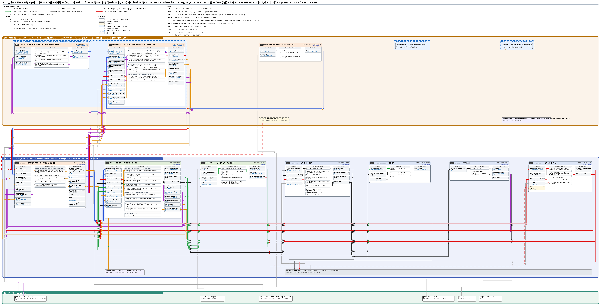

# AI가 설계하고 로봇이 조립하는 젠가 가구 — 요청 → 생성 → 검사 → 세대 관리 → 자동 조립

사람이 웹 글이나 말로 가구를 요청하면 **AI(GPT-4o)가 DB의 기본 설계(책상 · 의자)를 튜닝 · 생성해 젠가 설계도를 만들고**, 무너지지 않는지 · 로봇이 잡을 수 있는지 **검사**한 설계를 **DB에 세대별로 저장**한 뒤, 협동로봇이 **MoveIt2로 블록을 하나씩 집어 조립**한다. 사람이 완성한 구조물을 **스캔해 설계도로 만들어 똑같이 조립**할 수도 있다(10/6 주제 개편).

> 두산 ROKEY Boot Camp 9기 · 협동-2 · **D2팀**: 박진용 · 한세교 · 민범진 · 한석형 · 황인재(PL) · 2026-10-01 ~ 10-16

| 항목 | 내용 |
|---|---|
| 하드웨어 | Doosan M0609(6축 협동로봇) + OnRobot RG2 그리퍼 + 손목 카메라 Intel RealSense D435i(깊이) + 마이크 |
| 소프트웨어 | Ubuntu 24.04 · ROS 2 Jazzy · MoveIt2 · CycloneDDS(로봇 PC 안) · **MQTT(Mosquitto, PC 사이)** · Docker compose · DB(PostgreSQL 16) · 웹(frontend Next.js · three.js / backend FastAPI) · OpenAI API(GPT-4o · Whisper STT) · GitHub Actions CI |
| 상태 | **1차 구현 중** — 10/6 벤치 11개 자동 조립 실기 11/11(337초). 10/7 1차 판정(자동 조립 + 정지) → 10/7~13 핵심(AI 생성 · 검사 · DB · 스캔 복제 · 흩어진 블록 집기) → 10/13 기능 동결 → 10/16 시연 |
| 차별점 | 설계도를 **AI가 만들고 검사하고 세대로 관리**하며, 로봇은 그 설계도를 그대로 쌓는다. 실물을 스캔해 설계도로 복원 · 복제한다 → [선행 프로젝트와 차별점](docs/research/README.md) |

## 목차

1. [주요 기능](#주요-기능)
2. [시스템 구성](#시스템-구성) — 아키텍처 · 동작 흐름 · 예외 처리
3. [결과](#결과)
4. [실행 방법](#실행-방법)
5. [개발 환경 · 사용 장비](#개발-환경--사용-장비)
6. [프로젝트 구조](#프로젝트-구조)
7. [팀 · 역할](#팀--역할)
8. [협업 규칙](#협업-규칙)

## 주요 기능

- **요청 → AI 설계 생성 · 튜닝** — 웹 글상자나 음성("등받이 높은 의자 만들어 줘")으로 요청하면, 먼저 **파라미터 튜닝**(AI가 기본 설계의 템플릿과 숫자 — 다리 층수 · 등받이 층수 · 상판 길이 · 개수 — 만 고르고 코드가 블록을 배치)을 시도하고, 템플릿으로 안 되는 요청은 **자유 생성**(AI가 블록 좌표 · 방향 · 순서를 직접 씀)으로 넘긴다. 구조화 출력(JSON Schema)으로 형식 오류를 없앤다.
- **생성 직후 검사** — 무게중심 여유 ≥ 7 mm(쌓는 도중 포함) · 받침 · 손가락 틈 · 양쪽 막힌 칸 · 작업영역을 규칙으로 검사하고, 실패 이유를 AI에 돌려줘 다시 만든다(최대 2번). 통과한 설계만 레시피(`assembly.recipe/1.0`)로 바꿔 로봇에 준다. **AI가 만든 설계는 사람이 미리보기를 보고 [출발]을 눌러야 로봇이 움직인다.**
- **DB 세대 관리(RAG)** — 기본 설계 4개(의자 · 벤치 · 책상 2종)는 CAD로 미리 넣고, 생성본은 부모 설계와 버전(v1.0 → v1.1)으로 자동 저장한다. 조립 결과(성공 · 오차 · 시간)도 기록해 다음 생성 때 같은 가구의 설계 · 결과를 프롬프트에 넣는다.
- **CAD · 생성 설계 → 블록 하나씩 집기 · 놓기** — 레시피대로 공급 칸에서 집어 조립 원점에 쌓는다. **모든 이동을 MoveIt2로**(쌓인 블록 · 쥔 블록을 피함). 블록마다 손목 카메라로 있음 · 없음 + 높이를 확인하고 오차 측정값을 기록한다. 10/6 실기: 벤치 11개 11/11 · 337초.
- **스캔 복제** — 사람이 완성한 구조물을 관측 자세 2~3곳에서 깊이 촬영 → 점군을 **15 · 25 · 75 mm 격자에 맞춰** 블록 자리 · 방향으로 복원(가려진 블록은 '받침이 있어야 한다' 규칙으로 추정) → 설계도로 저장 → 사람이 치우면 로봇이 똑같이 조립한다. 젠가 블록 크기가 하나라서 가능한 방법이다.
- **언제나 멈춤** — 정지 입력 4개(화면 정지 버튼 · 키 · Ctrl+C · 로봇 알람) + 펜던트 비상정지. 늘 켜 둔 **정지 노드**가 '지금 자리에 서기' 궤적을 제어기에 직접 보내고(토픽), 잠근 뒤 화면 '다시 시작'으로만 푼다. 다시 시작은 항상 진행 확인부터.
- **공급 채우기** — 1차(10/7)는 공급 칸 6개, 핵심(10/10~)은 흩뿌린 공급 영역(E-36 — 안 되면 칸으로 되돌림). 맞는 칸이 다 비거나(1차) 공급 영역 관측 자세에서 블록이 하나도 안 보이면(핵심, `find_blocks`) 로봇이 멈추고 "공급 채워 주세요"를 띄운다. 사람이 채우고 [계속]을 누른다. (사람과 번갈아 쌓는 협동 모드는 챌린지로.)

## 시스템 구성

### 아키텍처

<p align="center">
  <br>
  <sub>시스템 아키텍처 v6 (10/6 PC 배치 · MQTT 다리 + 10/7 기술 스택 v2) · 따라 읽는 법: <a href="docs/시스템아키텍처_설명_v3_100710.md">시스템 아키텍처 설명</a></sub>
</p>

**PC 2대(10/6 18시 E-26~E-31).** **로봇 PC**에 ROS 2 노드 전부(브링업 · MoveIt2 · 정지 · 손목 비전 · 스캔 추론기 · **task** · **다리 `bridge`**)가 호스트로 돈다. **웹 PC**에는 ROS가 없다 — docker compose로 `mosquitto`(MQTT 브로커) · `db`(DB) · `web`(backend FastAPI — 설계 생성 · 저장소 + frontend 화면 정적 파일)을 띄우고, 음성은 호스트. 화면(frontend)은 사람의 브라우저에서 돌고 backend와 REST · WebSocket으로만 주고받는다(10/7 E-41). 두 PC는 **MQTT**로 잇는다(다리 노드가 ROS ↔ MQTT 변환).

| 위치 | 구성 | 실행 |
|---|---|---|
| 로봇 PC(로봇과 유선) | 두산 드라이버 · MoveIt2 `move_group`(브링업) · 집기 · 놓기 + 실행기 · 장면 관리 · 그리퍼 노드 · **정지 노드(고정)** · 손목 블록 인식 + **스캔 추론기** · **task(작업 관리자 · 작업 판단 · 검사 묶음 · 변환기 ②)** · **다리 `bridge`(ROS ↔ MQTT)** | 호스트(ROS 2 · CycloneDDS 60) |
| 웹 PC — 컨테이너(compose) | `mosquitto`: MQTT 브로커(1883) / `db`: DB(`designs` · `builds`) / `web`(안): **backend**(FastAPI :8000 — REST · WebSocket · **AI 설계 생성(GPT-4o)** · **저장소 인터페이스**) 한 프로세스 + **frontend**(Next.js 정적 + three.js — 브라우저에서 실행), ROS 없음 | Docker compose |
| 웹 PC — 호스트 | 음성(마이크 → Whisper API → MQTT) | 호스트 |


ROS 노드는 **8개**(+ 다리 `bridge`)다. 이름은 모두 `/d2/` 아래, 요청-결과는 전용 메시지(`d2_interfaces` 7개 + JSON 공용 `JsonQuery`), 상태는 JSON 토픽이다. 웹 PC와는 MQTT 토픽 `d2/…`(요청은 `…/req` · `…/res`)로 다리가 잇는다. 새 인터페이스는 '안'이고 10/7 오전에 확정한다.

| 통신 | 종류 | 방향 | 내용 |
|---|---|---|---|
| `/d2/hmi/command` · `/d2/hmi/intent` | 서비스 · 토픽 | 화면 · 음성 → 작업 관리자(· 화면) | 설계 선택 · 출발 · 스캔 / 음성 뜻(설계 요청 문장 포함 — 화면에서 확인 뒤 생성) |
| `/d2/task/check_design` | 서비스(JsonQuery) | 화면(생성) → task(검사 묶음) | 블록 JSON → 통과 · 이유 · 레시피 |
| `/d2/hmi/get_design` | 서비스(JsonQuery) | task → 화면(저장소) | design_id → 레시피 · 블록 JSON |
| `/d2/vision/scan_capture` · `scan_infer` | 서비스(JsonQuery) | 작업 관리자 → 스캔 추론기 | 촬영 자세별 점군 모으기 → 블록 JSON |
| `/d2/vision/check_progress` | 서비스 | 작업 관리자 → 손목 블록 인식 | 블록마다 있음 · 없음 · 높이 · 오차 측정값 |
| `/d2/motion/move_to` · `/d2/motion/pick_place` | 서비스 · 액션 | 작업 관리자 → 집기 · 놓기 | 관측 · 홈 · 촬영 자세 이동 / 블록 1개 전체 |
| `/d2/task/progress` · `/d2/task/state` · `/d2/task/scan_result` | 토픽(JSON) | task → 장면 관리 · 화면 | 진행표 · 상태 · 알림 · 스캔 추론 결과 |
| `/d2/safety/stop` · `/d2/safety/resume` · `/d2/safety/state` | 서비스 · 토픽 | 화면 → 정지 노드 → 모두 | 정지 요청 · 다시 시작 · 멈춤 · 잠금 |
| 서기 궤적 | 토픽 `/dsr_moveit_controller/joint_trajectory` | 정지 노드 → 두산 제어기 | 지금 관절값 0.3초 — 제어기에 직접 |
| `/d2/gripper/command` · `/d2/gripper/state` | 서비스 · 토픽 | 집기 · 놓기 → 그리퍼 → 모두 | 폭 · 힘 → 잡힘 · 폭 |

좌표 · 그리퍼 값 · 시간 기준은 설정 파일 하나(`src/d2_bringup/config/robot.yaml`)에 둔다. 이름 · 칸 · 단위의 정본은 [인터페이스 문서](docs/02_인터페이스_IRD_v3_100710.md), 패키지 · 절차는 [설계 문서](docs/03_설계_SDD_v3_100710.md).

### 동작 흐름

**설계 생성 · 튜닝 → 조립** ([그림 설명](docs/시스템아키텍처_설명_v3_100710.md))

```
① 요청        웹 글상자 "2인용 벤치 만들어 줘" [생성]  /  "hello rokey" → 음성 → 받아 적은 문장을 화면에서 확인 → [생성]
② 생성        DB에서 같은 가구의 기본 설계·파생본·조립 결과를 찾아(RAG) GPT-4o에 → 튜닝(템플릿·숫자) → 안 되면 자유 생성(블록 JSON)
③ 검사        무게중심 여유 7 mm(쌓는 도중) · 받침 · 손가락 틈 · 막힌 칸 · 작업영역 → 실패 이유를 돌려줘 재생성(최대 2번)
④ 저장        통과한 설계 → 레시피 변환 → DB(부모·버전) → 화면에 미리보기·검사 결과·버전 트리
⑤ 출발        사람이 [출발](버튼·키 또는 음성) → 시작 점검(로봇·그리퍼·카메라·DB·조립 자리·공급)
⑥ 조립        관측 → 진행 확인 → 다음 블록(sequence 첫 미배치) → 집기(10 N) → MoveIt2 옮기기 → 위치 제어 놓기 → 블록마다 배치 확인 → 반복
⑦ 기록        완성 → 조립 결과(성공·오차·시간)를 DB에 → 다음 생성의 재료
```

**스캔 복제**

```
① 사람이 완성한 구조물을 조립 작업영역에 두고 나감 → [스캔]
② 로봇이 관측 자세 2~3곳에서 깊이 촬영 → 점군 → 15·25·75 mm 격자에 맞춰 블록 자리·방향 → 가려진 블록은 받침 규칙으로 추정
③ 화면에 실물 사진 ↔ 추론 설계 비교 → 검사 통과 → 저장(made_by scan)
④ 사람이 구조물을 치움 → [출발] → 같은 자리에 복제 조립
```

### 예외 처리

판단은 한 곳에서 한다 — 멈출지는 **정지 노드**, 진행표는 **작업 판단**, **설계가 쌓을 만한지는 검사 묶음**, **무엇을 쌓을지는 사람**, 장면은 **장면 관리**, DB는 **HMI 저장소**가 정한다.

| 상황(실패 코드) | 로봇 · 시스템 | 사람 |
|---|---|---|
| 검사 실패(`CHECK_FAILED`) · 재생성 2번 뒤 실패(`GEN_FAILED`) | 이유를 AI에 돌려 다시 생성 → 끝내 실패면 화면에 이유 + 기본 설계 권함 | 요청을 바꾸거나 기본 설계 선택 |
| 가구 2종 밖 · 범위 밖(`OUT_OF_SCOPE`) | "책상 · 의자만 만들 수 있어요" | — |
| 경로 계획 실패(`PLAN_FAILED`) · 잡기 실패(`GRASP_FAILED`) | 다시 계획 1번 / 1번 더 → 다음 칸 → 사람 호출 | 원인 치우고 다시 시작 |
| 공급 칸 다 빔(`SLOT_EMPTY`) | 멈추고 "공급 채워 주세요" | 채우고 [계속] |
| 블록 없음 · 높이 다름(`OFFSET_OVER`) | 멈추고 사람 호출 | 블록 바로 놓기 |
| 스캔 실패(`SCAN_FAILED`) | 다시 스캔 안내 | 구조물 위치 · 조명 확인 |
| 정지 입력 · 로봇 알람 · 그리퍼 응답 없음 · 예상 못 한 오류(`STOP_REQUEST` · `ROBOT_ALARM` · `GRIPPER_NO_RESPONSE` · `ERROR`) | 정지 노드가 서기 궤적 → 잠금 | 원인 확인 → '다시 시작' → 진행 확인부터 |

## 결과

**아직 1차 구현 중이라 최종 결과는 없다.** 주제 확정 때 쓴 10/3 사전 검증 값과 10/4 · 10/6 실기다. 근거는 [결과표](docs/04_결과_결과표_v2_100710.md).

| 항목 | 결과 | 판정 |
|---|---|---|
| V-01 설계가 서는가 | 설계 6종(최대 27개 책장) 모두 섬 | ✅ |
| V-02 구조 유지 한계 | **7 mm**(세운 다리 위 보). 무너지는 경계 — 검사기 규칙값. 로봇 배치 목표는 ±2 mm | ✅ |
| V-17 손목 카메라 블록 위치 | 놓기 전후 **±0.5 mm**, 중심 흔들림 0.1~0.2 mm — 스캔 격자(15 · 25 mm)에 비해 작음 | ✅ 참고 |
| V-07 · V-24 MoveIt2 실기 · 쥔 채 계획 | 사람 팔 피해 감 · 끊김 없음 · 쥔 채 계획 6/6 | ✅ |
| R-01 실기 정지 | Ctrl+C 즉시 정지 실기 확인(10/4). 서기 궤적은 토픽으로(10/6) | ✅ |
| **10/6 벤치 11개 자동 조립** | **11/11 · 337초 · 중단 없음**(시제품, 속도 0.1) | ✅ 참고 |
| V-18 음성 받아 적기 | STT 1.8초 · 짧은 말 5/10 → 음성 설계 요청은 문장 확인 뒤 생성 | ⚠️ |
| AI 설계 생성(10/3 코드) | 프롬프트 · 검사기는 있으나 **시험 전** — 10/7 요청 15개 | 시험 전 |

1차 판정(10/7): 자동 조립 벤치 11개 **3번 중 2번** + 정지 입력 4개. 핵심(10/13): 변형 요청 3개 중 2개 검사 통과 · 생성 설계 조립 2종 · 스캔 복제 일치율 ≥ 90 % · 1회 · DB 트리 · 컨테이너 2개 이상 · PC 2대 MQTT 통신 · 흩어진 블록 집기 10개 중 8개(AC-9).

## 실행 방법

**(패키지 작성 중 — 생기면 채움)**

```bash
git clone https://github.com/hwang-injae/rokey_9_pjt2_D2.git
cd rokey_9_pjt2_D2
```

> 로봇을 움직이는 코드는 반드시 정지 처리(서기 궤적)를 넣는다. 새 코드 첫 실행은 저속으로, 펜던트를 든 짝과 함께. [출발] · [스캔] · [계속]을 누르기 전에 사람이 로봇 작업 영역 밖인지 누르는 사람이 확인한다(웹캠 사람 감지는 없다). 급할 때는 **펜던트 비상정지**.

## 개발 환경 · 사용 장비

| 항목 | 값 |
|---|---|
| OS · ROS | Ubuntu 24.04 LTS · ROS 2 Jazzy · CycloneDDS(로봇 PC 안) · PC 사이 MQTT(Mosquitto) |
| 동작 계획 | MoveIt2 2.12 · OMPL BiTRRT · `dsr_moveit_controller` · 브링업 `real_moveit.launch.py` |
| 로봇 드라이버 | 교육 과정 배포본 `doosan-robot2` · RG2 그리퍼 드라이버 — 저장소 밖 |
| 비전 | RealSense D435i 깊이 — 배치 확인 · 스캔 점군(격자 맞추기). GPU 없이 CPU |
| AI · 음성 | OpenAI GPT-4o(설계 생성 · 튜닝 — 구조화 출력, 학습 없음 · 의도 분류) · STT(OpenAI Whisper API) · 웨이크워드. 키는 PC마다 `.env`에만 |
| 화면 · DB | 웹 = frontend(Next.js 정적 + three.js 3D 미리보기 — 유일한 미리보기, 브라우저에서 실행) + backend(FastAPI :8000 · REST · WebSocket `/ws` · paho-mqtt) · DB(`designs` · `builds`, PostgreSQL 16 — 10/6 21시 PL 확정 E-39) |
| 실행 환경 | 로봇 PC = 호스트(ROS 노드 전부 + 다리) · 웹 PC = docker compose `mosquitto` · `db` · `web`(ROS 없음) + 호스트 음성. PC 2대 유선 LAN |
| 언어 · 도구 | Python 3.12 · colcon · pytest(ROS 없는 계산 파일 · `tests/`) · GitHub Actions CI(토큰 없음) |

| 장비 | 모델명 · 사양 | 수량 | 용도 |
|---|---|---|---|
| 협동로봇 | Doosan M0609(6축 · 가반 6 kg · 도달 900 mm) + 제어기 · 펜던트 | 1 | 집기 · 옮기기 · 놓기 · 스캔 촬영 자세 |
| 그리퍼 | OnRobot RG2(0~110 mm · 3~40 N) · 10 N · 고무 패드 뺌 | 1 | 블록 잡기 · 폭으로 잡힘 확인 |
| 손목 카메라 | Intel RealSense D435i(깊이 · 최소 거리 약 28 cm) | 1 | 배치 확인 · 스캔 점군 |
| 마이크 | — | 1 | 웨이크워드 · 음성 요청 |
| 블록 | 표준 젠가 75 × 25 × 15 mm(실측 두께 14.7 mm) · 1세트 54개 | 1 | 기본 설계 9~16개 + 공급 여분 |
| 작업대 | 1200 × 650 mm · 맨 작업대 | 1 | 조립 작업영역 · 로봇 공급 칸 6개 |
| PC | Ubuntu 24.04 · (로봇 PC만 ROS 2 Jazzy) | 2 | 로봇 PC · 웹 PC |

<p align="center">
  <br>
  <sub>작업대 배치 v4(위에서 본 그림, robot.yaml 값) · 조립 원점 (426.1, −72.5) mm · 공급 영역(1차 칸 6개 · 핵심 흩뿌림) · 관측 · 촬영 자세 · 공급 관측 자세(안, W134)</sub>
</p>

## 프로젝트 구조

| 경로 | 내용 |
|---|---|
| `src/` | ROS 2 패키지(작성 중). `d2_interfaces`(전용 메시지 7개 + `JsonQuery`) · `d2_bringup`(브링업 · `robot.yaml`) · `d2_motion`(집기 · 놓기 + 실행기 · 장면 관리) · `d2_gripper` · `d2_safety`(정지 노드) · `d2_vision`(손목 블록 인식 · 스캔 추론기) · `d2_task`(작업 관리자 · 작업 판단 · 검사 묶음 · 변환기 ②) · **`d2_bridge`(MQTT 다리)** · 레시피 도구(CAD → 레시피 · 변환기 ①) |
| `web/`(예정, E-32) | 웹 PC 코드(ROS 아님) — `backend/`(FastAPI · paho-mqtt · WebSocket · AI 설계 생성 · 저장소 · 음성) · `frontend/`(Next.js 정적 + three.js — 브라우저에서 실행) · `compose.yaml`(`mosquitto` · `db` · `web`) · `mosquitto/` — 황인재 |
| [`tests/`](tests/) | ROS 없는 자동 시험(pytest) — `motion_math` · `robot.yaml` 형식 · srv/action 형식 · 문서 이름 · 링크 · 키 모양 · 개인 경로. CI가 PR마다 돈다. 규칙은 [tests/README.md](tests/README.md) |
| `src/d2_bringup/config/robot.yaml` | 설정 파일 하나 — 작업면 · 조립 원점 · 공급 칸 · 관측 · 촬영 자세 · TCP · 그리퍼 값 · 검사 · 스캔 격자. 키는 [IRD 9장](docs/02_인터페이스_IRD_v3_100710.md) |
| `docs/` | 문서 지도는 [docs/README.md](docs/README.md) — 요구사항 · 인터페이스 · 설계 · 결과표 · 작업 분류 · 팀 규칙 · 결정 기록 · 시험 기록 · 트러블슈팅 · 환경 · 조사 · 그림 · 에이전트 프롬프트 |
| `docs/research/ref_1003/작업4/` | 10/3 검증 코드 — **`prompt_v09*` · `run_v09.py`(AI 설계 생성 · 재생성) · `jenga_check.py`(안정성 검사기 · 템플릿 생성기 · 그림)** → `web/backend` · `d2_task`의 바탕 |
| `tools/docver.py` | 문서 파일 이름(`이름_v버전_MMDDHH`)과 링크를 한 번에 바꾸는 도구 |
| `.github/` | 협업 규칙 · PR 양식 · CODEOWNERS · PR 자동 검사(`pr_check.yml`) · **CI(`ci.yml`: pytest · colcon · ruff, 토큰 없음)** · Claude 검토·자동 승인·auto-merge(팀원 PR 전부, 10/7) |
| `AGENTS.md` · `CHANGES.md` | AI 에이전트 읽기 규칙 · 날마다 파트별 변경 한 줄 |
| `LICENSE` | Apache-2.0 |

## 팀 · 역할

**로봇 동작 2명 · 비전 3명 · HMI 1명**(10/4 확정, 10/6 묶음 변경, **10/7 황인재가 비전도 맡음** — E-42). 파트 안의 일은 파트 사람이 같이 맡는다.

| 파트 | 담당 | 맡는 것 |
|---|---|---|
| 로봇 동작 | 박진용 · 한세교 | 로봇 셀 · MoveIt 실행기 · 정지 · 장면 · 집기 · 놓기 · 안전 감시(정지 노드) · 인프라 · 통합 · **CAD · 레시피 · 변환기 ①(블록 JSON → 레시피)** · 스캔 촬영 자세 · 세우기 동작(E-37) |
| 비전 | 민범진 · 한석형 · 황인재 | 손목 보정 · 블록 인식 · 배치 확인 · 작업 판단 · 작업 관리자 · **검사 묶음(안정성 · 받침 · 잡기) · 변환기 ② · 스캔 추론기 ③(점군 → 블록 JSON)** · 흩어진 블록 찾기 · 고르기(E-36) |
| HMI | 황인재(PL, 비전 겸함) | 웹 화면 · 음성 · **글상자 · AI 설계 생성 · 튜닝(GPT-4o) · DB(`designs` · `builds`) · 미리보기 · 버전 트리 · 스캔 비교 화면** · 웹 PC compose(`mosquitto` · `db` · `web`) · MQTT 다리(안) · PL(일정 · 회의 · 강사 확인 · 발표) |

- **PR 승인:** 황인재(@hwang-injae) · 한세교(@hansaekyo). `main`에는 PR로만(황인재만 예외 — 바로 push).
- **백업:** 박진용(10/10 없음) → 한세교 · 비전 세 사람은 서로 백업 · HMI는 **황인재 혼자**(팀 규칙 ③의 예외).

[Apache License 2.0](LICENSE). 두산 · OnRobot 드라이버(저장소 밖)는 각 제공자의 라이선스를 따른다.

## 협업 규칙

- [팀 협업 규칙](docs/06_팀협업규칙_v1_100711.md) — 팀 규칙 10개 · 브랜치 · 커밋 · PR · 보안 · 컨테이너 · 로봇 안전 · 문서 파일 이름
- [.github/CONTRIBUTING.md](.github/CONTRIBUTING.md) — GitHub에서 일하는 순서
- [AGENTS.md](AGENTS.md) — AI 에이전트 읽기 규칙
- [팀원별 에이전트 프롬프트](docs/에이전트_프롬프트/) — v4(10/6 개편 + PC 배치)를 저장소 맨 위 `CLAUDE.local.md`로 복사
- 작업을 끝내면 PR 본문 '완료한 일정표 작업'에 `완료: W번호` → merge 뒤 문서담당이 일정표(공유 드라이브)에 반영한다
