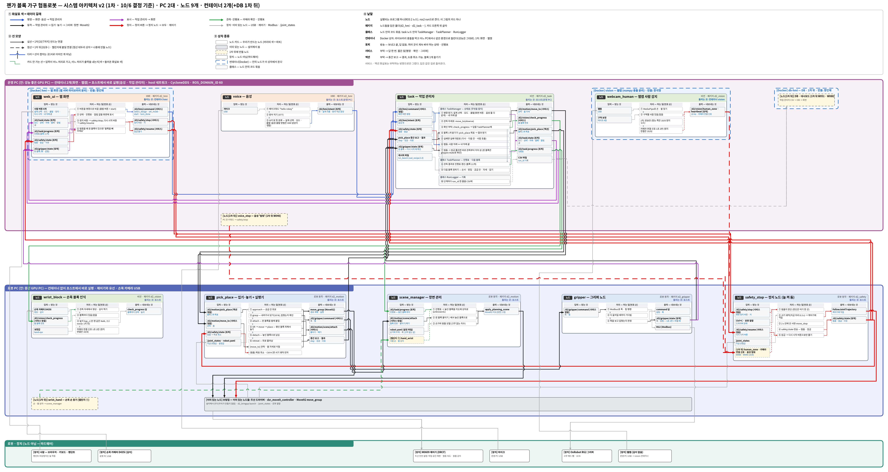

# CAD 설계도대로 젠가 블록 가구를 쌓는 협동로봇 — 자동 모드 · 협동 모드

사람이 말로 가구를 고르면, 협동로봇이 **CAD 설계도(레시피)대로 젠가 블록을 하나씩 집어 쌓는다.** 혼자 쌓는 **자동 모드**와 사람과 차례를 바꿔 같은 가구를 쌓는 **협동 모드**가 있다. 협동 모드에서는 사람이 설계도의 빈 자리 중 아무 곳에 블록을 놓아도, 로봇이 손목 카메라로 어디까지 쌓였는지 보고 다음 블록을 골라 이어 쌓는다. 모든 이동은 MoveIt2(로봇팔 동작 계획 소프트웨어)로 계획해 쌓인 블록을 피한다(사람 팔 피하기는 챌린지 ①).

> 두산 ROKEY Boot Camp 9기 · 협동-2 · **D2팀**: 박진용 · 한세교 · 민범진 · 한석형 · 황인재(PL) · 2026-10-01 ~ 10-16

| 항목 | 내용 |
|---|---|
| 하드웨어 | Doosan M0609(6축 협동로봇) + OnRobot RG2 그리퍼 + 손목 카메라 Intel RealSense D435i(깊이) + 웹캠(작업대 전체) + 마이크 |
| 소프트웨어 | Ubuntu 24.04 · ROS 2 Jazzy · MoveIt2 · CycloneDDS · Docker · DB(제품 미정) · 웹 화면 |
| 상태 | **1차 구현 중** (10/6 모듈 개발 · 기능별 통합 확인 2개 → 10/7 정지 실기 · 전체 통합(자동 · 협동, 영상도 같이) · 1차 판정 · 챌린지 10/8~13 · 시연 10/16). **10/4 15시 1차 간소화(S-01~S-13):** 1차에 넣는 것과 "1차 뒤(10/8~)"로 미룬 것을 아래에 표시했다 → [결정 기록 §9](docs/decisions/결정기록_시나리오_역할_인터페이스_1004_v1_100609.md#9-104-15시-30분-간소화-결정-s-01s-13--대비책). **10/5 PL 결정(S-14~S-17):** 코드 규칙 표현 · 운영 PC 컨테이너 2개(노드 담당이 만듦) · 출발 = 화면 버튼 또는 음성(S-16, 19시 정정) → [결정 기록 10/5](docs/decisions/결정기록_시나리오_역할_인터페이스_1004_v1_100609.md#105-결정-s-14--s-17) |
| 차별점 | 사람이 **순서와 상관없이** 블록을 놓아도 로봇이 진행 상태를 읽고 이어 쌓는다 → [선행 프로젝트와 차별점](docs/research/README.md) |

## 목차

1. [주요 기능](#주요-기능)
2. [시스템 구성](#시스템-구성) — 아키텍처 · 동작 흐름 · 예외 처리
3. [결과](#결과)
4. [실행 방법](#실행-방법)
5. [개발 환경 · 사용 장비](#개발-환경--사용-장비)
6. [프로젝트 구조](#프로젝트-구조)
7. [팀 · 역할](#팀--역할)
8. [협업 규칙](#협업-규칙)

## 주요 기능

- **CAD 설계도 → 블록 하나씩 집기 · 놓기** — 설계도는 한세교가 만든 Advanced 레시피 형식(`cad_recipe/1.0`)이다. 블록마다 자리 · 자세 · 쌓는 순서(sequence) · 받침 · 잡기 후보가 들어 있다. 설계 좌표에 조립 원점(작업영역 가운데를 로봇으로 한 번 찍은 값)을 더해 로봇 좌표를 만든다. 1차 설계는 **lv1_bench(벤치, 블록 11개 = 다리 벽 8 + 좌판 3)**.
- **모든 이동을 MoveIt2로** — 자주 가는 길은 정해 두고, 출발 전에 장면(Planning Scene, 피할 물체를 넣어 두는 가상 공간)에 막히는 것이 있으면 다시 계획한다. **1차 장면 = 쌓인 블록 + 쥔 블록**(팔의 일부로 보고 같이 피한다). 사람 팔을 장면에 넣는 것과 움직이는 중에 새 경로로 갈아타는 것은 챌린지 ①이다.
- **블록마다 배치 확인** — 블록을 놓을 때마다 손목 카메라(깊이)로 본다. **1차 = 블록이 있는지 · 없는지 + 높이.** 없거나 높이가 다르면 멈추고 사람을 부른다. 배치 목표 ±2 mm 판정과 위층 보정은 **1차 뒤**(10/8~10).
- **사람과 번갈아 쌓기(협동 모드)** — 사람이 설계도의 빈 자리에 2~3개를 놓고 **화면 버튼 '내 차례 끝'** 을 누르면 로봇 차례가 된다(출발 2초 전 화면 알림). 로봇은 sequence에서 아직 안 놓인 첫 블록부터 이어 쌓고, 양쪽이 막혀 손가락이 못 들어가는 칸은 사람에게 부탁한다. 웹캠 · 손목 카메라가 손이 3초 이상 안 보이는 것을 보고 자동으로 넘기는 것은 챌린지 ④.
- **말로 고르고 말로도 출발** — 웨이크워드 "hello rokey" → 받아 적기(STT) → GPT가 말의 뜻만 분류(**1차 = 설계 선택 · 모드 · 출발**). 출발은 **화면 출발 버튼 · 키 또는 음성**, 둘 중 하나로 한다. 음성으로 어떻게 출발시킬지(어떤 말로, 확인 단계를 둘지)는 HMI 담당이 정하고, 무음 녹음 5번에는 출발하지 않아야 한다(STT가 무음에서 말을 지어낸 일 2/10). 화면은 **버튼 6개**(설계 선택 · 모드 · 출발 · 정지 · 다시 시작 · 내 차례 끝) + 상태 글자다. 로봇이 말하는 TTS는 1차 뒤.
- **언제나 멈춤** — **1차 정지 입력 4개:** 화면 정지 버튼 · 키 · 터미널 Ctrl+C · 로봇 알람(+ 펜던트 비상정지는 늘). 늘 켜 둔 **정지 노드**가 제어기에 '지금 자리에 서기' 궤적을 직접 보내고, 화면 '다시 시작'으로만 잠금이 풀린다. 음성 '멈춰'(PC 안 키워드), 로봇 차례에 웹캠이 사람을 봄, 카메라 신호 1초 끊김으로 멈추는 것은 **1차 뒤**(10/8). 1차 웹캠은 로봇 작업 영역 안 사람 있음 · 없음 신호까지만 낸다.
- **기록** — 1차는 **작업 관리자가** 모든 사건을 실행 번호(run_id)로 CSV에 직접 쓴다(기록기 노드 없음). DB(Docker 컨테이너) · 대시보드는 1차 뒤(DB 결정 10/8 오전).

## 시스템 구성

### 아키텍처

<p align="center">
  <br>
  <sub>시스템 아키텍처 v2 (안, 검토 중) · 따라 읽는 법: <a href="docs/시스템아키텍처_설명_v1_100609.md">시스템 아키텍처 설명</a></sub>
</p>

**PC 2대로 시작한다**(부하를 보고 3대로 늘린다). 모든 노드를 어느 PC에서나 돌게 짠다. 로봇에 붙은 노드(브링업 · MoveIt2 · 정지 · 손목 비전)는 로봇 PC의 호스트에서 돈다. 운영 PC는 **Docker 컨테이너 2개**(`vision` 웹캠 사람 감지 · `hmi` 웹 화면, host 네트워크)와 **호스트**(음성 · 작업 관리자 · 작업 판단)로 나눈다. DB 컨테이너는 1차 뒤다(10/5 S-15). 컨테이너는 성능을 바꾸지 않으므로, 부하가 넘치면 노드를 다른 PC로 옮기거나 해상도 · Hz를 줄인다. ROS 2 통신은 **CycloneDDS**로 통일하고, 모든 PC · 컨테이너가 같은 `ROS_DOMAIN_ID`(60)를 쓴다.

| 위치 | 구성 | 실행 |
|---|---|---|
| 로봇 PC (로봇과 유선) | 두산 드라이버 · MoveIt2 `move_group`(브링업) · 집기 · 놓기 + 실행기 · 장면 관리 · 그리퍼 노드(잡힘 확인 포함) · **정지 노드(고정)** · 손목 블록 인식 · (챌린지 ①) 손목 손 찾기 | 호스트 |
| 운영 PC — 컨테이너 | 웹캠 사람 감지(`vision`) · 웹 화면(`hmi`) · (1차 뒤) DB(`db-hmi`) | Docker 컨테이너 (host 네트워크) |
| 운영 PC — 호스트 | 작업 관리자(CSV 기록 포함) · 작업 판단 · 음성 · (1차 뒤) 음성 멈춰(어디서 돌릴지는 HMI가 정함) | 호스트 |

1차에 만드는 노드는 **10개**다(기록기 노드 없음, 그리퍼 노드 하나 — 10/4 간소화 S-01 · S-10). 주요 통신은 아래와 같다. 이름은 모두 `/d2/` 아래에 있고, 요청-결과가 있는 것은 전용 메시지 패키지 `d2_interfaces`, 상태 방송은 JSON 문자열(`std_msgs/String`)이다.

| 통신 | 종류 | 방향 | 내용 |
|---|---|---|---|
| `/d2/hmi/command` | 서비스 | 화면 → 작업 관리자 | 설계 선택 · 모드 · 출발 · **내 차례 끝(`turn_done`)** · 이어 하기 (출발 = 출발 버튼 · 키. 음성 출발은 아래 `intent`로 들어와 똑같이 처리) |
| `/d2/hmi/intent` | 토픽(JSON) | 음성 → 작업 관리자 | 말의 뜻(1차: 설계 선택 · 모드 바꾸기 · 출발 — 작업 관리자가 화면 출발 버튼과 똑같이 받음) |
| `/d2/safety/stop` | 서비스 | 화면 · 키 → 정지 노드 | 정지 요청 — 받았는지 바로 답 (음성 멈춰는 1차 뒤) |
| `/d2/vision/human_zone` | 토픽(JSON) | 웹캠 → 작업 관리자 (정지 노드는 1차 뒤, W066) | 구역별(조립 · 로봇 공급 · 이동 길 · 사람 공급) 사람 있음 · 없음 |
| 서기 궤적 | 액션(`FollowJointTrajectory`) | 정지 노드 → 두산 제어기 | 지금 관절값으로 0.3초 궤적 — 제어기에 직접 |
| `/d2/safety/state` · `/d2/safety/resume` | 토픽(JSON) · 서비스 | 정지 노드 → 모두 · 화면 → 정지 노드 | 멈춤 · 잠금 상태 / 화면 '다시 시작'으로만 잠금 풀기 |
| `/d2/vision/check_progress` | 서비스 | 작업 관리자 → 손목 블록 인식 | 블록마다 있음 · 없음 · 윗면 높이 (위치 오차는 1차 뒤, W100) |
| `/d2/motion/move_to` | 서비스 | 작업 관리자 → 집기·놓기 | 관측 · 홈 자세로 이동 (다음 블록은 task 노드 안에서 정한다) |
| `/d2/task/progress` | 토픽(JSON) | 작업 판단 → 모두 | 진행표(블록마다 놓였나 · 얼마나 어긋났나) |
| `/d2/motion/pick_place` | 액션 | 작업 관리자 → 집기 · 놓기 | 블록 1개 전체(접근 → 잡기 → 옮기기 → 놓기 → 물러나기) |
| `/d2/gripper/command` | 서비스 | 집기 · 놓기 → 그리퍼 노드 | 폭 · 힘 → 다 움직인 뒤 잡힘 · 폭 |
| `/d2/task/state` | 토픽(JSON) | 작업 관리자 → 화면 · 정지 노드 | 지금 상태 · 사람에게 알릴 말(`message`). 기록 전용 토픽(`event`)은 1차 뒤 — 1차는 작업 관리자가 CSV를 직접 쓴다 |

좌표 · 그리퍼 값 · 시간 기준은 코드가 아니라 설정 파일 하나(`src/d2_bringup/config/robot.yaml`)에 둔다. 전체 이름 · 칸 · 단위는 [인터페이스 문서](docs/02_인터페이스_IRD_v1_100609.md), 패키지 · 노드 설계는 [설계 문서](docs/03_설계_SDD_v1_100609.md)에 있다.

### 동작 흐름

**자동 모드** ([그림 설명 1~6번](docs/시스템아키텍처_설명_v1_100609.md))

```
① 요청      "hello rokey" → "벤치 쌓아 줘" → 화면에 설계 표시
② 출발      화면 버튼 · 키 → 시작 점검(그리퍼 · 카메라 · 로봇 상태)
            또는 음성으로 출발(예: "벤치 자동으로 만들어 줘", 방법은 HMI 담당) → 같은 시작 점검
③ 진행 확인  손목 카메라로 놓인 블록 확인(1차: 있음 · 없음 + 높이)
④ 다음 블록  레시피 sequence 에서 아직 안 놓인 첫 블록(받침이 있는 것)
⑤ 집기      로봇 공급 영역의 칸에서 레시피 잡기 후보로 10 N 집기 → 그리퍼 노드가 폭으로 잡혔는지 답함
⑥ 옮기기    MoveIt2 — 정해진 길, 출발 전 막히면 다시 계획 (움직이는 중 사람이 들어오면 멈춤은 1차 뒤)
⑦ 놓기 · 확인 위치 제어로 놓기 → 블록마다 손목 카메라로 배치 확인 → 11개를 다 놓을 때까지 ③~⑦
```

**협동 모드 — 1차는 번갈아 하기** ([그림 설명 10~11번](docs/시스템아키텍처_설명_v1_100609.md))

```
① 모드 바꾸기  "같이 하자" 또는 화면 → 쥔 블록을 놓은 뒤 바뀜
② 사람 차례   로봇은 관측 자세에서 멈춰 있음 · 사람은 사람 공급 영역에서 블록을 가져와 빈 자리에 2~3개
③ 차례 끝     사람이 화면 버튼 '내 차례 끝' → 출발 2초 전 알림 → 로봇 차례 (손 3초 없음 + 칸 변화로 자동 넘기기는 챌린지 ④)
④ 로봇 차례   진행 확인 → 다음 블록 → 집기 · 옮기기 · 놓기 (출발 전 사람 팔을 장면에 넣는 것은 챌린지 ①)
⑤ 다시 사람 차례 관측 자세로 돌아가 기다림 → ②부터 반복
```

사람은 아무 순서로 놓아도 되지만 설계도에 있는 자리여야 한다. 설계에 없는 자리에 놓으면 로봇이 멈추고 다시 놓아 달라고 알린다(어긋남 ±2 mm 판정은 1차 뒤). 10/7 협동 실기에서 로봇 차례에는 사람이 로봇 작업 영역에 들어가지 않고, 안전은 펜던트 · 화면 정지 버튼 · 저속 · 충돌 감지로 한다(웹캠 → 정지 연결은 10/8). 단계별 상태표는 [설계 문서](docs/03_설계_SDD_v1_100609.md)에 있다.

### 예외 처리

판단은 한 곳에서 한다 — 멈출지는 **정지 노드**, 차례를 넘길지는 **작업 관리자**, 진행표는 **작업 판단**, MoveIt2 장면은 **장면 관리**가 정한다. 다시 시작할 때는 항상 진행 확인부터 하고, 그리퍼 폭으로 쥔 블록이 있는지도 본다.

| 상황 (실패 이유 코드) | 로봇 | 사람 |
|---|---|---|
| 경로 계획 실패 (`PLAN_FAILED`) | 다시 계획 1번 → 그래도 안 되면 사람 호출 | 원인을 치우고 화면에서 이어 하기 |
| 잡기 실패 (`GRASP_FAILED`) · 공급 칸이 빔 (`SLOT_EMPTY`) | 1번 더 잡기 → 다음 공급 칸 → 사람 호출 | 공급 칸 채우기 |
| 블록이 없거나 높이가 다름 (`OFFSET_OVER`) | 멈추고 사람 호출 (1차 판정은 있음 · 없음 + 높이. ±2 mm 보정은 1차 뒤, 다시 놓기는 챌린지) | 블록을 바로 놓기 |
| 양쪽이 막힌 칸 (`BLOCKED_BOTH_SIDES`) | 그 블록은 건너뛰고 사람에게 부탁(알림) | 그 블록을 손으로 놓기 |
| 정지 입력(화면 버튼 · 키 · Ctrl+C) · 로봇 알람 — 1차 / 로봇 차례에 사람이 들어옴 (`HUMAN_IN_ZONE`) · 카메라 연결 신호 1초 끊김 (`VISION_LOST`) — 1차 뒤(10/8) | 정지 노드가 서기 궤적을 보내고 잠금(`STOPPED`) | 확인 뒤 화면 '다시 시작' 한 번 → 바로 진행 확인부터 |
| 시간 초과 (`TIMEOUT`) | 사람 호출 | — |

펜던트 비상정지와 두산 충돌 감지는 이 흐름과 상관없이 늘 작동한다. 서기 궤적이 2초 안에 듣지 않으면 두산 `move_stop`, 그래도 안 서면 펜던트로 세운다([그림 설명 7~9번](docs/시스템아키텍처_설명_v1_100609.md)). 움직이는 중 Ctrl+C로 바로 서는 것은 10/4 실기에서 확인했다([TS-01](docs/troubleshooting/TS-01_정지가_안_들음_R-01_v1_100519.md)).

## 결과

**아직 1차 구현 중이라 최종 결과는 없다.** 아래는 주제를 확정할 때 쓴 10/3 사전 검증 값과 10/4 실기 확인이다. 그리퍼 고무 패드를 10/4에 빼서 V-11 · V-20은 다시 잰다. 근거는 [결과표](docs/04_결과_결과표_v1_100519.md)와 [시험 기록](docs/test-reports/)에 있다.

| 항목 | 결과 | 판정 |
|---|---|---|
| V-01 설계가 서는가 | 설계 6종(벤치 · 의자 · 책장 · 테이블 · 아치 · 의자)을 손으로 쌓아 모두 섬 | ✅ |
| V-02 구조 유지 한계 | **7 mm** (세운 다리 위 보, 가장 엄격). 어긋나도 서 있는 최대값이자 무너지는 경계다. 허용 오차가 아니며, 로봇 배치 목표는 ±2 mm | ✅ |
| V-11 놓을 때 밀림 | 3층에서 최대 **0.4 mm**, 아래 블록 안 움직임 (고무 패드 있을 때 · 35 mm 스펀지 위) | ✅ (다시 잼) |
| V-20 파지 유지 | 10 N 등 미끄러짐 **0/13** (고무 패드 있을 때 · 기준 20번에 못 미침) | ⚠️ (다시 잼) |
| V-17 손목 카메라로 블록 확인 | 놓기 전후 비교 **±0.5 mm**(95%) · 중심 흔들림 0.1~0.2 mm | ✅ 참고 |
| V-18 음성 받아 적기 | STT 평균 **1.8초**, 조용한 곳에서도 '정지' 5/10 → 음성 정지는 보조로만 | ❌ 정지 경로 |
| V-07 MoveIt2 실기 | 10/3 저녁, 공중에 둔 사람 팔을 피해 감 · 끊김 · 떨림 없음. 10/4 오후 재검증에서도 동작 정상 | ✅ |
| R-01 실기 정지 (10/4) | 처음에는 Ctrl+C가 동작이 끝난 뒤에야 들음 → 박진용이 Ctrl+C 즉시 정지를 구현해 실제 로봇에서 **바로 섬** (가상에서는 서기 궤적으로 7번 모두 0.58~1.12초) | ✅ 실기에서 해결 |

1차 완료 기준(10/7 판정): 자동 — 음성으로 벤치 선택 → 화면 버튼 또는 음성으로 출발 → MoveIt2로 lv1_bench 11개 완성 **3번 중 2번** · 협동 최소형 — 사람이 2~3개 놓고 '내 차례 끝' 버튼 → 로봇이 이어 쌓기 **1번** · 정지 입력 4개로 멈춤. 1차의 배치 확인은 있음 · 없음 + 높이다. 현재 **측정 전**. 영상은 10/7 실기 중에 찍는다.

| 남은 위험 · 확인 | 상태 |
|---|---|
| R-01 실행 중 정지가 안 들음([TS-01](docs/troubleshooting/TS-01_정지가_안_들음_R-01_v1_100519.md)) | **실기에서 해결**(10/4, 박진용 구현 · 코드는 PR 예정) |
| R-02 재시험 — 정지 → 재개 · 보호 정지 해제 · 충돌 감지 | 남음 (10/7 오전 · W059) |
| 10/7 오전 자동 모드를 못 끝낼 때 (대비책) | 10/7 오후도 자동에 집중하고, 협동 최소형 실기는 **10/8 오전(W073)**. 10/7 저녁 판정은 자동 결과로 먼저, 협동은 10/8 오전에 마저 본다. 협동은 1차 완료 기준에서 빼지 않는다 |
| 1차 뒤로 미룬 것(없애는 것이 아님) | ±2 mm 배치 판정 · 위층 보정(W100) · 음성 멈춰 · 웹캠 사람 · 카메라 끊김 → 정지(W066) · TTS(W052) · DB(W051) · 손 감지로 차례 끝(챌린지 ④) · 사람 팔 장면(챌린지 ①) |
| R-03 블록을 쥔 채 MoveIt2 계획이 바로 실패([TS-02](docs/troubleshooting/TS-02_블록_쥔_채_계획_실패_R-03_v1_100414.md)) | 조사 중 |
| 고무 패드를 뺀 그리퍼 다시 재기 · V-20 · V-11 다시 | 진행 중 (V-20 20번 · V-11은 10/7 자동 모드 실기 때 같이) |
| R-05 손목 카메라 보정이 4.8 cm 어긋남 | 10/6 다시 보정 (정확도 V-15는 10/7 자동 모드 실기 때) |

## 실행 방법

**(코드 작성 전 — 패키지가 생기면 채움)**

저장소 받기:

```bash
git clone https://github.com/hwang-injae/rokey_9_pjt2_D2.git
cd rokey_9_pjt2_D2
```

패키지가 생기면 여기에 ROS 2 · 두산 드라이버 설치, `colcon build`, 로봇 없이(가짜 노드 `mock_*`) 실행, 가상 로봇(에뮬레이터), 실제 로봇(PC 2대 · CycloneDDS · Docker) 순서로 그대로 따라 할 명령을 적는다.

> 로봇을 움직이는 코드는 반드시 정지 처리(서기 궤적)를 넣는다. 새 코드 첫 실행은 저속으로, 펜던트를 든 짝과 함께 한다. 급할 때는 Ctrl+C가 아니라 **펜던트 비상정지**.

## 개발 환경 · 사용 장비

| 항목 | 값 |
|---|---|
| OS · ROS | Ubuntu 24.04 LTS · ROS 2 Jazzy · CycloneDDS(`rmw_cyclonedds_cpp`) |
| 동작 계획 | MoveIt2 2.12 · 계획기 OMPL BiTRRT · 제어기 `dsr_moveit_controller` · 브링업은 박진용 `real_moveit.launch.py`로 통일(D-09) |
| 로봇 드라이버 | 교육 과정 배포본 `doosan-robot2` · RG2 그리퍼 드라이버 — 저장소 밖 |
| 비전 | RealSense D435i 깊이 · MediaPipe(학습 없음) · 웹캠 — NVIDIA GPU 없이 CPU로 돌게 짠다 |
| 음성 · LLM | 웨이크워드 · OpenAI STT · GPT 의도 분류(1차: 설계 선택 · 모드 · 출발 — 음성 출발 방법은 HMI 담당) · PC 안 키워드 인식('멈춰', 1차 뒤). API 키는 PC마다 `.env`에만 두고 GitHub에 올리지 않는다 |
| 화면 · 기록 | 웹 화면(버튼 6개 + 상태 글자) · CSV(1차, 작업 관리자가 씀) → DB(시기 · 제품은 1차 뒤 10/8 오전 HMI가 화면 설계 뒤 결정) |
| 실행 환경 | Docker — 1차 운영 PC 컨테이너 2개(`vision` 웹캠 사람 감지 · `hmi` 웹 화면, host 네트워크) · DB(`db-hmi`)는 1차 뒤 · 음성 · 작업 관리자 · 작업 판단과 로봇 PC 노드는 호스트 |
| 언어 · 도구 | Python 3.12 · colcon |

| 장비 | 모델명 · 사양 | 수량 | 용도 |
|---|---|---|---|
| 협동로봇 | Doosan M0609 (6축 · 가반하중 6 kg · 도달 거리 900 mm) + 제어기 · 티치 펜던트 | 1 | 블록 집기 · 옮기기 · 놓기 |
| 그리퍼 | OnRobot RG2 (벌림 0~110 mm · 힘 3~40 N) · 기본 10 N · 고무 패드 뺌(10/4) | 1 | 블록 잡기 · 그리퍼 폭으로 잡힘 확인 |
| 손목 카메라 | Intel RealSense D435i (깊이 · 최소 거리 약 28 cm) | 1 | 진행 확인 · 블록마다 배치 확인(1차: 있음 · 없음 + 높이) · 출발 전 손 찾기(챌린지 ①) |
| 웹캠 | 깊이 없음 · 작업대 앞쪽 긴 변 밖 | 1 | 작업대 구역별 사람 있음 · 없음 신호(정지 연결은 1차 뒤) |
| 마이크 | — | 1 | 웨이크워드 · 명령(설계 선택 · 모드 · 출발) · 음성 '멈춰'(1차 뒤) |
| 블록 | 표준 젠가 75 × 25 × 15 mm (실측 평균 두께 14.7 mm) | 1차 11개 + 여유 | 쌓기 |
| 작업대 | 1200 × 650 mm · 로봇 앞 850 mm · 맨 작업대 | 1 | 조립 작업영역 · 로봇 공급 영역 · 사람 공급 영역 · 출입 선 |
| PC | Ubuntu 24.04 · ROS 2 Jazzy | 2 | 로봇 PC · 운영 PC (부하를 보고 3대) |

<p align="center">
  <br>
  <sub>작업대 배치(위에서 본 그림) · 좌표는 10/4에 로봇으로 재서 확정</sub>
</p>

## 프로젝트 구조

| 경로 | 내용 |
|---|---|
| `src/` | ROS 2 패키지 (아직 없음). 패키지 이름(안): `d2_interfaces`(전용 메시지) · `d2_bringup`(브링업 · launch) · `d2_motion`(집기 · 놓기 + 실행기 · 장면 관리) · `d2_gripper` · `d2_safety`(정지 노드) · `d2_vision` · `d2_task`(작업 판단 · 작업 관리자, 1차 CSV 기록) · `d2_hmi`(웹 · 음성 — 기록기 노드는 없음) |
| `src/d2_bringup/config/robot.yaml` | (예정) 설정 파일 하나 — 작업대 높이 · 조립 원점 · 공급 칸 · 관측 자세 · TCP · 그리퍼 값 · 시간 기준. 키 이름은 [IRD](docs/02_인터페이스_IRD_v1_100609.md) |
| `docs/` | 문서 지도는 [docs/README.md](docs/README.md) — 요구사항 · 인터페이스 · 설계 · 결과표 · 작업 분류 · 팀 규칙 · 결정 기록 · 시험 기록 · 트러블슈팅 · 환경 설정 · 조사 · 그림 |
| `tools/docver.py` | 문서 파일 이름(`이름_v버전_MMDDHH`)과 링크를 한 번에 바꾸는 도구 |
| `.github/` | 협업 규칙 · PR 양식 · CODEOWNERS(PR 승인자) · 트러블슈팅 이슈 양식 · **PR 자동 검사 · 승인**(`workflows/pr_check.yml` — 문법 · main 반영 · 충돌 · 키 · 변경 파일 · 문서 이름) |
| `AGENTS.md` · `CHANGES.md` | AI 에이전트 읽기 규칙 · 날마다 파트별 변경 한 줄 요약 |
| `LICENSE` | Apache-2.0 |

## 팀 · 역할

**로봇 동작 2명 · 비전 2명 · HMI 1명**(10/4 확정). 파트 안의 일은 두 사람이 같이 맡고, 누가 무엇을 할지는 두 사람이 정한다.

| 파트 | 담당 | 맡는 것 |
|---|---|---|
| 로봇 동작 | 박진용 · 한세교 | 로봇 셀(작업대 · 그리퍼 · 교시 · 두산 안전 설정) · MoveIt 실행기 · 정지 · 장면 · 집기 · 놓기 · 안전 감시(정지 노드) · 인프라 · 통합(저장소 · 설정 파일 · Docker · PC 부하) · CAD 파일 만들기(한세교) |
| 비전 | 민범진 · 한석형 | 손목 카메라 보정 · 녹화 · 웹캠 사람 유무 · 블록 인식 · 손 찾기 · 차례 끝 · 작업 판단(레시피 · 진행표 · 다음 블록) · 작업 관리자(전체 흐름 상태표) |
| HMI | 황인재(PL) | 웹 화면 · 음성 · LLM(웨이크워드 · STT · 의도 분류) · 1차 뒤 DB · 음성 멈춰 · TTS · PL(일정 · 회의 · 강사 확인 · 발표) |

- **PR 승인:** 황인재(@hwang-injae) · 한세교(@hansaekyo). `main`에는 PR로만 들어간다.
- **백업:** 박진용(10/10 없음) → 한세교가 MoveIt2를 이어 받음 · 비전 두 사람은 서로 백업 · HMI는 **황인재 혼자** 맡는다(10/4 PL 결정 — 팀 규칙 ③의 예외).

[Apache License 2.0](LICENSE). 두산 · OnRobot 드라이버(저장소 밖)는 각 제공자의 라이선스를 따른다.

## 협업 규칙

- [팀 협업 규칙](docs/06_팀협업규칙_v1_100609.md) — 팀 규칙 10개 · 브랜치 · 커밋 · PR · 보안 · 컨테이너 · 로봇 안전 · 문서 파일 이름
- [.github/CONTRIBUTING.md](.github/CONTRIBUTING.md) — GitHub에서 일하는 순서(브랜치 → PR → 승인 → Squash and merge)
- [AGENTS.md](AGENTS.md) — AI 에이전트 읽기 규칙(커밋의 `변경 파일:`만 읽어 토큰을 아낀다)
- [팀원별 에이전트 프롬프트](docs/에이전트_프롬프트/) — 자기 파일을 저장소 맨 위 `CLAUDE.local.md`로 복사해 쓴다([쓰는 법](docs/에이전트_프롬프트/))
- 작업을 끝내면 PR 본문 '완료한 일정표 작업'에 `완료: W번호`를 적는다 → merge 뒤 문서담당이 일정표(공유 드라이브)에 반영한다
