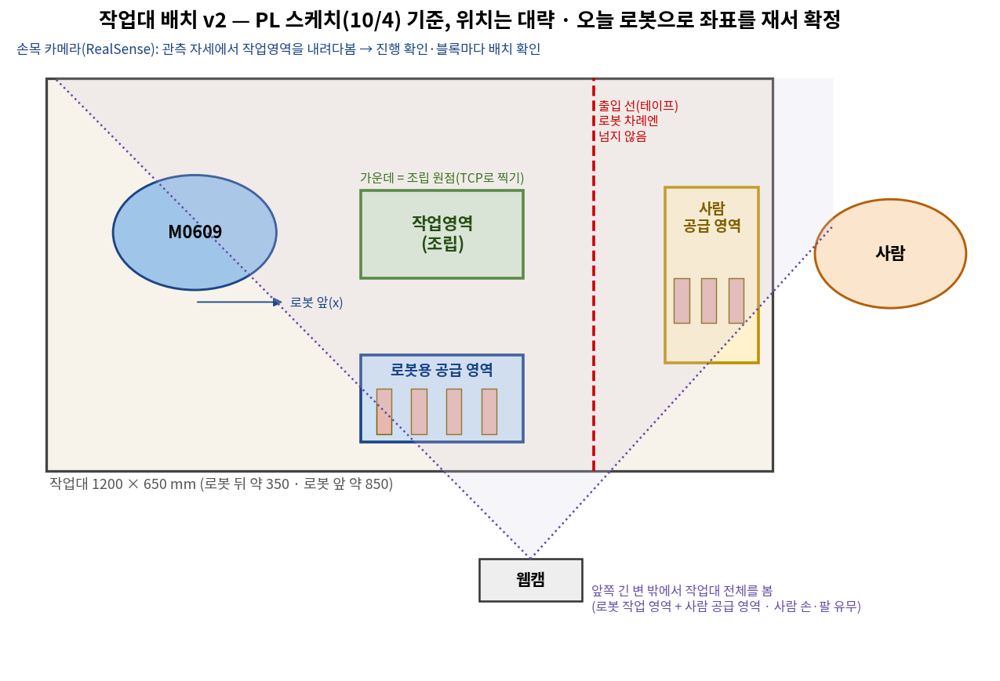

# 요구사항 문서 (Business · System Requirements)
## 젠가 가구 협동로봇 — CAD 설계도대로 젠가 블록 가구를 쌓는 협동로봇 (가칭: Jenga Furniture Builder)

| 항목 | 내용 |
|---|---|
| 문서 ID | REQ-D2-JENGA-001 · **v2** (2026-10-04) — 팀 문서 BRD v2·SRD v2(10/4)를 한 문서로 합친 판. 10/4 회의 결정(시나리오·PL 결정·확정 배정)과 10/4 인터페이스 결정(26개)을 반영. 일정은 일정표 v5(10/4 15시 30분 **간소화 S-01~S-13** 반영) 기준 — 간소화로 미룬 것은 "1차 뒤(10/8~)"로 표시했다(2.5). **10/5 PL 결정 S-14~S-17**(코드 규칙 표현 · 컨테이너 2개(노드 담당이 만듦) · 출발 = 화면 버튼 또는 음성 — S-16은 10/5 19시 정정) 반영(2.6) |
| 팀 | ROKEY 9기 협동2 · D2팀 — 한석형·민범진·박진용·황인재(PL)·한세교 |
| 장비 | 두산 M0609 1대 + OnRobot RG2 그리퍼(고무 패드 뺌) + 손목 카메라 RealSense D435i + 웹캠(작업대 앞) + 마이크 + 웹 화면 + PC 2대(로봇 PC·운영 PC) |
| 관련 문서 | [02_인터페이스_IRD_v1_100523.md](02_인터페이스_IRD_v1_100523.md)(이름·칸의 정본) · [03_설계_SDD_v1_100523.md](03_설계_SDD_v1_100523.md)(구조·상태표·시험 절차) · [04_결과_결과표_v1_100519.md](04_결과_결과표_v1_100519.md)(수락 기준 현황) · [05_작업분류_파트별_v1_100523.md](05_작업분류_파트별_v1_100523.md) · [06_팀협업규칙_v1_100517.md](06_팀협업규칙_v1_100517.md) · 결정 기록 [주제 확정 10/3](decisions/결정기록_주제확정_1003_v1_100415.md) · [시나리오·역할·인터페이스 10/4](decisions/결정기록_시나리오_역할_인터페이스_1004_v1_100522.md) |
| 일정 | 10/1(목)~10/16(금) · 10/6(화) 모듈 개발 → 저녁 기능별 통합 확인(가상) · **1차 완성 10/7(수)** — 오전 정지 실기·자동 모드 실기, 오후 협동 최소형, 저녁 1차 판정(대비책: 자동이 안 끝나면 오후도 자동에 집중, 협동 최소형은 10/8 오전 W073으로 — 10/4 15시 간소화) · 챌린지 10/8~13 · 기능 동결 10/13 저녁 · 리허설 10/14~15 · **10/16(금) 시연·발표** · 10/5·10/9는 일정 없음 |

**문서 경계**: 이 문서는 "왜 필요한가(BR)", "무엇을 해야 하는가(FR·NFR)", "어떻게 안전해야 하는가(SR)", "무엇과 무엇이 어떻게 이어지는가(IR, 요약)", "어떤 기술·제약을 지켜야 하는가(TR)", "어디까지 하면 성공인가(AC·KPI)"를 정한다. 이름·칸의 정확한 정의는 IRD, 노드 구조·상태표·좌표·오류 처리·시험 절차는 SDD, 결과는 결과표가 정한다. 일정은 팀 일정표(협동2_개발일정 v5, 작업 번호 W001~W100 — 합쳐져 비어 있는 번호 있음)로 관리한다. 강사 Notion "Business Requirements" 양식(BR/SR/FR/NFR/IR/TR + 추적표)을 따른다.

**표기**
- **단계:** **1차** = 10/7까지 꼭 한다 · **1차 뒤** = 1차에 넣기로 했다가 10/4 15시 간소화(S-n)로 10/8~로 미룬 것. 없애는 것이 아니다 · **챌린지 ①~④** = 10/8~13, 번호가 순서 · **챌린지 공통** = 번호와 별개로 챌린지 기간에 하는 것(TTS·두 번째 가구·화면 고도화·고장 시험) · **필수 기술** = Docker·DB. 시연 전까지 꼭 넣는다. DB 쓰는 시기·제품은 10/8 오전에 정한다(W051, S-09).
- **S-n:** 10/4 15시 30분 간소화 결정 번호(S-01~S-13, 목록은 2.5)와 10/5 PL 결정 번호(S-14~S-17, 목록은 2.6).
- **번호:** D-xx·M-xx·R-xx·T-xx·A-xx = 10/4 회의 자료의 결정·문제 번호 · V-xx = 시험 ID(V-01~V-20은 10/3 사전 검증 번호, V-21~V-43은 이 문서에서 새로 정함 — 11장) · '제안' = 아직 정하지 않은 값(시험 뒤 확정) · '＿＿ (측정 전)' = 아직 재지 않은 값.
- **요구 ID:** FR·NFR 번호는 SRD v2 번호를 그대로 쓴다(다른 문서와 맞추려고). 안전(SR)·인터페이스(IR)·기술(TR)은 이 문서에서 새로 붙이고 옛 번호를 옆에 적었다.
- **'SR'의 뜻:** 이 문서에서 SR은 **안전 요구(Safety Requirements)** 다.

---

## 1. 비즈니스 요구 (BR)

### 1.1 목적

이 프로젝트의 목적은 사업 성과가 아니다. 아래 기술을 실제 로봇에서 써 보고 확인하는 것이다.

1. **CAD 설계도 → 로봇 작업:** CAD로 만든 설계도(레시피)를 블록 하나하나의 '집기·놓기' 작업으로 바꾼다.
2. **MoveIt2 동작 계획:** 쌓은 블록과 사람 팔을 피해 움직이는 경로를 MoveIt2(ROS 2용 로봇팔 동작 계획 소프트웨어)로 만든다. 이 프로젝트의 핵심 기술이다.
3. **사람과 함께 쌓기:** 사람이 순서와 상관없이 블록을 놓아도, 로봇이 카메라로 어디까지 쌓였는지 보고 이어 쌓는다. 우리 프로젝트의 차별점이다.
4. **말 → 행동:** 1차는 말로 가구를 고른다. 챌린지 ③에서는 말로 새 설계를 만들게 한다('말 → 설계 만들기'). 학습형 VLA(보고·듣고·움직이는 학습 모델)는 하지 않는다.

### 1.2 배경과 문제

- 실제 산업에는 설계 데이터대로 재료를 쌓고 조립하는 로봇이 있다. 예: 벽돌 쌓기 로봇, 목조 부재 조립 로봇.
- 연구에서는 글로 설명한 구조물을 무너지지 않게 설계해 로봇이 조립하는 시도가 있다. 예: CMU [BrickGPT](https://github.com/AvaLovelace1/BrickGPT)(ICCV 2025 최우수 논문). 이 연구는 서로 맞물리는 블록과 양팔 로봇을 썼다.
- 우리는 이것을 책상 크기로 줄인다. 맞물림이 없는 젠가 블록을 쓰고, 팔은 하나이며, 사람이 옆에서 함께 일한다.
- 선행 프로젝트와 다른 점: 8기 A-2는 손을 MoveIt 장애물로 넣었고, HOME-CRAFT는 웹 CAD로 LEGO를 조립했다. 우리는 **사람이 순서와 상관없이 놓아도 로봇이 진행 상태를 읽고 이어 쌓는다.**

**문제 정의:** "사람이 말로 가구를 고르면, 로봇이 CAD 설계도대로 젠가 블록을 쌓는다. 사람이 옆에서 설계도의 빈 자리 아무 곳에 블록을 놓아도, 로봇은 카메라로 진행을 확인해 이어 쌓는다. 그동안 사람과 부딪히지 않게 움직이고, 로봇이 할 수 없는 자리는 사람에게 부탁한다."

### 1.3 이해관계자

| 이해관계자 | 관심사 |
|---|---|
| 팀원 5명 | MoveIt2·비전·CAD·음성/LLM·사람과의 협업을 직접 만들어 보는 경험 |
| 강사·평가자 | 문제 정의, 차별성, 챌린지(도전 과제). Docker + DB, PC 2대 이상 통신, '사람과 협업하는 반자율 협동로봇' |
| 시연 관람자 | 말 한마디로 가구가 쌓이는 장면, 사람과 로봇이 번갈아 같은 가구를 쌓는 장면 |

### 1.4 비즈니스 요구사항

| ID | 비즈니스 요구사항 | 단계 | 검증 방법 |
|---|---|---|---|
| **BR-01** | 사용자는 말로 만들 가구를 고르고, 모드(자동·협동)를 바꾸고, 출발시킬 수 있어야 한다. 로봇은 **화면 출발 버튼·키, 또는 음성** 중 하나로 출발한다(S-16). 음성으로 어떻게 출발시킬지는 HMI 담당이 정한다. | 1차 | V-09·V-31(음성), V-30(화면) → AC-1·AC-8 |
| **BR-02** | 시스템은 CAD 설계도(레시피: 블록 자리·자세·순서·받침·잡는 방법)를 읽고 다음에 놓을 블록을 정해야 한다. 1차는 레시피 순서(sequence)와 받침 규칙으로 정한다. | 1차 (말로 새 설계: 챌린지 ③) | V-25 → AC-1 |
| **BR-03** | 로봇은 설계도대로 블록을 집어 쌓아 가구를 완성해야 한다. **블록마다** 손목 카메라로 제자리에 놓였는지 확인한다. | 1차: 블록 있음·없음 + 높이 / 1차 뒤(W100): ±2 mm 판정·위층 보정 (S-05) | V-26·V-36 → AC-1·AC-4 |
| **BR-04** | 로봇은 쌓은 블록과 사람 팔을 피해 움직여야 한다. 로봇 차례에 사람이 로봇 작업 영역에 들어오면 멈춰야 한다. | 1차: 쌓인 블록·쥔 블록만 피함 + 웹캠은 사람 있음 신호만 / 1차 뒤(W066): 사람 있음 → 정지 / 챌린지 ①: 사람 팔 장면 + 움직이는 중 새 경로 (S-02·S-03·S-07) | V-22·V-27 → AC-5 / V-39 → AC-C1 |
| **BR-05** | 협동 모드에서 사람과 로봇이 차례를 바꿔 같은 가구를 쌓아야 한다. 사람이 설계도의 빈 자리 아무 곳에 놓아도 로봇이 진행을 읽고 이어 쌓는다. 로봇이 놓을 수 없는 자리(양쪽이 막힌 칸)는 사람에게 부탁한다. | 1차: 번갈아 하기 / 챌린지 ①: 동시 작업 | V-28·V-37 → AC-2·AC-6 / V-39 → AC-C1 |
| **BR-06** | 사람은 언제든 로봇을 멈출 수 있어야 한다: 펜던트 비상정지, 터미널 Ctrl+C, 화면 정지 버튼·키, 음성 '멈춰'(보조). 다시 시작할 때는 항상 진행 확인부터 한다. | 1차: 정지 입력 4개(키·화면 버튼·Ctrl+C·로봇 알람) + 펜던트 / 1차 뒤(W066·W046): 음성 '멈춰' (S-03·S-08) | V-21·V-22·V-29 → AC-3 |
| **BR-07** | 작업 과정과 결과(성공·실패·어긋남)를 기록하고 화면에 보여 줘야 한다. **DB와 Docker는 필수 기술**이다. | 1차(CSV·화면) / 필수 기술(DB·Docker) | V-32·V-33 → AC-7·AC-T |
| **BR-08** | 1차가 끝나면 챌린지 ① → ② → ③ → ④ 순서로 도전한다(2.4). | 챌린지 ①~④ (선택) | V-39~V-43 → AC-C1~C4 |

### 1.5 핵심 기능 (파트 = 기능, 10/4 확정 배정)

**로봇 동작 2명 · 비전 2명 · HMI 1명.** 파트 안의 일은 두 사람이 같이 맡고, 누가 무엇을 할지는 두 사람이 정한다.

| 파트 | 담당 | 맡는 기능 | 1차(10/7)까지 핵심 | 챌린지 |
|---|---|---|---|---|
| **로봇 동작** | 박진용, 한세교 (+ CAD 한세교) | 로봇 셀(작업대·그리퍼·교시·안전 설정) · MoveIt 실행기·정지 · MoveIt 장면 · MoveIt 집기·놓기 · 안전 감시(정지 노드) · 인프라·통합(브링업·저장소·설정 파일·Docker·PC 통신) · CAD | 정지 수정 재시험, 고무 뺀 그리퍼 다시 재기·그리퍼 노드, 작업영역·공급 영역 좌표·안전 설정, MoveIt2(TCP 반영·블록 쥔 채 계획·집기·놓기), 정지 노드, 브링업·저장소·설정 파일, PC 부하(자동 모드 실기 때 같이 잼), CAD 조립 시험·CAD 문제 고치기 | ① 갈아타기 → 동시 작업, ② 흩어진 블록 집기, ④ 떨어뜨리기 + 정돈, 두 번째 가구 CAD |
| **비전** | 민범진, 한석형 | 손목 보정·녹화 · 웹캠 사람 감지 · 비전(블록 인식·손 찾기·차례 끝) · 작업 판단(레시피·진행표·다음 블록) · 작업 관리자(상태표·CSV 기록) | 데이터 녹화, 손목 보정, 웹캠 설치·사람 있음 신호(W042), 블록마다 배치 확인 = 있음·없음 + 높이(W041), lv1_bench 레시피·진행표·다음 블록, 작업 관리자 노드(차례 끝 = 화면 버튼, CSV 기록 — W065·W068). 10/4 15시 간소화: 손 찾기 → 챌린지 ①, ±2 mm 판정 → 1차 뒤(W100), 손 감지로 차례 끝 → 챌린지 ④ | ① 손 위치, ② 흩어진 블록 찾기, ③ 안정성 검사기, ④ 손 감지 차례 끝 |
| **HMI** | 황인재 (+ PL) | 화면·DB · 음성·LLM(웨이크워드·받아 적기·의도 분류·음성 '멈춰') | 웹 화면 최소형 = 버튼 6개(설계 선택·모드·출발·정지·다시 시작·내 차례 끝) + 상태 글자(W047), 웨이크워드·STT·의도 분류(W045). 10/4 15시 간소화: 음성 '멈춰'(W046)·TTS(W052)·음성 통합(W069)·DB 결정(W051) → 1차 뒤(10/8). 기록기 노드는 없음(S-10, 작업 관리자가 CSV) | ③ 말 → 레시피 만들기(LLM), TTS, DB·대시보드 |

> 그림: [시스템 아키텍처](images/시스템아키텍처_v2_100522.png) — 따라 읽는 법은 [시스템 아키텍처 설명](시스템아키텍처_설명_v1_100522.md) 3장(노드 9개).

- **PL(황인재):** 회의·일정·강사 확인·발표 자료. PL 문서 초안은 문서담당 에이전트(AI)가 쓰고 PL이 확인한다.
- **백업:** 박진용(10/10 없음) → 한세교가 MoveIt2를 이어 받는다. 비전 두 사람은 서로 백업. HMI는 **황인재 혼자** 맡는다(10/4 PL 결정 — 팀 규칙 ③의 예외).
- **PR 승인:** 황인재(@hwang-injae)·한세교(@hansaekyo).

---

## 2. 범위

### 2.1 시나리오

| 시나리오 | 내용 | 종료 조건 |
|---|---|---|
| **S1 자동** | "hello rokey" → "벤치 쌓아 줘"(의도 분류만) → 화면에서 설계 확인 → **화면 버튼·키로 출발**(시작 점검). 말로 출발할 수도 있다(예: "벤치 자동으로 만들어 줘", 음성 출발 방법은 HMI 담당 — S-16) → 진행 확인 → 다음 블록(sequence에서 안 놓인 첫 블록) → 집기(10 N, 그리퍼 폭으로 확인) → MoveIt2로 옮기기 → 위치 제어로 놓기 → **블록마다** 배치 확인(1차 = 블록 있음·없음 + 높이, S-05) → 반복. 흐름: [시스템 아키텍처 설명](시스템아키텍처_설명_v1_100522.md) 1~6번 | lv1_bench 11개 완성, 실행 기록(작업 관리자 CSV) |
| **S2 협동 (번갈아)** | "같이 하자" 또는 화면 → 쥔 블록을 놓은 뒤 모드 바뀜 → 사람 차례(로봇은 관측 자세에서 정지, 사람은 설계도의 빈 자리 아무 곳에 2~3개) → 차례 끝 알기(**1차 = 사람이 화면 버튼 '내 차례 끝'을 누름**, S-06. 웹캠·손목 손 없음 3초 + 칸 변화로 자동 판단은 챌린지 ④) → 로봇 차례(진행 확인 → 다음 블록 → 집기·옮기기·놓기, 양쪽 막힌 칸은 사람에게 부탁. 출발 전 손목으로 손 확인·장면에 넣기는 챌린지 ①, S-02) → 다시 사람 차례. 흐름: [시스템 아키텍처 설명](시스템아키텍처_설명_v1_100522.md) 10~11번 | 가구 완성. 1차 기준은 이어 쌓기 1번 |
| **S3 정지·다시 시작** | 사람이 멈춤(1차: 펜던트·Ctrl+C·화면 버튼·키. 음성 '멈춰'는 1차 뒤) 또는 로봇이 스스로 멈춤(1차: 충돌 감지·로봇 알람. 로봇 차례에 사람 감지·비전 끊김 → 정지는 1차 뒤 W066, S-03) → 정지 노드가 서기 궤적 → 잠금 → 화면 '다시 시작' → 진행 확인부터. 흐름: [시스템 아키텍처 설명](시스템아키텍처_설명_v1_100522.md) 7~9번 | 로봇이 섬, 이유가 화면에 뜸, 이어서 진행 |
| **S4 챌린지** | ① 갈아타기·동시 작업 → ② 흩어진 블록 → ③ 말 → 설계 → ④ 남으면(2.4) | 챌린지별 기준(8.3) |

### 2.2 포함

- M0609 + RG2 + 손목 카메라 + 웹캠 + 마이크 + 웹 화면, 로봇 1대 + 사람 1명 협업
- 표준 젠가 블록(75 × 25 × 15 mm, 실측 평균 두께 14.7 mm)만 사용
- 1차 설계: 한세교 Advanced 레시피의 **lv1_bench(블록 11개, 다리 벽 8개 4층 + 좌판 3개)**. 챌린지 기간: 두 번째 가구(내민 곳 없는 의자·책장), 말로 만든 설계
- 작업대(1200 × 650 mm, 로봇 앞 850 mm) 위 조립 작업영역·로봇 공급 영역·사람 공급 영역·출입 선(좌표는 10/4에 로봇으로 재서 정함)
- ROS 2 노드(2.3·IRD), 전용 메시지 `d2_interfaces`, 설정 파일 `src/d2_bringup/config/robot.yaml` 하나, 기록은 작업 관리자가 run_id CSV를 직접 쓴다(기록기 노드 없음 — S-10. DB는 필수 기술, 시기 10/8 결정), Docker(1차: 운영 PC 컨테이너 `vision`·`hmi` 2개, DB 컨테이너는 1차 뒤 — S-15)
- 말 → 설계 만들기(LLM이 레시피를 쓰고 검사를 통과하면 쌓기, 챌린지 ③)

### 2.3 제외

- 접착제·목심·나사 같은 결합 부품, 실제 크기 가구·무거운 재료
- 여러 로봇 협업, 이동 로봇, 작업대 밖 물류·운반
- 학습형 VLA(시범 데이터로 모델 학습), 강화학습 보정
- 순응 하강으로 놓기(1차는 위치 제어), 1차에 움직이는 중 감속·회피, 1차에 GPT 설계 추천·대답

### 2.4 1차와 챌린지

| 기능 | 1차 (10/7까지) | 챌린지 (10/8~13) |
|---|---|---|
| 블록 공급 | 같은 간격·자세로 놓아 둠 | ② 흩뿌린 블록 찾기·고르기·밀어서 떼기·세워 다시 잡기 |
| 협동 | 번갈아 하기. 사람 차례 끝 = 화면 버튼 '내 차례 끝'(S-06) | ① 사람과 **동시 작업** · ④ 손 감지로 차례 끝 자동 판단 |
| 사람 피하기 | MoveIt2 장면 = 쌓인 블록 + 쥔 블록만(S-02). 웹캠은 로봇 작업 영역 안 사람 있음·없음 신호만(S-07). 안전은 펜던트·화면 정지 버튼·저속·충돌 감지로. **1차 뒤(10/8, W066):** 사람 있음·카메라 끊김 → 정지 노드 연결 | ① 사람 팔을 장면에 넣기(손 찾기) + 움직이는 중 손이 길을 막으면 **새 경로로 갈아타기** |
| 다음 블록 | 레시피 sequence + 카메라로 진행 확인(블록 있음·없음 + 높이) | ④ 쌓는 순서 고르기 |
| 어긋났을 때 | 1차: 블록 빠짐·높이 이상이면 멈추고 사람 알림. **1차 뒤(W100, 10/8~10):** ±2 mm 판정·위층 보정(S-05) | ④ 구조 정렬(다시 놓기) |
| 양쪽 막힌 칸 | 사람에게 부탁 | ④ 위에서 떨어뜨린 뒤 정돈 |
| 설계 | Advanced lv1_bench 11개 | 두 번째 가구, ③ **말 → 설계 만들기** |
| 안정성 검사기 | 안 씀(sequence와 받침 규칙으로 충분) | ③에서 STEP 기반으로 고쳐 씀 |
| LLM | 말의 뜻만 분류(어떤 설계인지) | ③ 말 → 레시피 만들기 |
| 기록 | CSV(작업 관리자가 직접, 기록기 노드 없음 — S-10) | DB(필수, 시기·제품은 10/8 오전 W051) + 대시보드, Docker(필수) |
| 음성 | 웨이크워드 + STT + 의도 분류(설계 선택·모드·출발 — 음성 출발 방법은 HMI 담당, S-08·S-16) | 1차 뒤(10/8): 음성 '멈춰'(W046)·TTS(W052)·음성 통합(W069) |
| 화면 | 버튼 6개(설계 선택·모드·출발·정지·다시 시작·내 차례 끝) + 상태 글자(S-09) | 화면 고도화, 대시보드 |

| 순서 | 챌린지 | 무엇을 보여 주나 | 완료 기준 (예) | 주로 맡을 파트 | 시기 |
|---|---|---|---|---|---|
| ① | MoveIt2 심화 | 움직이는 중 손이 길을 막으면 멈추지 않고 새 경로로 갈아타 돌아간다. 그다음 같은 가구를 사람과 동시에 쌓는다 | 손이 길을 막으면 1초 안에 새 길로 계속 감, 10번 중 8번 | 로봇 동작 + 비전 | 10/8~13 |
| ② | 흩어진 블록 집기 | 흩뿌린 블록을 손목 카메라로 찾고 잡기 쉬운 것을 고른다. 붙어 있으면 닫은 그리퍼로 밀어 떼고, 세워진 것은 눕혀 다시 잡는다 | 흩어진 블록 10개 중 8개 이상 집기 | 비전 + 로봇 동작 | 10/10~12 (휴일 로봇 시간) |
| ③ | 말 → 설계 만들기 (VLA 대신) | "5층 탑 만들어 줘" → LLM이 Advanced 형식 레시피를 만든다. 형식 검사 → 안정성 검사(STEP)를 통과하면 로봇이 쌓는다. 못 통과하면 이유를 LLM에 돌려줘 다시 만든다 | 말로 요청한 설계 3개 중 2개 이상 검사 통과 → 1개 실제로 쌓기 | HMI(LLM) + 비전(작업 판단·검사기) + 로봇 동작(CAD) | 10/8~13 (로봇 거의 안 씀) |
| ④ | 시간이 남으면 | 구조 정렬, 양쪽 막힌 칸 떨어뜨리기 + 정돈, 쌓는 순서 고르기, 사람 차례 끝을 손 감지로 자동 판단(S-06) | — | 로봇 동작 + 비전 | — |

- 순서 이유: ①은 MoveIt2 필수 챌린지이고 1차 협동과 바로 이어진다. ②는 처음 기획(흩뿌림)의 핵심인데 로봇 시간이 많이 들어 휴일에 둔다. ③은 로봇 시간이 거의 들지 않아 ①·②가 로봇을 쓰는 동안 나란히 만들 수 있다.
- ③은 학습형 VLA가 아니다. 발표에서는 '언어 → 행동' 파이프라인으로 설명한다.

### 2.5 10/4 15시 간소화 — 1차와 "1차 뒤"의 경계 (S-01~S-13)

시간이 부족해 1차(10/7 판정)에서 간편화·통합·미룬 것이다. 미룬 것은 **없애는 것이 아니라 "1차 뒤(10/8~)"로 옮긴 것**이다. 일정표 v5 기준(합쳐지거나 없어진 작업 번호는 비워 두었다).

| S-n | 1차에 하는 것 | 1차 뒤·챌린지로 미룬 것 | 일정표 |
|---|---|---|---|
| S-01 | 그리퍼 노드 하나가 폭을 보고 잡힘까지 돌려준다 | — (잡힘 확인을 따로 만들지 않음) | W039 |
| S-02 | MoveIt2 장면 = 쌓인 블록 + 쥔 블록만 | 사람 팔을 장면에 넣기(손 찾기 포함) → 챌린지 ① | W036 |
| S-03 | 정지 입력 4개: 키·화면 버튼·Ctrl+C·로봇 알람(+ 펜던트 비상정지) | 음성 '멈춰'·웹캠 사람·카메라 끊김 → 정지 노드 연결 → 1차 뒤(10/8) | W040 / W066 |
| S-04 | 출입 선 테이프는 로봇 준비(W057)에 포함 | — | W057 |
| S-05 | 배치 확인 = 블록 있음·없음 + 높이 | ±2 mm 판정·위층 보정 → 1차 뒤(10/8~10) | W041 / W100 |
| S-06 | 사람 차례 끝 = 화면 버튼 '내 차례 끝'(`turn_done`) → 작업 관리자 | 손 감지 자동 판단 → 챌린지 ④ | W068 |
| S-07 | 웹캠 = 로봇 작업 영역 안 사람 있음·없음 신호(`human_zone`)만. 10/7 협동 실기 안전은 펜던트·화면 정지·저속·충돌 감지 | `human_zone` → 정지 노드 연결 → 1차 뒤(10/8) | W042 / W066 |
| S-08 | 음성 = 웨이크워드 + STT + 의도 분류(설계 선택·모드). **→ S-16으로 바뀜:** 음성 출발도 1차(방법은 HMI 담당) | 음성 '멈춰'·TTS·음성 통합 → 1차 뒤(10/8) | W045 / W046·W052·W069 |
| S-09 | 화면 = 버튼 6개(설계 선택·모드·출발·정지·다시 시작·내 차례 끝) + 상태 글자. 기록은 CSV | DB 시기·제품·웹 연결 결정 → 1차 뒤(10/8 오전) | W047 / W051 |
| S-10 | 기록기 노드 없음. 작업 관리자가 run_id CSV를 직접 쓴다 | 기록 전용 인터페이스는 DB 넣을 때 다시 봄 | W065 |
| S-11 | 10/6 저녁 기능별 통합 확인 2개: ① 동작+정지(W049) ② 인식·판단+HMI(W097) | — | W049·W097 |
| S-12 | 판정 영상은 10/7 전체 통합 실기(W063·W067) 중에 찍는다 | — | W063·W067 |
| S-13 | — | 복구 절차 문서 → 10/8 오전(W070), 시연 블록 고르기 → 10/14(W054), 두 번째 가구 CAD → 10/8(W074) | W070·W054·W074 |
| 대비책 | 10/7 오전 자동을 못 끝내면 오후도 자동에 집중. 10/7 저녁 판정은 자동 결과로 먼저 | 협동 최소형 실기·판정 → 10/8 오전(W073). 협동은 1차 완료 기준에서 빼지 않는다 | W073 |

### 2.6 10/5 PL 결정 (S-14~S-17)

| S-n | 정한 것 | 이 문서에서 고친 곳 |
|---|---|---|
| S-14 | 코드 규칙 ① 표현: **노드 하나 = 노드 클래스 하나 = 파일 하나.** 노드가 쓰는 계산 클래스(ROS 없이 도는 것)는 같은 패키지의 다른 파일로 나눠도 된다 — 다른 사람이 맡거나 ROS 없이 시험할 때만(규칙 ② 과도한 구조화 금지) | TR-07 |
| S-15 | **1차 운영 PC 컨테이너는 2개:** `vision`(웹캠 사람 감지 — MediaPipe numpy 2와 ROS cv_bridge numpy 1.26이 부딪친 기록, 웹캠은 `--device`로 넘김) · `hmi`(웹 화면 — 웹 서버 라이브러리를 ROS와 분리). 음성(마이크 장치를 넘기기 번거로움)·작업 관리자·작업 판단(rclpy와 순수 파이썬뿐)은 운영 PC 호스트. DB 컨테이너(`db-hmi`)는 1차 뒤(W051). 로봇 PC는 전부 호스트. **컨테이너는 성능을 바꾸지 않는다** — 과부하는 노드를 다른 PC로 옮기거나 처리량(해상도·Hz)을 줄여 푼다(W053) | 2.2, NFR-16, TR-01, TR-10, 9.3 |
| S-16 | **출발 방법을 2가지로 늘린다: ① 화면 출발 버튼 ② 음성.** 둘 중 아무거나 하나로 출발한다. 두 가지를 함께 써야 하는 것이 아니다. **음성으로 어떻게 출발시킬지(어떤 말로, 확인 단계를 둘지·어떻게 둘지)는 음성 담당(HMI, 황인재)이 정한다.** 음성 노드는 출발이 정해지면 의도 `start`(design_id, mode)를 보내고, 작업 관리자는 이것을 화면 출발 버튼(`hmi/command start`)과 똑같이 받는다. 확인 단계가 필요하면 HMI 안에서 끝낸다 — 작업 관리자에는 확인 대기 상태를 두지 않는다. 시험은 결과만: 음성으로 출발 → 로봇 출발 · 무음 녹음 5번 → 출발하지 않음(V-18). 정지·다시 시작은 그대로 화면 버튼(음성 '멈춰'는 1차 뒤). **10/5 19시 PL 정정** — 오전에 적은 '화면 [확인] 한 번 거침'은 PL 뜻과 달라 지웠다. 출발 방법을 2가지로 늘린다는 뜻이다 | BR-01, 2.1~2.5, FR-V02·V03, FR-T01·T05, IR-04, 7.2, A7, AC-1·AC-8, 9.3, V-31 |
| S-17 | **컨테이너는 그 안에 넣는 노드의 담당이 만든다.** `vision` = 한석형(W101) · `hmi` = 황인재(W102), 10/6에 만들어 10/6 저녁 통합 확인 ②(W097)부터 컨테이너로(10/7 1차도 컨테이너). `db-hmi` = 황인재(W088, 1차 뒤). W083은 없앰 — 컨테이너 ↔ 로봇 PC 통신 확인은 W029 | TR-01, 9.3, V-33, 추적표 |

---

## 3. 기능 요구사항 (FR)

'근거'는 10/4 회의 자료의 결정 번호다. '검증 방법'의 V-xx는 11장 시험 ID다. 이름·칸은 [02_인터페이스_IRD_v1_100523.md](02_인터페이스_IRD_v1_100523.md)를 따른다. 정지·안전은 5장(SR)으로 옮겼다(옛 FR-E01~E07).

### 3.1 음성 (HMI)

| ID | 요구사항 | 단계 | 근거 | 검증 방법 |
|---|---|---|---|---|
| **FR-V01** | 웨이크워드('hello rokey')를 들으면 녹음을 시작한다. 말소리가 없거나 너무 짧은 녹음은 STT(말을 글로 받아 적기)로 보내지 않는다. | 1차 | T-04 | V-31: 웨이크워드 20번 깨어남 횟수, 말 없이 5분 둘 때 잘못 깸 횟수 |
| **FR-V02** | STT로 받아 적은 문장을 GPT가 **의도로만** 분류해 `/d2/hmi/intent`로 보낸다. 의도 코드는 6개: `select_design`(설계 선택)·`set_mode`(모드 바꾸기)·`start`(출발 — design_id·mode를 함께 보냄, 10/5 S-16)·`ask_progress`(진행 묻기)·`cancel`(그만하기)·`unknown`(모름). | 1차 | D-31, S-16 | V-09 다시: 문장 24개 정확도 22/24 이상, 위험한 오답 0 |
| **FR-V03** | **음성으로도 출발한다(방법은 HMI 담당).** 출발 = 화면 출발 버튼·키 또는 음성, 둘 중 하나. 음성 노드는 출발이 정해지면 `intent` = `start`(design_id·mode)를 보낸다. 작업 관리자는 이것을 화면 출발 버튼(`hmi/command start`)과 똑같이 받는다 — 쉬는 상태(IDLE·READY)에서 시작 점검을 통과했을 때만 출발하고, 운전 중에 받으면 무시하고 `/d2/task/state`의 message로 이유를 알린다. 음성으로 어떻게 출발시킬지(어떤 말로, 확인 단계를 둘지·어떻게 둘지)는 음성 담당(HMI)이 정한다. 확인 단계가 필요하면 HMI 안에서 끝낸 뒤 `start`를 보낸다(작업 관리자에는 확인 대기 상태가 없다). | 1차 | S-16 (옛 D-32) | V-31: 음성으로 출발 → 로봇 출발 · 무음 녹음 5번 → 출발하지 않음(STT가 무음에서 말을 지어낸 일 2/10, V-18) |
| **FR-V04** | 음성 **'멈춰'는 보조 정지**다. PC 안 키워드 인식으로 바로 알아듣고(STT·GPT를 거치지 않음) `/d2/safety/stop_request`(source `voice`)로 정지 노드에 보낸다. | **1차 뒤**(10/8, W046·W066 — 10/4 15시 간소화 S-03·S-08로 바뀜) | A9-1, V-18 | V-31: '멈춰' 10번 — 정지 요청까지 시간과 인식 횟수 (제안 목표: 1초 안, 8/10 이상) |
| **FR-V05** | 로봇이 사람에게 알릴 상황(출발 예고, 사람 차례, 부탁, 설계와 다르게 놓음, 정지 이유, 완성)을 정해 두고 화면 글로 보여 준다(`/d2/task/notify`). 출발 예고는 소리도 낸다. | 1차(화면 상태 글자로. 소리는 1차 뒤와 함께) | M-07, D-18 | V-30: 알림 목록의 상황마다 화면에 뜨는지 |
| **FR-V06** | 알림을 말(TTS)로도 한다. 방식은 회의에서 정한다(추천: 미리 만든 음성 파일). 말하는 동안에는 듣지 않는다. | 1차 뒤(방식 결정 10/8, W052 — S-08) / 챌린지 공통 | T-05 | V-31: 알림 문장마다 재생, 재생 중 잘못 깸 0 |

### 3.2 설계도(레시피)·다음 블록 (비전 '작업 판단' + CAD 한세교)

| ID | 요구사항 | 단계 | 근거 | 검증 방법 |
|---|---|---|---|---|
| **FR-P01** | 설계도는 한세교 Advanced 레시피(cad_recipe/1.0)를 쓴다. 레시피는 CAD(DXF)에서 뽑은 결과로 보고 손으로 고치지 않는다. | 1차 | D-16, D-40 | V-25: DXF에서 다시 뽑아도 레시피가 같은지 |
| **FR-P02** | 1차 설계는 **lv1_bench 11개**(다리 벽 8개 + 좌판 3개)다. 두 번째 가구(내민 곳 없는 의자·책장)는 챌린지 기간에 더한다. | 1차 / 챌린지 공통(두 번째 가구) | 1차 설계, D-27 | V-25: lv1_bench 11칸이 모두 읽히는지 |
| **FR-P03** | 레시피를 불러올 때 계산으로 다시 확인한다: 모든 블록에 받침이 있는지, 잡기 후보마다 손가락이 들어갈 틈이 있는지(**새로 잰 손가락 두께·폭**으로). 통과 못 하면 쓰지 않는다. | 1차 | D-22 | V-25: 받침 없는 블록을 일부러 넣은 레시피를 거부하는지 |
| **FR-P04** | 레시피를 불러올 때 IK(역기구학 — 손끝 목표에서 관절 각도 계산)·관측 자세·여는 폭 간섭까지 가상으로 끝까지 검사한다. | 챌린지 공통 | M-09 | V-25(챌린지 항목): 7개 설계 검사 결과표 |
| **FR-P05** | **다음 블록 = 레시피 sequence에서 아직 안 놓인 첫 블록**(받침이 다 놓인 것). 사람이 놓은 블록은 건너뛴다. 다 놓였으면 '완성'을 돌려준다(`/d2/task/next_block`, reason `done`). | 1차 | D-21 | V-25: 가짜 진행표 5가지(빈 상태, 일부, 사람이 순서 없이 놓음, 끝 등)에서 고른 블록 확인 |
| **FR-P06** | 고른 블록이 **양쪽이 막힌 칸**(손가락 틈 0, 예: 협동에서 앞·뒤 좌판이 먼저 놓인 가운데 좌판)이면 로봇이 놓지 않고 '사람에게 부탁'(reason `blocked_both_sides`)을 돌려준다. 자동 모드는 sequence대로라 생기지 않는다. | 1차 | 양쪽 막힘 결정 | V-25: 앞·뒤 좌판만 놓인 진행표 → 부탁이 나오는지 |
| **FR-P07** | **진행표 주인은 작업 판단이다.** 비전의 블록별 관측 결과를 레시피와 맞춰 블록마다 상태·놓은 쪽·오차를 적고 `/d2/task/progress`로 방송한다. | 1차 | D-07, 인터페이스 결정 | V-25: 가짜 관측 결과를 넣어 진행표가 맞게 바뀌는지 |
| **FR-P08** | 블록 로봇 좌표 = 설계 좌표 + 조립 원점(T_base_from_cad). 설계 축 = 로봇 base 축이다. 놓는 높이는 잰 받침 윗면 기준, 잰 값이 없으면 14.7 mm씩 쌓는다. | 1차 | D-14, D-23 | V-38: 원점에 TCP를 대 보기, 1층 블록 2개 좌표를 자로 확인 · V-24: CAD 조립 시험 |
| **FR-P09** | 안정성 검사기를 STEP 기반으로 고친다(높이마다 '이어진 위 덩어리'의 무게중심이 닿는 면 안에 있는지). 1차에는 쓰지 않는다. | 챌린지 ③ | D-27, D-40 | V-41: 20 mm씩 3번 내민 4층 계단을 '불안정'으로 판정 |
| **FR-P10** | **말 → 레시피 만들기:** LLM이 Advanced 형식 레시피를 만든다. 검증된 레시피(lv1_bench 등)를 예시로 주고, 형식 검사 → 안정성 검사 순서로 거른다. 통과 못 하면 이유를 LLM에 돌려줘 다시 만들게 한다. | 챌린지 ③ | D-34 | V-41: 말로 요청한 설계 3개 중 2개 이상 검사 통과 → 1개 실제로 쌓기 |
| **FR-P11** | 쌓는 순서를 로봇이 고른다(받침·손 거리·잡기 여유). | 챌린지 ④ | D-21 | V-43: 협동에서 고른 순서로 끝까지 쌓기 |

### 3.3 인식 (비전)

| ID | 요구사항 | 단계 | 근거 | 검증 방법 |
|---|---|---|---|---|
| **FR-S01** | **손목 블록 인식:** 관측 자세에서 깊이로 설계 칸마다 있음·없음·모름, 윗면 높이, 위치 오차를 잰다(`/d2/vision/check_progress`). 같은 자세에서 찍은 빈 작업대 기준과 비교한다. | 1차 | D-19, D-20 | V-26: 1·3·5 mm 일부러 어긋낸 블록을 캘리퍼스 값과 비교, 차 ≤ 1.5 mm |
| **FR-S02** | **블록마다 배치 확인:** 로봇이 1개 놓을 때마다 확인하고 결과를 보낸다. **1차 = 블록 있음·없음 + 윗면 높이.** 빠짐·높이 이상·무너짐이면 멈추고 사람 호출(`OFFSET_OVER`). **1차 뒤(W100):** ±2 mm 안(`place_tolerance_m` 0.002) → 그대로 / 조금 더 → 위층 목표 보정 / 기준 초과 → 사람 호출. 기준값은 구조 유지 한계 7 mm보다 충분히 작게, 10/7 자동 모드 실기(W063)의 오차 분포를 보고 정한다. | 1차(있음·없음 + 높이, W041) / **1차 뒤**(±2 mm 판정·보정, W100 10/8~10 — S-05) | A8, D-26 | V-26: 블록마다 결과가 진행표에 남는지(1차) · 3 mm 어긋낸 뒤 위층 보정되는지(1차 뒤) |
| **FR-S03** | (범위 조정 규칙, 9.3 위험과 같음) 1차 배치 확인은 '블록 있음·없음 + 높이'까지, ±2 mm 판정은 1차 뒤(W100). **10/4 15시 간소화 S-05로 대비책이 아니라 확정된 범위가 됐다.** | 1차 (확정) | 회의 자료 5.5, S-05 | — (FR-S02에 포함) |
| **FR-S04** | **손목 손 찾기:** 출발 전 관측 자세에서 깊이 차이(설계에 없는 부피) + MediaPipe(학습 없이 손·팔을 찾는 도구)로 사람 손·팔을 찾고, 위치(상자·원기둥)를 장면용으로 보낸다(`/d2/vision/hand_wrist`). 깊이가 빈 큰 덩어리(너무 가까움)도 손으로 본다. | **챌린지 ①**(10/4 15시 간소화 S-02로 바뀜) | T-03, D-17 | V-27: 손을 5곳에 두고 찾는지, 손 없을 때 잘못 찾음 0 |
| **FR-S05** | **웹캠 사람 감지:** 작업대 전체를 보고 사람 손·팔이 어느 구역(조립 영역 `assembly`·로봇 공급 영역 `robot_supply`·이동 길 `path` / 사람 공급 영역 `human_supply`)에 있는지 **있음·없음만** 보낸다(`/d2/vision/human_zone`). 학습 없이 MediaPipe만 쓴다. **1차는 신호만 낸다.** 정지 노드 연결은 1차 뒤(W066, 10/8). | 1차(신호, W042) / 1차 뒤(정지 연결, W066 — S-07) | D-17, T-03 | V-06 다시: 구역마다 손 넣기 10번 놓침 0, 처리 속도 ≥ 10 Hz |
| **FR-S06** | 웹캠 구역 경계를 작업대 테이프에 맞춰 보정한다. | 1차 | D-17 | V-06 다시: 경계 양쪽에 손을 대 보고 구역 판정이 맞는지 |
| **FR-S07** | **손목 보정(hand-eye — 카메라가 그리퍼에서 어디를 보는지 재기):** 다시 찍는다(지금 작업대가 4.8 cm 높게 보임, R-05). TCP로 찍은 점 5곳으로 정확도를 확인한다. 보정값은 link_6 기준으로 저장해 TCP를 고쳐도 유지한다. | 1차 (보정 10/6 오전, W058) | R-05, D-14 | V-15: 오차 ≤ 2 mm — 따로 시험하지 않고 10/7 자동 모드 실기(W063) 때 같이 잰다 |
| **FR-S08** | 비전 노드는 생존 신호를 **1초에 2번** 낸다(`/d2/vision/heartbeat`). 신호가 **1초** 끊기면 정지 노드가 '모름 = 멈춤'으로 처리한다(`VISION_LOST`, `stop.vision_timeout_s` 1). | 1차(신호 내기) / 1차 뒤(정지 노드 연결, W066 — S-03) | D-11, 인터페이스 결정 | V-22: 카메라 USB를 뽑아 로봇이 서는지(1차 뒤) |
| **FR-S09** | 움직이는 중에도 손 위치를 계속 보낸다(장면 갱신용). | 챌린지 ① | D-34 | V-39: 손 → 장면 갱신 지연 ≤ 200 ms (NFR-05) |
| **FR-S10** | 흩뿌린 블록을 손목 카메라로 찾고(위치·방향), 잡기 쉬운 것을 고른다. 붙은 블록·세워진 블록을 구분한다. | 챌린지 ② | A5, D-34 | V-40: 흩어진 블록 10개 중 8개 이상 바르게 찾기 |

### 3.4 동작 계획·실행 (로봇 동작)

| ID | 요구사항 | 단계 | 근거 | 검증 방법 |
|---|---|---|---|---|
| **FR-M01** | 팀 브링업(로봇·MoveIt2·그리퍼를 한 번에 켜는 실행 파일)은 박진용 `real_moveit.launch.py` 하나로 통일하고 팀 저장소(`d2_bringup`(안))로 옮긴다. | 1차 | D-09 | V-35: 팀 저장소에서 실기·에뮬레이터 모두 켜지는지 |
| **FR-M02** | **모든 이동(집기·옮기기·놓기)을 MoveIt2로** 계획·실행한다. 실기에서 끊기면 그때 마지막 접근·놓기만 두산 명령(movel 등)으로 바꾼다. | 1차 | A2 | V-07 다시: 벤치 11개 실행 중 끊김·떨림 기록(10/7 자동 모드 실기 W063). 10/4 실기 재검증(W010)은 동작 정상, 수치는 기록 받기 전 |
| **FR-M03** | **정해진 길 + 출발 전 다시 계획:** 자주 가는 길(공급 → 조립)은 정해 둔다. 출발 전 계획할 때 장면에 막히는 것이 있으면 피하는 경로로 다시 계획한다. **움직이는 중에는 멈추기만 한다.** 계획이 실패하면(`PLAN_FAILED`) 다시 계획 1번 → 사람 호출. | 1차 | D-44, 인터페이스 결정 5장 | V-27: 경로에 가상 상자·손을 두고 다시 계획되는지 · V-36: 10/7 블록당 시간 비교 |
| **FR-M04** | **장면(Planning Scene — MoveIt2가 피할 물체를 넣는 가상 공간):** 책상, 놓인 블록(진행표 기준, `blk_<block_id>`), 공급 블록, 쥔 블록을 넣는다. **1차 장면은 여기까지다**(S-02, 손가락 충돌 모델도 장면 관리 W036에 포함). 출발 전 본 사람 팔(`human_*`)은 챌린지 ①부터 넣는다. 장면을 고치는 노드는 **장면 관리 하나**다. | 1차(블록만, W036) / 챌린지 ①(사람 팔) | D-17, D-24, 인터페이스 결정 | V-35: RViz 장면이 진행표·실제와 맞는지 |
| **FR-M05** | 쥔 블록은 붙은 물체(attached object)로 처리하고, **블록을 쥔 채 계획이 되어야 한다**(R-03 해결). 집기·놓기는 `/d2/motion/scene/attach`로 장면 관리에 붙이기·떼기를 부탁한다. 먼저 볼 곳은 쥔 블록과 손가락·받침·옆 블록 사이 허용 충돌(ACM) 설정이다(추정). | 1차 | R-03 | V-24: 블록을 쥔 채 공급 → 조립 계획 10번 연속 성공 |
| **FR-M06** | 놓는 마지막 순간에만 '쥔 블록 ↔ 받침·옆 블록'의 접촉을 허용한다. 손가락과 옆 블록, 사람은 늘 검사한다. | 1차 | M-05 | V-24: 놓기 계획이 충돌로 막히지 않고, 손가락 충돌은 잡히는지 |
| **FR-M07** | **위치 제어로 놓기.** 놓을 때 그리퍼는 '잡은 폭 + 정해진 여유'(`gripper.open_margin_m`)만 연다(완전히 열면 옆 블록을 민다). 여유 값은 10/4 잡기 교시에서 정한다. 처음 1~2 cm는 천천히 수직으로 올린다. | 1차 | D-23, M-02 | V-11 다시(맨 작업대, 3층): 밀림 ≤ 1 mm, 옆·아래 블록 안 움직임 — 따로 시험하지 않고 10/7 자동 모드 실기(W063) 때 같이 잰다(W060) |
| **FR-M08** | **잡기는 레시피 잡기 후보 그대로:** 다리 벽 = 옆면(SIDE_25), 좌판 = 끝면(END_75). 끝면은 좌우 여유가 ±2.5 mm뿐이라 공급 칸 교시 때 중심을 맞추고, 놓기 직전 옆 블록 위치를 재서 기준(예: 2 mm)을 넘으면 멈추고 알린다. | 1차 | D-22 | V-20 다시: 옆면·끝면 10 N 각 20번 미끄러짐 0 (10/4 각 5번, 20번은 10/7 자동 모드 실기 W063 때) |
| **FR-M09** | **그리퍼 노드 하나:** (폭, 힘)을 받아 다 움직일 때까지 기다린 뒤 잡힘·폭을 돌려준다(`/d2/gripper/command`). 기본 10 N(`gripper.force_n`), 미끄러지면 20 N. 같은 그리퍼에 두 곳에서 명령하지 않는다. 잡힘 확인(FR-M10)과 놓을 때 여는 폭도 이 노드 하나에서 한다(S-01, W039). | 1차 | T-01 | V-23: 10 N 명령 → 다 닫힌 뒤에 응답, 폭 값이 캘리퍼스와 맞는지 |
| **FR-M10** | **잡힘 확인(그리퍼 노드 안에서, S-01):** 닫은 뒤 그리퍼 폭으로 잡혔는지 본다. 실패하면(`GRASP_FAILED`) 1번 더 → 다음 공급 칸 → 사람 호출. 빈 칸이면(`SLOT_EMPTY`) 다음 공급 칸. 옮기는 중에도 폭을 본다. 그리퍼 응답이 없으면 실기는 시작하지 않는다. | 1차 | M-03, 인터페이스 결정 5장 | V-23: 빈 칸에서 집기 → 실패 감지, 다시 잡기 |
| **FR-M11** | **TCP·그리퍼 값:** 고무 패드를 뺀 그리퍼로 다시 잰 값(TCP, 손가락 두께·폭, 잡기별 표시폭, 집는 높이, 공구 무게)을 펜던트·MoveIt2 모델·`src/d2_bringup/config/robot.yaml`에 **같은 값으로** 넣는다. MoveIt2 TCP(228 mm 가정값)는 10/4에 바로 고친다. | 1차 | 회의 자료 6.2, R-04 | V-23: 7.3 값이 설정 파일 한 곳에 있고 세 곳이 같은지 |
| **FR-M12** | **움직이는 중 갈아타기:** 손이 길을 막으면 멈추지 않고 새 경로로 갈아타 돌아간다. 그다음 같은 가구를 사람과 동시에 쌓는다. | 챌린지 ① | D-34, D-18 | V-39: 손이 길을 막으면 1초 안에 새 길로 계속 감, 10번 중 8번 |
| **FR-M13** | **흩어진 블록 집기:** 붙어 있으면 닫은 그리퍼로 밀어 떼고, 세워진 것은 눕혀 다시 잡는다. | 챌린지 ② | A5, D-34 | V-40: 흩어진 블록 10개 중 8개 이상 집기 |
| **FR-M14** | 양쪽 막힌 칸은 위에서 떨어뜨린 뒤 정돈한다. 많이 어긋난 블록은 다시 놓는다(구조 정렬). | 챌린지 ④ | D-26 | V-43: 가운데 좌판 떨어뜨리기 후 오차 ≤ 2 mm |

### 3.5 협동 (작업 관리자 + 비전 + 로봇 동작)

| ID | 요구사항 | 단계 | 근거 | 검증 방법 |
|---|---|---|---|---|
| **FR-H01** | 모드는 음성("같이 하자") 또는 화면으로 바꾼다. 쥔 블록을 놓은 뒤 바뀌고, 바뀐 뒤 진행 확인부터 한다. | 1차 | D-25 | V-29: 블록을 옮기는 중에 바꿔 보기 — 놓은 뒤 바뀌는지 |
| **FR-H02** | **사람 차례:** 로봇은 관측 자세에서 멈춰 있다(속도 0, 그리퍼가 사람 손에 닿지 않는 높이). 사람은 사람 공급 영역의 블록을 **설계도의 빈 자리 중 아무 곳에** 놓는다. 설계도에 '누가 놓을지' 칸은 없다. | 1차 | D-18, A4, M-01 | V-28: 사람 차례 동안 관절 속도 0 기록 |
| **FR-H03** | **사람 차례 끝:** **1차 = 사람이 화면 버튼 '내 차례 끝'(`/d2/hmi/command` cmd `turn_done`)을 누르면** 작업 관리자가 로봇 차례로 넘긴다. 넘기기 전 화면 글로 알린다. **챌린지 ④:** 웹캠·손목 카메라 둘 다 손 없음 3초 이상(`turn.hand_absent_s`) + 칸 변화로 자동 판단, 출발 2초 전(`turn.start_warning_s`) 소리·화면 알림. 차례 판단은 작업 관리자 한 곳에서 한다. | 1차(버튼, W068) / 챌린지 ④(손 감지 — 10/4 15시 간소화 S-06으로 바뀜) | D-18, D-17 | V-28: 버튼 → 로봇 차례로 넘어감(1차) · 손을 잠깐 뺐다 다시 넣기 10번 — 잘못 넘김 0(챌린지 ④) |
| **FR-H04** | **로봇 차례 출발 전:** 손목 카메라로 손을 다시 확인한다. 보이면 장면에 넣고 피하는 경로로 계획한다. 1차는 사람이 버튼을 누르고 출입 선 밖으로 나간 뒤 로봇이 출발한다(운영 규칙 SR-07). | **챌린지 ①**(S-02로 바뀜) | D-17, T-03 | V-27: 출발 전 손을 경로 옆에 두고 피하는 경로가 나오는지 |
| **FR-H05** | 사람이 설계에 없는 자리에 놓거나 많이 어긋나게 놓으면 로봇이 멈추고 다시 놓아 달라고 알린다. | **1차 뒤**(10/4 PL — 1차 배치 확인은 설계 자리의 있음/없음+높이만, S-05. 1차에는 사람이 화면을 보고 치운다) | D-26 | V-29: 설계 밖에 블록 1개 두기 → 알림 |
| **FR-H06** | 양쪽 막힌 칸은 사람에게 부탁한다(FR-P06의 결과를 화면 글로 알림, TTS는 챌린지). | 1차 | 양쪽 막힘 결정 | V-37: 가운데 좌판 상황에서 부탁 알림 |
| **FR-H07** | 사람과 로봇이 같은 가구를 **동시에** 쌓는다. | 챌린지 ① | D-18 | V-39: 동시 작업으로 벤치 완성 1번 |

### 3.6 작업 관리·화면·기록 (비전 '작업 관리자' + HMI)

| ID | 요구사항 | 단계 | 근거 | 검증 방법 |
|---|---|---|---|---|
| **FR-T01** | **작업 관리자 = ROS 2 노드 하나, 안에 상태표.** 상태(초안): 시작 점검 → 대기 → 설계 확인 → [진행 확인 → 다음 블록 → 집기 → 옮기기 → 놓기 → 배치 확인] → 완성. 음성 출발(`intent` = `start`)은 화면 출발 버튼과 똑같이 받는다(확인 기다림 상태는 없다, S-16). 공통 예외: 사람 차례, 정지됨, 도움 요청. 상태는 `/d2/task/state`로 방송한다. | 1차 | D-08 | V-29: 가짜 사건으로 모든 상태 바뀜을 돌려 기록 확인 |
| **FR-T02** | **시작 점검:** 로봇 상태, 그리퍼, 깊이 영상, 비전 노드, 조립 자리, 공급 수가 정상일 때만 출발 버튼을 받는다. | 1차 | M-06 | V-29: 하나씩 끄고 출발이 거부되는지 |
| **FR-T03** | **실패 대응표:** 실패 이유 코드(6.2 표 — `PLAN_FAILED`·`GRASP_FAILED`·`SLOT_EMPTY`·`OFFSET_OVER`·`BLOCKED_BOTH_SIDES`·`HUMAN_IN_ZONE`·`VISION_LOST`·`TIMEOUT`)마다 할 행동을 표로 둔다. 모든 실패 처리는 '쥐고 있나' 확인부터 한다. 계획 실패 뒤 복구 경로는 자동으로 바로 실행하지 않는다(사람 확인 뒤 저속). | 1차 | M-04, 인터페이스 결정 5장 | V-29: 실패를 하나씩 일부러 내 보기 |
| **FR-T04** | **다시 시작은 항상 진행 확인부터.** 그리퍼 폭으로 쥔 블록도 확인한다. | 1차 | D-12 | V-29: 중간에 멈춘 뒤 다시 시작 → 이미 놓인 블록을 건너뛰는지 |
| **FR-T05** | **웹 화면 최소형(1차, S-09): 버튼 6개 — 설계 선택·모드·출발·정지·'내 차례 끝' — + 상태 글자**(지금 상태·몇 번째 블록·알림). 음성도 설계 선택·모드·출발 의도를 낸다. 출발은 화면 출발 버튼 또는 음성으로 한다(S-16). 음성 출발에 확인 단계를 둘지·어떻게 둘지는 HMI가 정한다. 정지 뒤 풀기('다시 시작', `/d2/safety/resume`)는 정지 버튼과 한 묶음으로 둔다(SR-02에 필요 — 버튼 6개 안에 넣을지 확인 필요). 정지 버튼은 작업 관리자를 거치지 않고 정지 노드로 바로 간다(`/d2/safety/stop_request`). 웹 연결 방식(rosbridge 또는 웹 서버 직접)은 1차 뒤(10/8 오전, W051)에 정한다. | 1차(W047) / 웹 연결·DB 결정은 1차 뒤(W051) | D-33, D-11, S-09, S-16 | V-30: 버튼마다 동작 확인, 작업 관리자를 꺼도 정지 버튼이 듣는지 |
| **FR-T06** | 화면 고도화: 손목 카메라 영상, 설계 3D 미리보기, 시연용 두 번째 화면에 RViz 장면(사람 팔·놓인 블록·계획 경로). | 챌린지 공통 | D-33, D-45 | V-30: 시연 리허설에서 확인 |
| **FR-T07** | **실행 기록:** 모든 실행을 같은 형식(run_id·시각·모듈·종류·block_id·값)으로 남긴다. **1차는 작업 관리자가 run_id CSV를 직접 쓴다. 기록기 노드와 기록 전용 인터페이스(`/d2/task/event` 같은 `/d2/log/…`류)는 1차에 만들지 않는다**(S-10, W065 — DB 넣을 때 다시 본다). 동작 코드는 파일·DB에 직접 쓰지 않는다. | 1차(작업 관리자 CSV) | D-35, 인터페이스 결정, S-10 | V-32: 자동 1번 뒤 CSV에 블록 11개 결과가 있는지 |
| **FR-T08** | **DB + 대시보드:** 기록을 DB에도 쓴다(CSV와 같은 칸, 쓰는 주체는 DB 결정 때 정함). DB 쓰는 시기·제품은 HMI가 **1차 뒤(10/8 오전, W051 — S-09)** 정한다(추천 PostgreSQL). DB·대시보드는 컨테이너로 띄운다(TR-01·TR-02). | 필수 기술 (결정 10/8 오전, 대시보드는 챌린지 공통) | D-30, 10/4 결정 | V-32: DB 조회 · V-33: 컨테이너 실행 목록 |

---

## 4. 비기능 요구사항 (NFR)

| ID | 구분 | 요구사항 | 목표값 | 단계 | 검증 방법 |
|---|---|---|---|---|---|
| NFR-01 | 정밀도 | 블록 배치 오차(설계 대비). 설계 좌표 + 조립 원점으로 로봇 좌표를 만들고 공급 칸은 교시·계산하므로, 손목 보정 오차는 배치에 직접 들어가지 않는다. 카메라는 확인·보정용이다. | **±2 mm**(배치 목표 정밀도). 구조 유지 한계 7 mm보다 충분히 작다 | 1차(목표) / 카메라 ±2 mm 판정은 1차 뒤(W100) | V-36: 10/7 자동 모드 실기(W063)에서 블록마다 오차 기록(1차는 캘리퍼스·자 중심, 손목 카메라 오차 값은 W100 뒤) |
| NFR-02 | 시간 | 블록 1개 시간(집기 ~ 배치 확인). 블록마다 확인해서 늘어난다. | 제안 ≤ 60초 (가상 49.9초). 10/7에 재고 조정 | 1차 | V-36: 10/7 자동 모드 실기(W063) 기록. 너무 길면 관측 자세 이동을 줄인다 |
| NFR-03 | 정지 | 정지 요청 → 로봇이 섬. | 1초 안팎 (가상 0.58~1.12초). 실기 Ctrl+C 즉시 정지는 10/4 확인, 걸린 시간 ＿＿ (기록 전) | 1차 | V-21: 실기 Ctrl+C 정지 ✅(10/4) · 남은 R-02 재시험 10/7 오전(W059) |
| NFR-04 | 사람 감지 | 웹캠 처리 속도, 손이 구역에 들어옴 → 정지 요청까지 시간. | ≥ 10 Hz(1차). 감지 → 정지 요청 지연은 정지 노드 연결 뒤(W066, 10/8)에 재고 정함 | 1차(속도) / 1차 뒤(정지 지연, S-07) | V-06 다시 + V-22 정지 시험 기록 |
| NFR-05 | 갈아타기 | 손 → 장면 갱신 지연. | ≤ 200 ms | 챌린지 ① | V-39: 로그 시각 비교 |
| NFR-06 | 신뢰성 | 1차 완료 기준(D-01). | 자동: lv1_bench 11개 완성 **3번 중 2번** / 협동 최소형: 이어 쌓기 **1번** | 1차 | 10/7 판정 회의, 영상(AC-1·AC-2) |
| NFR-07 | 안전 | 협동 속도 제한·충돌 감도. | 실기 속도 상한 0.3(추정, 드라이버 한도, `speed_scale`). 협동 값은 정지 거리를 잰 뒤 정함 | 1차 | V-38: 정지 거리 측정, 펜던트 설정 사진 |
| NFR-08 | PC 부하 | 2대로 돌 때 부하. | CPU < 70%, 카메라 처리 ≥ 초당 15장. 넘으면 비전을 3번째 PC로 | 1차 | V-34: 따로 시험하지 않고 10/7 자동 모드 실기(W063) 때 같이 잰다(W053) |
| NFR-09 | 이식성 | 모든 노드가 어느 PC에서나 돈다. 박힌 경로 없음. 같은 ROS_DOMAIN_ID(PC 사이 통신 방 번호), CycloneDDS, 유선. | 노드를 다른 PC로 옮겨도 설정 파일만 바꿈 | 1차 | V-33: 노드 1개를 다른 PC로 옮겨 실행 |
| NFR-10 | 통신 | 카메라는 처리하는 PC에 직접 꽂고, PC 사이에는 결과(좌표·상태)만 보낸다. 화면 영상은 압축·저해상도. | PC 사이 지연 ≤ 50 ms | 1차 | V-14 |
| NFR-11 | 설정 | 작업대 높이·좌표·조립 원점·공급 칸·관측 자세·TCP·그리퍼 값을 **`src/d2_bringup/config/robot.yaml` 하나**에 둔다(보정 값만 따로 파일). 값마다 출처·날짜·잰 사람을 적는다. | 같은 값이 두 곳에 없음 | 1차 | 코드 리뷰 · V-23 |
| NFR-12 | 단위·번호 | 노드끼리는 m·rad·쿼터니언, 파일(레시피·설정·CSV)은 mm. 블록 번호는 레시피 block_id. 변환 함수는 한 곳. | 위반 0 | 1차 | 코드 리뷰, IRD 표 |
| NFR-13 | 저장소 | colcon 패키지(ROS 2 코드 묶음 단위)로 나눈다(TR-06). 로봇 PC는 main만 실행. | — | 1차 | 저장소 구조 확인 |
| NFR-14 | 기록 | 모든 명령·상태 바뀜·오차를 시각과 run_id로 남긴다. | 1차 CSV(작업 관리자가 직접, S-10), DB는 필수 기술(시기 10/8 오전 결정, W051) | 1차 / 필수 기술 | V-32: 실행 1번 뒤 조회 |
| NFR-15 | 환경 | 맨 작업대, 공급 칸·작업영역·출입 선을 테이프로 고정. 조명은 시험 때와 시연 때를 같게 둔다(같은 등 켜기·블라인드). | 같은 조명에서 블록 인식 놓기 전후 차이 ±0.5 mm 유지(V-17 방식) | 1차 | 설치 사진 + 10/14 리허설 때 시연장 조명으로 V-17 다시 |
| NFR-16 | 컨테이너 | 평가 조건(PC 2대 이상, 컨테이너 2개 이상, DB)을 채운다. 컨테이너는 운영 PC의 `vision`·`hmi` 2개 + DB(1차 뒤)다(S-15). 자세한 요구는 TR-01·TR-02·TR-03. | 컨테이너 2개 이상 | 필수 기술 | V-33: 컨테이너 실행 목록, DB 조회 |

---

## 5. 안전 요구 (SR)

정지는 이 프로젝트에서 가장 먼저 확인할 기능이다. 10/3 가상 시험에서 MoveIt 실행 취소와 두산 `move_stop`만으로는 팔이 서지 않았고, '서기 궤적'(지금 자리에 서라는 0.3초짜리 궤적)만 팔을 세웠다(R-01). **10/4(W010) 박진용이 Ctrl+C 즉시 정지를 넣고 실기에서 확인했다.** 첫 시도에서는 Ctrl+C가 동작이 끝난 뒤에야 멈췄고, 고친 뒤 실기에서 바로 섰다. 그래서 **R-01은 실기에서 해결**됐다. 남은 R-02 재시험(정지 → 다시 시작, 보호 정지 해제, 충돌 감지)은 10/7 오전 정지 실기(W059)에서 자동 모드 실기 전에 한다. 문제와 해결 과정은 [TS-01](troubleshooting/TS-01_정지가_안_들음_R-01_v1_100519.md)에 있다.

**10/4 15시 간소화(S-03·S-07)와 1차 안전:** 1차 정지 입력은 **키·화면 버튼·Ctrl+C·로봇 알람 4개**(+ 펜던트 비상정지는 하드웨어라 늘 있음)다. 음성 '멈춰'·웹캠 사람 있음·카메라 끊김을 정지 노드에 이어 주는 일(W066)은 10/8이다. 그래서 **10/7 협동 최소형 실기의 안전은 펜던트를 든 조작자·화면 정지 버튼·저속·두산 충돌 감지로 지킨다.** 사람은 로봇 차례에 출입 선 안에 들어가지 않는다(SR-07).

> 그림: [시스템 아키텍처](images/시스템아키텍처_v2_100522.png) — 따라 읽는 법은 [시스템 아키텍처 설명](시스템아키텍처_설명_v1_100522.md) 5장 7~9번(정지).

| ID | 요구사항 | 단계 | 근거 (옛 번호) | 검증 방법 |
|---|---|---|---|---|
| **SR-01** | **사람이 멈추는 방법:** 펜던트 비상정지 · 터미널 Ctrl+C · 웹 화면 정지 버튼·키 · 음성 '멈춰'(보조). 화면·키·음성은 `/d2/safety/stop_request`(source `web`·`key`·`voice`)로 정지 노드에 바로 간다. 작업 관리자를 거치지 않는다. **1차 정지 입력 = 키·화면 버튼·Ctrl+C·로봇 알람 4개**(S-03, W040). 음성 '멈춰'는 1차 뒤(W046·W066). | 1차(4개 + 펜던트) / 1차 뒤(음성) | A9-1 (SRD FR-E01), S-03 | V-21: 방법마다 실기에서 정지 확인 |
| **SR-02** | **정지 노드:** 늘 켜 둔다(작업 관리자와 다른 프로세스, 로봇 PC 고정). 정지 요청을 받으면 ① 제어기(`dsr_moveit_controller`)에 서기 궤적(지금 관절값, 0.3초)을 **직접** 보냄 ② 집기·놓기에 `/d2/motion/halt`를 보내 진행 중 목표를 취소 ③ 설 때까지 확인. 2초 안에(`stop.first_wait_s`) 안 서면 두산 `move_stop`, 그래도 안 서면 '펜던트 비상정지' 경고를 띄운다. 멈춘 뒤 잠그고(`/d2/safety/state` locked), **화면 '다시 시작' 버튼(`/d2/safety/resume`)으로만** 푼다. | 1차 | D-11, R-01 (SRD FR-E02) | V-21: 실기 Ctrl+C 즉시 정지 ✅ 확인(10/4, R-01 해결). 걸린 시간 ＿＿ (기록 전, 가상 7번 모두 0.58~1.12초). 남은 것: 가상 상자 막힘·정지 → 다시 시작·보호 정지 해제(R-02, 10/7 오전 W059) |
| **SR-03** | **로봇이 스스로 멈추기:** 로봇 차례에 웹캠이 로봇 작업 영역(조립 영역·로봇 공급 영역·이동 길) 안 사람을 봄(`HUMAN_IN_ZONE`) · 비전 생존 신호 1초 끊김(`VISION_LOST`) · 두산 충돌 감지 · 로봇 알람. 정지 노드는 `/d2/vision/human_zone`과 `/d2/task/state`(로봇 차례인지)를 함께 보고 정한다. **1차 = 두산 충돌 감지·로봇 알람만.** `human_zone`·`heartbeat` → 정지 연결은 1차 뒤(W066, 10/8). 1차에 정지 노드는 `human_zone`을 구독하지 않는다. | 1차(충돌 감지·알람) / 1차 뒤(사람 있음·비전 끊김, W066 — S-03·S-07) | D-11, D-25 (SRD FR-E03) | V-22: 가상에서 먼저 → 저속 실기에서 구역에 손 넣기 10번 → 10번 정지, 카메라 USB 뽑기 → 섬 (W066 뒤, 10/8) |
| **SR-04** | 자동 모드에서도 사람 감시를 켠다. 움직이는 중은 웹캠(1차 뒤, W066). 출발 전 손목 손 확인은 챌린지 ①. 1차는 운영 규칙(SR-07)으로 대신한다. | 1차 뒤(W066) / 챌린지 ①(손목) | D-25 (SRD FR-E04) | V-22: 자동 실행 중 웹캠 구역에 손 → 정지 |
| **SR-05** | **두산 안전 설정:** 작업 공간 제한(작업·공급 영역 좌표로, 10/4) + 협동 TCP 속도 제한(첫 협동 실기 전). 충돌 감도는 100%. 매일 시작할 때 켜져 있는지 확인한다. | 1차 | D-13, V-16 (SRD FR-E05) | V-38: 펜던트 설정 사진, 영역 밖 목표가 막히는지 · V-16: 저속 접촉 정지 횟수 기록 |
| **SR-06** | **로봇을 움직이는 모든 코드는 정지 처리를 넣는다.** Ctrl+C·막힘·실패 때 먼저 서기 궤적으로 로봇을 세운다. 프로그램이 끝나도 이미 보낸 궤적은 계속 움직일 수 있기 때문이다(10/4 가상에서 원본 코드는 Ctrl+C 뒤 4.4~5.1초 동안 75~77° 더 감). | 1차 | 팀 규칙 2-5, R-01 | 코드 리뷰(PR) + V-21: 각 실행 프로그램에서 Ctrl+C |
| **SR-07** | **운영 규칙(기능이 아니라 사람이 지킬 규칙):** 조작자는 펜던트를 들고 있다. 새 스크립트 첫 실행은 저속·짝과 함께. 로봇이 움직일 때 손은 로봇 작업 영역 밖. 사람은 로봇 차례에 출입 선(테이프)을 넘지 않는다. 사람 손 시험은 정지 확인 뒤에만. | 1차 | 회의 자료 1.6 (SRD FR-E06), 팀 규칙 6장 | 매일 시작 점검표 |
| **SR-08** | **고장을 일부러 내 본다**(카메라 USB 뽑기, 노드 끄기, 랜선 뽑기, 그리퍼 끊기). 기대: 로봇이 서고, 이유가 화면에 뜨고, 진행 확인부터 다시 시작. | 챌린지 공통 | R-16 (SRD FR-E07) | V-42: 항목마다 1번, 위험한 것은 가상에서 먼저 |

**판단은 한 곳에서 (인터페이스 결정)**
- 멈출지: **정지 노드**. 1차는 정지 입력 4개(키·화면 버튼·Ctrl+C·로봇 알람)를 본다. 로봇 차례에 웹캠 사람 있음·비전 신호 1초 끊김·음성 '멈춰'는 1차 뒤(W066)에 더한다.
- 차례를 넘길지: **작업 관리자**. 1차는 화면 버튼 '내 차례 끝'(`turn_done`)으로, 챌린지 ④부터 웹캠·손목 모두 손 없음 3초 + 칸 변화로 정한다.
- 비전은 '있음·없음'과 관측 결과만 보낸다.

**안전과 이어진 다른 요구:** FR-V03(음성으로도 출발 — 방법은 HMI 담당, 무음 녹음 5번에 출발하지 않아야 함, S-16) · FR-V04(음성 '멈춰'는 보조, 1차 뒤) · FR-H02·H03(사람 차례·차례 끝 = 1차 버튼) · FR-T02(시작 점검) · FR-T03(실패 처리는 '쥐고 있나' 먼저, 복구 경로는 사람 확인 뒤 저속) · FR-T04(다시 시작은 진행 확인부터) · NFR-03(정지 시간) · NFR-07(속도 제한).

---

## 6. 인터페이스 요구 (IR) — 정본은 [02_인터페이스_IRD_v1_100523.md](02_인터페이스_IRD_v1_100523.md)

10/4 인터페이스 회의에서 26개를 정했다. 아래는 요약이다. 이름·칸·단위가 다르면 IRD가 맞다. **10/4 15시 간소화로 바뀐 것:** `/d2/hmi/command`에 `turn_done`(내 차례 끝) 값 추가(안) · 기록기 노드와 기록 전용 인터페이스(`/d2/log/…`류, 이 문서의 `/d2/task/event`)는 1차에 없음 · `human_zone`은 1차에 정지 노드가 구독하지 않음(10/8부터) · `hand_wrist`는 챌린지 ①부터. **10/5 S-16으로 바뀐 것:** `intent/1`의 intent 값에 `start`(design_id·mode 함께) 추가 · 작업 관리자는 음성 `start`를 화면 출발 버튼과 똑같이 받음(확인 대기 상태 없음) · 운전 중에 받은 음성 `start`는 무시하고 `/d2/task/state`의 message로 이유를 알림.

### 6.1 인터페이스 요구

| ID | 인터페이스 | 요약 | 단계 | 검증 방법 |
|---|---|---|---|---|
| IR-01 | 메시지 방식·패키지 | **섞기:** 요청-결과(집기·놓기, 진행 확인, 다음 블록, 그리퍼, 장면 붙이기, 화면 명령)는 전용 서비스·액션. 상태 방송(진행표·상태·사건·알림·사람 감지 등)은 JSON 문자열(`std_msgs/String`). 전용 메시지는 **`d2_interfaces` 하나**: `PickPlace.action`, `GripperCommand.srv`, `CheckProgress.srv`, `NextBlock.srv`, `HmiCommand.srv`, `SceneAttach.srv`. JSON은 맨 앞에 `"schema": "이름/1"`, 시각은 `stamp`(초) | 1차 | `ros2 interface show`로 6개 확인, 보내는 쪽이 JSON마다 예시 한 줄 |
| IR-02 | 이름·단위·번호·좌표 | 모두 **`/d2/` 아래** + 파트 앞머리(`/d2/hmi`·`/d2/safety`·`/d2/vision`·`/d2/task`·`/d2/motion`·`/d2/gripper`). 노드끼리 m·rad·쿼터니언, 파일 mm. JSON 칸 이름에 단위(`dx_m`, `offset_mm`, `force_n`). 블록 번호 = block_id(예: `LV1_B001`). 좌표 = `base_link`, 설계 좌표는 조립 원점(T_base_from_cad)으로 바꾼다 | 1차 | 코드 리뷰, `ros2 topic list`에 우리 노드 이름이 `/d2/` 밖에 없음 |
| IR-03 | 결과 형식·실패 코드 | 서비스·액션 결과에 `success`(참·거짓) + `reason`(6.2의 코드) | 1차 | V-29: 실패를 하나씩 일부러 내 보기 |
| IR-04 | 화면·음성 → 작업 관리자 | `/d2/hmi/command`(서비스, cmd: `select_design`·`set_mode`·`start`·`turn_done`(내 차례 끝, 1차 — S-06. 기존 `human_done`과 하나로 맞추는 이름은 IRD에서 확정)·`resume`, design_id, mode → success, reason). **출발은 두 길 중 하나** — 화면 출발 버튼·키(`hmi/command start`) 또는 음성(`hmi/intent` start). 작업 관리자는 둘을 똑같이 받는다(S-16). `/d2/hmi/intent`(JSON `intent/1`: intent(`start` 포함), design_id, mode, text, confidence) | 1차 | V-30, V-31 |
| IR-05 | 정지 | `/d2/safety/stop_request`(JSON, source·reason) · `/d2/safety/state`(JSON, stopped·locked·reason) · `/d2/safety/resume`(`std_srvs/Trigger`, 화면 '다시 시작' 버튼만) · `/d2/motion/halt`(JSON, 진행 중 목표 취소) · 서기 궤적(두산 `FollowJointTrajectory` → `dsr_moveit_controller`, 지금 관절값, 0.3초, 제어기에 직접) | 1차 | V-21 |
| IR-06 | 비전 | `/d2/vision/check_progress`(서비스, block_ids → 블록마다 state·dx·dy·dz·top_z, m) · `/d2/vision/human_zone`(JSON, zones{assembly·robot_supply·path·human_supply} 있음·없음, stamp) · `/d2/vision/hand_wrist`(JSON, present, 손·팔 상자 목록, base_link, m — **챌린지 ①**) · `/d2/vision/heartbeat`(JSON, node, last_frame_stamp, 1초에 2번). **1차:** `check_progress`는 state·top_z만(dx·dy는 W100 뒤), `human_zone`·`heartbeat`는 내기만 하고 정지 노드 구독은 1차 뒤(W066) | 1차(check_progress·human_zone·heartbeat) / 1차 뒤(정지 연결) / 챌린지 ①(hand_wrist) | V-26, V-27, V-06, V-22 |
| IR-07 | 작업 판단·작업 관리자 | `/d2/task/next_block`(서비스, block_id·공급 칸·집는 자세·놓는 자세·잡기, 없으면 reason `done`·`blocked_both_sides`·`no_support`) · `/d2/task/progress`(JSON, 진행표, **주인 = 작업 판단**) · `/d2/task/state`(JSON, mode·state·turn(human·robot)·run_id·block_id, 알림 문장 message — 안, S-16) · `/d2/task/notify`(JSON, id·text·block_id) · `/d2/task/event`(JSON, run_id·stamp·module·kind·block_id·value — **1차에 안 만든다.** 작업 관리자가 CSV를 직접 쓴다, S-10. DB 넣을 때 다시 봄) | 1차(event 제외) | V-25, V-29, V-32 |
| IR-08 | 동작·그리퍼·장면 | `/d2/motion/pick_place`(액션, **블록 1개 전체**, 중간 보고 step: approach·grasp·lift·move·place·retreat, 결과 success·reason·grip_width_m·duration_s) · `/d2/motion/scene/attach`(서비스, block_id, 붙이기·떼기) · `/d2/gripper/command`(서비스, width_m·force_n → grasped·width_m, **다 움직인 뒤 답**) · `/d2/gripper/state`(JSON, width_m·grasped) · 장면 갱신(MoveIt2 `apply_planning_scene`, 놓인 블록 `blk_<block_id>`·쥔 블록, 사람 팔 `human_*`은 챌린지 ① — **장면 관리만** 고친다) | 1차(사람 팔은 챌린지 ①) | V-23, V-24, V-35 |
| IR-09 | 설정 파일 | **`src/d2_bringup/config/robot.yaml` 하나**(보정 값만 따로 파일). 키(정함, 값은 측정 뒤): `table_z_m`, `assembly_origin`(x·y·z·yaw), `supply_slots`, `observe_pose`, `tcp_length_m`, `finger.thickness_m`, `finger.width_m`, `gripper.force_n`(10), `gripper.open_margin_m`, `grasp_width_m.SIDE_25`·`END_75`, `speed_scale`, `stop.first_wait_s`(2). 1차 뒤·챌린지에 쓰는 키(미리 정해 둠): `place_tolerance_m`(0.002, W100), `stop.vision_timeout_s`(1, W066), `turn.hand_absent_s`(3)·`turn.start_warning_s`(2)(챌린지 ④) | 1차 | 코드 리뷰: 같은 값이 두 곳에 없음(NFR-11) |
| IR-10 | 설계도 형식 | 레시피 cad_recipe/1.0. 설계 좌표계: 바닥 외곽 가운데 = (0, 0), x 오른쪽, y 뒤쪽, z 위(작업면 = 0), mm. 블록마다 block_id·자리·자세·sequence·받침 블록·역할(다리 벽·좌판 등)·잡기 후보(SIDE_25·END_75). 정확한 칸 이름은 한세교 레시피 파일을 따른다 | 1차 | V-25 |
| IR-11 | 진행표·기록 형식 | 진행표: 블록마다 block_id·상태(있음·없음·가려짐·모름)·놓은 쪽(로봇·사람)·잰 위치 오차(m)·판정(그대로·보정·초과)·재시도 수 / 전체 design_id·모드·차례·공급 남은 수·쥔 블록·run_id. CSV 한 줄(작업 관리자가 직접 씀, S-10): run_id·시각·모듈·종류(출발·집기·놓기·배치 확인·정지·차례 끝·알림·오류)·block_id·값, 길이는 mm로 적고 칸 이름에 `_mm`. 1차 진행표의 오차·판정 칸은 '없음·높이'까지만 채운다. DB 표(추천안, 10/8 오전 W051에서 확정): design·run·step_result·event_log·voice_log, CSV와 같은 칸 | 1차 / 필수 기술(DB, 결정 10/8) | V-32 |
| IR-12 | 바꾸는 규칙·개발용 가짜 노드 | 이름·칸을 바꾸는 PR은 **받는 파트 사람이 확인해야** merge한다. 커밋 `영향:`에 파트를 적고 `CHANGES.md`에 한 줄 남긴다. 10/6 오전 개발 시작 전에 전원이 인터페이스를 다시 맞추고, 개발용 가짜 노드(`mock_*`)는 **보내는 쪽이** 10/6 오전에 올린다(W034) | 1차 | PR 기록, V-35(10/6 저녁 기능별 통합 확인에서 가짜 노드를 실제 노드로) |

### 6.2 실패 이유 코드 (정함)

| 코드 | 누가 | 작업 관리자 행동 | 단계 |
|---|---|---|---|
| `PLAN_FAILED` | 집기·놓기 | 다시 계획 1번 → 사람 호출 | 1차 |
| `GRASP_FAILED` | 집기·놓기 | 1번 더 → 다음 칸 → 사람 호출 | 1차 |
| `SLOT_EMPTY` | 집기·놓기 | 다음 공급 칸 | 1차 |
| `OFFSET_OVER` | 작업 판단 | 멈추고 사람 호출 | 1차는 블록 없음·높이 이상만, ±2 mm 초과는 1차 뒤(W100) |
| `BLOCKED_BOTH_SIDES` | 작업 판단 | 사람에게 부탁(알림) | 1차 |
| `HUMAN_IN_ZONE` | 정지 노드 | STOPPED | 1차 뒤(W066) |
| `VISION_LOST` | 정지 노드 | STOPPED | 1차 뒤(W066) |
| `TIMEOUT` | 누구나 | 사람 호출 | 1차 |

---

## 7. 기술 요구·제약 (TR)

### 7.1 필수 기술·개발 제약

| ID | 요구사항 | 단계 | 근거 | 검증 방법 |
|---|---|---|---|---|
| **TR-01** | **Docker (필수):** 1차 운영 PC 컨테이너는 2개다 — `vision`(웹캠 사람 감지. MediaPipe와 ROS cv_bridge의 numpy 충돌을 떼어 둠, 웹캠은 `--device`로 넘김) · `hmi`(웹 화면. 웹 서버 라이브러리를 ROS와 분리). 음성(마이크 장치)·작업 관리자·작업 판단은 운영 PC 호스트에서 바로 돌린다(rclpy와 순수 파이썬뿐). DB 컨테이너(`db-hmi`)는 1차 뒤(W051). 로봇 PC(브링업·MoveIt2·정지·손목 비전)는 호스트. 기록기 노드는 없다(S-10). 컨테이너는 host 네트워크. 컨테이너는 성능을 바꾸지 않는다(CPU 차이 거의 없음, host 네트워크라 통신 지연 없음) — 과부하는 노드를 다른 PC로 옮기거나 처리량(해상도·Hz)을 줄여 푼다. 평가 조건은 컨테이너 2개 이상이다(`vision`·`hmi` + DB). | 1차 (컨테이너는 그 노드 담당이 10/6에 만듦 — `vision` W101 한석형 · `hmi` W102 황인재, S-17. DB 컨테이너는 1차 뒤 W088) | 10/4 결정, S-15, NFR-16 | V-33: 컨테이너 실행 목록에 2개 이상, 컨테이너 노드가 로봇 PC 노드와 통신 |
| **TR-02** | **DB (필수):** 기록을 DB에 쌓는다. 쓰는 시기와 제품은 **HMI가 1차 뒤(10/8 오전, W051 — 10/4 15시 간소화 S-09로 바뀜)** 정한다. 후보: PostgreSQL(추천 — 공식 Docker 이미지·JSON 칸·Grafana 연결이 쉬움) / MySQL·MariaDB / SQLite('DB 컨테이너'로 보여 주기 약함). CSV와 같은 칸을 쓴다. DB 데이터는 이름 있는 볼륨이나 로컬 폴더에 둔다. | 필수 기술 (회의 자료 기준: 1차는 CSV, DB 넣기는 10/8 이후) | D-30, 10/4 결정 | V-32: DB 조회 |
| **TR-03** | **PC 2대 이상 통신:** 로봇 PC + 운영 PC로 시작한다. ROS 2 통신은 **CycloneDDS**로 통일(`RMW_IMPLEMENTATION=rmw_cyclonedds_cpp`). 모든 PC·컨테이너 같은 `ROS_DOMAIN_ID` = 60 (팀 60번대, 함께 돌리는 PC·컨테이너는 모두 60). 유선. 10/7 자동 모드 실기(W063) 때 같이 잰 부하(W053)가 CPU 70%를 넘거나 카메라 처리가 초당 15장 아래면 비전을 3번째 PC로 옮긴다. 브링업과 정지 노드는 로봇 PC에서 옮기지 않는다. | 1차 | D-29, 10/4 결정 | V-14: PC 사이 지연 ≤ 50 ms · V-34: 부하 |
| **TR-04** | **OS·ROS·MoveIt2:** Ubuntu 24.04 + ROS 2 Jazzy, MoveIt2 2.12(계획기 OMPL BiTRRT, 제어기 `dsr_moveit_controller`, 브링업 제어 주기 100 Hz). 팀 PC 버전을 통일한다. | 1차 | SRD 6장 | 각 PC 버전 확인 |
| **TR-05** | **GPU 없이 돈다:** 1차 전체를 NVIDIA GPU 없이 CPU로 돌게 짠다. 비전은 학습 없는 방법(깊이 차이·MediaPipe). 학습형 VLA는 하지 않는다. 팀에 GPU PC가 있지만 필수로 삼지 않는다. | 1차 | BRD 11장, D-34 | V-34 |
| **TR-06** | **저장소·패키지:** colcon 패키지로 나눈다. 패키지 이름(안): `d2_interfaces`(전용 메시지), `d2_bringup`(브링업), `d2_motion`(집기·놓기 + 실행기, 장면 관리), `d2_gripper`, `d2_safety`(정지 노드), `d2_vision`, `d2_task`(작업 판단·작업 관리자, CSV 기록 포함), `d2_hmi`(웹·음성). 로봇 PC는 main만 실행한다. | 1차 | D-05, D-09, NFR-13 | 저장소 구조 확인 · V-35: 팀 저장소에서 실기·에뮬레이터가 켜지는지 |
| **TR-07** | **코드 규칙:** 관련 기능은 클래스로 묶는다 — **노드 하나 = 노드 클래스 하나 = 파일 하나.** 노드가 쓰는 계산 클래스(ROS 없이 도는 것)는 같은 패키지의 다른 파일로 나눠도 된다 — 다른 사람이 맡거나 ROS 없이 시험할 때만(규칙 ①, 10/5 S-14). 한 번만 쓰는 값·함수를 따로 빼서 여기저기 참조하게 하지 않고, '나중에 쓸지도 모르는' 추상 계층을 미리 만들지 않는다(규칙 ②). 두 번 이상 쓰는 값은 `src/d2_bringup/config/robot.yaml`에 둔다. 개인 경로를 코드·launch·설정에 쓰지 않는다. | 1차 | 팀 규칙 ①②, 2-3, S-14 | PR 리뷰 |
| **TR-08** | **보안:** OpenAI API 키는 GitHub에 올리지 않는다. 키는 .env, GitHub 금지. Dockerfile·이미지에도 넣지 않는다. | 1차 | 팀 규칙 ④ | 커밋 전 `git status`·`git diff --stat` 확인, `.gitignore` |
| **TR-09** | **컨테이너 운영:** 지우기 전에 만든 사람을 확인하고, 내가 만든 것이 아니면 먼저 묻는다. 한꺼번에 지우는 명령은 쓰지 않는다(규칙 ⑤). 원본 자료(녹화 rosbag·대용량 CAD·DB 데이터)는 컨테이너에 넣지 않고 로컬 폴더를 연결(마운트)한다. 설정·레시피도 로컬 저장소 폴더를 연결해 읽는다(규칙 ⑥). | 필수 기술 | 팀 규칙 ⑤⑥ | Dockerfile 리뷰(원본 복사 0), 실행 명령 확인 |
| **TR-10** | **파이썬 환경:** MediaPipe(numpy 2)와 ROS cv_bridge(numpy 1.26)가 부딪칠 수 있다. 그래서 웹캠 사람 감지는 컨테이너 `vision`으로 호스트와 떼어 둔다(S-15). 컨테이너 안에서도 둘을 같이 쓰면 numpy<2와 맞는 MediaPipe 판을 고르거나 cv_bridge 없이 변환한다. 10/7 전에 확인한다. | 1차 | T-06, S-15 | `vision` 컨테이너에서 웹캠 사람 감지를 돌리고 호스트 노드와 통신 |
| **TR-11** | **개발 규칙:** [06_팀협업규칙_v1_100517.md](06_팀협업규칙_v1_100517.md)을 따른다 — 파트마다 2명 이상(규칙 ③, HMI는 황인재 혼자 — 예외), PR 승인 황인재·한세교(규칙 ⑦), 커밋 메시지에 '변경 파일:'을 적어 에이전트가 그 파일만 읽게(규칙 ⑧), 문서 이름 `이름_v<버전>_<MMDDHH>`(규칙 ⑨). | 1차 | 팀 규칙 ③⑦⑧⑨ | PR·커밋 기록 |

### 7.2 하드웨어·소프트웨어 환경

| 항목 | 값·제약 | 영향 |
|---|---|---|
| M0609 | 가반 6 kg, 도달 900 mm, 반복정밀도 ±0.03 mm, TCP 최고 1 m/s | 조립 작업영역은 홈 자세 근처(도달 여유가 큰 곳) |
| 작업대 | 1200 × 650 mm, 로봇 앞 850 mm. 맨 작업대 | 작업영역·공급 영역 2개·출입 선을 이 안에 나눈다. 좌표는 10/4에 잰다 |
| RG2 | 벌림 0~110 mm, 힘 3~40 N. **고무 패드를 뺐다(10/4)** | 10/3 값을 다시 잰다(7.3). 10 N으로 미끄러지면 20 N |
| 힘 | 힘 센서 없음. 관절 토크로 추정(몇 N 오차). 목표 힘은 10 N 이상만 | 블록(약 15 g) 닿음은 힘으로 알기 어렵다 → 1차는 위치 제어로 놓기 |
| D435i (손목) | 깊이 최소 거리 약 28 cm. 보정이 4.8 cm 어긋나 있음(R-05) | 관측 자세는 조립 영역 위 30~40 cm. 10/6 재보정 |
| 웹캠 (고정) | 깊이 없음 | 구역 안 사람 유무만 본다 |
| MoveIt2 | ROS 2 Jazzy의 MoveIt2 2.12, OMPL BiTRRT, `dsr_moveit_controller`, 100 Hz(`dsr_controller2.yaml`) | 실행 취소·move_stop만으로는 팔이 안 섰다(10/3 가상) → 서기 궤적 필요 |
| 실시간 제어 | ROS 2를 거치면 응답 최대 13~20 ms | 움직이는 중 갈아타기는 챌린지 ① |
| 음성 | STT 평균 1.8초, 조용한 곳에서 '정지' 5/10, 무음에서 말을 지어냄 2/10 (V-18) | 음성 출발은 무음에서 출발하지 않게(방법은 HMI 담당, S-16), 음성 '멈춰'는 PC 안 키워드로 보조만 |
| PC | 로봇 PC + 운영 PC. GPU 조건 없음 | MediaPipe·깊이 처리 부하는 10/7 자동 모드 실기 때 같이 잰다(W053) |

### 7.3 그리퍼 다시 잴 값 (고무 패드 제거, 10/4)

10/4 오후에 재는 중이다. 결과가 오면 채우고 `src/d2_bringup/config/robot.yaml`에 넣는다(FR-M11).

| 값 | 10/3 (고무 포함) | 10/4 다시 (고무 없음) | 들어갈 곳 |
|---|---|---|---|
| 손가락 끝 두께 | 14 mm | ＿＿ (측정 전) | `finger.thickness_m`, 잡기 후보 계산, 공급 칸 간격(지금 20 mm), MoveIt2 손가락 모델 |
| 손가락 폭 | 20 mm | ＿＿ (측정 전) | `finger.width_m`, 끝면 잡기 좌우 여유(지금 ±2.5 mm) |
| 접촉면 길이·끝 높이 | 고무 면 세로 20 mm, 고무 아래 0 mm | ＿＿ (측정 전) | 잡는 높이(블록 바닥 + 1~2 mm) |
| TCP | 펜던트 GripperDA_v1, MoveIt2 228 mm 가정 | ＿＿ (측정 전) | `tcp_length_m`, MoveIt2 모델, 모든 교시값 |
| 잡기별 표시폭 | 옆면 34.1~34.3 · 끝면 84.5~84.7 · 넓은 면 24.1~24.3 mm | ＿＿ (측정 전) | `grasp_width_m.SIDE_25`·`END_75`, 잡힘 확인 기준 |
| 집는 높이 | 옆면 45.88 · 끝면 30.81 · 넓은 면 50.08 mm (35 mm 스펀지 위) | ＿＿ (측정 전, 맨 작업대 위) | `supply_slots` |
| 파지 유지 (V-20) | 10 N, 미끄러짐 0/13 | ＿＿ (10/4 각 5번 → 10/7 자동 모드 실기 때 20번) | `gripper.force_n`(미끄러지면 20 N) |
| 놓기 밀림 (V-11) | 3층 최대 0.4 mm | ＿＿ (10/7 자동 모드 실기 때 맨 작업대, W060) | 놓는 방법 |
| 공구 무게 | 무부하 Fz 약 1.77 N | ＿＿ (측정 전) | 펜던트 Tool Weight |

### 7.4 가정

| # | 가정 | 근거 |
|---|---|---|
| A1 | 블록은 표준 젠가(75 × 25 × 15 mm)만. 실측 두께 평균 14.7 mm, 블록마다 조금씩 다르다 | V-03 |
| A2 | 1차 설계는 lv1_bench 11개(다리 벽 8개 4층 + 좌판 3개). sequence대로 놓으면 양쪽이 막히는 칸이 생기지 않는다 | 회의 자료 5.6 계산 |
| A3 | 로봇 공급 영역의 블록은 같은 간격·자세. 사람 공급 영역은 따로 | A5, M-01 |
| A4 | 작업면은 맨 작업대. 조립 원점은 작업영역 가운데 한 점을 TCP로 찍어 정하고, 설계 축 = 로봇 base 축 | D-14, D-15 |
| A5 | 구조 유지 한계는 7 mm(세운 다리 위 보가 가장 엄격). 무너지기 시작하는 경계이며, 그만큼 틀려도 된다는 뜻이 아니다. 로봇 목표는 ±2 mm | V-02 |
| A6 | 사람은 로봇 차례에 출입 선을 넘지 않는다. 그래도 넘으면 웹캠이 보고 멈춘다 | 운영 규칙, SR-03 |
| A7 | STT와 의도 분류는 인터넷 음성·LLM 서비스를 쓴다. 음성으로도 출발하므로(S-16), 음성이 틀렸을 때 잘못 출발하지 않게 하는 방법은 HMI 담당이 정하고 시험한다(무음 녹음 5번 → 출발하지 않음) | BRD 11장, S-16 |
| A8 | 1차 전체는 GPU 없이 돈다(문서담당 추정: CPU 약 6~10코어·RAM 6~10 GB) | BRD 11장 |

### 7.5 데이터 요구 (녹화·측정값)

| 항목 | 내용 |
|---|---|
| 비전 개발용 녹화 (D-39) | 로봇 없이 비전을 개발하려고(10/6 모듈 개발, W041) 10/4에 녹화한다. 보정이 아직 어긋나 있으므로 **원본 영상·깊이 + 관절값(/joint_states) + TF(좌표 변환 정보)를 같이** rosbag2로 남긴다. 그러면 10/6에 다시 보정한 값을 나중에 적용할 수 있다. 카메라 고정 위치는 바꾸지 않는다. 녹화 원본은 컨테이너에 넣지 않는다(TR-09) |
| 녹화 장면 | 빈 조립 자리, 벤치가 쌓이는 과정, 일부러 1·3·5 mm 어긋낸 블록, 붙은 좌판, 위에 손이 있을 때 |
| 측정값 | 그리퍼 다시 잰 값(7.3), 조립 원점·작업면 높이·공급 칸·관측 자세. `src/d2_bringup/config/robot.yaml`에 출처·날짜·잰 사람과 함께 둔다(NFR-11) |
| 블록 | 시연용으로 평균 두께에 가까운 블록을 따로 고른다(D-41, 제안). 1차 뒤 10/14(W054, S-13) |
| 챌린지 ② | 흩뿌린 블록 인식에 학습 모델을 쓸지(예: YOLO-obb)는 챌린지 시작 때 정한다 |

---

## 8. 수락 기준 (AC)

현황(✅·❌·진행 중)은 [04_결과_결과표_v1_100519.md](04_결과_결과표_v1_100519.md)에 적는다.

### 8.1 1차 완료 판정 (10/7 1차 판정 회의, D-01)

| AC | 시나리오 | 기준 | 횟수·증거 | 관련 요구 |
|---|---|---|---|---|
| **AC-1** | S1 자동 | 음성으로 벤치 선택 → 화면 버튼 또는 음성으로 출발(S-16) → MoveIt2로 **lv1_bench 11개 완성**. 1차 '배치 확인'의 뜻 = 블록 있음·없음 + 높이(S-05) | **3번 중 2번**, 영상(실기 중 촬영) | BR-01~03, NFR-06 |
| **AC-2** | S2 협동 최소형 | 사람이 설계도의 빈 자리 아무 곳에 2~3개 놓기 → **사람이 화면 버튼 '내 차례 끝'을 누름**(1차 '차례 끝'의 뜻, S-06) → 로봇이 진행을 읽고 이어 쌓기 | **1번**, 영상(실기 중 촬영) | BR-05, FR-H01~H06, NFR-06 |
| **AC-3** | S3 정지 | **1차 정지 입력 4개(키·화면 정지 버튼·Ctrl+C·로봇 알람, S-03) + 펜던트**로 모두 멈춘다. 정지 요청 → 섬 **1초 안팎**(목표, 가상 0.58~1.12초. 실기 Ctrl+C 즉시 정지는 10/4 확인 — 걸린 시간 ＿＿ (기록 전)) | 방법마다 실기 1번 이상, 걸린 시간 기록 | BR-06, SR-01·SR-02, NFR-03 |

- 협동은 차별점이라 일정이 밀려도 판정에서 빼지 않는다.
- **대비책(10/4 15시):** 10/7 오전 자동을 못 끝내면 오후도 자동에 집중한다. 10/7 저녁 판정은 자동(AC-1·AC-3)으로 먼저 하고, 협동(AC-2)은 10/8 오전 협동 최소형 실기(W073)에서 마저 본다.
- 영상(자동 3번 + 협동 1번)은 따로 찍지 않고 10/7 전체 통합 실기(W063·W067) 중에 찍는다(S-12). 판정 회의(W072)에서 본다.

### 8.2 1차 지표 기준 (BRD 7.2)

| AC | 지표 | 기준 | 관련 요구 |
|---|---|---|---|
| **AC-4** | 놓기 정밀도·충돌 | 블록마다 확인 결과(1차: 있음·없음 + 높이)가 진행표에 남는다. 빠짐·무너짐이면 멈추고 사람을 부른다. 쌓은 블록과 충돌 0회. 배치 오차는 캘리퍼스·자로 재어 **±2 mm** 목표를 확인한다. **1차 뒤(W100):** 카메라로 ±2 mm 판정, 조금 더 어긋나면 위층 보정(S-05) | BR-03, FR-S01·S02, NFR-01 |
| **AC-5** | 회피·사람 감지 | 1차: 쌓인 블록·쥔 블록을 피해 계획한다. 웹캠이 구역 안 사람 있음·없음을 ≥ 10 Hz로 낸다(손 넣기 10번 놓침 0). **1차 뒤(W066):** 로봇 차례에 사람이 들어오면 정지 — 저속 실기에서 구역에 손 넣기 **10번 → 10번 정지**. **챌린지 ①:** 출발 전 사람 팔을 피하는 경로 | BR-04, FR-H04, FR-S05, SR-03·SR-04, NFR-04 |
| **AC-6** | 협업 | 양쪽 막힌 칸은 사람에게 부탁한다(앞·뒤 좌판만 놓인 상황에서 부탁 알림). 설계 밖에 놓으면 멈추고 알린다. 버튼 '내 차례 끝' 뒤에만 로봇이 출발한다(1차). 손을 잠깐 뺐다 넣기 10번에 잘못 넘김 0은 챌린지 ④ | BR-05, FR-P06, FR-H03·H05·H06 |
| **AC-7** | 기록·화면 | 모든 실행을 같은 형식(run_id)으로 작업 관리자가 CSV에 남긴다. 자동 1번 뒤 CSV에 블록 11개 결과가 있다. 화면 버튼 6개가 듣고 상태 글자가 뜬다 | BR-07, FR-T05·T07, NFR-14 |
| **AC-8** | 음성 | 말로 벤치를 고른다(LLM은 뜻 분류만). 의도 분류 22/24 이상·위험한 오답 0(V-09). 음성으로 출발 → 로봇 출발 · 무음 녹음 5번 → 출발하지 않음(S-16, 방법은 HMI 담당). '멈춰'(제안 목표 1초 안·8/10 이상)는 1차 뒤(W046) | BR-01, FR-V01~V04 |

### 8.3 챌린지·필수 기술 기준

| AC | 대상 | 기준 (예) | 관련 요구 |
|---|---|---|---|
| **AC-C1** | 챌린지 ① MoveIt2 심화 | 손이 길을 막으면 1초 안에 새 길로 계속 감, **10번 중 8번**. 손 → 장면 갱신 ≤ 200 ms. 동시 작업으로 벤치 완성 1번 | FR-S09, FR-M12, FR-H07, NFR-05 |
| **AC-C2** | 챌린지 ② 흩어진 블록 | 흩어진 블록 **10개 중 8개 이상** 찾기·집기 | FR-S10, FR-M13 |
| **AC-C3** | 챌린지 ③ 말 → 설계 | 말로 요청한 설계 **3개 중 2개 이상** 검사 통과 → **1개** 실제로 쌓기 | FR-P09, FR-P10 |
| **AC-C4** | 챌린지 ④ 시간이 남으면 | 기준 없음(—). 한다면 가운데 좌판 떨어뜨리기 후 오차 ≤ 2 mm(FR-M14 검증 방법), 손 감지 차례 끝: 손 뺐다 넣기 10번 잘못 넘김 0 | FR-P11, FR-M14, FR-H03(손 감지) |
| **AC-C5** | 챌린지 공통 — 두 번째 가구 | 두 번째 가구(내민 곳 없는 의자·책장) 완성. 횟수 (미정) | FR-P02 |
| **AC-T** | 필수 기술 | 컨테이너 2개 이상 실행 + DB 조회 + PC 2대 이상 사이 통신. 기능 동결(10/13 저녁) 전에 들어가 있어야 한다(일정상) | BR-07, TR-01~TR-03, FR-T08, NFR-16 |

### 8.4 강사·평가 관심사와의 대응

| 평가 관심사 (BRD 4장) | 보여 줄 수락 기준 |
|---|---|
| 문제 정의·차별성(사람이 순서 없이 놓아도 이어 쌓기) | AC-2, AC-6 |
| '사람과 협업하는 반자율 협동로봇' | AC-2, AC-3, AC-5 |
| 챌린지(도전 과제) — MoveIt2 필수 | AC-C1~C5 |
| Docker + DB, PC 2대 이상 통신 | AC-T, AC-7 |

시연(10/16): 자동 모드로 벤치를 끝까지 쌓고, 협동 모드로 몇 블록을 같이 쌓는다. 챌린지는 된 것만 라이브로, 나머지는 영상으로 보여 준다. 시연 시간은 강사에게 확인한다(D-37).

---

## 9. 종속성·제약·위험

### 9.1 종속성

- 로봇·컨트롤러·RG2·손목 카메라·웹캠·마이크·PC 2대(로봇 PC·운영 PC, 유선)
- 작업대 테이프(조립 작업영역·로봇 공급 영역·사람 공급 영역·출입 선 — 로봇 준비 W057에 포함, S-04), 블록(시연용 평균 두께에 가까운 것은 10/14 W054)
- 한세교 Advanced 레시피(lv1_bench, DXF·STEP), 박진용 `real_moveit.launch.py`, R-01 정지 수정본(`safe_stop.py`)
- 인터넷 음성·LLM 서비스(STT·의도 분류)

### 9.2 제약

- **일정:** 10/1~10/16. 1차는 10/7, 기능 동결은 10/13 저녁이다.
- **로봇 1대:** M0609 + RG2 하나를 5명이 나눠 쓴다. 로봇 시간에는 순서표([로봇 1], [로봇 2] …)대로 번갈아 쓴다.
- **10/5·10/9는 일정 없음.** 로봇 없이 하는 개발은 에뮬레이터(가상 로봇)와 10/4에 녹화한 카메라 데이터로 한다. 수업일(10/6 등) 로봇 시간은 강사 답에 따른다.
- **박진용 10/10 없음:** 한세교가 MoveIt2를 이어 받는다.
- **힘:** 힘 센서가 없어 관절 토크로 추정한다. 집는 힘은 10 N 이상만 정할 수 있다.

### 9.3 위험과 완화

| 위험 | 영향 | 완화 |
|---|---|---|
| 모듈 개발이 10/6 하루뿐이고, 10/7 하루에 정지 실기·자동 모드 실기·협동 최소형·판정이 몰려 있음 | 1차 일정 | **10/4 15시 간소화(S-01~S-13, 2.5)**로 1차 범위를 줄였다. 10/6 개발 중에는 가짜 노드로 혼자 확인만 하고 개발을 빨리 끝낸다. 10/6 저녁 기능별 통합 확인은 2개(① 동작+정지 W049, ② 인식·판단+HMI W097)로 벤치 11개를 끝까지 돌려 둔다(V-35). 중간 검증(놓기 밀림 V-11·손목 정확도 V-15·PC 부하)은 10/7 자동 모드 실기(W063) 때 같이 잰다. 영상도 실기 중에 찍는다. 10/7 오전 정지 실기(W059) → 자동 모드 실기(W063), 오후 협동 최소형(W067). **대비책:** 자동이 늦으면 오후도 자동, 협동은 10/8 오전(W073) |
| 블록을 쥐면 MoveIt2 계획이 거절됨(R-03) | 놓기를 못 함 | 가상에서 먼저 재현하고 원인을 찾는다. 먼저 볼 곳은 쥔 블록과 손가락·옆 블록 사이 허용 충돌 설정(추정). 실패하면 방금 올라온 수직 경로를 되짚어 내려놓는다. 실기에서 끊기면 마지막 접근·놓기만 두산 명령으로 바꾼다. 기록: [TS-02](troubleshooting/TS-02_블록_쥔_채_계획_실패_R-03_v1_100414.md) |
| 정지 뒤 다시 시작·보호 정지 해제·충돌 감지가 실기에서 정의대로 안 될 수 있음(R-02). ※ R-01(정지가 안 들음)은 10/4(W010) 실기에서 Ctrl+C 즉시 정지를 확인해 **해결** | 안전·운영 중단 | 10/7 오전(W059) 자동 모드 실기 전에 R-02 재시험(V-21·V-16). 확인 전에는 사람 손으로 시험하지 않는다. 펜던트 비상정지는 늘 손에 든다. 정지 노드(SR-02)도 같은 서기 궤적 방식으로 만든다 |
| 고무 패드를 빼서 블록이 미끄러짐 | 집기 실패·떨어뜨림 | V-20 다시(10/4 각 5번 → 10/7 자동 모드 실기 때 20번). 미끄러지면 20 N. 그리퍼 폭으로 잡혔는지 확인하고 실패하면 다시 잡음 |
| 사람 차례 끝을 잘못 판단(손이 가려지거나, 다음 블록을 가지러 잠깐 손을 뺌) | 사람이 있는데 로봇이 출발 | **1차:** 사람이 화면 버튼 '내 차례 끝'을 누른 뒤에만 로봇이 출발한다(S-06). 1차에는 웹캠 → 정지 연결이 없으므로 사람은 버튼 뒤 출입 선 밖으로 나가고, 조작자는 펜던트를 든다. **챌린지 ④:** 웹캠과 손목 카메라 둘 다 손 없음 3초 + 칸 변화일 때만 넘김, 출발 2초 전 알림 |
| 블록이 어긋나 쌓다가 무너짐 | 완성 실패 | 1차: 블록마다 있음·없음 + 높이 확인, 빠짐·무너짐이면 멈추고 사람 호출. 1차 뒤(W100): ±2 mm 안이면 그대로, 조금 더면 위층 보정, 기준 초과면 사람 호출. 기준값은 구조 유지 한계(7 mm)보다 충분히 작게, 10/7 자동 모드 실기 오차를 보고 정함 |
| 비전 일이 1차에 몰림(손목 보정·블록마다 확인·웹캠·차례 끝) | 1차 일정 | 비전은 블록별 관측 결과만 보내고 진행표 갱신은 작업 판단이 맡는다. **10/4 15시 간소화로 확정:** 1차 배치 확인은 '블록 있음·없음 + 높이'(S-05), 손 찾기는 챌린지 ①(S-02), 차례 끝은 버튼(S-06), 웹캠은 신호만(S-07). 두 사람이 서로 백업 |
| 손목 카메라 보정이 4.8 cm 어긋나 있음(R-05) | 배치 확인 정확도 | 배치는 카메라에 기대지 않는다(NFR-01). 10/6 오전에 다시 보정(W058), 정확도(V-15)는 10/7 자동 모드 실기 때 같이 잰다. 그 전 녹화는 원본 영상·깊이 + 관절값·TF를 같이 남겨 새 보정값을 나중에 적용 |
| 블록마다 확인해서 한 번 쌓는 시간이 김 | 시연 시간 | 10/7 자동 모드 실기에서 블록당 시간을 재고, 너무 길면 관측 자세 이동을 줄인다 |
| 끝면 잡기는 좌우 여유가 ±2.5 mm뿐 | 옆 블록을 눌러 밀어냄 | 공급 칸 교시 때 끝면 잡기 중심을 맞춘다. 놓기 직전 옆 블록 위치를 재서 기준(예: 2 mm)을 넘으면 멈추고 알린다 |
| 음성 인식이 느리고 틀림(평균 1.8초, 조용한 곳에서도 10번 중 5번, 소리 없을 때 말을 지어낸 일 2/10) | 잘못된 명령·늦은 정지 | 음성 출발은 무음 녹음 5번 → 출발하지 않음을 시험한다 — 잘못 출발하지 않게 하는 방법은 HMI 담당이 정한다(S-16). 음성 '멈춰'는 보조이고 PC 안 키워드 방식(1차 뒤, W046). 주된 정지는 펜던트·Ctrl+C·화면 버튼 |
| PC 2대로 부하가 넘침 | 카메라 처리 지연 | 10/7 자동 모드 실기 때 부하를 같이 재고(V-34, W053), 기준(CPU 70%)을 넘으면 비전을 다른 PC로. 컨테이너로 나눠도 부하는 줄지 않으므로(S-15) 노드를 옮기거나 처리량(해상도·Hz)을 줄인다 |
| 컨테이너·DB를 늦게 넣음 | 필수 기술 미달 | DB 시기·제품을 10/8 오전(W051, S-09)에 정한다. 컨테이너 `vision`·`hmi`는 그 노드 담당이 10/6에 만들어 10/6 저녁 통합 확인 ②부터 쓴다(W101·W102, S-17). 컨테이너는 운영 PC `vision`·`hmi` 2개로 줄였다(S-15). 컨테이너 노드도 같은 CycloneDDS·ROS_DOMAIN_ID로 맞춘다(TR-03) |
| 파이썬 환경 충돌(numpy) | 비전 노드 실행 실패 | 맞는 판을 고르거나 cv_bridge 없이 변환. 10/7 전에 확인(TR-10) |
| LLM이 레시피 형식을 한 번에 맞게 못 씀(챌린지 ③) | 챌린지 ③ 미달 | 검증된 레시피(lv1_bench 등)를 예시로 주고 형식 검사 → 안정성 검사 순서로 거른다. 실패 이유를 돌려줘 다시 만들게 한다 |

---

## 10. KPI

발표용 수치는 아래 6개다(D-35). 값은 작업 관리자 CSV(1차)·DB(1차 뒤)와 시험 기록에서 뽑는다.

| KPI | 기준선 (지금까지 잰 값) | 1차 목표 | 챌린지 목표 | 재는 곳 |
|---|---|---|---|---|
| 배치 오차 | 놓기 밀림 3층 최대 0.4 mm(V-11, 스펀지 위), 깊이로 잰 블록 위치 놓기 전후 ±0.5 mm(V-17) | **±2 mm**(배치 목표 정밀도), 실측 ＿＿ (측정 전, 1차는 캘리퍼스로) | ④ 다시 놓은 뒤 ≤ 2 mm | 캘리퍼스(1차), 진행표 오차 칸(W100 뒤) |
| 블록당 시간 | 가상 49.9초(V-08) | 제안 ≤ 60초. 실측 ＿＿ (측정 전, 10/7). 벤치 11개 완성 시간 ＿＿ (측정 전) | — | `pick_place` 결과 `duration_s`, 사건 시각 |
| 연속 성공률 | 가상 회피 계획 39/40, 연속 실행 6/6(V-08) | 자동 **3번 중 2번** 완성, 협동 최소형 **1번** | ① 10번 중 8번 · ② 10개 중 8개 · ③ 3개 중 2개 | 판정 회의 영상, run 기록 |
| 정지 시간 | 가상 Ctrl+C 7번 모두 0.58~1.12초(R-01) | **1초 안팎**(목표). 실기 Ctrl+C 즉시 정지는 10/4 확인, 걸린 시간 ＿＿ (기록 전) | — | 정지 노드 기록(걸린 시간) |
| 사람 감지 | 웹캠 처리 속도 기록 없음(V-06) | 웹캠 ≥ 10 Hz, 구역 손 넣기 10번 놓침 0(1차). 로봇 차례 정지 10번 중 10번, 감지 → 정지 요청 지연 ＿＿ (측정 전, 1차 뒤 W066 10/8) | ① 손 → 장면 갱신 ≤ 200 ms | `human_zone` stamp, 사건 기록 |
| 음성 정확도 | STT '정지' 5/10, 평균 1.8초, 무음에서 지어냄 2/10(V-18) | 의도 분류 22/24 이상·위험한 오답 0(V-09). '멈춰' 제안 1초 안·8/10 이상(1차 뒤 W046) | — | 음성 기록(DB 표 추천안 voice_log) |

---

## 11. 검증 계획과 시험 ID

시험 절차는 [03_설계_SDD_v1_100523.md](03_설계_SDD_v1_100523.md)의 시험 계획에, 결과는 [04_결과_결과표_v1_100519.md](04_결과_결과표_v1_100519.md)와 `test-reports/`(`<ID>_<내용>_<이름>_v1_<MMDDHH>.md`)에 적는다.

### 11.1 10/3 사전 검증 결과 (V-01~V-20, 요약)

판정 항목 5개(V-01·V-02·V-04·V-11·V-20)에 ❌가 없어 주제를 확정했다. '다시'가 붙은 시험은 같은 번호로 다시 한다.

| ID | 무엇 | 판정 | 핵심 수치 | 이 문서에 준 영향 |
|---|---|---|---|---|
| V-01 | 설계가 서는가 | ✅ | Lv1~6 모두 섬 | — |
| V-02 | 구조 유지 한계 | ✅ | 7 mm(세운 다리 위 보). Lv1 좌판은 20 mm에서도 섬 | NFR-01 ±2 mm 유지, 배치 판정 기준은 7 mm보다 충분히 작게(FR-S02) |
| V-03 | 블록 크기 | 기록 | 두께 평균 14.7 mm | 놓는 높이 누적값(FR-P08) |
| V-04 | 잡을 면 | ⚠️ | 좌판 둘째·셋째는 끝면으로만(좌우 ±2.5 mm) | 잡기 후보 그대로 + 끝면 대비(FR-M08) |
| V-05 | 블록 방향 인식 | ⏸ 안 함 | — | 챌린지 ②에서(V-40) |
| V-06 | 웹캠 팔 추적 | 기록 없음 | ＿＿ Hz | 다시: ≥ 10 Hz(FR-S05·S06, NFR-04) |
| V-07 | MoveIt2 실기 | ✅ | 공중의 사람 팔을 피해 감, 끊김·떨림 없음. 10/4 실기 재검증(W010, 박진용)에서 동작 정상·Ctrl+C 바로 정지 확인. 수치(도착 오차·멈출 때까지 걸린 시간)는 기록 받기 전 | 모든 이동 MoveIt2(FR-M02) |
| V-08 | MoveIt2 회피(가상) | ✅ | 계획 39/40, 최대 0.04 s, 연속 6/6, 블록당 49.9 s | NFR-02 |
| V-09 | 말 → 설계 선택·명령 분류 | 기록 없음 | ＿＿/24 | 다시: 22/24·위험 0(FR-V02) |
| V-10 | MoveIt2 ↔ 두산 명령 전환 | 기록 없음 | ＿＿/10 | FR-M02(끊기면 마지막 접근·놓기만 두산 명령) |
| V-11 | 놓기 밀림 | ✅ | 3층 최대 0.4 mm(스펀지 위) | 다시: 맨 작업대(FR-M07) — 10/7 자동 모드 실기(W063) 때 같이 잼 |
| V-12 | 직접 교시 중 관절 값 기록 | ⏸ 안 함 | — | — |
| V-13 | (학습형 VLA 관련) | ⏸ 안 함 | — | 학습형 VLA 제외 |
| V-14 | PC 사이 통신 지연 | 기록 없음 | ＿＿ ms | ≤ 50 ms(NFR-10, TR-03) |
| V-15 | 손목 보정 정확도 | ⏸ 안 함 | — | 보정 10/6 오전(W058), 정확도는 10/7 자동 모드 실기(W063) 때 같이 잼(FR-S07) |
| V-16 | 충돌 시 정지 | ⚠️ | 충돌 감도 100%로 정함, 정지 횟수 기록 필요 | SR-05 |
| V-17 | 블록 위치(깊이) | ✅ 참고 | 중심 흔들림 0.1~0.2 mm, 놓기 전후 ±0.5 mm | 손목 블록 인식 방식(FR-S01), 조명(NFR-15) |
| V-18 | 음성 받아 적기 | ❌ 정지 경로 | STT 평균 1.8초, '정지' 5/10 | 음성 정지는 보조·키워드(FR-V04), 음성 출발 방법은 HMI 담당, 무음 녹음 5번 → 출발하지 않음(FR-V03, S-16) |
| V-19 | 조도 | 기록 없음 | — | NFR-15 |
| V-20 | 파지 유지 | ⚠️ | 미끄러짐 0/13, 20번에 못 미침 | 다시: 고무 뺀 그리퍼로(FR-M08) — 10/4 각 5번, 20번은 10/7 자동 모드 실기(W063) 때 |

### 11.2 새 시험 ID (V-21~V-43, 이 문서에서 정함)

| ID | 무엇 | 언제 | 통과 기준 | 관련 요구 | 담당 파트 |
|---|---|---|---|---|---|
| V-21 | 정지 시험 — R-01 실기 재시험(Ctrl+C) + R-02 재시험(가상 상자 막힘, 정지 → 다시 시작, 보호 정지 해제, 충돌 감지) + 1차 정지 입력 4개(키·화면 버튼·Ctrl+C·로봇 알람) | R-01: 10/4(W010) ✅ 실기 Ctrl+C 즉시 정지 확인 · 정지 입력 4개: 10/6 저녁 기능별 통합 확인 ① 동작+정지(W049, 가상) · R-02: 10/7 오전 정지 실기(W059) · 음성 '멈춰'는 1차 뒤(W066) | 매번 섬, 걸린 시간 기록(목표 1초 안팎), 다시 시작은 진행 확인부터 | SR-01·SR-02·SR-06, NFR-03, AC-3 | 로봇 동작 (+ HMI: 화면 버튼) |
| V-22 | 로봇 스스로 정지 — 로봇 차례 웹캠 구역 손, 비전 신호 끊김, 자동 모드 중 손 | **1차 뒤(S-03·S-07):** 정지 입력 더하기 W066(10/8) 뒤 가상 먼저 → 저속 실기. 1차에는 웹캠 신호(V-06)만 확인 | 손 넣기 10번 → 10번 정지, 카메라 USB 뽑기 → 섬 | SR-03·SR-04, FR-S08, NFR-04, AC-5 | 로봇 동작(정지 노드) + 비전 |
| V-23 | 그리퍼 다시 재기·그리퍼 노드(잡힘 확인·여는 폭 포함, S-01) | 10/4 [로봇 2·3], 노드 10/6(W039) → 10/6 저녁 기능별 통합 확인 ① 동작+정지(W049) | 7.3 값이 다 채워지고 세 곳이 같음, 10 N 명령 → 다 닫힌 뒤 응답, 폭이 캘리퍼스와 맞음, 빈 칸 → 실패 감지·다시 잡기 | FR-M09~M11, NFR-11 | 로봇 동작 |
| V-24 | CAD 조립 시험(lv1_bench 레시피 그대로) + 블록 쥔 채 계획(R-03) | 10/4 [로봇 9] + 가상 재현 | 몇 개까지 되는지와 실패 원인 기록 → 쥔 채 공급 → 조립 계획 10번 연속 성공, 놓기 마지막 접촉 허용·손가락 충돌은 잡힘 | FR-M05·M06, FR-P08 | 로봇 동작 (+ 비전 녹화) |
| V-25 | 레시피·진행표·다음 블록(로봇 없이) | 10/6 개발(W043, 가짜 노드로) → 10/6 저녁 기능별 통합 확인 ② 인식·판단+HMI(W097) | 11칸 읽힘, 다시 뽑아도 같음, 받침 없는 레시피 거부, 가짜 진행표 5가지 맞음, 앞·뒤 좌판만 → 부탁, 가짜 관측 → 진행표 갱신 (챌린지: 7개 설계 검사 결과표) | FR-P01~P07, FR-P04 | 비전(작업 판단) + 로봇 동작(CAD 한세교) |
| V-26 | 손목 블록 인식·블록마다 배치 확인 | 1차(있음·없음 + 높이): 10/6 녹화 데이터(W041) → 10/6 저녁 기능별 통합 확인 ②(W097) → 10/7 자동 모드 실기(W063) · 1차 뒤(±2 mm 판정·보정): W100(10/8~10) | 1차: 칸마다 있음·없음·높이가 맞고 진행표에 남음 · 1차 뒤: 1·3·5 mm 어긋낸 블록과 캘리퍼스 차 ≤ 1.5 mm, 3 mm 어긋낸 뒤 위층 보정 | FR-S01·S02, AC-4 | 비전 |
| V-27 | 출발 전 피하는 경로(1차: 가상 상자·쌓인 블록) · 손목 손 찾기(챌린지 ①) | 피하는 경로: 10/6 저녁 기능별 통합 확인 ①(W049) → 10/7 실기 · 손 찾기: 챌린지 ①(10/8~13, S-02) | 가상 상자·쌓인 블록 → 피하는 경로(1차) · 손 5곳 찾음, 없을 때 잘못 찾음 0, 경로 옆 손 → 피하는 경로(챌린지 ①) | FR-M03·M04(1차), FR-S04·FR-H04(챌린지 ①), AC-5 | 로봇 동작 + 비전 |
| V-28 | 사람 차례·차례 끝 | 1차(버튼): 10/6 가짜 입력(W044) → 10/7 오후 협동 최소형(W067·W068, 작업 관리자) · 챌린지 ④(손 감지) | 1차: 사람 차례 동안 관절 속도 0, 버튼 '내 차례 끝' → 로봇 차례, 버튼 전에는 출발 안 함 · 챌린지 ④: 손 잠깐 뺐다 넣기 10번 잘못 넘김 0, 출발 2초 전 알림 | FR-H02·H03, AC-6 | 비전(작업 관리자) |
| V-29 | 작업 관리자 — 상태표·시작 점검·실패 대응·다시 시작·모드 바꾸기·CSV 기록 | 10/6 가짜 입력(W044) → 10/6 저녁 기능별 통합 확인 ② 인식·판단+HMI(W097) → 10/7 전체 통합(W063·W067) | 모든 상태 바뀜 기록, 하나씩 끄면 출발 거부, 실패 코드마다 정한 행동, 다시 시작 때 놓인 블록 건너뜀, 옮기는 중 모드 바꾸면 놓은 뒤 바뀜, 설계 밖 블록 → 알림 | FR-T01~T04, FR-H01·H05, IR-03 | 비전(작업 관리자) |
| V-30 | 웹 화면 | 10/6 개발(W047) → 10/6 저녁 기능별 통합 확인 ② 인식·판단+HMI(W097) (고도화는 리허설) | 버튼 6개마다 동작, 작업 관리자를 꺼도 정지 버튼이 들음, 알림 상황마다 상태 글자가 뜸 | FR-T05·T06, FR-V05 | HMI |
| V-31 | 음성 — 웨이크워드·음성 출발(1차) · '멈춰'·TTS(1차 뒤) | 1차: 10/6 개발(W045) → 10/6 저녁 기능별 통합 확인 ②(W097) · 1차 뒤(S-08): '멈춰' W046, TTS W052, 음성 통합 W069 (10/8) | 웨이크워드 20번 깨어남 횟수·5분 잘못 깸 횟수 기록, 음성으로 출발 → 로봇 출발, 무음 녹음 5번 → 출발하지 않음(1차, S-16 — 방법은 HMI가 정함) · '멈춰' 10번(제안 1초 안·8/10), TTS 재생 중 잘못 깸 0(1차 뒤) | FR-V01·V03·V04·V06, AC-8 | HMI |
| V-32 | 기록·DB | CSV(작업 관리자): 10/6 저녁 기능별 통합 확인 ②(W097) → 10/7 자동 모드 실기(W063) 뒤. DB는 10/8 오전(W051)에 정한 시기 | 자동 1번 뒤 CSV에 블록 11개 결과, DB 조회(1차 뒤) | FR-T07·T08, NFR-14, TR-02, AC-7 | 비전(작업 관리자, CSV) + HMI(DB) |
| V-33 | 컨테이너·PC 사이 노드 옮기기 | 컨테이너 2개 · 통신: 10/6 저녁(W097) ~ 10/7 자동 모드 실기(W101 · W102 · W029, S-17) / 노드 옮기기: 1차 뒤 | 컨테이너 2개 이상 실행 목록, 컨테이너 노드 ↔ 로봇 PC 노드 통신, 노드 1개를 다른 PC로 옮겨 설정만 바꿔 실행 | TR-01·TR-03, NFR-09·NFR-16, AC-T | 컨테이너 노드 담당(`vision` 한석형 · `hmi` · DB 황인재) + 로봇 동작(인프라·통합, PC 사이) |
| V-34 | PC 부하 | 따로 시험하지 않고 10/7 자동 모드 실기(W063) 때 같이 잰다(W053) | CPU < 70%, 카메라 처리 ≥ 초당 15장 | NFR-08, TR-05 | 로봇 동작(인프라·통합) |
| V-35 | 가상 통합(에뮬레이터, 가짜 노드 포함) | 10/6 저녁 기능별 통합 확인 2개 — ① 동작+정지(W049) ② 인식·판단+HMI(W097) (S-11) | 에뮬레이터에서 벤치 11개 끝까지, RViz 장면이 진행표와 맞음 | FR-M01~M10, FR-T01, IR 전체, TR-06 | 전원 |
| V-36 | 자동 모드 실기 | 10/7 오전 전체 통합 ① 자동 모드 실기(W063) — 놓기 밀림 V-11·손목 정확도 V-15·PC 부하 V-34를 같이 재고, 판정용 3번 영상도 실기 중에 찍는다(S-12). 못 끝내면 오후까지 | 11개 완성, 블록마다 오차(캘리퍼스)·시간 기록 → 3번 중 2번 | NFR-01·02·06, AC-1·AC-4 | 전원 |
| V-37 | 협동 최소형 실기 | 10/7 오후 전체 통합 ② 협동 최소형(W067, 영상 1번도 실기 중) · 대비책: 10/8 오전(W073) | 사람 2~3개 → 버튼 '내 차례 끝' → 이어 쌓기 1번, 양쪽 막힌 칸 부탁 알림 | FR-H01~H06, AC-2·AC-6 | 전원 |
| V-38 | 작업대 좌표·두산 안전 설정 — 조립 원점·공급 칸·관측 자세·작업 공간 제한·협동 속도 제한 | 10/4 [로봇 5~8], 속도 제한은 첫 협동 실기 전(10/6 오전 W057) | 좌표 저장, 원점에 TCP 대 보기, 1층 블록 2개 좌표 자로 확인, 펜던트 설정 사진, 영역 밖 목표가 막힘, 정지 거리 기록 | FR-P08, SR-05, NFR-07·11 | 로봇 동작 |
| V-39 | 챌린지 ① 갈아타기·동시 작업 | 10/8~13 | 1초 안에 새 길 10번 중 8번, 손 → 장면 ≤ 200 ms, 동시 작업 벤치 완성 1번 | FR-S09, FR-M12, FR-H07, NFR-05, AC-C1 | 로봇 동작 + 비전 |
| V-40 | 챌린지 ② 흩어진 블록(V-05 방향 인식 포함) | 10/10~12 | 10개 중 8개 이상 바르게 찾기·집기 | FR-S10, FR-M13, AC-C2 | 비전 + 로봇 동작 |
| V-41 | 챌린지 ③ 말 → 설계·안정성 검사기 | 10/8~13 | 20 mm씩 3번 내민 4층 계단 '불안정', 설계 3개 중 2개 이상 통과 → 1개 쌓기 | FR-P09·P10, AC-C3 | HMI(LLM) + 비전(검사기) + 로봇 동작(CAD) |
| V-42 | 고장 시험(카메라 USB·노드·랜선·그리퍼) | 10/12~13 (복구 절차 문서는 10/8 오전 W070, S-13) | 항목마다 1번: 로봇이 서고, 이유가 화면에 뜨고, 진행 확인부터 다시 | SR-08 | 전원 |
| V-43 | 챌린지 ④ 순서 고르기·떨어뜨리기 + 정돈·구조 정렬 | 시간이 남으면 | 고른 순서로 끝까지 쌓기, 가운데 좌판 떨어뜨리기 후 오차 ≤ 2 mm | FR-P11, FR-M14, AC-C4 | 로봇 동작 + 비전 |

---

## 12. 추적표 (BR → 요구 → 설계 → 시험 → AC → 담당 파트)

'설계' 칸의 §는 [03_설계_SDD_v1_100523.md](03_설계_SDD_v1_100523.md)의 절 번호다. 10/4 15시 간소화로 단계가 바뀐 요구는 괄호에 적었다(1차 뒤 / 챌린지 ①·④).

| BR | 요구 | 설계 (SDD) | 시험 ID | AC | 담당 파트 |
|---|---|---|---|---|---|
| BR-01 | FR-V01~V03, FR-V04(1차 뒤), IR-04 | §6.7 음성·화면·기록, §8.1 정지 구조(음성 멈춰) | V-09, V-18(기준선), V-31 | AC-1, AC-8 | HMI |
| BR-01·05 | FR-H01, FR-T05, FR-V05 | §6.7 음성·화면·기록, §5 상태 머신 | V-29, V-30 | AC-1, AC-2, AC-7 | HMI + 비전(작업 관리자) |
| BR-02 | FR-P01~P03·P05~P08, IR-07·IR-10 | §6.3 진행 확인, §6.4 다음 블록 = 레시피 sequence, §4.3 조립 원점 | V-03(기준선), V-04, V-25, V-38 | AC-1 | 비전(작업 판단) + 로봇 동작(CAD 한세교) |
| BR-03 | FR-S01~S03(±2 mm 판정·보정은 1차 뒤 W100), FR-S07, NFR-01, IR-06 | §6.3 진행 확인·배치 확인, §4.5 관측 자세 | V-15, V-17, V-26, V-36 | AC-4 | 비전 |
| BR-03 | FR-M01·M02·M05~M11, NFR-02, IR-08·IR-09 | §6.2 집기·놓기, §6.5 장면 관리, §4.1 장비, §4.6 그리퍼 값, §3.4 설정 파일 | V-07, V-10, V-11, V-20, V-23, V-24, V-35, V-36 | AC-1, AC-4 | 로봇 동작 |
| BR-03·06 | FR-T01~T04, IR-03(실패 코드) | §5 상태 머신, §7.1 실패 코드 → 행동 | V-29 | AC-1, AC-3 | 비전(작업 관리자) |
| BR-04 | FR-M03·M04, FR-S04(챌린지 ①), FR-H04(챌린지 ①) | §6.5 장면 관리, §6.6 사람 감지 | V-08, V-27 | AC-5 | 로봇 동작 + 비전 |
| BR-04 | SR-03·SR-04(사람 있음·비전 끊김 → 정지는 1차 뒤 W066), FR-S05·S06·S08, NFR-04 | §6.6 사람 감지·차례 넘기기, §8.1 정지 구조 | V-06, V-22 | AC-5 | 비전 + 로봇 동작(정지 노드) |
| BR-05 | FR-H02·H03(1차 버튼 / 손 감지 챌린지 ④)·H05·H06, FR-P05·P06 | §5 상태 머신, §6.6 차례 넘기기, §6.4 다음 블록, §7.2 양쪽 막힌 칸 | V-25, V-28, V-37 | AC-2, AC-6 | 비전 + 로봇 동작 |
| BR-06 | SR-01·SR-02·SR-06, NFR-03, IR-05 | §8.1 정지 구조, §7.3 다시 시작 | V-21 | AC-3 | 로봇 동작 (+ HMI: 화면 정지. 음성 멈춰는 1차 뒤) |
| BR-06 | SR-05·SR-07, NFR-07 | §8.2 두산 안전 설정, §8.3 운영 규칙, §4.2 영역과 좌표 | V-16, V-38 | AC-3, AC-5 | 로봇 동작 (운영 규칙은 전원) |
| BR-07 | FR-T07(작업 관리자 CSV, 기록기 없음), NFR-14, IR-11 | §6.7 음성·화면·기록, §5 상태 머신 | V-32 | AC-7 | 비전(작업 관리자) + HMI(DB) |
| BR-07 | TR-01·TR-02·TR-09, FR-T08, NFR-16 | §1.2 Docker·DB, §3.5 실행 순서, [env/README](env/README.md) | V-32, V-33 | AC-T | 컨테이너 노드 담당(S-17: `vision` 한석형 · `hmi` · DB 황인재) + 로봇 동작(인프라·통합) |
| BR-07 | TR-03~TR-05, NFR-08~NFR-10 | §1.1 PC 배치, §2 네트워크, [env/README](env/README.md) | V-14, V-33, V-34 | AC-T | 로봇 동작(인프라·통합) |
| BR-08 ① | FR-S09, FR-M12, FR-H07, NFR-05 | §10 챌린지 ①, §6.5 장면 관리 | V-39 | AC-C1 | 로봇 동작 + 비전 |
| BR-08 ② | FR-S10, FR-M13 | §10 챌린지 ②, §6.3 진행 확인, §6.2 집기·놓기 | V-05, V-40 | AC-C2 | 비전 + 로봇 동작 |
| BR-08 ③ | FR-P09·P10 | §10 챌린지 ③, §6.4 다음 블록 | V-41 | AC-C3 | HMI(LLM) + 비전(검사기) + 로봇 동작(CAD) |
| BR-08 ④ | FR-P11, FR-M14 | §10 챌린지 ④, §7.2 양쪽 막힌 칸 | V-43 | AC-C4 | 로봇 동작 + 비전 |
| 챌린지 공통 | FR-V06(TTS, 결정 10/8 W052), FR-T06, FR-P02(두 번째 가구, CAD 10/8 W074)·P04, SR-08 | §6.7 음성·화면·기록, §7 예외 처리, §9.6 실패 주입 | V-25, V-30, V-31, V-42 | AC-C5 | HMI, 로봇 동작(CAD), 전원(고장 시험) |
| 전체 | IR-01·IR-02·IR-12, TR-06·TR-07·TR-08·TR-10·TR-11, NFR-11~NFR-13·NFR-15 | §3 패키지 구성·구조 규칙, §3.4 설정 파일, [02_인터페이스_IRD_v1_100523.md](02_인터페이스_IRD_v1_100523.md) | V-35, 코드 리뷰(PR) | — | 전원 (`d2_interfaces`·`src/d2_bringup/config/robot.yaml`·CycloneDDS: 로봇 동작 인프라·통합) |

---

## 13. 아직 정하지 않은 것

| 무엇 | 언제·누가 |
|---|---|
| DB 쓰는 시기·제품 (추천 PostgreSQL), 웹 연결 방식(rosbridge 또는 웹 서버 직접) | 1차 뒤 10/8 오전(W051, S-09), HMI |
| TTS 방식 (미리 만든 파일 / 클라우드 / 로컬) | T-05, 1차 뒤 10/8(W052, S-08), HMI |
| 음성으로 출발시키는 방법(S-16): 어떤 말로, 확인 단계를 둘지·어떻게 둘지(HMI 안에서 끝냄) | HMI(음성)가 정한다. 10/6 오전 인터페이스 다시 맞추기 때 알린다 |
| 그리퍼 다시 잰 값·TCP (7.3), 작업대 좌표·조립 원점 | 10/4 오후 진행 중, 로봇 동작 |
| 배치 판정 기준값 (±2 mm를 넘을 때 '보정'과 '멈춤'의 경계, 7 mm보다 충분히 작게) | 10/7 자동 모드 실기(W063) 오차 분포(캘리퍼스)를 보고, 1차 뒤 W100(10/8~10)에서, 비전 |
| 사람 차례 끝 유지 시간 (지금 3초) | 챌린지 ④ 손 감지 차례 끝을 만들 때(S-06), 비전(작업 관리자) |
| 복구 절차 문서 · 시연 블록 고르기 · 두 번째 가구 CAD | 1차 뒤: W070 10/8 오전 · W054 10/14 · W074 10/8 (S-13) |
| 블록당 시간 목표, 정지 시간 목표, 협동 속도 제한 값 | 10/7 R-02 재시험(W059)·자동 모드 실기(W063) 뒤, 로봇 동작 |
| 두 번째 가구 완료 기준(횟수) | 챌린지 시작 때, PL |
| 시연 시간, 수업일 로봇 사용 시간 | 강사 확인 (D-37), PL |

---

## 14. 용어

| 용어 | 뜻 |
|---|---|
| 블록 | 표준 젠가 블록 75 × 25 × 15 mm. 실측 두께 평균 14.7 mm |
| 레시피 (cad_recipe/1.0, Advanced) | 한세교가 만든 설계도 형식. 블록마다 번호(block_id), 자리·자세, 조립 순서(sequence), 받침 블록, 잡기 후보가 들어 있다 |
| block_id | 레시피의 블록 번호. 예: `LV1_B001`. 모든 모듈이 이 번호로 블록을 부른다 |
| sequence | 레시피의 조립 순서. 자동 모드는 이 순서대로 놓는다 |
| 잡기 후보 | 레시피에 적힌 잡는 방법. SIDE_25 = 긴 옆면을 잡음(닫는 폭 25 mm), END_75 = 끝면을 잡음(닫는 폭 75 mm) |
| lv1_bench | 1차 설계. 블록 11개(다리 벽 8개 4층 + 좌판 3개) |
| 진행표 | 블록마다 '놓였나·누가 놓았나·얼마나 어긋났나'를 적은 표. 주인은 작업 판단 |
| 조립 원점 (T_base_from_cad) | 설계 좌표를 로봇 좌표로 바꾸는 값. 조립 작업영역 가운데를 TCP로 찍어 저장한다 |
| TCP | 그리퍼 손가락 끝의 기준점. 로봇은 이 점을 목표 자리로 움직인다 |
| 교시 | 로봇을 실제 자리에 데려가 그 좌표를 기록하는 일 |
| 로봇 작업 영역 | 조립 작업영역 + 로봇 공급 영역 + 그 사이 이동 길. 로봇 차례에 사람이 들어오면 안 되는 곳 |
| 출입 선 | 사람이 로봇 차례에 넘지 않는 선. 테이프로 표시한다 |
| 관측 자세 | 손목 카메라가 조립 영역을 내려다보는 로봇 자세. 사람 차례에 로봇이 여기서 기다린다 |
| 구조 유지 한계 | 블록이 어긋나도 구조물이 서 있는 최대값(7 mm). **무너지기 시작하는 경계**이며, 그만큼 틀려도 된다는 뜻이 아니다 |
| 배치 목표 정밀도 | 로봇이 블록을 놓을 때 지킬 정밀도(±2 mm). 구조 유지 한계와의 차이가 블록 크기 차이·층 누적·흔들림을 받아 주는 안전 여유다 |
| MoveIt2 · 장면 · 붙은 물체 · 허용 충돌(ACM) | ROS 2용 동작 계획 소프트웨어 / 피할 물체를 넣는 가상 공간 / 쥔 블록을 팔의 일부로 보는 설정 / '이 두 물체는 닿아도 된다'는 설정 |
| 서기 궤적 (hold) | '지금 자리에 서라'는 아주 짧은(0.3초) 궤적. 10/3 가상 시험에서 이것만 팔을 멈췄다 |
| 정지 노드 | 늘 켜 두는 정지 전용 프로그램. 정지 입력을 모아 서기 궤적을 보내고 잠근다 |
| 작업 관리자 · 작업 판단 | 전체 흐름(상태표·차례)을 정하는 ROS 2 노드 / 레시피·진행표·다음 블록을 맡는 노드 |
| 토픽 · 서비스 · 액션 | ROS 2에서 노드끼리 주고받는 방법. 토픽 = 계속 방송, 서비스 = 요청 → 결과, 액션 = 오래 걸리는 요청(중간 보고 + 결과) |
| CycloneDDS · ROS_DOMAIN_ID | ROS 2 통신 방식(팀 통일) / PC 사이 ROS 2 통신 방 번호. 같아야 서로 보인다 |
| Docker · 컨테이너 | 프로그램을 실행 환경째 묶어 어느 PC에서나 같게 돌리는 도구 / 그렇게 묶어 돌리는 실행 단위 |
| 호스트 | 컨테이너 없이 PC에 바로 설치해 실행하는 것 |
| STT · LLM · 웨이크워드 · 키워드 인식 | 말을 글로 받아 적기 / 글의 뜻을 알아듣는 큰 언어 모델(GPT 등) / 'hello rokey'처럼 음성 명령을 시작하는 말 / PC 안에서 정해진 단어를 바로 알아듣는 방식(음성 '멈춰'에 씀) |
| MediaPipe | 카메라 영상에서 손·팔을 찾아 주는 도구. 따로 학습시키지 않아도 된다 |
| DXF · STEP | 2D 도면 파일 / 3D 모델 파일. 조립 작업은 DXF, 안정성 검사는 STEP |
| VLA | 보고(Vision) 듣고(Language) 움직이는(Action) 학습형 모델. 우리는 하지 않고 '말 → 설계 만들기'로 대신한다 |
| 에뮬레이터 · 가상 통합 | 진짜 로봇 없이 컴퓨터 안의 가상 로봇으로 돌려 보는 것 / 각 모듈을 가상 로봇에서 한 번에 이어 돌려 보는 것 |
| 기능별 통합 확인 · 전체 통합 확인 | 기능 묶음 2개(① 동작+정지 W049 ② 인식·판단+HMI W097 — 10/4 15시 간소화 S-11)마다 모듈을 이어 확인하는 것(10/6 저녁 가상, 정지 실기는 10/7 오전 W059) / 모든 모듈을 이어 실제 로봇으로 자동·협동 모드를 끝까지 돌려 보는 것(10/7, 영상도 이때 찍음) |
| 1차 뒤 | 1차에 넣기로 했다가 10/4 15시 간소화(S-01~S-13)로 10/8 이후로 미룬 것. 없애는 것이 아니다 |
| 기능 동결 | 그날 뒤로는 새 기능을 넣지 않고 고치기·연습만 하는 것(10/13 저녁) |

---

## 변경 이력

| 버전 | 날짜 | 내용 |
|---|---|---|
| (BRD·SRD v0.1~v1-1) | 2026-10-02~03 | 팀 문서 BRD·SRD 초안 → 임시 주제 → 파일명 규칙 적용 → 용어 정리(구조 유지 한계 / 배치 목표 정밀도), 작업대 크기 반영 |
| (BRD·SRD v2) | 2026-10-04 | 10/4 회의 결과 반영: 확정 시나리오(자동·협동), 1차(10/7)와 챌린지 ①~④ 범위, 1차 완료 기준, 확정 결정, 역할(로봇 동작 2·비전 2·HMI 1). 학습형 VLA 목표를 '말 → 설계 만들기'로 바꿈 |
| **v2** | 2026-10-04 | 저장소 첫 판. BRD v2·SRD v2를 한 문서로 합쳤다(지난 협동1 요구사항 문서 양식). 10/4 인터페이스 결정(26개)을 반영: 이름 `/d2/…`, 의도 코드 5개, 실패 이유 코드 8개(잡기 실패 → 1번 더 → 다음 칸 → 사람 호출), 비전 신호 1초 끊기면 정지, 다시 시작은 화면 버튼만, 설정 키, 기록기 노드 하나, CycloneDDS. Docker·DB를 필수 기술(TR-01·TR-02)로 올렸다. 안전 요구(SR)·인터페이스 요구(IR)·기술 요구(TR) 장을 나누고, 수락 기준(AC)·KPI·추적표를 더했다. 시험 ID V-21~V-43을 새로 정했다. 10/4(W010) 실기 Ctrl+C 즉시 정지 확인으로 R-01을 해결로 바꾸고, 남은 R-02 재시험(10/6, W059)을 적었다 |
| v2 | 2026-10-04 15시 | 일정표 v4 반영: 10/6 모듈 개발 → 10/6 저녁 기능별 통합 확인 → 10/7 정지 실기·전체 통합(자동·협동)·1차 판정, 10/9 일 옮김. 중간 검증(V-11·V-15·PC 부하 V-34)은 10/7 자동 모드 실기(W063) 때 같이 잼. DB·웹 연결 결정 10/6 오전(W051), TTS 결정 10/6 오후(W052), `ROS_DOMAIN_ID` = 60 |
| v2 | 2026-10-04 15시 30분 | **간소화 S-01~S-13**(2.5) 반영, 일정표 v5 기준. 1차 범위를 줄이고 미룬 것은 "1차 뒤(10/8~)"로 표시: 배치 확인 = 있음·없음 + 높이(±2 mm 판정·보정 → W100), 장면 = 쌓인 블록 + 쥔 블록(손 찾기·사람 팔 → 챌린지 ①), 정지 입력 4개(음성 '멈춰'·웹캠 사람·카메라 끊김 → 정지 연결 W066), 사람 차례 끝 = 화면 버튼 `turn_done`(손 감지 → 챌린지 ④), 웹캠 = 신호만, 음성 = 웨이크워드·STT·의도(TTS·음성 통합 → 10/8), 화면 = 버튼 6개 + 상태 글자, DB 결정 → 10/8 오전, 기록기 노드 없음(작업 관리자 CSV), 그리퍼 노드 하나, 기능별 통합 확인 2개(W049·W097), 영상은 실기 중 촬영. 대비책: 자동이 늦으면 협동 최소형은 10/8 오전(W073). FR·SR·IR·TR·AC·V-21~V-37·추적표·미정 목록의 단계 표시를 고침 |
| v2 | 2026-10-05 | 10/5 — S-14 코드 규칙 표현 · S-15 컨테이너 2개(vision·hmi) · S-16 음성 출발(화면 확인) · S-17 컨테이너는 노드 담당이 만듦(vision W101 · hmi W102, 10/6) |
| v2 | 2026-10-05 19시 | 10/5 19시 — S-16 정정: 출발 = 화면 버튼 또는 음성(음성 방법은 HMI 담당), 확인 창·WAIT_CONFIRM 지움 |
