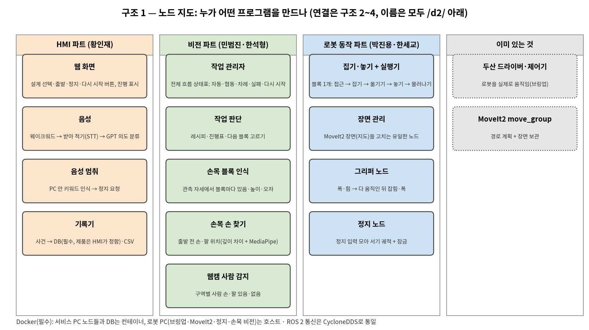
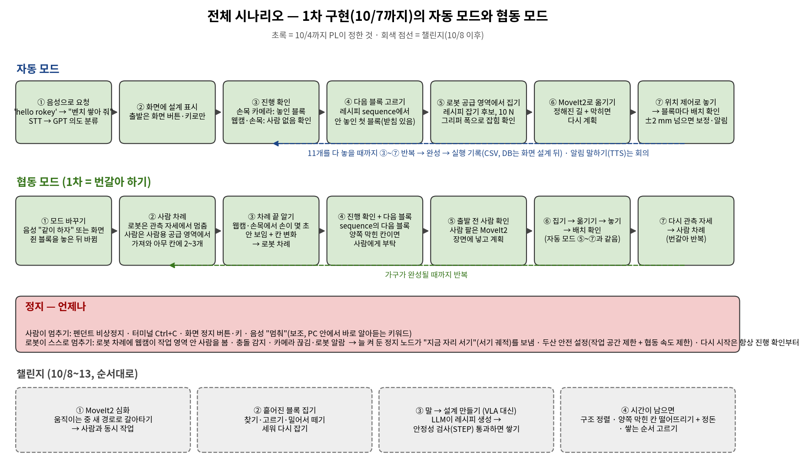
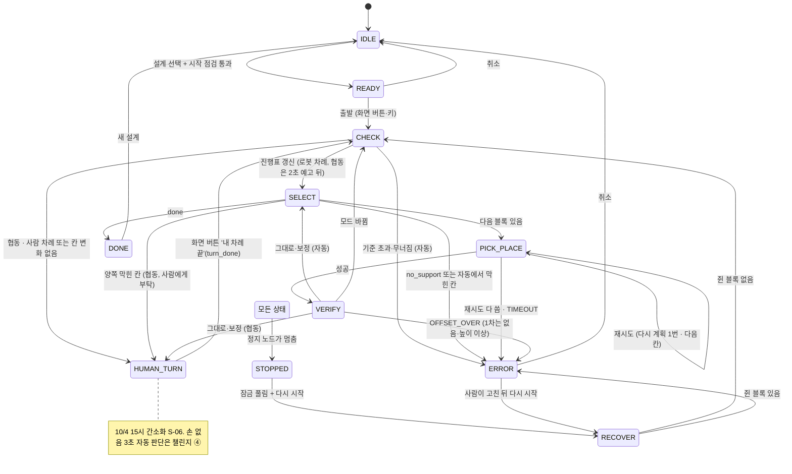
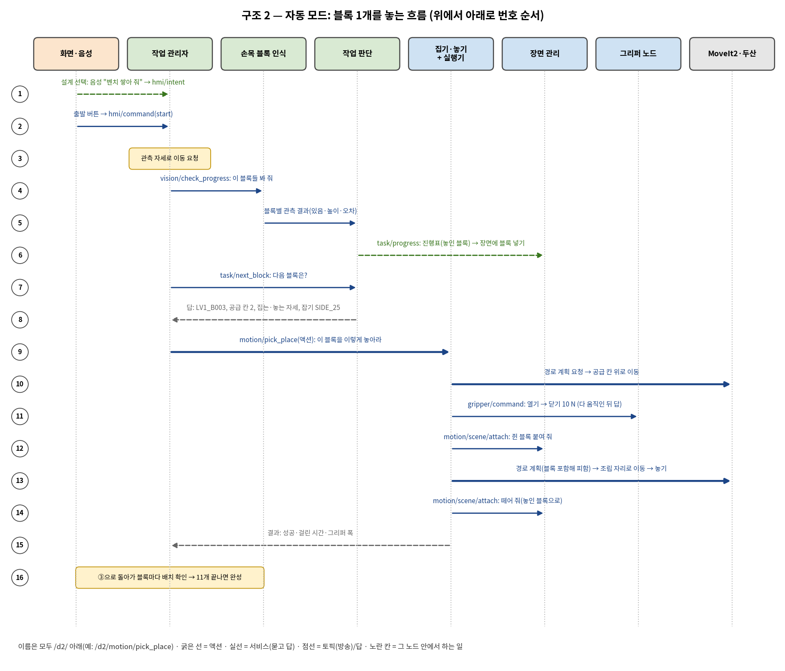
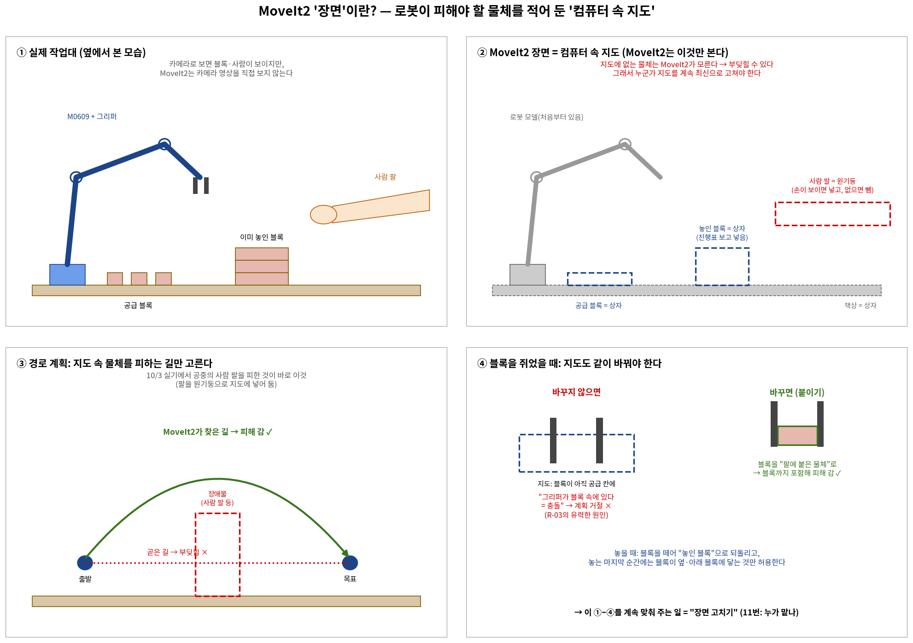
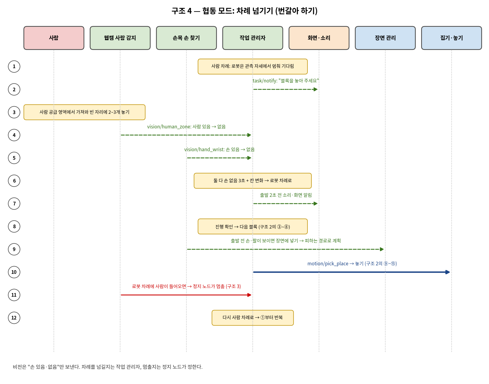
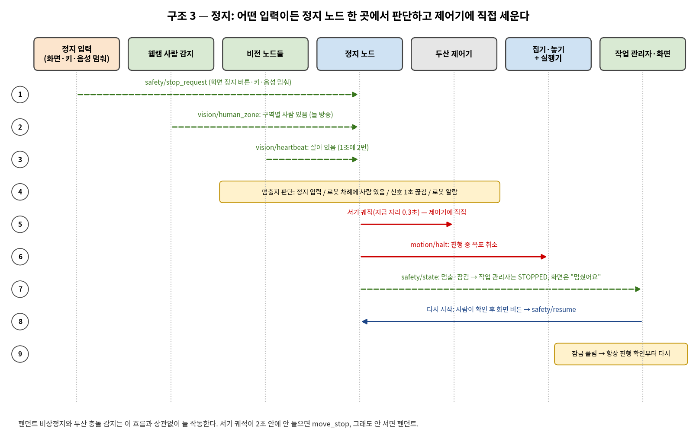
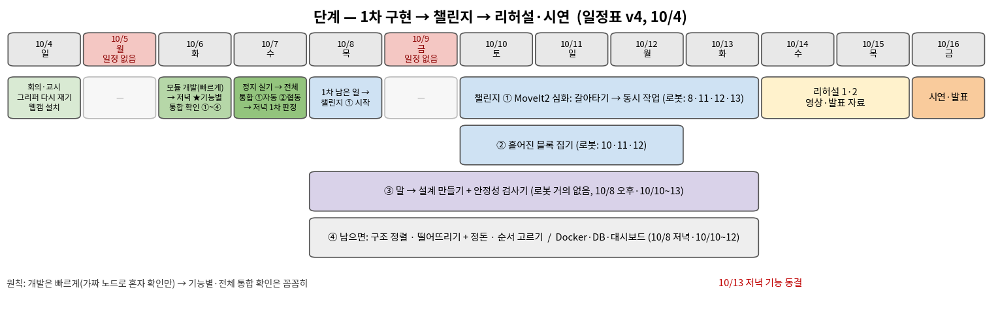

# 시스템 설계 문서 (SDD)
## 젠가 블록 가구 협동로봇 — CAD 설계도대로 쌓는 자동 모드·협동 모드

| 항목 | 내용 |
|---|---|
| 문서 | SDD(System Design Document, 시스템 설계 문서) **v1 초안** · 2026-10-04 |
| 팀 | D2 — 로봇 동작 박진용·한세교(+CAD 한세교, 인프라·통합 포함) · 비전 민범진·한석형(손목 보정·녹화, 웹캠 사람 감지, 비전, 작업 판단, 작업 관리자) · HMI 황인재(화면·DB, 음성·LLM, +PL) |
| 상위 문서 | [01_요구사항_BR-SR_v2_100422.md](01_요구사항_BR-SR_v2_100422.md) · [02_인터페이스_IRD_v1_100422.md](02_인터페이스_IRD_v1_100422.md) |
| 근거 | [결정기록 — 주제 확정(10/3)](decisions/결정기록_주제확정_1003_v1_100415.md) · [결정기록 — 시나리오·역할·인터페이스(10/4)](decisions/결정기록_시나리오_역할_인터페이스_1004_v1_100416.md) |
| 관련 | [04_결과_결과표](04_결과_결과표_v1_100422.md) · [05_작업분류_파트별](05_작업분류_파트별_v1_100422.md) · [06_팀협업규칙](06_팀협업규칙_v1_100416.md) · [TS-01 정지가 안 들음(R-01)](troubleshooting/TS-01_정지가_안_들음_R-01_v1_100415.md) · [TS-02 블록 쥔 채 계획 실패(R-03)](troubleshooting/TS-02_블록_쥔_채_계획_실패_R-03_v1_100414.md) |
| 표시 | **(안)** = 이 문서가 제안한 것(팀 확인 전) · **＿＿ (측정 전)** = 아직 재지 않은 값 · **(미정)** = 정할 사람·때만 정해진 것 · D-xx·A-xx·M-xx·T-xx·R-xx = 10/4 회의 자료의 결정 번호 · V-xx = 사전 검증 항목 · FR·NFR = 01 요구사항 번호 |

이 문서는 요구사항(01)을 "실제로 어떻게 만들 것인가"로 바꾼다. PC 배치, 네트워크, 패키지, 워크셀 좌표, 작업 관리자 상태 머신, 기능별 절차, 예외 처리, 안전, 시험 계획을 정한다.
- 토픽·서비스·액션의 이름·칸·단위는 인터페이스 문서(02)가 정본이다. 이 문서와 02가 다르면 02가 맞다.
- **R-01(Ctrl+C로 안 멈춤)은 10/4 실기에서 해결을 확인했다**(박진용, W010 — §8.1). R-02 재시험(정지 → 재개, 보호 정지 해제, 충돌 감지)은 10/7 오전 자동 모드 실기 전에 남아 있다(W059).
- 10/4 오후 MoveIt2 실기 재검증 수치와 그리퍼 다시 재기 결과는 아직 받지 못했다. 그 결과가 들어갈 자리는 '(측정 전)'으로 비워 두었다.
- **10/4 15시 30분 간소화(S-01~S-13, PL):** 시간이 부족해 1차(10/7 판정) 범위를 줄였다. 이 문서의 "1차"는 간소화 뒤 범위다. 미룬 것은 "1차 뒤(10/8~)"로 적고 없애지 않는다. 결정 목록은 §1.3 끝, 미룬 것 모음은 §10 끝에 있다. 일정표는 v5(W001~W100)다.

---

## 1. 시스템 개요·PC 배치



*그림 1. 노드 지도 — 파트별로 누가 어떤 노드를 만드는지. HMI(주황) 4개 · 비전(초록) 6개 · 로봇 동작(파랑) 4개 · 이미 있는 것(회색: 두산 드라이버·제어기, MoveIt2 move_group). 노드 사이 연결은 그림 4(자동 모드)·그림 6(협동 차례)·그림 7(정지)에 있다. 그림은 10/4 오전 기준이다. 10/4 15시 간소화로 1차 노드가 줄었다: 기록기 없음(S-10), 음성 멈춰는 1차 뒤(S-08), 손목 손 찾기는 챌린지 ①(S-02). 1차 HMI 2개 · 비전 4개 · 로봇 동작 4개.*

**한 줄 요약.** CAD 설계도(레시피)대로 젠가 블록 가구를 쌓는 협동로봇이다. 혼자 쌓는 **자동 모드**와, 사람과 차례를 바꿔 쌓는 **협동 모드**가 있다. 사람이 설계도의 빈 자리 아무 곳에 블록을 놓아도 로봇이 카메라로 진행을 읽고 이어 쌓는다.

**구조 한 줄 요약.** 서비스 PC의 **작업 관리자**가 전체 흐름(상태 머신: 지금 단계와 다음 단계를 정하는 표)을 정한다. 블록 1개를 집어 놓는 일은 로봇 PC의 **집기·놓기 노드**에 액션(오래 걸리는 요청: 중간 보고 + 결과) 하나로 맡긴다. 그리고 **판단은 한 곳에서만** 한다.

| 판단 | 정하는 노드 | 보는 것 (1차) | 1차 뒤에 더 보는 것 |
|---|---|---|---|
| 멈출지 | 정지 노드 (로봇 PC) | 정지 입력 4개 — 키·화면 버튼·Ctrl+C·로봇 알람 (S-03) | 음성 '멈춰', 로봇 차례에 웹캠이 본 사람, 비전 신호 1초 끊김 (W066, 10/8) |
| 차례를 넘길지 | 작업 관리자 | 화면 버튼 '내 차례 끝'(`turn_done`) + 칸 변화 (S-06) | 웹캠·손목 카메라 손 없음 3초로 자동 판단 (챌린지 ④) |
| 진행표(블록마다 놓였나·누가 놓았나) | 작업 판단 | 손목 블록 인식 결과(있음·없음·높이) + 레시피 (S-05) | 얼마나 어긋났나(±2 mm 판정·위층 보정, W100, 10/8~10) |
| MoveIt2 장면(로봇이 피해야 할 물체를 적은 지도) | 장면 관리 | 진행표(쌓인 블록), 쥔 블록 (S-02) | 사람 팔(손목 손 찾기, 챌린지 ①) |



*그림 2. 전체 시나리오 — 1차(10/7까지) 자동 모드 ①~⑦, 협동 모드 ①~⑦(번갈아 하기), 언제나 작동하는 정지, 챌린지 ①~④(10/8~13).*

### 1.1 PC 배치 (2대로 시작)

| PC | 실행 방식 | 실행하는 것 | 꽂는 장비 |
|---|---|---|---|
| **로봇 PC** (필수, 고정) | **호스트**(컨테이너 없이 PC에 바로 설치해 실행) | 브링업 `real_moveit.launch.py`(두산 드라이버·`dsr_moveit_controller`·MoveIt2 move_group, D-09) · 집기·놓기 + 실행기 · 장면 관리 · 그리퍼 노드(잡힘 확인 포함, S-01) · 정지 노드 · 손목 블록 인식. 손목 손 찾기는 챌린지 ①(S-02) | 로봇 제어기(유선) · RG2 그리퍼 · 손목 카메라 RealSense D435i(USB) |
| **서비스 PC** (필수) | **Docker 컨테이너**(host 네트워크) | 웹 화면 · 음성 · 웹캠 사람 감지 · 작업 관리자(CSV 기록 포함, S-10) · 작업 판단. 1차 뒤(10/8~): DB(W051) · 음성 멈춰(W046, 컨테이너에 넣을지는 (미정)) | 웹캠(USB) · 마이크 · 화면 |
| 3번째 PC (조건부) | 서비스 PC와 같음 | 부하가 넘치면 비전 노드를 옮긴다 | 옮긴 카메라 |
| 개발 PC (5명 각자) | 호스트 | 맡은 노드 + 상대 쪽 가짜 노드(`mock_*`) + 에뮬레이터(가상 로봇) | — |

PC 규칙(D-29):
- **2대로 시작한다.** 로봇 PC는 10/3에 시험한 호스트 환경(두산 드라이버·MoveIt2·RealSense)을 그대로 쓴다.
- **모든 노드를 어느 PC에서나 돌게 짠다.** 박힌 경로 없이 설정 파일로 바꾼다(§3.3).
- **옮기지 않는 것:** 브링업과 정지 노드는 로봇 PC에 둔다. 카메라는 그 카메라를 처리하는 PC에 직접 꽂는다.
- **늘리는 기준:** 10/7 자동 모드 실기 때 잰 부하(W053, 따로 시험하지 않음)가 CPU 70%를 넘거나 카메라 처리가 초당 15장 아래면 비전을 3번째 PC로 옮긴다.
- 작업 판단을 어느 PC에 둘지는 그때 잰 부하를 보고 정한다. 지금은 서비스 PC다.

### 1.2 Docker·DB (필수 기술)

| 항목 | 정한 것 | 상태 |
|---|---|---|
| 컨테이너에 넣는 것 | 서비스 PC 노드들(웹 화면·음성·웹캠 비전·작업 관리자·작업 판단). DB는 1차 뒤(W051). 기록기는 없음(S-10) | 정함(10/4), 10/4 15시 간소화로 범위 조정 |
| 호스트에 두는 것 | 로봇 PC 전부(브링업·MoveIt2·정지·손목 비전) | 정함 |
| 컨테이너 네트워크 | host 네트워크. ROS 2 통신이 호스트와 똑같이 보인다 | 정함 |
| DB 제품·쓰는 시기·웹 연결 | **1차 뒤.** HMI가 10/8 오전에 정한다(W051, 회의 추천: PostgreSQL). 1차 기록은 작업 관리자가 쓰는 CSV(S-09, S-10) | (미정) |
| 컨테이너 나누기 | 1차 3개 — `hmi-injae`(웹 화면·음성) · `task-<담당>`(작업 관리자·작업 판단) · `vision-<담당>`(웹캠 사람 감지). `db-hmi`(DB)는 1차 뒤(W051). 이름에 파트·사람을 붙인다(규칙 ⑤) | (안) |

컨테이너 규칙:
- **⑤ 지우기 전에 확인한다.** `docker ps -a`로 이름·만든 사람을 본다. 남이 만든 것은 먼저 묻는다. 한꺼번에 지우는 명령은 쓰지 않는다.
- **⑥ 원본 자료는 컨테이너에 넣지 않는다.** 녹화(rosbag)·큰 CAD·DB 데이터는 로컬 폴더에 두고 연결(마운트)한다. 설정 파일·레시피도 저장소 폴더를 읽기 전용으로 연결한다. Dockerfile에서 원본을 이미지 안으로 복사하지 않는다.
- **④ 키는 `.env`, GitHub 금지.** 키를 이미지에 넣지 않는다.

### 1.3 설계 결정

| 결정 | 이유 | 번호 |
|---|---|---|
| 작업 관리자 = ROS 2 노드 하나, 안에 상태표 | 흐름을 한 노드에서 보고 고친다 | D-08 |
| 블록 1개 = 액션 하나(`/d2/motion/pick_place`) | 작업 관리자는 블록 단위로만 명령한다. 접근·잡기·놓기 같은 중간 단계는 로봇 PC 안에서 끝낸다 | 인터페이스 결정 |
| 정지 노드는 따로, 로봇 PC에 고정. 제어기에 서기 궤적('지금 자리에 서라'는 아주 짧은 궤적)을 **직접** 보낸다 | 10/3 가상 시험에서 MoveIt 실행 취소·두산 `move_stop`만으로는 팔이 안 섰다. 작업 관리자나 서비스 PC가 죽어도 로봇은 선다 | D-11, R-01 |
| 화면 정지 버튼은 작업 관리자를 거치지 않는다 | 정지 경로를 짧게 둔다. 작업 관리자를 꺼도 정지 버튼이 듣는지 시험한다 | FR-T05 |
| 모든 이동을 MoveIt2로 | 장면을 보고 부딪히지 않는 경로를 스스로 찾는다. 쥔 블록도 같이 피한다(사람 팔은 챌린지 ①, S-02). 실기에서 끊기면 마지막 접근·놓기만 두산 명령으로 바꾼다 | A2 |
| 정해진 길 + 출발 전 다시 계획 | 자주 가는 길(공급 → 조립)은 정해 둔다. 출발 전에 막히면 다시 계획한다. 움직이는 중에는 멈추기만 한다(갈아타기는 챌린지 ①) | D-44 |
| 위치 제어로 놓기 | 블록(약 15 g)이 닿는 것을 힘으로 알기 어렵다 | D-23 |
| 다음 블록 = 레시피 sequence + 진행 확인 | 사람이 순서 없이 놓아도 '안 놓인 첫 블록'을 고르면 된다. 자동 모드에서는 양쪽 막힌 칸이 생기지 않는다 | D-21 |
| 블록마다 배치 확인 | 1차는 블록 **있음·없음 + 높이**만 본다(S-05). ±2 mm 판정·위층 보정은 1차 뒤(W100). 시간이 늘어 10/7 자동 모드 실기에서 잰다 | A8, S-05 |
| 메시지 섞기 | 요청-결과(집기·놓기, 진행 확인, 다음 블록, 그리퍼, 장면 붙이기, 화면 명령)는 전용 메시지로 형식을 검사한다. 상태 방송은 JSON 문자열로 빨리 바꾼다 | 인터페이스 결정 |
| 출발은 화면 버튼·키로만, LLM은 의도 분류만 | STT가 무음에서 말을 지어낸 일이 2/10(V-18). 로봇 움직임·정지는 LLM이 정하지 않는다 | D-32, D-31 |
| 설정 파일 하나, 기록은 작업 관리자 한 곳 | 같은 값이 두 곳에 없게 한다. 1차 기록은 작업 관리자가 `run_id` CSV를 직접 쓴다(S-10). 기록기 노드·기록 전용 토픽은 1차에 없다(DB 넣을 때 다시 봄). 다른 동작 코드는 파일·DB에 직접 쓰지 않는다 | NFR-11, FR-T07, S-10 |
| ROS 2 통신은 CycloneDDS(ROS 2 통신 방식의 한 종류) | 모든 PC·컨테이너를 한 방식으로 맞춘다 | 인터페이스 결정 |
| 웹 화면 | 브라우저만 있으면 어느 PC에서나 본다. 1차는 버튼 6개(설계 선택·모드·출발·정지·다시 시작·내 차례 끝) + 상태 글자(S-09) | D-33, S-09 |

**10/4 15시 30분 간소화 (S-01~S-13, PL).** 1차 범위를 줄인 결정이다. 미룬 것은 "1차 뒤"이고 없애는 것이 아니다.

| 번호 | 바뀐 것 | 이 문서에서 고친 곳 | 일정표 |
|---|---|---|---|
| S-01 | 그리퍼 노드가 폭을 보고 **잡힘 확인·놓을 때 여는 폭**까지 맡는다(따로 작업 없음) | §3.2, §6.2 | W039 |
| S-02 | 장면 관리 1차 = **쌓인 블록 + 쥔 블록만.** 손가락 충돌 모델도 장면 관리에 포함. 사람 팔(손목 손 찾기)은 챌린지 ① | §3.2, §6.5, §6.6 | W036 |
| S-03 | 1차 정지 입력 = **키·화면 버튼·Ctrl+C·로봇 알람 4개.** 음성 멈춰·웹캠 사람·카메라 끊김 → 정지 노드 연결은 1차 뒤 | §7.1, §8.1 | W066 → 10/8 |
| S-04 | 출입 선 테이프는 로봇 준비에 포함 | §4.2 | W057 |
| S-05 | 1차 배치 확인 = **블록 있음·없음 + 높이.** ±2 mm 판정·위층 보정은 1차 뒤 | §6.3, §6.4 | W041 / W100(10/8~10) |
| S-06 | 사람 차례 끝 = **화면 버튼 '내 차례 끝'(`turn_done`)** → 작업 관리자. 손 감지 자동 판단은 챌린지 ④ | §5, §6.6 | W068(10/7 오후) |
| S-07 | 1차 웹캠 = 로봇 작업 영역 안 **사람 있음·없음 신호(`human_zone`)만.** 정지 노드 연결은 W066. 10/7 협동 실기 안전은 펜던트·화면 정지 버튼·저속·충돌 감지 | §2.2, §6.6, §8.1 | W042 |
| S-08 | 1차 음성 = **웨이크워드 + STT + 의도 분류(설계 선택·모드)만.** 음성 멈춰·TTS·음성 통합은 1차 뒤 | §6.7 | W045 / W046·W052·W069 → 10/8 |
| S-09 | 1차 화면 = **버튼 6개 + 상태 글자.** DB 시기·제품·웹 연결은 1차 뒤. 1차 기록은 CSV | §6.7 | W047 / W051 → 10/8 오전 |
| S-10 | **기록기 노드 없음.** 작업 관리자가 `run_id` CSV를 직접 쓴다. 기록 전용 인터페이스는 1차에 안 만든다 | §2.2, §3.2, §6.7 | W065 |
| S-11 | 10/6 저녁 기능별 통합 확인 = **2개**: ① 동작+정지(W049) ② 인식·판단+HMI(W097) | §9.1 | W049, W097 |
| S-12 | 영상은 10/7 전체 통합 실기 중에 같이 찍는다 | §9.1, §9.2 | — |
| S-13 | 복구 절차 문서 → 10/8 오전(W070) · 시연 블록 고르기 → 10/14(W054) · 두 번째 가구 CAD → 10/8(W074) | §9.1, §10 | W070, W054, W074 |
| 대비책 | 10/7 오전 자동을 못 끝내면 **오후도 자동에 집중**, 협동 최소형 실기는 10/8 오전(W073). 판정은 자동 먼저, 협동은 10/8 오전에 마저 본다. 협동은 1차 완료 기준에서 빼지 않는다 | §9.2, §9.8 | W073 |

---

## 2. 네트워크

### 2.1 구성도

```
[M0609 제어기 192.168.1.100] ──유선 (두산 전용 통신, ROS 2 아님)── [로봇 PC] ──USB── [손목 카메라 D435i]
[RG2 그리퍼] ── 로봇 PC의 그리퍼 노드가 Modbus로 다룬다                │
                                                                       │ 유선 · ROS 2 (CycloneDDS)
                                                                       │ 같은 ROS_DOMAIN_ID = 60 (팀 60번대)
                                                                       │ 이름은 모두 /d2/ 아래
[브라우저: 웹 화면] ── [서비스 PC: 컨테이너들 (host 네트워크)] ──────┘
                                  ├──USB── [웹캠]
                                  └─────── [마이크]
```

- **로봇 PC ↔ 제어기:** 두산 전용 통신, 유선. 브링업이 맡는다.
- **로봇 PC ↔ 서비스 PC:** ROS 2. **CycloneDDS로 통일**한다. 모든 PC·컨테이너가 같은 `ROS_DOMAIN_ID`(PC 사이 ROS 2 통신 방 번호)를 쓴다. 우리 팀은 **60번대**(60~69)를 쓴다. GPU PC = **60**. 번호가 같아야 서로 보이므로 함께 돌리는 PC·컨테이너는 모두 **60**으로 맞춘다(혼자 시험할 때 61~69를 각자 쓰는 것은 (안)). PC 사이는 유선이다(NFR-09).
- **모든 PC·컨테이너의 환경 변수:** `RMW_IMPLEMENTATION=rmw_cyclonedds_cpp`, `ROS_DOMAIN_ID=60`. 랜카드가 둘 이상인 PC는 CycloneDDS 설정 파일로 쓸 랜카드를 정한다 (안).
- **카메라 영상은 PC 사이로 보내지 않는다.** 카메라를 꽂은 PC에서 처리하고 결과(좌표·있음·없음)만 보낸다. 화면에 보일 영상은 압축·저해상도로 보낸다(NFR-10). PC 사이 지연 목표 ≤ 50 ms — ＿＿ ms (측정 전, V-14).
- **브라우저 ↔ 웹 화면:** rosbridge를 쓸지, 웹 서버가 직접 ROS 2에 붙을지 HMI가 정한다 (미정).
- **서비스 PC나 네트워크가 끊기면:** 1차에는 정지 노드가 생존 신호를 아직 보지 않는다(S-03, W066은 10/8). 화면 정지 버튼도 닿지 않으므로 **펜던트 비상정지**를 쓴다. 10/8부터는 웹캠 생존 신호가 끊기면 정지 노드가 1초 안에 로봇을 세운다(`VISION_LOST`).

### 2.2 통신 정의 (구간별)

칸·형식·단위는 [02 인터페이스](02_인터페이스_IRD_v1_100422.md)에 있다. 여기서는 **어느 구간을 지나는지**만 본다.

| 이름 | 종류 | 보내는 쪽 → 받는 쪽 | 구간 |
|---|---|---|---|
| `/d2/hmi/command` | 서비스 `d2_interfaces/HmiCommand` | 웹 화면 → 작업 관리자 (출발은 화면에서만). 값에 `turn_done`(내 차례 끝)을 더한다(S-06, 안) | 서비스 PC 안 |
| `/d2/hmi/intent` | 토픽 JSON `intent/1` | 음성 → 작업 관리자 | 서비스 PC 안 |
| `/d2/safety/stop_request` | 토픽 JSON `stop_request/1` | 화면·키 → 정지 노드. 음성 멈춰는 1차 뒤(W046) | 서비스 → 로봇 |
| `/d2/vision/human_zone` | 토픽 JSON `human_zone/1` | 웹캠 사람 감지 → 작업 관리자(1차). 정지 노드 구독은 1차 뒤(W066, 10/8, S-07) | 서비스 안 (10/8부터 서비스 → 로봇) |
| `/d2/vision/heartbeat` | 토픽 JSON `heartbeat/1` (1초에 2번) | 비전 노드들 → 정지 노드. 1차에는 보내기만 하고 정지 노드 연결은 W066(10/8) | 서비스 → 로봇, 로봇 안 |
| 서기 궤적 | 액션 `FollowJointTrajectory` | 정지 노드 → `dsr_moveit_controller` (직접) | 로봇 PC 안 |
| `/d2/motion/halt` | 토픽 JSON `halt/1` | 정지 노드 → 집기·놓기 | 로봇 PC 안 |
| `/d2/safety/state` | 토픽 JSON `safety_state/1` | 정지 노드 → 모두 | 로봇 → 서비스 |
| `/d2/safety/resume` | 서비스 `std_srvs/Trigger` | 웹 화면('다시 시작' 버튼) → 정지 노드 | 서비스 → 로봇 |
| `/d2/vision/check_progress` | 서비스 `d2_interfaces/CheckProgress` | 작업 관리자 → 손목 블록 인식 | 서비스 → 로봇 |
| `/d2/task/progress` | 토픽 JSON `progress/1` | 작업 판단 → 모두(장면 관리·화면·작업 관리자) | 서비스 → 로봇, 서비스 안 |
| `/d2/task/next_block` | 서비스 `d2_interfaces/NextBlock` | 작업 관리자 → 작업 판단 | 서비스 PC 안 |
| `/d2/vision/hand_wrist` | 토픽 JSON `hand_wrist/1` | 손목 손 찾기 → 장면 관리·작업 관리자. **챌린지 ①부터**(S-02), 1차에 없음 | 로봇 안, 로봇 → 서비스 |
| `/d2/motion/pick_place` | 액션 `d2_interfaces/PickPlace` | 작업 관리자 → 집기·놓기 (블록 1개 전체) | 서비스 → 로봇 |
| `/d2/motion/scene/attach` | 서비스 `d2_interfaces/SceneAttach` | 집기·놓기 → 장면 관리 | 로봇 PC 안 |
| `/d2/gripper/command` | 서비스 `d2_interfaces/GripperCommand` | 집기·놓기 → 그리퍼 노드 (다 움직인 뒤 폭·잡힘 여부까지 답, S-01) | 로봇 PC 안 |
| `/d2/gripper/state` | 토픽 JSON `gripper_state/1` | 그리퍼 노드 → 모두 | 로봇 안, 로봇 → 서비스 |
| `/d2/task/state` | 토픽 JSON `state/1` | 작업 관리자 → 화면·정지 노드 | 서비스 안, 서비스 → 로봇 |
| `/d2/task/notify` | 토픽 JSON `notify/1` | 작업 관리자 → 화면(음성 TTS는 1차 뒤) | 서비스 PC 안 |
| `/d2/task/event` | 토픽 JSON `event/1` | **1차에 없음**(S-10). 기록기 노드가 없고 작업 관리자가 자기 상태·결과를 CSV에 직접 쓴다. DB를 넣을 때(W051) 다시 본다 | — |
| 장면 갱신 | 서비스 `apply_planning_scene` (MoveIt2) | 장면 관리 → move_group | 로봇 PC 안 |

- 서비스 PC → 로봇 PC로 가는 명령은 **세 갈래뿐**이다: 정지 입력(`stop_request`·`resume`), 진행 확인(`check_progress`), 블록 1개(`pick_place`). 그래서 네트워크 문제를 찾을 곳이 적다.
- 관측 자세로 옮기는 명령은 26개 표에 아직 없다(§11 열린 항목).

---

## 3. 패키지 구성 (안)·구조 규칙

### 3.1 저장소 구조 (안)

```
rokey_9_pjt2_D2/                  ← 저장소 루트
├── docs/                         문서·그림·결정 기록·시험 기록·트러블슈팅
├── docker/                       (안) 서비스 PC 컨테이너: Dockerfile · compose 파일 — 원본 자료는 넣지 않고 연결
├── tools/                        문서 이름 도구(docver.py) · (안) CAD → 레시피 도구(한세교)
└── src/
    ├── d2_interfaces/            action/PickPlace · srv/GripperCommand · CheckProgress · NextBlock · HmiCommand · SceneAttach
    ├── d2_bringup/               launch/(로봇 PC · 서비스 PC · 가짜) · config/robot.yaml · 보정 파일 · 박진용 real_moveit 옮김
    ├── d2_motion/                pick_place_node (집기·놓기 + 실행기) · scene_manager_node (장면 관리) · mock_pick_place
    ├── d2_gripper/               gripper_node · mock_gripper
    ├── d2_safety/                stop_node · safe_stop (서기 궤적 보내기, R-01 수정본 옮김)
    ├── d2_vision/                block_check_node · human_zone_node · mock_* · (챌린지 ①) hand_wrist_node
    ├── d2_task/                  task_manager_node (상태표 + run_id CSV 기록) · task_judge_node (레시피·진행표·다음 블록) · recipes/
    └── d2_hmi/                   web_node · voice_node · web/ (화면) · (1차 뒤, W046) voice_stop_node
```

- 10/4 15시 간소화: `logger_node`는 없다(S-10). `voice_stop_node`는 1차 뒤(S-08), `hand_wrist_node`는 챌린지 ①(S-02)이다.

- 저장소는 colcon 패키지(ROS 2 코드 묶음 단위)로 나눈다(D-05, NFR-13). 로봇 PC는 main만 실행한다.
- 두산 드라이버 워크스페이스(강사 배포, 고치지 않음) 위에 이 워크스페이스를 겹친다. source 순서는 두산 → 우리다. 설치 경로는 사람마다 달라 코드·문서에 박지 않는다.
- 박진용 브링업과 로봇 모델(M0609 + RG2 + 손목 카메라)은 `d2_bringup`으로 옮긴다(FR-M01). 모델을 따로 패키지로 둘지는 옮길 때 로봇 동작 파트가 정한다 (안).
- 가짜 노드(`mock_*`)는 **보내는 쪽 파트**가 자기 패키지 안에 만든다(10/6 오전, W034).

### 3.2 패키지와 노드 (안)

| 패키지 | 노드(실행 파일) | 클래스 (규칙 ①) | 파트 | PC |
|---|---|---|---|---|
| `d2_interfaces` | 없음. 전용 메시지 6개(위 트리) | — | 로봇 동작(인프라·통합) | 두 PC 모두 |
| `d2_bringup` | launch 파일 + `config/robot.yaml` | — | 로봇 동작(인프라·통합) | 두 PC 모두 |
| `d2_motion` | `pick_place_node` | `PickPlaceNode`(액션 서버). 같은 프로세스에서 `executor.py`의 `Executor`(궤적 실행·취소)를 쓴다 | 로봇 동작 | 로봇 |
| `d2_motion` | `scene_manager_node` | `SceneManager` — 장면을 고치는 유일한 노드. 1차 장면 = 책상·쌓인 블록·공급 블록·쥔 블록 + 손가락 충돌 모델(S-02). 사람 팔은 챌린지 ① | 로봇 동작 | 로봇 |
| `d2_gripper` | `gripper_node` | `GripperNode` — 열기·닫기·폭 읽기 + **잡힘 확인·놓을 때 여는 폭**(S-01) | 로봇 동작 | 로봇 |
| `d2_safety` | `stop_node` + 모듈 `safe_stop.py` | `StopNode` · `SafeStop`(서기 궤적 → 취소 → 설 때까지 확인 → `move_stop`). 1차 입력 4개(S-03) | 로봇 동작(안전 감시) | 로봇 |
| `d2_vision` | `block_check_node` · `human_zone_node` · (챌린지 ①) `hand_wrist_node` | `BlockChecker`(1차: 있음·없음·높이) · `HumanZoneDetector`(1차: 신호만) · `HandFinder`(챌린지 ①) | 비전 | 로봇 · 서비스 · 로봇 |
| `d2_task` | `task_manager_node` · `task_judge_node` | `TaskManager`(상태표 + `run_id` CSV 기록, S-10) · `TaskJudge`(레시피·진행표·다음 블록) | 비전 | 서비스 |
| `d2_hmi` | `web_node` · `voice_node` · (1차 뒤, W046) `voice_stop_node` | `WebServer`(버튼 6개 + 상태 글자) · `VoiceNode`(웨이크워드·STT·의도) · `VoiceStop`(1차 뒤). 기록기 없음(S-10) | HMI | 서비스 |

- 파일·클래스 이름은 (안)이다. 노드 이름·인터페이스 이름은 02가 정본이다.
- HMI는 **황인재 혼자** 맡는다(10/4 PL 결정 — 팀 규칙 ③의 예외).

### 3.3 구조 규칙 (팀 규칙 반영)

| 규칙 | 이 설계에서 지키는 방법 |
|---|---|
| ① 관련 기능은 클래스로 묶는다 | 노드 하나 = 파일 하나 = 클래스 하나가 기본이다. 예: 그리퍼 노드 = `GripperNode` 안에 열기·닫기·폭 읽기·잡힘 확인(S-01) |
| ② 불필요한 일회성 참조·과도한 구조화 금지 | 한 번만 쓰는 값·함수는 그 자리에 둔다. 공통 부모 클래스·추상 계층을 미리 만들지 않는다. 따로 빼는 것은 실제로 두 곳 이상 쓸 때만이다. 예: `SafeStop`은 정지 노드와 집기·놓기 두 곳에서 쓴다 |
| 경로 하드코딩 금지 | `/home/이름/...` 같은 개인 경로를 코드·launch·설정에 쓰지 않는다. `get_package_share_directory` 또는 `Path(__file__).parent`를 쓴다 |
| 설정 파일 한 곳 | 두 번 이상 쓰는 값은 `config/robot.yaml`에 둔다(§3.4). 값마다 출처·날짜·잰 사람을 적는다(NFR-11). 보정 값(손목 hand-eye)만 따로 파일 |
| 로봇 코드에 정지 처리 | 로봇을 움직이는 프로그램은 Ctrl+C·막힘·실패 때 **먼저 서기 궤적**을 보낸다(`SafeStop`). rclpy는 `SignalHandlerOptions.NO`로 시작해 Ctrl+C 때 ROS가 먼저 꺼지지 않게 한다(저장소 에이전트 규칙). 이미 보낸 궤적은 프로그램이 끝나도 계속 움직인다(10/4 가상: 고치기 전 코드는 Ctrl+C 뒤 4.4~5.0초 동안 75~77° 더 감) |
| 단위·이름 | 노드끼리는 m·rad·쿼터니언, 파일(레시피·CSV)은 mm. JSON 칸 이름에 단위를 붙인다(`dx_m`, `offset_mm`, `force_n`). 블록 번호는 레시피 block_id(예: `LV1_B001`). mm ↔ m 바꾸기는 그 파일을 읽는 노드 한 곳에서만 한다 |
| 결과 형식 | 서비스·액션 결과 = `success`(참·거짓) + `reason`(§7 코드) |
| 키 | 키는 `.env`, GitHub 금지(규칙 ④) |
| 이름·칸 바꾸기 | 받는 파트 사람이 확인해야 merge한다. 커밋 `영향:`에 파트를 적고 `CHANGES.md`에 한 줄 남긴다. 커밋 메시지에 `변경 파일:`을 적는다(규칙 ⑧). PR 승인은 황인재·한세교(규칙 ⑦) |

### 3.4 설정 파일 `config/robot.yaml`

키 이름은 10/4에 정했다. 값은 측정 뒤 넣는다. 파일 자리는 `d2_bringup/config/robot.yaml`이고, 노드는 패키지 기준 경로로 읽는다 (안). 컨테이너는 저장소 폴더를 읽기 전용으로 연결해 같은 파일을 읽는다.

| 키 | 뜻 | 값 | 쓰는 노드 |
|---|---|---|---|
| `table_z_m` | 작업면 높이(3~4곳 평균) | ＿＿ (측정 전, 10/4 [로봇 5]) | 장면 관리·작업 판단 |
| `assembly_origin` (x·y·z·yaw) | 조립 원점 T_base_from_cad(§4.3) — 여기 하나만 | x 560.0 · y 164.1 mm · yaw −0.1° (base, 10/4 박진용. z = 작업면 3~4점 평균은 10/6) | 작업 판단·장면 관리 |
| `supply_slots` | 로봇 공급 칸 좌표 목록 | 1 (436.3, −215.7) · 2 (514.0, −219.6) · 3 (610.6, −219.9) · 4 (368.0, −218.7) · 5 (477.9, −301.5) · 6 (581.7, −294.3) mm (base, 10/4 박진용) | 작업 판단·장면 관리 |
| `observe_pose` | 관측 자세 | ＿＿ (측정 전, 10/4 [로봇 8]) | 작업 관리자·집기·놓기 |
| `tcp_length_m` | TCP(그리퍼 손가락 끝 기준점) 길이 | 228.0 mm (10/4 MoveIt FK 확인, 펜던트와 1.2 mm 차) | 브링업 모델·집기·놓기 |
| `finger.thickness_m` | 손가락 끝 두께 | 11.4 mm (모델 메시 값, 캘리퍼스는 10/6 W011. 고무 포함 14 mm였음) | 작업 판단(잡기 틈)·장면 관리(손가락 모델) |
| `finger.width_m` | 손가락 폭 | 20 mm (모델 메시 값) | 작업 판단(끝면 좌우 여유) |
| `gripper.force_n` | 기본 파지력 | 10 (미끄러지면 20) | 그리퍼 노드·집기·놓기 |
| `gripper.open_margin_m` | 놓을 때 '잡은 폭 + 이만큼'만 연다 | ＿＿ (측정 전, 10/4 [로봇 3]) | 집기·놓기 |
| `grasp_width_m.SIDE_25` · `END_75` | 잡기별 폭(잡힘 확인 기준) | 표시폭 옆면 32.8·33.0 · 끝면 83.4·83.7 mm (10/4 박진용, 고무 낀 채 임시 — 10/6 고무 없이 다시). 고무 포함 10/3 값은 34.1~34.3 · 84.5~84.7 mm | 집기·놓기 |
| `speed_scale` | 속도 배율 | ＿＿ (미정. R-01 첫 실기는 0.1) | 집기·놓기 |
| `place_tolerance_m` | 배치 목표 정밀도. 1차 뒤(W100)부터 쓴다(S-05) | 0.002 (±2 mm) | 작업 판단 |
| `turn.hand_absent_s` | 손 없음이 이만큼 이어지면 사람 차례 끝. 챌린지 ④부터(S-06) | 3 (시험으로 조정) | 작업 관리자 |
| `turn.start_warning_s` | 로봇 출발 예고 | 2 | 작업 관리자·화면 |
| `stop.vision_timeout_s` | 비전 신호가 이만큼 끊기면 정지. 1차 뒤(W066)부터(S-03) | 1 | 정지 노드 |
| `stop.first_wait_s` | 서기 궤적 뒤 이만큼 안에 안 서면 `move_stop` | 2 | 정지 노드 |

- 키 이름이 `_m`으로 끝나므로 값은 m로 적는다. 공통 약속 '파일은 mm'과 어긋나 보이므로 10/6 오전 개발 시작 전 인터페이스 다시 맞추기에서 확인한다(§11).
- TCP·공구 무게는 **펜던트·MoveIt2 모델·robot.yaml 세 곳에 같은 값**을 넣는다(FR-M11).

### 3.5 실행 순서 (안)

launch 이름·인자는 인프라가 정한다. 아래는 순서만 보이는 예다.

```bash
# 모든 PC·컨테이너 공통
export RMW_IMPLEMENTATION=rmw_cyclonedds_cpp ROS_DOMAIN_ID=60      # 팀 60번대, 함께 돌리는 PC는 60

# 로봇 PC (호스트) — 브링업 + 로봇 PC 노드
ros2 launch d2_bringup robot_pc.launch.py mode:=real               # 가상은 mode:=virtual

# 서비스 PC — 컨테이너들 (웹 화면 · 음성 · 웹캠 비전 · 작업 관리자 · 작업 판단. DB는 1차 뒤)
docker compose -f docker/compose.yaml up                           # 저장소 폴더는 읽기 전용으로 연결

# 로봇 없이 (개발 PC 한 대) — 받는 쪽은 가짜 노드
ros2 launch d2_bringup mock.launch.py
```

- 첫 실행 때 정지 준비가 되었는지(서기 궤적 컨트롤러가 보이는지) 화면에 찍고, 안 보이면 실기를 하지 않는다(R-01 수정본의 '정지 준비' 줄과 같은 방식).

---

## 4. 워크셀


*그림 3. 작업대 배치 v2 — PL 스케치(10/4) 기준. 로봇 앞에 조립 작업영역, 그 옆(웹캠 쪽)에 로봇용 공급 영역, 출입 선(빨간 점선) 너머 사람 앞에 사람 공급 영역, 앞쪽 긴 변 밖에 웹캠. 위치는 대략이고 10/4 로봇 시간에 좌표를 재서 확정한다.*

### 4.1 장비 (하드웨어 구성)

| 장비 | 하는 일 | 연결 |
|---|---|---|
| 두산 M0609 (가반 6 kg, 도달 900 mm, 반복정밀도 ±0.03 mm) | 블록 옮기기 | 제어기 ↔ 로봇 PC 유선 |
| OnRobot RG2 (벌림 0~110 mm, 힘 3~40 N). **고무 패드 뺌(10/4)** | 블록 집기·놓기 | 그리퍼 노드(Modbus) |
| 손목 카메라 RealSense D435i (깊이 있음, 최소 거리 약 28 cm) | 진행 확인·블록마다 배치 확인(1차: 있음·없음·높이). 출발 전 손 찾기는 챌린지 ① | 로봇 PC USB |
| 웹캠 (깊이 없음, 1차부터 씀) | 작업대 전체를 보고 구역별 사람 손·팔 있음·없음 신호(1차는 신호만, S-07) | 서비스 PC USB |
| 마이크 | 웨이크워드·음성 명령. 음성 '멈춰'는 1차 뒤(W046) | 서비스 PC |
| 작업대 1200 × 650 mm (로봇 뒤 약 350 · 로봇 앞 약 850 mm), 맨 작업대 | — | — |
| 젠가 블록 75 × 25 × 15 mm (두께 평균 14.7 mm, V-03) | 1차 lv1_bench 11개 + 공급 여분(수 (미정)) | — |
| 테이프 | 출입 선·공급 칸·작업영역 표시 | — |

### 4.2 영역과 좌표

좌표는 모두 로봇 기준 `base_link`다.

| 영역 | 위치 | 로봇이 가나 | 웹캠 구역 이름 | 설정 키 | 값 |
|---|---|---|---|---|---|
| 조립 작업영역 | 로봇 바로 앞, 홈 자세 근처(도달 여유가 큰 곳). 가운데 = 조립 원점 | 감 | `assembly` | `assembly_origin` | ＿＿ (측정 전) |
| 로봇 공급 영역 | 작업영역 옆, 웹캠 쪽 | 감 | `robot_supply` | `supply_slots` | ＿＿ (측정 전) |
| 이동 길 | 조립 작업영역 ↔ 로봇 공급 영역 사이 | 감 | `path` | — | — |
| 사람 공급 영역 | 작업대 먼 끝, 사람 바로 앞 | 안 감 | `human_supply` | — | 테이프로 표시 |
| 출입 선 | 사람 공급 영역과 로봇 작업 영역 사이 테이프 | — | 구역 경계 | — | 10/6 오전 로봇 준비(W057)에 포함(S-04) |
| 관측 자세 | 조립 작업영역 위 30~40 cm | 감(대기 자세) | — | `observe_pose` | ＿＿ (측정 전) |
| 작업면 | 맨 작업대(스펀지·판 없음, D-15) | — | — | `table_z_m` | ＿＿ (측정 전) |

**로봇 작업 영역** = 조립 작업영역 + 로봇 공급 영역 + 이동 길. 로봇 차례에 사람이 들어오면 안 되는 곳이다.

### 4.3 조립 원점 T_base_from_cad

- **설계 좌표계(레시피):** 바닥 외곽 가운데 = (0, 0), x 오른쪽, y 뒤쪽, z 위(작업면 = 0), 단위 mm. **설계 축 = 로봇 base 축**이다(D-14).
- **조립 원점 찍기:** 조립 작업영역 가운데를 로봇 TCP로 찍어 `assembly_origin`에 저장한다. 높이는 작업면 3~4곳의 평균이다. 원점은 하나만 찍고, 설계 파일은 고치지 않는다.
- **바꾸는 식** (작업 판단 한 곳에서만):

```
p_base [m] = R_z(yaw) · (p_cad [mm] / 1000) + (x, y, z)        # (x, y, z, yaw) = assembly_origin
# 설계 축 = base 축이면 yaw = 0 → "블록 로봇 좌표 = 설계 좌표 + 원점"
```

- **놓는 높이:** 잰 받침 윗면(손목 블록 인식의 `top_z`)을 기준으로 한다. 잰 값이 없으면 14.7 mm씩 쌓는다(D-23).
- **손목 카메라 보정 오차는 배치 좌표에 직접 들어가지 않는다.** 좌표는 설계 + 원점 + 교시·계산으로 만들고, 카메라는 확인·보정에만 쓴다(NFR-01). 지금 손목 보정은 4.8 cm 어긋나 있다(R-05) → 10/6 오전에 다시 보정한다(W058). 정확도(V-15)는 10/7 자동 모드 실기 때 같이 잰다.
- 레시피에도 `T_base_from_cad` 칸이 있지만, 값은 robot.yaml `assembly_origin` **하나만** 쓴다(같은 값 두 곳 금지). 레시피의 `T_base_from_cad`는 null로 둔다 — 10/4 한세교 동의.

### 4.4 공급 영역 둘

| | 로봇 공급 영역 | 사람 공급 영역 |
|---|---|---|
| 두는 방법 | 같은 간격·같은 자세(1차, A5). 흩뿌림은 챌린지 ② | 사람이 집기 쉽게 둔다 |
| 좌표 | 칸 좌표를 계산해 `supply_slots`에 넣는다. 칸 간격은 새 손가락 두께로 다시 계산한다(지금 20 mm) — **계산은 로봇 셀(W016)**, 작업 판단은 그 값을 쓴다(10/4 PL). 두 잡기(SIDE_25·END_75)가 모두 들어가야 한다 | 로봇이 가지 않아 좌표가 필요 없다 |
| 집는 높이 | 기준 = 손가락 끝이 책상 위 +4 mm(눕힘 기준, 10/4 실기 6/6 — PL 결정). 잡기별 값은 §4.6 | — |
| 칸 고르기 | 작업 판단이 다음 빈 칸을 `supply_slot`으로 돌려준다 | — |
| 블록 수 | lv1_bench 11개 + 여분 ＿＿ (미정) | 협동에서 사람이 놓을 2~3개 + 여분 |
| 나눈 이유 | 사람과 로봇의 동선이 겹치지 않게 한다(M-01) | |

### 4.5 관측 자세

- 조립 작업영역 위 30~40 cm다(D435i 깊이 최소 거리 약 28 cm). 손목 카메라가 조립 영역 전체를 내려다본다.
- 쓰는 때: 진행 확인, 블록마다 배치 확인, 협동 모드의 사람 차례 대기(속도 0, 그리퍼가 사람 손에 닿지 않는 높이). 출발 전 손 찾기는 챌린지 ①(S-02).
- 같은 자세에서 찍은 **빈 작업대 기준**을 남긴다(블록 인식 비교용).
- 교시는 10/4 [로봇 8] — ＿＿ (측정 전).

### 4.6 그리퍼 값 (고무 패드 제거로 다시 잼)

| 값 | 10/3 (고무 포함) | 10/4 다시 | 설정 키 | 바뀌면 고칠 곳 |
|---|---|---|---|---|
| 손가락 끝 두께 | 14 mm | 11.4 mm (모델 메시 값 — 캘리퍼스는 10/6 W011) | `finger.thickness_m` | 잡기 틈 계산, 공급 칸 간격, 놓을 때 여는 폭, MoveIt2 손가락 모델 |
| 손가락 폭 | 20 mm | 20 mm (모델 메시 값) | `finger.width_m` | 끝면 잡기 좌우 여유(지금 ±2.5 mm) |
| 접촉면 길이·끝 높이 | 고무 면 세로 20 mm | 폭에 따라 끝 높이가 최대 39 mm 바뀜 → 집는·놓는 높이에 폭별 보정. 다 닫힘·TCP z 12.2 mm일 때 끝이 책상 위 약 1 mm (10/4 박진용) | — | 집는 높이 기준 = 손가락 끝이 책상 위 +4 mm(눕힘 기준, 10/4 실기 6/6 — PL 결정) |
| TCP | MoveIt2 228 mm 가정 | 228.0 mm 확인(MoveIt FK, 펜던트와 1.2 mm 차) | `tcp_length_m` | 펜던트 TCP, MoveIt2 모델, 모든 교시값 |
| 잡기별 표시폭 | 옆면 34.1~34.3 · 끝면 84.5~84.7 mm | 옆면 32.8·33.0 · 끝면 83.4·83.7 · 다 닫힘 9.0 mm (10/4 박진용, 고무 낀 채 임시 — 10/6 고무 없이 다시). 표시폭 = 실제 + 약 9.4 mm, 방향 따라 약 3 mm 차 | `grasp_width_m.*` | 잡힘 확인 기준 |
| 집는 높이 | 스펀지 위 값(못 씀) | 손가락 끝, 책상 위: 눕힘 4 · 옆세움-길게 14 · 옆세움-짧게 약 7 · 세움-짧게 약 54 · 세움-길게 약 50 mm (10/4 박진용, 고무 낀 채) | `supply_slots` | 공급 칸 좌표 |
| 공구 무게 | 무부하 Fz 약 1.77 N | ＿＿ (측정 전) | — (펜던트) | Tool Weight 설정 |

---

## 5. 상태 머신 (작업 관리자)

작업 관리자는 ROS 2 노드 하나(`task_manager_node`, 클래스 `TaskManager`)다. 안에 상태표가 있다(D-08). 지금 상태는 `/d2/task/state`의 `state` 칸으로 늘 방송한다(`mode`·`turn`·`run_id`·`block_id` 함께). 1차에는 상태 바뀜·블록 결과를 `run_id` CSV에 직접 쓴다(S-10, §6.7).



### 5.1 상태표 — 들어가는 조건·나가는 조건

| 상태 | 하는 일 | 들어가는 조건 | 나가는 조건 → 다음 상태 |
|---|---|---|---|
| **IDLE** | 대기. 설계 고르기를 받는다(화면 `select_design`, 음성 `intent=select_design` → 화면에 띄움). 시작 점검을 돌린다 | 노드 시작 · DONE 뒤 · READY·ERROR에서 취소 | 설계가 골라지고 시작 점검 통과 → **READY**. 점검 실패 → IDLE에 머물고 이유를 알린다 |
| **READY** | 출발을 기다린다. 모드(자동·협동) 바꾸기를 받는다 | IDLE에서 설계 + 점검 통과 | `start`(화면 버튼·키에서만) → 점검 한 번 더 (안) → 새 `run_id` → **CHECK** · 취소·설계 바꾸기 → **IDLE** |
| **CHECK** | 진행 확인. 관측 자세로 옮긴다 → `check_progress` → 작업 판단의 진행표 갱신(`/d2/task/progress`)을 기다린다. 사람 차례 뒤라면 이전 진행표와 비교해 칸 변화를 본다 | READY의 `start` · HUMAN_TURN 끝 · RECOVER · 모드가 바뀐 뒤 | 자동, 또는 협동 + 로봇 차례 → **SELECT** · 협동 + 사람 차례 → **HUMAN_TURN** · 사람 차례 뒤 칸 변화 있음 → 출발 2초 전 화면 알림(1차는 알림만. 그사이 손이 보이면 취소는 챌린지 ④) → turn = robot → **SELECT** · 칸 변화 없음 → **HUMAN_TURN** · 설계 밖 블록·빠짐·높이 이상: 협동이면 '다시 놓아 주세요' 알림 + **HUMAN_TURN** (안), 자동이면 **ERROR** |
| **SELECT** | `next_block` 요청. 출발 전 확인: 웹캠 로봇 작업 영역 3구역이 비었는지(`human_zone`, 1차). 손목 손 찾기 결과로 장면에 넣기는 챌린지 ①(S-02) | CHECK · VERIFY(자동) · PICK_PLACE에서 다음 칸으로 다시 | `found` → **PICK_PLACE** · `done` → **DONE** · `blocked_both_sides` → 협동이면 부탁 알림 + **HUMAN_TURN**, 자동이면 **ERROR** · `no_support` → **ERROR** |
| **PICK_PLACE** | `/d2/motion/pick_place` 목표를 보낸다. 중간 보고(step)를 받는다 | SELECT에서 `found` | `success` → **VERIFY** · 실패는 §7 표대로(다시 계획 1번, 같은 칸 1번 더 → 다음 칸) · 재시도를 다 씀·`TIMEOUT` → **ERROR** |
| **VERIFY** | 블록마다 배치 확인. 관측 자세 → 방금 놓은 블록을 `check_progress` → 작업 판단의 판정(§6.3)을 받는다. **1차 판정 = 있음·없음 + 높이**(S-05). 미뤄 둔 모드 바꾸기를 여기서 적용한다 | PICK_PLACE `success` | 있음·높이 정상: 자동 → **SELECT**, 협동 → turn = human → **HUMAN_TURN**(로봇 차례에 1개, 안) · 모드 바뀜 → **CHECK** · `OFFSET_OVER`(1차: 없음·높이 이상) → **ERROR**. ±2 mm 판정·보정은 1차 뒤(W100) |
| **HUMAN_TURN** | (협동) 관측 자세에서 멈춰 기다린다(속도 0). 알림 '블록을 놓아 주세요'. turn = human | CHECK(사람 차례) · VERIFY(협동) · SELECT(부탁) | **1차:** 화면 버튼 '내 차례 끝'(`hmi/command` `turn_done`, S-06) → **CHECK** · **챌린지 ④:** 웹캠 로봇 작업 영역 3구역 **과** 손목 카메라 **모두** 손 없음이 `turn.hand_absent_s`(3 s) 이상 → **CHECK** |
| **STOPPED** | 정지 노드가 멈추고 잠갔다. 새 목표를 보내지 않는다. 화면에 정지 이유를 띄운다 | **어느 상태에서나** `/d2/safety/state`의 `stopped` = 참 | `locked` = 거짓(화면 '다시 시작' → `/d2/safety/resume`) **그리고** `/d2/hmi/command` `resume` → **RECOVER** |
| **RECOVER** | 다시 시작 준비. ① 그리퍼 폭(`/d2/gripper/state`)으로 쥔 블록을 확인 ② 없으면 관측 자세로(저속, 값 (미정)) ③ 항상 진행 확인부터(D-12) | STOPPED·ERROR에서 다시 시작 | 쥔 블록 없음 → **CHECK** · 쥔 블록 있음 → **ERROR**(처리 방법 (미정), §11) |
| **ERROR** | 사람 호출. 로봇은 서 있다. 알림(무슨 일·할 일)을 띄우고 사건을 남긴다 | 재시도를 다 씀 · `OFFSET_OVER` · `TIMEOUT` · `no_support` · 자동에서 막힌 칸 · RECOVER에서 쥔 블록 | 사람이 고친 뒤 화면 '다시 시작'(`resume`) → **RECOVER** · 취소 → **IDLE** |
| **DONE** | 완성 알림. 실행 기록 마무리(`run_id` CSV를 작업 관리자가 닫는다, S-10) | SELECT에서 `done` | 새 설계 선택 → **IDLE** |

공통:
- **모드 바꾸기(D-25):** `set_mode`는 아무 때나 받는다. 블록을 쥐고 있으면(PICK_PLACE) 놓은 뒤(VERIFY 끝) 적용하고 CHECK부터 다시 한다. 협동으로 바뀌면 사람 차례부터 시작한다(시나리오 1.5).
- **시작 점검(M-06):** 로봇 상태(두산 드라이버 정상·알람 없음), 그리퍼 응답(`/d2/gripper/state`), 깊이 영상·비전 생존 신호, 조립 자리, 공급 수가 정상일 때만 출발을 받는다. 정지 노드가 살아 있는지(`/d2/safety/state`가 오는지)도 본다 (안).
- **다시 시작 버튼:** 화면 버튼 하나가 ① `/d2/safety/resume`(잠금 풀기) ② 성공하면 `/d2/hmi/command` `resume` 순서로 부른다 (안). 잠금이 풀렸다고 로봇이 저절로 움직이지 않게 한다.
- **실행 구조 (안):** 서비스·액션 호출은 비동기로 하고, 콜백은 상태 변수만 바꾼다. 콜백 안에서 답을 기다리지 않는다(교착 방지).

---

## 6. 기능별 절차

### 6.1 자동 모드 — 블록 1개 흐름



*그림 4. 자동 모드에서 블록 1개를 놓는 흐름(위에서 아래로 ①~⑯). 굵은 선 = 액션, 실선 = 서비스, 점선 = 토픽·답. 노란 칸 = 그 노드 안에서 하는 일.*

| 그림 번호 | 상태 | 하는 일 |
|---|---|---|
| ①② | IDLE → READY → CHECK | 음성으로 설계 선택 → 화면 출발 버튼(`hmi/command start`) |
| ③~⑥ | CHECK | 관측 자세 → `check_progress` → 블록별 관측 결과 → 작업 판단이 진행표 방송(장면 관리가 놓인 블록을 장면에 넣음) |
| ⑦⑧ | SELECT | `next_block` → 예: `LV1_B003`, 공급 칸, 집는·놓는 자세, 잡기 `SIDE_25` |
| ⑨~⑮ | PICK_PLACE | 집기·놓기가 경로 계획 → 그리퍼 닫기 10 N(그리퍼 노드가 폭을 보고 잡힘까지 답, S-01) → 쥔 블록 붙이기 → 블록 포함 경로로 조립 자리 → 놓기 → 떼기 → 결과(성공·걸린 시간·그리퍼 폭) |
| ⑯ | VERIFY → SELECT | 블록마다 배치 확인(1차: 있음·없음 + 높이, S-05) → 11개가 끝나면 DONE |

### 6.2 블록 1개 집기·놓기 (`d2_motion` pick_place_node)

| 단계(step) | 하는 일 | 확인 | 실패하면 |
|---|---|---|---|
| `approach` | 그리퍼를 잡기별 여는 폭으로 연다 → 공급 칸 위 접근 자세까지 MoveIt2로 간다(정해진 길, 출발 전 막히면 다시 계획) | 계획 성공 | `PLAN_FAILED` |
| `grasp` | 집는 높이(손가락 끝이 책상 위 +4 mm(눕힘 기준, 10/4 실기 6/6 — PL 결정), 폭별 끝 높이 보정 포함)까지 수직으로 내린다 → `gripper/command`(닫기, 잡기 종류, 10 N). **그리퍼 노드가 다 움직인 뒤 폭을 `grasp_width_m.<잡기>`와 비교해 `grasped`(잡힘)까지 돌려준다**(S-01). 집기·놓기는 답만 본다 | 답의 `grasped` = 참 | `GRASP_FAILED` |
| `lift` | `scene/attach`(붙이기) → 수직으로 들어 올린다 | 폭 유지 | `GRASP_FAILED` |
| `move` | 놓는 자리 위까지 MoveIt2로 간다. 쥔 블록까지 포함해 피한다(사람 팔은 챌린지 ①) | 계획 성공, 옮기는 중 폭 유지 | `PLAN_FAILED`(쥔 채 계획 실패 = R-03) / `GRASP_FAILED`(떨어뜨림) (안) |
| `place` | 놓는 마지막 구간만 허용 충돌(쥔 블록 ↔ 받침·옆 블록) → 위치 제어로 수직으로 내린다 | 목표 높이 도착 | `PLAN_FAILED` |
| `retreat` | `gripper/command`(놓기) → **그리퍼 노드가 '잡은 폭 + `open_margin`'만 연다**(완전히 열면 옆 블록을 민다, S-01) → `scene/attach`(떼기 = 놓인 블록으로) → 처음 1~2 cm는 천천히 수직으로 올린다 | — | — |

```python
# d2_motion/pick_place_node.py — PickPlaceNode (안, 흐름만)
def execute(goal):                     # block_id, supply_slot, pick_pose, place_pose, grasp (m, base_link)
    step('approach'); open_for(goal.grasp); plan_and_go(above(goal.pick_pose))
    step('grasp');    go_straight(goal.pick_pose); r = gripper(cmd='grasp', grasp=goal.grasp, force_n=10)
    if not r.grasped:  return fail('GRASP_FAILED')                 # 잡힘 판단은 그리퍼 노드 안 (S-01)
    step('lift');     attach(goal.block_id); go_straight(above(goal.pick_pose))
    step('move');     plan_and_go(above(goal.place_pose))          # 쥔 블록 포함 · 옮기는 중 폭 감시
    step('place');    allow_touch(goal.block_id); go_straight(goal.place_pose)
    step('retreat');  gripper(cmd='release'); detach(goal.block_id); go_up_slow()   # 여는 폭 = 잡은 폭 + open_margin, 그리퍼 노드가 계산
    return ok(grip_width_m=r.width_m, duration_s=elapsed())
# /d2/motion/halt 를 받으면: 진행 중 MoveIt2 목표 취소 → success=False, reason=halt의 reason
# Ctrl+C·막힘·실패: SafeStop 으로 먼저 서기 궤적 (규칙: 로봇 코드에 정지 처리)
```

- 그리퍼 명령은 이 노드만 보낸다. 같은 그리퍼에 두 곳에서 명령하지 않는다(T-01).
- 10/4 15시 간소화(S-01): 잡힘 확인(폭 비교)과 놓을 때 여는 폭 계산은 **그리퍼 노드 안**이다. 따로 작업·노드를 두지 않는다. `GripperCommand`의 칸(잡기 종류·`grasped` 답)은 02에 맞춘다 (안).
- 잡기는 레시피 잡기 후보 그대로다: 다리 벽 = 옆면(`SIDE_25`), 좌판 = 끝면(`END_75`)(D-22). 끝면 잡기는 좌우 여유가 ±2.5 mm뿐이라 공급 칸 교시 때 중심을 맞춘다.
- 첫 실기는 저속(`speed_scale` 0.1, R-01과 같음)으로 짝과 함께 돌린다.
- MoveIt2 실행이 실기에서 끊기면 마지막 접근·놓기만 두산 명령(movel 등)으로 바꾼다(A2).
- 쥔 채 계획이 끝내 안 되면 방금 올라온 수직 경로를 되짚어 내려놓는다(R-03 대안). → [TS-02](troubleshooting/TS-02_블록_쥔_채_계획_실패_R-03_v1_100414.md)
- 빈 칸과 헛잡음을 가르는 기준은 아직 없다. 1차는 `GRASP_FAILED`만 보내고, 같은 칸에서 두 번 실패하면 작업 관리자가 그 칸을 빈 칸으로 본다. `SLOT_EMPTY`는 손목 카메라로 공급 칸을 보게 되면(챌린지 ②) 쓴다 (안).

### 6.3 진행 확인·블록마다 배치 확인 (`d2_vision` 손목 블록 인식 + `d2_task` 작업 판단)

1. 작업 관리자가 로봇을 관측 자세로 옮긴다(명령 인터페이스는 (미정), §11).
2. `check_progress`에 볼 block_id 목록을 준다. 진행 확인은 설계 블록 전부, 배치 확인은 방금 놓은 블록과 그 받침이다 (안).
3. 손목 블록 인식이 같은 자세의 빈 작업대 기준 깊이와 비교한다. 설계 칸마다 `state`(있음·없음·가려짐·모름)와 `top_z`(m)를 돌려준다. `dx`·`dy`·`dz`(어긋남) 칸은 1차 뒤(W100)부터 채운다(S-05).
4. 작업 판단이 레시피와 맞춰 진행표를 갱신하고 `/d2/task/progress`로 방송한다(장면 관리·화면·작업 관리자가 받음). 관측 결과가 작업 판단에 가는 길은 (미정)이다(§11).
5. 작업 판단의 판정 — **1차(10/4 15시 간소화 S-05, W041):**

| 본 것 | 판정 | 행동 |
|---|---|---|
| 있음 + 높이(`top_z`)가 층 높이 근처 | 그대로 | 다음 블록 |
| 없음 · 높이가 층 높이와 많이 다름(기준 (안): 블록 두께 절반) · 설계 밖 블록 | `OFFSET_OVER` | 멈추고 사람 호출(협동이면 '다시 놓아 주세요') |

**1차 뒤(W100, 10/8~10):** ±2 mm 판정과 위층 보정을 더한다.

| 잰 어긋남 | 판정 | 행동 |
|---|---|---|
| ≤ 2 mm (배치 목표 정밀도, `place_tolerance_m`) | 그대로 | 다음 블록 |
| 2 mm 초과 ~ 기준 ＿＿ (측정 전) | 보정 | 위층 블록 목표를 잰 받침 위치에 맞춰 옮긴다. 방법: 받침 블록들의 잰 dx·dy 평균만큼 (안) |
| 기준 초과 · 빠짐 · 무너짐 | `OFFSET_OVER` | 멈추고 사람 호출 |

- 기준은 **구조 유지 한계 7 mm**(블록이 어긋나도 구조물이 서 있는 최대값 = 무너지기 시작하는 경계, V-02)보다 충분히 작게 잡는다. 10/7 자동 모드 실기의 오차 분포를 보고 정한다(D-26).
- 정확도 목표(1차 뒤): 1·3·5 mm 일부러 어긋낸 블록을 캘리퍼스 값과 비교해 차 ≤ 1.5 mm(FR-S01). 10/3 V-17: 중심 흔들림 0.1~0.2 mm, 놓기 전후 비교 ±0.5 mm. 1차 실기에서는 어긋남을 캘리퍼스로 손으로 재서 기록한다 (안).
- 시간: 블록마다 관측 자세로 가므로 블록당 시간이 늘어난다. 목표 ≤ 60 s(제안, 가상 49.9 s) — ＿＿ s (측정 전, 10/7 자동 모드 실기). 너무 길면 관측 자세 이동을 줄인다.
- 10/4 오전 대비안(FR-S03, '비전이 늦으면 있음+높이로 줄임')은 10/4 15시 간소화 S-05로 **1차 기본**이 되었다.

### 6.4 다음 블록 = 레시피 sequence (`d2_task` 작업 판단)

- **레시피:** 한세교 Advanced 형식(`cad_recipe/1.0`). CAD(DXF)에서 뽑은 결과로 보고 손으로 고치지 않는다. 안정성 검사는 STEP으로 한다(챌린지 ③, D-40).
- **1차 설계 lv1_bench 11개:** `LV1_B001`~`LV1_B008` 다리 벽 8개(4층, 옆면 `SIDE_25`) + `LV1_B009`~`LV1_B011` 좌판 3개(끝면 `END_75`).
- **불러올 때 검사:** 모든 블록에 받침이 있는지, 잡기 후보마다 손가락이 들어갈 틈이 있는지(새로 잰 손가락 두께·폭으로). 통과 못 하면 쓰지 않는다(FR-P03).

```python
# d2_task/task_judge_node.py — TaskJudge.next_block (흐름만)
for b in recipe.sequence:                                  # 조립 순서대로
    if progress[b.id].state == '있음':  continue            # 이미 놓임 (로봇이든 사람이든)
    if any(progress[s].state != '있음' for s in b.supports):  return none('no_support')
    if blocked_both_sides(b, progress):  return none('blocked_both_sides')   # 손가락 틈 0
    slot = next_supply_slot()                              # 아직 안 쓴 공급 칸 중 첫 칸
    return found(b.id, slot, pick_pose(slot), place_pose(b), b.grasp)
return none('done')
```

- `place_pose` = 설계 좌표 + 조립 원점(§4.3). 높이는 잰 받침 윗면 기준이다. 위층 보정(§6.3)은 1차 뒤(W100)부터 반영한다.
- 협동에서 사람이 놓은 블록은 '있음'이라 건너뛴다. 설계도에 '누가 놓을지' 칸은 없다(A4).
- 자동 모드는 sequence대로 놓으므로 양쪽 막힌 칸이 생기지 않는다. 7개 설계로 계산해 확인했다(회의 자료 5.6).
- 끝면 잡기 대비(1차 뒤, W100): 진행표의 옆 블록 어긋남이 기준(예: 2 mm)을 넘으면 놓기 전에 멈추고 알린다(FR-M08). 돌려줄 코드는 (미정). 1차는 공급 칸 교시로 중심을 맞추는 데서 그친다.

### 6.5 장면 관리 (`d2_motion` scene_manager_node)



*그림 5. MoveIt2 장면 = 로봇이 피해야 할 물체를 적어 둔 '컴퓨터 속 지도'. ① 실제 작업대 ② 장면 — MoveIt2는 카메라 영상이 아니라 이것만 본다 ③ 경로 계획은 지도 속 물체를 피한다 ④ 블록을 쥐면 지도도 같이 바뀌어야 한다(붙이기).*

**장면을 고치는 노드는 장면 관리 하나다.** 다른 노드는 장면을 직접 고치지 않는다. 장면 갱신은 MoveIt2 `apply_planning_scene` 서비스로 한다. **1차 장면 = 책상 + 쌓인 블록 + 공급 블록 + 쥔 블록**(10/4 15시 간소화 S-02, W036). 사람 팔은 챌린지 ①.

| 물체 | 장면 이름 | 넣고 빼는 때 | 시기 |
|---|---|---|---|
| 책상 | `table` (안) | 시작할 때, 높이 `table_z_m` | 1차 |
| 놓인 블록 | `blk_<block_id>` | `/d2/task/progress`에서 '있음'이 되면 넣고(1차는 설계 위치 + 잰 높이, 잰 dx·dy는 W100부터), '없음'이 되면 뺀다 | 1차 |
| 공급 블록 | `sup_<칸>` (안) | 시작할 때 `supply_slots`로 넣고, 집으면 뺀다 | 1차 |
| 쥔 블록 | 붙은 물체(attached object: 쥔 물체를 팔의 일부로 보고 같이 피함) | `scene/attach` 붙이기 → 떼기 때 놓인 블록 `blk_<block_id>`로 바꾼다 | 1차 |
| 사람 팔 | `human_*` (원기둥·상자) | 출발 전 `/d2/vision/hand_wrist`에 손이 있으면 넣고, 없으면 뺀다 → 움직이는 중에도 갱신 | 챌린지 ① (S-02) |

- **허용 충돌(ACM: '이 두 물체는 닿아도 된다'는 MoveIt2 설정):** 놓는 마지막 순간 '쥔 블록 ↔ 받침·옆 블록'만 허용한다. 손가락 ↔ 옆 블록, 사람은 늘 검사한다(M-05).
- **R-03(블록을 쥐면 계획이 거절됨):** 먼저 볼 곳은 쥔 블록과 손가락·받침·옆 블록 사이 허용 충돌 설정이다(흔한 원인, 추정). 10/4 [로봇 9]에서 확인 중이고 결과는 아직 없다.
- 손가락 충돌 모델은 고무 없는 치수로 다듬는다. 장면 관리 작업(W036)에 포함한다(S-02, 따로 작업 없음).
- 챌린지 ①: 손목 손 찾기(`hand_wrist_node`)를 만들고 사람 팔을 장면에 넣는다. 움직이는 중에도 계속 갱신한다(손 → 장면 지연 ≤ 200 ms, NFR-05).

### 6.6 사람 감지·차례 넘기기



*그림 6. 협동 모드 차례 넘기기(번갈아 하기, ①~⑫). 비전은 '손 있음·없음'만 보낸다. 차례를 넘길지는 작업 관리자, 멈출지는 정지 노드가 정한다. 그림은 10/4 오전 기준이다 — 10/4 15시 간소화(S-06·S-07)로 **1차 차례 끝은 화면 버튼**이고, 웹캠은 신호만 낸다.*

| 노드 | 보는 것 | 보내는 것 | 쓰는 곳 | 시기 |
|---|---|---|---|---|
| 웹캠 사람 감지 (`human_zone_node`) | 작업대 전체. MediaPipe만 쓴다(학습 없음). 구역 경계는 작업대 테이프 4점으로 보정 | `/d2/vision/human_zone`: 4구역(`assembly`·`robot_supply`·`path`·`human_supply`) 있음·없음. 처리 속도 ≥ 10 Hz 목표 — ＿＿ Hz (측정 전, V-06) | **1차:** 작업 관리자(출발 전 3구역 비었는지 확인, 화면 표시). **10/8(W066):** 정지 노드(로봇 차례 정지). **챌린지 ④:** 차례 자동 판단 | 1차 (W042, S-07) |
| 손목 손 찾기 (`hand_wrist_node`) | 관측 자세에서 깊이 차이(설계에 없는 부피) + MediaPipe. 깊이가 빈 큰 덩어리(너무 가까움)도 손으로 본다 | `/d2/vision/hand_wrist`: `present` + 손·팔 상자 목록(base_link, m) | 장면 관리(장면에 넣기) · 작업 관리자(차례) | 챌린지 ① (S-02) |
| 비전 노드 공통 | — | `/d2/vision/heartbeat` 1초에 2번 | 정지 노드(1초 끊기면 정지) — 연결은 W066(10/8) | 보내기는 1차 |

차례 넘기기 (작업 관리자) — **1차**:
1. **사람 차례:** 로봇은 관측 자세에서 속도 0. 알림 '블록을 놓아 주세요'. 사람은 사람 공급 영역의 블록을 설계도의 빈 자리 아무 곳에 2~3개 놓는다.
2. **차례 끝:** 사람이 화면 버튼 **'내 차례 끝'**을 누른다(`hmi/command` `turn_done`, S-06) → CHECK. 웹캠·손목 손 없음 3초로 자동 판단하는 것은 챌린지 ④다.
3. **칸 변화 확인:** CHECK에서 칸이 바뀌었으면 출발 `turn.start_warning_s`(2 s) 전 화면 알림 → 로봇 차례. 칸 변화가 없으면 '놓은 블록이 없습니다' 알림 + 사람 차례 그대로다. (알림 중 손이 보이면 취소하기는 챌린지 ④.)
4. **로봇 차례 출발 전:** 웹캠 로봇 작업 영역 3구역(`assembly`·`robot_supply`·`path`)이 비었는지 본다(`human_zone`). 사람이 있으면 알림을 띄우고 기다린다 (안). 손목 카메라로 손을 보고 장면에 넣는 것(FR-H04)은 챌린지 ①.
5. **로봇 차례에 사람이 들어오면:** 1차에는 정지 노드가 웹캠을 보지 않는다(W066은 10/8). **펜던트·화면 정지 버튼·저속·두산 충돌 감지**로 안전을 지킨다(S-07). 화면에는 웹캠 신호를 글자로 띄운다 (안). 10/8부터 정지 노드가 멈춘다(`HUMAN_IN_ZONE`, §8).

- 자동 모드에서도 웹캠 신호는 켜 두고 화면에 띄운다(D-25). 정지 연결은 10/8부터.
- 손을 잠깐 뺐다가 다시 넣는 경우: 1차는 버튼이라 사람이 직접 끝을 알린다. 챌린지 ④에서 두 카메라 모두 + 3초 유지 + 칸 변화 + 2초 예고 + 움직이는 중 들어오면 정지로 막는다.

### 6.7 음성·화면·기록 (`d2_hmi`)

**음성** — 1차 = 웨이크워드 + STT + 의도 분류(설계 선택·모드)만(10/4 15시 간소화 S-08, W045).

| 노드 | 하는 일 | 보내는 것 | 시기 |
|---|---|---|---|
| 음성 (`voice_node`) | 웨이크워드('hello rokey') → 받아 적기(STT, OpenAI) → GPT가 의도만 분류. 말이 없거나 너무 짧은 녹음은 STT로 보내지 않는다(V-18 대비) | `/d2/hmi/intent`: `intent`(1차: select_design·set_mode·unknown), `design_id`, `text`, `confidence` | 1차 (W045) |
| 음성 멈춰 (`voice_stop_node`) | PC 안에서 정해진 단어를 바로 알아듣는다(STT·GPT를 거치지 않음). 보조 정지다. 목표 1초 안, 10번 중 8번(제안) | `/d2/safety/stop_request` (`source=voice`) | 1차 뒤 (W046, 10/8) |
| 음성 통합 | `ask_progress`·`cancel` 의도, 되묻기, 음성 ↔ 작업 관리자 전체 흐름 확인 | — | 1차 뒤 (W069, 10/8) |
| TTS | 알림을 말로 한다. 방식은 (미정)(추천: 미리 만든 음성 파일). 말하는 동안에는 듣지 않는다 | — | 1차 뒤 (W052, 10/8 오후) |

작업 관리자가 의도를 받으면 (안):
- `select_design` → 화면에 설계를 띄운다(IDLE·READY에서). **음성으로는 출발시키지 않는다.** 화면 버튼이 확실한 길이고, 음성은 보조다.
- `set_mode` → 모드를 바꾼다(블록을 쥐고 있으면 놓은 뒤).
- `unknown`·낮은 `confidence` → 1차는 무시하고 화면에 '못 알아들음' 글자만. 되묻기 알림(기준 (미정))은 W069.
- 1차 뒤(W069): `ask_progress` → 몇 번째 블록인지 알림으로 답한다. `cancel` → IDLE·READY에서 설계 선택을 지운다. 운전 중에는 받지 않고 '멈추려면 정지 버튼'이라고 알린다(멈춤은 정지 경로만).

**웹 화면 (1차 최소형)** — 버튼 6개(설계 선택·모드·출발·정지·다시 시작·내 차례 끝) + 상태 글자(S-09, W047).

| 요소 | 동작 | 쓰는 인터페이스 | 시기 |
|---|---|---|---|
| 설계 선택 버튼 | 목록에서 고른다. 음성으로 고른 설계도 여기 보여 준다 | `hmi/command` `select_design` | 1차 |
| 모드 버튼 | 자동·협동. 블록을 쥐고 있으면 '놓은 뒤 바뀜'을 표시 | `hmi/command` `set_mode` | 1차 |
| 출발 버튼·키 | READY에서만 켜진다 | `hmi/command` `start` | 1차 |
| **정지 버튼·키** | 늘 보이고 늘 켜져 있다. **작업 관리자를 거치지 않는다** | `safety/stop_request` (`source=web`·`key`) | 1차 |
| **내 차례 끝 버튼** | HUMAN_TURN에서 켜진다. 1차 협동의 차례 넘기기 수단(S-06) | `hmi/command` `turn_done` (안) | 1차 |
| **다시 시작 버튼** | STOPPED·ERROR에서 켜진다. ① 잠금 풀기 ② `resume` (§5.1 공통). 정지 뒤 잠금을 푸는 유일한 길이라 1차 버튼이다 | `safety/resume` → `hmi/command` `resume` | 1차 |
| 상태 글자 | 지금 상태·차례·모드, 몇 번째 블록 / 11, 웹캠 사람 신호, 정지 이유, 알림 문장(출발 예고·사람 차례·부탁·다시 놓아 주세요·완성) | `task/state` · `task/notify` · `safety/state` · `vision/human_zone` | 1차 |
| 진행표 그림 | 설계도 위에 놓인 블록 표시 | `task/progress` | 1차 뒤 |
| 고도화 | 손목 카메라 영상, 설계 3D 미리보기, 시연용 두 번째 화면에 RViz 장면, 대시보드 | — | 챌린지 |

- 키보드 키 배정, 연결 끊김 표시 기준은 (미정, HMI, 화면 작업 W047 안에서).
- 웹 연결 방식(rosbridge / 웹 서버 직접)·DB 제품·시기는 HMI가 **10/8 오전**에 정한다(W051, S-09) (미정). 1차 화면은 가장 빨리 되는 방식으로 붙인다.
- 알림 목록과 문장(M-07)은 10/6에 확정한다. 부탁 문장은 레시피 부위 이름을 쓴다(예: '가운데 좌판을 놓아 주세요'). 1차는 화면 글자만, 소리·TTS는 1차 뒤.

**기록 — 작업 관리자가 직접 쓴다 (S-10)**
- 기록기 노드(`logger_node`)와 기록 전용 토픽(`/d2/task/event`·`/d2/log/…`)은 **1차에 만들지 않는다.** 작업 관리자(`TaskManager`)가 상태 바뀜·블록 결과(`block_id`·성공·실패 코드·걸린 시간·그리퍼 폭)·정지 사건을 `run_id`별 CSV에 한 줄씩 직접 쓴다. 다른 노드는 파일·DB에 쓰지 않는다.
- 사람이 읽는 파일이라 길이는 mm로 적고 칸 이름에 `_mm`를 붙인다. 파일 자리는 저장소 밖 로컬 폴더(컨테이너는 마운트) (안).
- DB는 제품·시기·웹 연결을 HMI가 10/8 오전에 정한다(W051). 그때 CSV와 같은 칸으로 옮기고, 기록 전용 인터페이스가 필요한지 다시 본다(추천안 표: design, run, step_result, event_log, voice_log).
- 발표용 수치: 완성·블록당 시간, 연속 성공률, 정지 시간, 사람 감지 사건, 음성 정확도. 배치 어긋남은 1차 뒤(W100).

---

## 7. 예외 처리

### 7.1 실패 코드 → 행동

| 코드 | 누가 | 언제 생기나 | 작업 관리자 행동 | 다음 상태 |
|---|---|---|---|---|
| `PLAN_FAILED` | 집기·놓기 | MoveIt2가 경로를 못 찾음(출발 전 다시 계획까지 실패). 쥔 채 계획 실패(R-03)도 | 다시 계획 1번 → 또 실패면 사람 호출. 복구 경로는 자동으로 바로 실행하지 않는다(사람 확인 뒤 저속) | PICK_PLACE → ERROR |
| `GRASP_FAILED` | 집기·놓기 | 닫은 뒤 폭이 잡기 폭 밖(헛잡음). 옮기는 중 폭이 바뀜(떨어뜨림) (안) | 같은 칸 1번 더 → 다음 칸 → 사람 호출 | PICK_PLACE → ERROR |
| `SLOT_EMPTY` | 집기·놓기 | 공급 칸이 비었음(1차는 §6.2대로 같은 칸 두 번 실패) | 다음 공급 칸. 칸이 다 비면 사람 호출(공급 채우기) (안) | PICK_PLACE → ERROR |
| `OFFSET_OVER` | 작업 판단 | 배치 확인에서 1차: 없음·높이 이상·설계 밖 블록(S-05). 1차 뒤(W100): 기준 초과·무너짐도 | 멈추고 사람 호출. 협동에서 사람이 놓은 블록이면 '다시 놓아 주세요' (안) | ERROR / HUMAN_TURN |
| `BLOCKED_BOTH_SIDES` | 작업 판단 | 다음 블록이 양쪽 막힌 칸 | 사람에게 부탁(알림) | HUMAN_TURN (자동이면 ERROR) |
| `HUMAN_IN_ZONE` | 정지 노드 | 로봇 차례에 웹캠이 로봇 작업 영역 안 사람을 봄. **1차 뒤**(W066, 10/8, S-03) | STOPPED | STOPPED |
| `VISION_LOST` | 정지 노드 | 비전 생존 신호 1초 끊김('모름 = 멈춤'). **1차 뒤**(W066, 10/8, S-03) | STOPPED | STOPPED |
| `TIMEOUT` | 누구나 | 정한 시간 안에 답이 없음(시간 값 (미정)) | 사람 호출 | ERROR |

- **코드가 없는 정지(1차 정지 입력 4개, S-03):** 키 · 화면 정지 버튼 · Ctrl+C · 로봇 알람. 정지 노드가 멈추고 → STOPPED. 이유는 `safety_state`의 `reason`에 적는다. 코드 이름은 (미정)(§11). 펜던트 비상정지·두산 충돌 감지는 제어기가 스스로 멈추고 로봇 알람으로 보인다. 음성 '멈춰'는 1차 뒤(W046).
- **공통 규칙:**
  - 모든 실패 처리는 '쥐고 있나' 확인부터 한다(FR-T03).
  - 실패하면 로봇은 그 자리에 선다. 먼 곳으로 자동으로 가지 않는다 (안).
  - 다시 시작은 항상 진행 확인부터다(D-12).
  - 실패마다 작업 관리자가 `run_id` CSV에 한 줄 남긴다(S-10).

### 7.2 양쪽 막힌 칸 → 사람에게 부탁

- **무엇:** 손가락이 들어갈 틈이 양쪽 다 0인 칸이다. lv1_bench에서는 협동 중 사람이 앞·뒤 좌판을 먼저 놓으면 가운데 좌판이 이렇게 된다.
- **자동 모드:** sequence대로 놓으므로 생기지 않는다. 생기면 레시피·진행표 오류로 보고 ERROR로 간다.
- **협동 모드 순서:**
  1. 작업 판단이 `next_block` 답에 `reason=blocked_both_sides`를 준다.
  2. 작업 관리자가 '가운데 좌판을 놓아 주세요'(레시피 부위 이름)를 소리·화면으로 알린다.
  3. 사람 차례(HUMAN_TURN)로 간다.
  4. 사람이 놓고 '내 차례 끝' 버튼을 누르면 CHECK가 '있음'을 보고 다음 블록으로 간다(1차, S-06).
- **챌린지 ④:** 위에서 떨어뜨린 뒤 정돈하는 동작으로 로봇이 직접 한다.

lv1_bench 잡기 틈(회의 자료 5.6, 손가락 폭 20 mm 기준 계산 — 새 손가락 치수로 다시 계산한다):

| 블록 | 옆면 틈 | 끝면 틈 | 잡기 후보 | 최악일 때(같은 층이 먼저 다 놓임) |
|---|---|---|---|---|
| 다리 벽 `LV1_B001`~`B008` | 넉넉 또는 25 mm | 넉넉 | 옆면 `SIDE_25` | 옆면 25 mm |
| 좌판 첫째 `LV1_B009` | 넉넉 | 넉넉 | 끝면 `END_75` | 옆면 0 |
| 좌판 둘째·셋째 `LV1_B010`·`B011` | 0(한쪽) | 넉넉 | 끝면 `END_75` | 가운데 좌판은 **양쪽 0** → 사람에게 부탁 |

### 7.3 정지·실패 뒤 다시 시작

1. 사람이 원인을 없앤다(구역에서 손 빼기, 카메라 다시 꽂기, 블록 바로 놓기 등).
2. 화면 '다시 시작' → 잠금 풀림 + `resume`.
3. RECOVER: 쥔 블록 확인 → 관측 자세(저속) → CHECK(진행 확인부터).
4. 이미 놓인 블록은 건너뛴다(FR-T04로 시험).

---

## 8. 안전

### 8.1 정지 구조



*그림 7. 정지 — 어떤 입력이든 정지 노드 한 곳에서 판단하고 제어기에 직접 세운다(①~⑨). 펜던트 비상정지와 두산 충돌 감지는 이 흐름과 상관없이 늘 작동한다. 그림은 10/4 오전 기준이다 — 1차 정지 노드 입력은 4개다(아래 표).*

**1차 정지 입력(10/4 15시 간소화 S-03, W040):** 정지 노드가 받는 입력은 **키 · 화면 정지 버튼 · Ctrl+C · 로봇 알람** 4개다. 나머지는 1차 뒤 W066(10/8)에 연결한다.

| 구분 | 1차 | 1차 뒤 (W066, 10/8) |
|---|---|---|
| 사람이 멈추기 | 펜던트 비상정지(제어기 자체) · 터미널 Ctrl+C · **웹 화면 정지 버튼·키** (A9-1) | 음성 '멈춰'(보조, W046) |
| 로봇이 스스로 멈추기 | 두산 충돌 감지(제어기 자체) · 로봇 알람 (D-11) | 로봇 차례에 웹캠이 로봇 작업 영역 안 사람을 봄(`HUMAN_IN_ZONE`) · 비전 신호 1초 끊김(`VISION_LOST`) (D-25) |

- **10/7 협동 실기(최소형)의 안전:** 웹캠 → 정지 연결이 10/8이므로, 사람 차례와 로봇 차례가 바뀌는 동안의 안전은 **펜던트를 든 조작자 · 화면 정지 버튼 · 저속(`speed_scale` 0.1) · 두산 충돌 감지(100%)**로 지킨다(S-07). 로봇 차례에는 출입 선을 넘지 않는다(§8.3). 웹캠 신호는 화면에 글자로 띄워 조작자가 본다 (안).

정지 노드(`d2_safety` stop_node) 순서:

```
정지 판단(1차): 키 / 화면 버튼 / Ctrl+C / 로봇 알람      (10/8부터: 음성 멈춰 / 로봇 차례에 로봇 작업 영역 사람 / 비전 신호 1 s 끊김)
① 서기 궤적 — 지금 관절값, 0.3 s → dsr_moveit_controller (FollowJointTrajectory) — 제어기에 직접
② /d2/motion/halt → 집기·놓기가 진행 중 MoveIt2 목표를 취소
③ 설 때까지 확인 — 관절 변화 0.05° 이하가 이어지면 '섰다' (R-01 시험 기준)
④ stop.first_wait_s (2 s) 안에 안 서면 두산 move_stop → 2 s 더 확인
⑤ 그래도 안 서면 화면에 '펜던트 비상정지!'를 크게 띄움
⑥ 잠금 — /d2/safety/state { stopped: 참, locked: 참, reason }
⑦ 화면 '다시 시작'(/d2/safety/resume)으로만 잠금을 푼다 → 작업 관리자는 항상 진행 확인부터
```

- **`move_stop`은 '안 설 때만' 부른다.** 10/4 가상에서 서기 궤적 바로 뒤에 `move_stop`을 7번 불렀더니 1번 에뮬레이터가 멈췄다(관절 상태가 끊김).
- **정지 중 다시 들어온 입력**(Ctrl+C 두 번 등)은 정지를 끊지 않는다(R-01 수정본).
- **차례를 본다(1차 뒤, W066):** 정지 노드는 `/d2/task/state`의 `turn`을 보고 '로봇 차례에 사람'일 때만 웹캠 입력으로 멈춘다. 자동 모드는 늘 로봇 차례다. `task/state`가 끊기면 로봇 차례로 본다(안전한 쪽) (안).
- **생존 신호(1차 뒤, W066):** 비전 노드들(웹캠·손목)이 1초에 2번 보낸다(보내기는 1차부터). `stop.vision_timeout_s`(1 s) 끊기면 `VISION_LOST`로 멈춘다(FR-S08).
- **로봇 알람:** 두산 드라이버가 내는 상태를 본다. 정확한 이름은 브링업에서 확인한다.
- **각 로봇 프로그램의 Ctrl+C·막힘·실패**도 자기 서기 궤적을 먼저 보낸다(`SafeStop`).
- **서비스 PC·네트워크가 끊기면** 1차에는 화면 버튼이 닿지 않으므로 펜던트를 쓴다. 10/8부터는 웹캠 생존 신호가 끊겨 스스로 선다.
- **시험 수치:**
  - 가상(10/4, 수정본): Ctrl+C 0.58~1.12 s(고치기 전에는 4.4~5.0 s 동안 궤적 끝까지 감). 가상 상자 막힘 0.28~1.08 s, 1번은 1.92 s(`move_stop` 예비가 불림).
  - 실기(10/4, 박진용, W010): 첫 시도에서는 Ctrl+C가 동작이 끝난 뒤에야 멈췄다. 박진용이 바로 멈추게 고쳐 실기에서 확인했다 → **R-01 해결**. 걸린 시간은 ＿＿ s (기록 받기 전).
  - 남은 것: R-02 재시험(정지 → 재개, 보호 정지 해제, 충돌 감지) — 10/7 오전, 자동 모드 실기 전(W059, 정지 실기).
  - 목표: 1초 안팎(NFR-03).
  - 설계는 그대로다: 정지 노드가 제어기에 직접 서기 궤적 + 집기·놓기에 `halt`.
  - 자세한 원인·수정은 [TS-01](troubleshooting/TS-01_정지가_안_들음_R-01_v1_100415.md).

### 8.2 두산 안전 설정

| 설정 | 값 | 언제 | 상태 |
|---|---|---|---|
| 작업 공간 제한 | 작업·공급 영역 좌표로 | 10/4 [로봇 7] | ＿＿ (측정 전) |
| 협동 TCP 속도 제한 | 정지 거리를 잰 뒤 정함 | 첫 협동 실기 전(10/6 오전) | (미정) |
| 충돌 감도 | 100% (V-16) | 10/3 정함 | 100%에서 몇 번 중 몇 번 멈췄는지 기록 필요 |
| 실기 속도 상한 | 0.3(추정, 드라이버 한도, NFR-07). 첫 실기는 0.1 | — | — |

펜던트 설정 사진을 남기고, 매일 시작할 때 켜져 있는지 확인한다.

### 8.3 운영 규칙 (사람이 지킬 것)

| 규칙 | 내용 |
|---|---|
| 조작자 | 로봇이 움직일 때는 한 사람이 **펜던트를 들고** 비상정지를 누를 수 있게 한다. 엄지는 비상정지 버튼에, 눈은 로봇에 |
| 새 코드 첫 실행 | 저속으로, 짝과 함께, 장애물 없이 먼저 돌린다. 사람 근처 시험 전에는 **정지가 되는지부터** 본다 |
| 손 | 로봇이 움직이는 동안 손은 로봇 작업 영역 밖에 둔다. 로봇 차례에는 출입 선을 넘지 않는다 |
| 안전 설정 | 두산 작업 공간 제한·협동 속도 제한을 켠 상태로 쓴다 |
| 다시 시작 | 멈춘 뒤에는 항상 진행 확인부터 한다 |
| 기록 | 실기 시험 결과(성공·실패·걸린 시간·이상 동작)를 실행 기록(`run_id`)이나 시험 기록에 남긴다 |

### 8.4 위험요소·안전대책

| 위험 | 대책 |
|---|---|
| 로봇 차례에 사람 손이 로봇 작업 영역에 들어옴 | **1차:** 출입 선 테이프 · 펜던트를 든 조작자 · 화면 정지 버튼 · 저속 · 충돌 감지 · 출발 전 웹캠 3구역 확인 · 출발 2초 전 알림 (S-07). **10/8(W066):** 웹캠이 보면 정지(`HUMAN_IN_ZONE`). **챌린지 ①:** 출발 전 손목으로 손 확인 |
| 사람이 손을 잠깐 뺐을 때 로봇 차례로 잘못 넘김 | **1차:** 차례 끝은 사람이 버튼으로 알리므로 생기지 않는다(S-06). **챌린지 ④:** 웹캠·손목 둘 다 + 3초 유지 + 칸 변화 + 2초 예고 + 움직이는 중 들어오면 정지 |
| 정지가 안 들음(R-01 — 10/4 실기에서 해결 확인) | 서기 궤적 + 설 때까지 확인 + `move_stop` + 펜던트. 새 코드마다 정지부터 확인하고, 확인 전에는 사람 손으로 시험하지 않는다. 정지 → 재개·보호 정지 해제·충돌 감지는 R-02로 10/7 오전에 재시험(W059) |
| 카메라·노드가 죽었는데 모름 | 1차: 조작자가 화면 상태 글자를 보고 정지 버튼·펜던트. 10/8(W066): 생존 신호 1초 끊기면 정지('모름 = 멈춤') |
| 작업 관리자·서비스 PC가 죽음 | 정지 노드는 로봇 PC에 따로 있다. 화면 정지는 작업 관리자를 거치지 않는다. 네트워크가 끊기면 생존 신호 끊김으로 선다 |
| 블록 떨어뜨림 | 잡힘 확인 + 옮기는 중 폭 확인. 블록은 약 15 g로 가볍다 |
| 고무 패드를 빼서 미끄러짐 | V-20 다시. 미끄러지면 20 N |
| 놓을 때 옆 블록을 밂 | 완전히 열지 않고 '잡은 폭 + 여유'만 연다. 처음 1~2 cm는 천천히 수직 상승 |
| 관절 사이 끼임 | 로봇이 움직일 때 손은 작업 영역 밖. 첫 실기는 저속 |
| 음성 정지를 믿기 어려움(V-18: '정지' 5/10) | 음성 '멈춰'는 보조이고 1차 뒤(W046). 주 정지는 펜던트·Ctrl+C·화면 버튼·키 |
| 블록을 쥔 채 멈춤 | 다시 시작 때 그리퍼 폭으로 쥔 블록을 먼저 확인 → 쥐고 있으면 사람 호출 |

---

## 9. 시험 계획

원칙: **개발은 빠르게, 통합 확인은 줄이지 않는다.** 모듈 개발은 가짜 노드로 혼자 돌려 보기만 한다 → **기능별 통합 확인**(가상 → 정지 실기) → **전체 통합**(자동 → 협동, 실기 저속) → 판정.
- 중간 검증(V-11 놓기 밀림 · V-15 손목 정확도 · PC 부하 · MoveIt 가상 합치기)은 따로 두지 않고 통합 확인 때 같이 잰다.
- 위험한 시험은 가상에서 먼저 한다. 사람 손 시험은 정지가 되는 것을 본 뒤에만 한다.

시험 번호는 10/3 결과 V-01~V-20에 이어 **V-21~V-43**을 쓴다. 번호·통과 기준·담당은 [01_요구사항_BR-SR §11.2](01_요구사항_BR-SR_v2_100422.md)에 있고, 결과는 [04_결과_결과표](04_결과_결과표_v1_100422.md)에 적는다.

### 9.1 단계

| 단계 | 내용 | 주도 | 로봇 | 시기 |
|---|---|---|---|---|
| 모듈 개발 (가짜 노드) | 빠르게 만든다. 노드마다 상대 쪽을 가짜(`mock_*`, W034)로 두고 혼자 돌려 보기만 한다. 따로 검증 시간을 두지 않는다 | 각 파트 | 없음 (오전 로봇 시간은 [로봇 1] 협동 속도 제한 W057 · [로봇 2] 손목 보정 다시 W058) | 10/6 오전·오후 |
| ★ 기능별 통합 확인 (가상) — **2개**(10/4 15시 간소화 S-11) | ① **동작 + 정지** W049: MoveIt 세 묶음 + 그리퍼(잡힘 확인 포함) → 벤치 11개를 에뮬레이터에서 끝까지, 그리고 1차 정지 입력 4개(키·화면·Ctrl+C·로봇 알람) → 정지 노드 → 서기 궤적·`halt`·멈춤 알림 · ② **인식·판단 + HMI** W097: 녹화 데이터 → 진행 확인(있음·없음·높이) → 다음 블록 → 작업 관리자 ↔ 화면(버튼 6개·상태 글자)·음성(설계 선택·모드)·`run_id` CSV(가짜 노드를 실제 노드로 바꿔 가며) | ① 로봇 동작(+안전 감시) · ② 비전 + HMI | 에뮬레이터 | 10/6 저녁 |
| 정지 실기 | R-02 재시험: 정지 → 재개, 보호 정지 해제, 충돌 감지(폼 블록) W059. 자동 모드 실기 전에 | 로봇 동작(안전 감시) | 실기 [로봇 1] | 10/7 오전 |
| ★ 전체 통합 ① 자동 모드 | 벤치 11개 완성 W063. 블록마다 시간을 기록하고 어긋남은 캘리퍼스로 재며, 놓기 밀림 V-11(W060) · 손목 정확도 V-15 · 미끄러짐 V-20 20번 · PC 부하(W053)를 같이 잰다. **영상은 이 실기 중에 찍는다**(S-12). 복구 절차 문서 W070은 10/8 오전(S-13) | 전원 | 실기 [로봇 2] | 10/7 오전 |
| ★ 전체 통합 ② 협동 최소형 | 사람 2~3개 → '내 차례 끝' 버튼 → 로봇이 이어 쌓기 1번 W067. 차례 넘기기(버튼, 작업 관리자) W068은 10/7 오후. **영상은 이 실기 중에 찍는다**(S-12). 음성 통합 W069는 10/8(S-08). **대비책:** 오전 자동을 못 끝내면 오후도 자동, 협동 최소형은 10/8 오전 W073 | 전원 | 실기 [로봇 3] | 10/7 오후 (늦으면 10/8 오전) |
| 1차 판정 | 자동 3번 + 협동 1번 영상(실기 중 촬영) → 판정 회의 W072(§9.2). 협동이 10/8 오전으로 밀리면 자동 결과로 먼저 판정하고 협동은 10/8 오전에 마저 본다 | 전원 | 실기 [로봇 4] | 10/7 저녁 |
| 챌린지 | §10 | 파트별 | 실기 | 10/8~13 |
| 고장 시험 | §9.6 | 로봇 동작(안전 감시) | 가상 먼저 | 10/12~13 |
| 리허설 | 시연 순서대로 + 영상 | 전원 | 실기 | 10/14~15 |

### 9.2 1차 판정 (10/7 저녁 판정 회의, D-01)

- **자동:** 음성(또는 화면 버튼)으로 벤치 선택 → 화면 버튼으로 출발 → MoveIt2로 lv1_bench 11개 완성. 블록마다 배치 확인은 있음·없음 + 높이(S-05). **3번 중 2번**, 영상을 남긴다(실기 중 촬영, S-12).
- **협동 최소형:** 사람이 설계도의 빈 자리 아무 곳에 2~3개 → **'내 차례 끝' 버튼**(S-06) → 로봇이 진행을 읽고 이어 쌓기. **1번**, 영상을 남긴다.
- **정지:** 펜던트·Ctrl+C·화면 정지 버튼·키로 모두 멈춘다(1차 정지 입력 4개 + 펜던트, S-03).
- 협동은 차별점이라 일정이 밀려도 판정에서 빼지 않는다. **대비책(10/4 15시):** 10/7 오전 자동을 못 끝내면 오후도 자동에 집중하고, 협동 최소형 실기는 10/8 오전(W073)으로 넘긴다. 10/7 저녁 판정은 자동 결과로 먼저 하고, 협동은 10/8 오전에 마저 본다.
- 2 mm 판정·손 감지 차례·음성 멈춰·TTS·DB는 1차 완료 기준에 없다(1차 뒤).

### 9.3 남은 검증 (V-xx·R-xx)

| 항목 | 무엇 | 언제 | 통과 기준 | 결과 |
|---|---|---|---|---|
| R-01 실기 정지 | Ctrl+C 먼저, 그다음 가상 상자 막힘 | 10/4 [로봇 1] (W010) | 매번 섬, 걸린 시간 기록 | ✅ 해결 — 첫 시도는 동작이 끝난 뒤 멈춤 → 바로 멈추게 고쳐 실기 확인. 걸린 시간 ＿＿ s (기록 받기 전) |
| V-07 MoveIt2 실기 수치 | 추종·도착 오차, 움직이는 중 경로 바꾸기 | 10/4 오후 | 기록 | (측정 전 — 진행 중) |
| 그리퍼 다시 재기 | §9.4 | 10/4 [로봇 2·3] | §9.4 표가 다 채워짐 | (측정 전 — 진행 중) |
| V-20 다시 (고무 없음) | 옆면·끝면 10 N | 10/4 [로봇 4] 각 5번 → 10/7 오전 자동 모드 실기 때 20번(W063) | 미끄러짐 0 | (측정 전) |
| 영역 좌표·안전 설정·관측 자세 | 조립 원점·공급 칸·작업 공간 제한·관측 자세 | 10/4 [로봇 5~8] | 좌표 저장, 펜던트 사진 | (측정 전) |
| CAD 조립 시험 (R-03 포함) | lv1_bench 레시피 그대로 sequence대로 | 10/4 [로봇 9] | 몇 개까지 되는지와 실패 원인 기록 | (측정 전) |
| V-14 PC 사이 지연·부하 | 자동 모드 실기 중 CPU·카메라 처리 속도, 두 PC 사이 지연(따로 시험하지 않음) | 10/7 오전 자동 모드 실기 때 같이 (W053) | ≤ 50 ms, CPU < 70%, 초당 15장 이상 | (측정 전) |
| V-09 의도 다시 | 문장 24개(1차는 설계 선택·모드 의도만) | 10/6 (W045) → 10/6 저녁 기능별 통합 확인 ② (W097) | 22/24·위험한 오답 0 | (측정 전) |
| 음성 '멈춰' | '멈춰' 10번 | **1차 뒤** 10/8 (W046·W066, S-08) | 1초 안·8/10(제안) | (1차 뒤) |
| V-06 웹캠 사람 감지 | 구역마다 손 넣기 | 10/4 설치·보정(W055) → 10/6 개발(W042) → 10/6 저녁 기능별 통합 확인 ② (W097, 신호 확인). 정지 연결은 10/8(W066) | ≥ 10 Hz, 구역별 놓침 0 | (측정 전) |
| V-15 손목 보정 | TCP로 찍은 점 5곳 | 10/6 오전 다시 보정(W058) → 10/7 오전 자동 모드 실기 때 같이(1차는 높이·있음 판정에 쓰고, ±2 mm 판정은 W100) | 오차 ≤ 2 mm | (측정 전) |
| V-11 다시 | 맨 작업대, 3층 놓기 밀림 | 10/7 오전 자동 모드 실기 때 같이 (W060) | 밀림 ≤ 1 mm, 옆·아래 블록 안 움직임 | (측정 전) |
| V-16 충돌 정지 기록 | 감도 100% 저속 접촉 | 10/7 오전 R-02와 같이 (W059) | 몇 번 중 몇 번 멈췄는지 | (측정 전) |
| R-02 남은 재시험 | 정지 → 재개, 보호 정지 해제, 충돌 감지 | 10/7 오전 [로봇 1] (W059) — 자동 모드 실기 전 | 기록 | (측정 전) |

결과는 [04_결과_결과표](04_결과_결과표_v1_100422.md)에 모은다.

### 9.4 고무 패드 제거 — 다시 잴 값

| 값 | 재는 법 | 통과 기준 | 결과 |
|---|---|---|---|
| 손가락 끝 두께·폭 | 캘리퍼스 | 값 기록 | ＿＿ (측정 전) |
| 접촉면 길이·끝 높이 | 손가락 끝에서 접촉면까지 | 값 기록 | ＿＿ (측정 전) |
| TCP | 고무 없이 폭별 끝 길이 | 펜던트·MoveIt2·robot.yaml 세 곳 같음 | ＿＿ (측정 전) |
| 잡기별 표시폭 | 다시 잡아 읽기(옆면·끝면) | 값 기록 | ＿＿ (측정 전) |
| 집는 높이 | 맨 작업대 위에서 다시 교시 | 값 기록 | ＿＿ (측정 전) |
| 파지 유지 V-20 | 10 N 옆면·끝면 각 5번 → 10/7 자동 모드 실기 때 20번 | 미끄러짐 0 | ＿＿ (측정 전) |
| 놓기 밀림 V-11 | 3층 | ≤ 1 mm | ＿＿ (측정 전, 10/7 자동 모드 실기 때) |
| 공구 무게 | 무부하 Fz | 펜던트 Tool Weight 갱신 | ＿＿ (측정 전) |

새 손가락 치수가 나오면 잡기 틈·공급 칸 간격·여는 폭을 다시 계산한다(작업 판단).

### 9.5 노드별 시험

모듈 개발(10/6) 중에는 따로 하지 않는다. 기능별 통합 확인(10/6 저녁 가상 ①·②, 10/7 오전 정지 실기)과 전체 통합(10/7) 때 같이 한다. "1차 뒤"로 표시한 줄은 그 작업이 끝난 뒤 한다.

| 패키지 | 시험 | 통과 기준 | 근거 |
|---|---|---|---|
| `d2_gripper` | 10 N 명령(잡기 종류 포함) | 다 닫힌 뒤에 답, 폭 값이 캘리퍼스와 맞음, `grasped` 판정이 빈 손·블록에서 맞음(S-01) | FR-M09 |
| `d2_motion` | 쥔 채 공급 → 조립 계획 | 10번 연속 성공 | FR-M05 (R-03) |
| `d2_motion` | 놓기 계획 | 충돌로 막히지 않고, 손가락 충돌은 잡힘 | FR-M06 |
| `d2_motion` | 경로에 가상 상자 | 출발 전 다시 계획됨 | FR-M03 |
| `d2_safety` | 1차: Ctrl+C · 막힘 · 화면 버튼·키 · 로봇 알람. 1차 뒤(W066): 음성 · 카메라 USB 뽑기 · 웹캠 사람 | 매번 섬, 걸린 시간 기록 | FR-E02, FR-E03 |
| `d2_safety` | 작업 관리자를 끄고 정지 버튼 | 섬 | FR-T05 |
| `d2_vision` | 블록 있음·없음·높이(블록 하나 빼기, 하나 더 놓기) | 있음·없음이 맞고 `top_z`가 층 높이와 맞음(S-05) | FR-S01 (1차) |
| `d2_vision` | 1·3·5 mm 어긋낸 블록 — 1차 뒤(W100) | 캘리퍼스와 차 ≤ 1.5 mm | FR-S01 |
| `d2_vision` | 손을 5곳에 두기 / 손 없음 — 챌린지 ① | 찾음 / 잘못 찾음 0 | FR-S04 |
| `d2_vision` | 웹캠 구역마다 손 넣기 10번 | 놓침 0, ≥ 10 Hz | FR-S05 |
| `d2_task` | 가짜 진행표 5가지(빈 상태·일부·사람이 순서 없이·끝 등) | 고른 블록이 맞음 | FR-P05 |
| `d2_task` | 앞·뒤 좌판만 놓인 진행표 | `blocked_both_sides` | FR-P06 |
| `d2_task` | 받침 없는 블록을 넣은 레시피 | 거부 | FR-P03 |
| `d2_task` | 가짜 사건으로 모든 상태 바뀜 | 상태표대로 바뀌고 CSV에 기록됨 | FR-T01 |
| `d2_task` | HUMAN_TURN에서 `turn_done` 버튼 → 칸 변화 있음/없음 | 있음이면 로봇 차례, 없으면 사람 차례 그대로(S-06) | FR-H03 (1차) |
| `d2_task` | 손을 잠깐 뺐다 다시 넣기 10번 — 챌린지 ④ | 잘못 넘김 0 | FR-H03 |
| `d2_task` | 자동 1번 뒤 `run_id` CSV(작업 관리자가 씀, S-10) | 블록 11개 결과가 있음 | FR-T07 |
| `d2_hmi` | "시작해"·무음 녹음 5번 | 로봇이 안 움직임 | FR-V03 |
| `d2_hmi` | 버튼 6개마다 | 각 동작 확인 | FR-T05 |

### 9.6 실패 주입

| 주입 | 방법 | 기대 |
|---|---|---|
| 빈 공급 칸 | 칸 하나를 비워 둠 | 같은 칸 두 번 실패 → 다음 칸 |
| 헛잡음 | 집기 직전 블록을 빼냄(가상 또는 저속) | `GRASP_FAILED` → 1번 더 → 다음 칸 |
| 경로 막힘 | MoveIt2 장면에 가상 상자(R-01 시험 도구 방식, 실물은 안 둠) | 다시 계획 / 움직이는 중이면 정지 |
| 블록 빠짐·높이 이상 (1차) | 놓인 블록을 빼거나 위에 하나 더 올려 둠 | `OFFSET_OVER` → ERROR (S-05) |
| 작은 어긋남 — 1차 뒤(W100) | 놓인 블록을 3 mm 밀어 둠 | 위층 보정 |
| 큰 어긋남·무너짐 — 1차 뒤(W100) | 기준보다 크게 밀거나 블록을 뺌 | `OFFSET_OVER` → ERROR |
| 양쪽 막힌 칸 | 협동에서 앞·뒤 좌판을 먼저 놓음 | 부탁 알림 → HUMAN_TURN |
| 로봇 차례에 손 — 1차 뒤(W066, 10/8) | 저속에서 웹캠 구역에 손 넣기 10번 | 10번 정지(`HUMAN_IN_ZONE`) |
| 카메라 끊김 — 1차 뒤(W066, 10/8) | 카메라 USB 뽑기 | 1초 안에 정지(`VISION_LOST`) |
| 노드·네트워크 끊김(챌린지 기간) | 노드 끄기, 랜선 뽑기, 그리퍼 끊기 | 로봇이 서고, 이유가 화면에 뜨고, 진행 확인부터 다시 시작 |

위험한 것은 가상에서 먼저 한다(10/6 저녁 기능별 통합 확인 ① 동작+정지). 사람 손이 들어가는 시험은 그날 정지 시험을 통과한 뒤에만 한다(10/7은 오전 정지 실기 W059 뒤). 1차에는 웹캠 → 정지가 없으므로 사람 손 시험은 W066 뒤(10/8~)에 한다.

### 9.7 기록·녹화

- 시험 기록: `docs/test-reports/<ID>_<내용>_<이름>_v1_<MMDDHH>.md` — 일시·담당·가상/실기·속도·결과표·영상 파일 이름.
- 영상·rosbag 원본은 저장소·컨테이너에 넣지 않고 로컬에 둔다. 기록에는 파일 이름만 적는다(규칙 ⑥) (안).
- 비전 개발용 녹화(D-39): 원본 영상·깊이 + 관절값(`/joint_states`) + TF를 같이 rosbag2로 남긴다. 그러면 10/6에 다시 보정한 값을 나중에 적용할 수 있다.
- 실행 기록은 작업 관리자가 `run_id` CSV로 남긴다(S-10). 영상은 따로 시간을 잡지 않고 10/7 실기(W063·W067) 중에 찍는다(S-12).

### 9.8 범위 방어 (늦을 때)

**개발은 빠르게, 통합 확인은 줄이지 않는다.** 늦으면 아래 순서로 줄인다.
1. **개발 범위부터 줄인다.** 기능을 최소형으로 하고, 덜 된 쪽은 가짜 노드로 둔 채 통합 확인에 들어간다.
2. **1차에 꼭 필요하지 않은 것은 10/8 뒤로 미룬다.** 10/4 15시 간소화(S-01~S-13)로 이미 한 번 줄였다(±2 mm 판정, 손 감지 차례, 음성 멈춰, TTS, DB, 웹캠 → 정지 연결). 더 늦으면 같은 원칙으로 더 줄인다.
3. **통합 확인은 빼지 않는다.** 기능별 통합 확인 ①·②, 정지 실기, 전체 통합 ①·②는 건너뛰지 않는다. 안 끝난 것은 다음 단계 전에 마저 한다. 1차 판정은 10/7 저녁 그대로다(협동만 10/8 오전으로 밀릴 수 있다).

| 언제 | 조건 | 조치 |
|---|---|---|
| 10/4~ | MoveIt2 실행이 실기에서 끊김 | 마지막 접근·놓기만 두산 명령 |
| 10/4~6 | R-03이 안 풀림 | 방금 올라온 수직 경로를 되짚어 내려놓기 |
| 10/4~7 | 고무 없이 미끄러짐 | 20 N |
| 10/6 오전 | 장비 작업 하나가 30분을 넘음 | 미루고 모듈 개발을 먼저. 미룬 작업은 그 장비를 쓰는 실기 전까지 |
| 10/6 오후 | 모듈 개발이 덜 끝남 | 남은 기능은 최소형으로 줄이고 덜 된 쪽은 가짜 노드로 둔다. 10/6 저녁 기능별 통합 확인은 예정대로 |
| 10/6 저녁 | 비전이 늦음 | 1차 배치 확인은 이미 '있음·없음 + 높이'다(S-05). 더 늦으면 높이도 빼고 있음·없음만 (안) |
| 10/6 저녁 | 기능별 통합 확인이 덜 끝남 | 건너뛰지 않고 10/7 오전 실기 전에 마저 한다. ① 동작+정지의 정지 부분이 안 끝나면 실기를 하지 않는다 |
| 10/7 오전 | 부하 기준을 넘음(자동 모드 실기 때 잰 값) | 비전을 3번째 PC로 |
| 10/7 오전 | 자동 모드 실기를 못 끝냄 | **10/7 오후도 자동에 집중**하고, 협동 최소형 실기는 **10/8 오전(W073)**으로 넘긴다. 10/7 저녁 판정은 자동 결과로 먼저 하고, 협동은 10/8 오전에 마저 본다. 협동은 1차 완료 기준에서 빼지 않는다(§9.2) — 10/4 15시 대비책 |
| 10/13 저녁 | 기능 동결 | 그 뒤로는 버그·값 조정만 |

---

## 10. 향후 개선·챌린지



*그림 8. 단계 — 10/4 회의·교시 → 10/6 모듈 개발 → 10/6 저녁 기능별 통합 확인(가상) → 10/7 정지 실기·전체 통합(자동 → 협동 최소형)·1차 판정 → 10/8~13 챌린지 ①~④ → 10/14~15 리허설 → 10/16 시연. 10/13 저녁 기능 동결.*

**1차 뒤로 미룬 것 (10/4 15시 간소화, 10/8~).** 없애는 것이 아니라 순서를 뒤로 둔 것이다. 챌린지보다 먼저 한다.

| 미룬 것 | 내용 | 일정표 | 설계 위치 |
|---|---|---|---|
| 정지 입력 더하기 | 음성 '멈춰'·웹캠 사람(`HUMAN_IN_ZONE`)·카메라 끊김(`VISION_LOST`) → 정지 노드 연결 | W066, 10/8 | §7.1, §8.1 (S-03, S-07) |
| 배치 ±2 mm 판정·위층 보정 | `dx`·`dy` 어긋남 판정, 위층 목표 보정, 끝면 잡기 옆 블록 확인 | W100, 10/8~10 | §6.3, §6.4 (S-05) |
| 음성 멈춰 | `voice_stop_node`, 보조 정지 | W046, 10/8 | §6.7 (S-08) |
| TTS | 알림을 말로 | W052, 10/8 오후 | §6.7 (S-08) |
| 음성 통합 | `ask_progress`·`cancel`·되묻기, 음성 ↔ 작업 관리자 전체 흐름 | W069, 10/8 | §6.7 (S-08) |
| DB·웹 연결 결정 | 제품·시기·웹 연결 방식, CSV → DB 옮기기, 기록 인터페이스 다시 보기 | W051, 10/8 오전 | §1.2, §6.7 (S-09, S-10) |
| 복구 절차 문서 | 정지·실패 뒤 다시 시작 절차 | W070, 10/8 오전 | §7.3 (S-13) |
| 두 번째 가구 CAD | DXF·STEP·레시피 | W074, 10/8 | §10 공통 (S-13) |
| 시연 블록 고르기 | 시연용 블록 선별 | W054, 10/14 | (S-13) |
| 손목 손 찾기 + 사람 팔 장면 | `hand_wrist_node`, `/d2/vision/hand_wrist`, 장면에 `human_*` | 챌린지 ① | §6.5, §6.6 (S-02) |
| 손 감지로 차례 자동 판단 | 웹캠·손목 손 없음 3초 + 칸 변화, 알림 중 손 보이면 취소 | 챌린지 ④ | §5, §6.6 (S-06) |

| 순서 | 챌린지 | 설계에서 바뀌는 곳 | 완료 기준 (예) | 시기 |
|---|---|---|---|---|
| ① | MoveIt2 심화 — 손 찾기 → 갈아타기 → 동시 작업 | 비전: 손목 손 찾기(`hand_wrist_node`)를 만들고 움직이는 중에도 손 위치를 보낸다(1차에서 미룸, S-02). 장면 관리: 사람 팔을 장면에 넣고 계속 갱신(≤ 200 ms). 실행기: 움직이는 중 장면이 바뀌면 멈추지 않고 새 경로로 갈아탄다. 상태 머신: 번갈아 하기(HUMAN_TURN) 대신 사람과 동시에 쌓는다. 정지 노드: 갈아탈 수 없을 때만 멈춘다 (안) | 손이 길을 막으면 1초 안에 새 길로 계속 감, 10번 중 8번 → 동시 작업으로 벤치 완성 1번 | 10/8~13 |
| ② | 흩어진 블록 집기 | 비전: 흩뿌린 블록의 위치·방향을 찾고 잡기 쉬운 것을 고른다(학습 모델을 쓸지는 시작 때 정함). 작업 판단: `pick_pose`를 고정 공급 칸 대신 찾은 자세에서 만든다. 집기·놓기: 붙은 블록은 닫은 그리퍼로 밀어 떼고, 세워진 블록은 눕혀 다시 잡는다 | 흩어진 블록 10개 중 8개 이상 집기 | 10/10~12 (휴일 로봇 시간) |
| ③ | 말 → 설계 만들기 (학습형 VLA 대신) | HMI: LLM이 Advanced 형식 레시피를 만든다(검증된 레시피를 예시로 함께 줌). 작업 판단: 형식 검사 → 안정성 검사(STEP 기반으로 고친 검사기) → 통과 못 하면 이유를 LLM에 돌려줘 다시 만들게 한다 | 말로 요청한 설계 3개 중 2개 이상 통과 → 1개 실제로 쌓기 | 10/8 오후·10/10~13 (로봇 거의 없음) |
| ④ | 시간이 남으면 | **손 감지로 사람 차례 끝 자동 판단**(웹캠·손목 손 없음 3초 + 칸 변화, 1차에서 미룸, S-06), 구조 정렬(많이 어긋난 블록 다시 놓기), 양쪽 막힌 칸은 위에서 떨어뜨린 뒤 정돈, 쌓는 순서를 로봇이 고르기(받침·손 거리·잡기 여유) | — | — |

챌린지 기간 공통: 위 '1차 뒤로 미룬 것'을 먼저 끝낸다(TTS W052, DB W051, 두 번째 가구 W074). 그다음 대시보드(컨테이너), 화면 고도화(손목 영상·3D 미리보기·RViz), 고장 일부러 내 보기.

**1차에서 일부러 하지 않는 것:** 학습형 VLA, 강화학습 보정, 순응 하강으로 놓기(1차는 위치 제어), 1차에 움직이는 중 감속·회피, 1차에 GPT 설계 추천·대답.

---

## 11. 아직 정하지 않은 것

| 무엇 | 왜 필요한가 | 누가·언제 |
|---|---|---|
| 관측 자세로 옮기는 명령 | 작업 관리자가 CHECK·VERIFY·RECOVER에서 로봇을 관측 자세로 보내야 하는데, 26개 인터페이스 표에 없다. (안) 집기·놓기 노드에 '자세로 이동' 서비스(예: `/d2/motion/move_to`)를 더하고, 정지(halt)도 같이 받게 한다 | 로봇 동작 + 비전(작업 관리자), 10/6 오전 개발 시작 전 인터페이스 다시 맞추기 |
| `check_progress` 결과가 작업 판단에 가는 길 | 그림 2 ⑤는 손목 → 작업 판단인데, 서비스 답은 작업 관리자에게 간다. (안) 작업 관리자가 받은 결과를 작업 판단에 넘기거나, 손목 블록 인식이 결과를 토픽으로도 낸다 | 비전, 10/6 오전 개발 시작 전 |
| 빈 칸을 작업 판단이 아는 법 | `NextBlock` 요청에 칸 정보가 없어, 같은 칸 실패를 작업 판단이 모른다. `/d2/task/event`가 1차에 없으므로(S-10) (안) `NextBlock` 요청에 '빈 칸 목록' 칸을 더하거나, 작업 관리자가 `/d2/task/state`에 빈 칸을 함께 방송한다 | 비전, 10/6 오전 개발 시작 전 |
| 코드 없는 정지의 이유 이름 | 사람 정지 입력·충돌 감지·로봇 알람은 §7 코드표에 없다. (안) `safety_state`의 `reason`에 입력 이름(`web`·`key`·`voice`·`alarm` 등)을 그대로 적는다 | 로봇 동작(안전 감시), 10/6 오전 개발 시작 전 |
| robot.yaml 단위 | 키 이름은 `_m`(m)인데 공통 약속은 '파일은 mm'이다. 어느 쪽으로 맞출지 | 로봇 동작(인프라), 10/6 오전 개발 시작 전 |
| ~~조립 원점이 두 곳에 있는지~~ | ✅ 정함(10/4 한세교 동의): robot.yaml `assembly_origin` 하나만, 레시피 `T_base_from_cad`는 null | 한세교 + 비전(작업 판단) |
| 멈춘 뒤 쥔 블록 처리 | RECOVER에서 블록을 쥐고 있으면 어떻게 하나(놓던 자리에 이어 놓기 / 사람이 받기). 그리퍼 명령은 집기·놓기만 보내므로 그 노드가 맡아야 한다 | 실패 대응표(M-04), 비전 + 로봇 동작, 10/6 |
| 다시 시작 버튼 순서 | `safety/resume` 다음 `hmi/command resume`을 부르는 안(§5.1) 확인 | HMI + 로봇 동작, 10/6 |
| DB 제품·시기, 웹 연결 방식 | 1차 뒤. 1차 기록은 작업 관리자 CSV(S-09, S-10) | HMI, **10/8 오전** (W051) |
| `turn_done`·`GripperCommand` 칸 | `/d2/hmi/command`에 `turn_done` 값(S-06), 그리퍼 서비스에 잡기 종류·`grasped` 답(S-01)을 02에 넣기 | HMI + 로봇 동작, 10/6 오전 개발 시작 전 인터페이스 다시 맞추기 |
| 1차 높이 판정 기준 | '높이 이상'의 경계(안: 블록 두께 절반) | 비전, 10/6 |
| 컨테이너 나누기, 음성 멈춰를 컨테이너에 넣을지 | §1.2 (안) 확인. 마이크 연결을 보고 정한다. 음성 멈춰는 1차 뒤(W046) | HMI + 로봇 동작(인프라), 10/8 |
| 배치 판정 기준값 (1차 뒤, W100) | '보정'과 '멈춤'의 경계(7 mm보다 충분히 작게) | 비전, 10/7 자동 모드 실기 오차 분포 뒤 |
| 사람 차례 끝 유지 시간 (챌린지 ④) | 지금 3초. 시험으로 조정 | 비전, 챌린지 ④ 때 |
| 로봇 차례에 놓는 블록 수 | 1차는 1개 (안) | 비전(작업 관리자), 10/6 |
| 블록당 시간·정지 시간 목표, 협동 속도 제한 값 | 실기 값으로 확정 | 로봇 동작, 10/7 실기 뒤(정지 W059·자동 모드 W063) |
| `TIMEOUT` 시간 값, 다시 시작 첫 이동 속도 | 실패 대응표에 넣는다 | 비전(작업 관리자), 10/6 |
| 작업 판단을 둘 PC | 부하를 보고 | 10/7 자동 모드 실기 때 잰 부하를 보고 (W053) |
| 알림 문장 | 알림 목록(M-07). 1차는 화면 글자만 | HMI, 10/6 |
| TTS 방식 | 회의 안건(T-05). 1차 뒤 | HMI, **10/8 오후** (W052) |
| 키보드 키 배정, 연결 끊김 표시 기준 | 화면 설계 | HMI, 10/6 (W047) |
