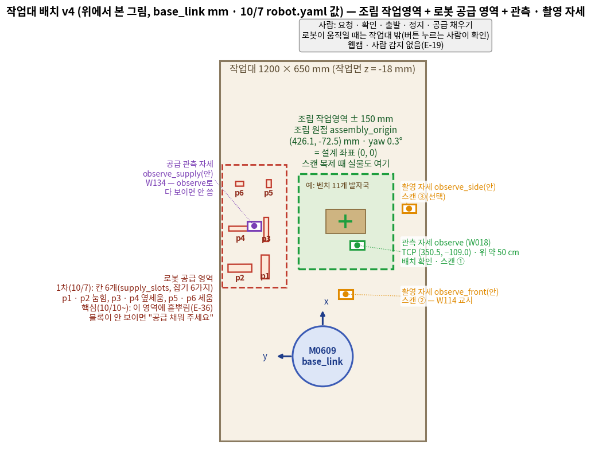
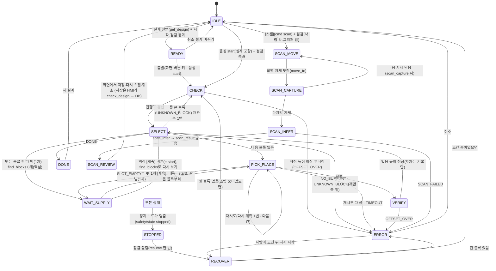

# 시스템 설계 문서 (SDD)
## AI가 설계하고 로봇이 조립하는 젠가 가구 — 요청 → 생성 → 검사 → 세대 관리 → 자동 조립 (+ 스캔 복제)

| 항목 | 내용 |
|---|---|
| 문서 | SDD(System Design Document) **v3** · 2026-10-06 18시 — **10/6 저녁 PC 배치 · MQTT 다리 · CI(E-26~E-35)** 반영: PC 2대 = **웹 PC(ROS 없음) + 로봇 PC(모든 ROS 노드)**, PC 사이는 **MQTT 다리**, HMI 코드는 `web/`, CI는 토큰 없이. v2(16시, 주제 개편 E-01~E-25) · v1(10/4~5)은 git 이력. **10/7 고침:** 웹 = frontend · backend(E-41, 아키텍처 v6) · 미리보기 three.js 하나 · STT Whisper(E-40) · DB PostgreSQL 16(E-39). **10/7 문서 2중 검증 반영:** Claude 검토 = 팀원 PR 전부 · 카메라 끊김 · 음성 '멈춰' 등은 챌린지가 아니라 '나중에' · 상태 전이(SELECT → CHECK 재관측, VERIFY → CHECK 없음) · 핵심 `WAIT_SUPPLY`(find_blocks 0개) · 장면 공급 블록 뺌 · 측정값(조립 원점 · 관측 자세 · place_up 0.001 · 속도 0.3) · 실행 이름 `safety_stop` · `wrist_block` · V-52 · V-53 |
| 팀 | D2 — 로봇 동작 박진용 · 한세교(+CAD · 레시피 · 변환기 ① 한세교) · 비전 민범진 · 한석형 · 황인재(손목 보정 · 블록 인식 · 작업 판단 · 작업 관리자 · 검사 묶음 · 변환기 ② · 스캔 추론기 — 황인재는 10/7부터, E-42) · HMI 황인재(화면 · 음성 · AI 생성 · DB, +PL) |
| 상위 문서 | [01_요구사항_BR-SR_v3_100711.md](01_요구사항_BR-SR_v3_100711.md) · [02_인터페이스_IRD_v3_100711.md](02_인터페이스_IRD_v3_100711.md) |
| 근거 | [결정 기록 10/6 저녁 PC 배치 · MQTT · CI](decisions/결정기록_PC배치_MQTT_CI_1006_v1_100711.md) · [10/6 주제 개편](decisions/결정기록_주제개편_1006_v1_100616.md) · [10/4](decisions/결정기록_시나리오_역할_인터페이스_1004_v1_100609.md) · [10/3](decisions/결정기록_주제확정_1003_v1_100415.md) |
| 관련 | [04 결과표](04_결과_결과표_v2_100711.md) · [05 작업 분류](05_작업분류_파트별_v2_100711.md) · [06 팀 규칙](06_팀협업규칙_v1_100711.md) · [TS-01](troubleshooting/TS-01_정지가_안_들음_R-01_v1_100519.md) · [TS-02](troubleshooting/TS-02_블록_쥔_채_계획_실패_R-03_v1_100414.md) |
| 표시 | **(안)** = 제안(팀 확인 전) · **＿＿** = 아직 재지 않은 값 · **(미정)** = 정할 사람 · 때만 정해진 것 · E-nn = 10/6 결정 · S-nn = 10/4~5 결정 · FR · NFR · V = 01 번호 |

이 문서는 요구사항(01)을 "실제로 어떻게 만들 것인가"로 바꾼다. PC 배치, 네트워크, 패키지, 워크셀 좌표, 작업 관리자 상태 머신, 기능별 절차(조립 · **AI 생성 · 검사 · 변환 · DB · 스캔**), 예외 처리, 안전, 시험 계획을 정한다.
- 토픽 · 서비스 · 액션의 이름 · 칸 · 단위는 02가 정본이다. 다르면 02가 맞다.
- **조립 엔진(집기 · 놓기 · 장면 · 그리퍼 · 정지 · 진행 확인)은 v1 그대로**다. 바뀐 것은 ① 협동 모드 · 웹캠 · 손 찾기를 뺌 ② 설계가 '파일 하나'에서 '요청 → AI 생성 → 검사 → DB'로 바뀜 ③ 스캔 복제 흐름 추가 ④ 10/6 박진용 값 · 서기 궤적 토픽 · 실패 코드 ⑤ **(18시) PC 2대 = 웹 PC(ROS 없음) + 로봇 PC, PC 사이는 MQTT 다리 노드 하나, task가 로봇 PC로, HMI 코드는 `web/`(E-26~E-33).**

---

## 1. 시스템 개요 · PC 배치

> 그림: [시스템 아키텍처 v6](images/시스템아키텍처_v6_100708.png) — 따라 읽는 법은 [시스템 아키텍처 설명 v3](시스템아키텍처_설명_v3_100711.md).

**한 줄 요약.** 사람이 웹 글이나 말로 요청하면 AI(GPT-4o)가 DB의 기본 설계(책상 · 의자)를 튜닝 · 생성해 젠가 설계도를 만들고, 검사를 통과한 설계를 DB에 세대별로 저장한 뒤, 로봇이 MoveIt2로 조립한다. 사람이 완성한 구조물을 스캔해 설계도로 만들어 똑같이 조립할 수도 있다. 사람은 요청 · 확인 · 출발 · 정지 · 공급 채우기를 맡는다(협동 동작은 챌린지).

**구조 한 줄 요약.** 설계는 **웹 PC의 HMI 코드 안**에서 만들어지고 저장된다(생성 · 저장소 · DB). 쌓을 만한지는 **로봇 PC task 노드의 검사 묶음**이 정하고 레시피까지 만든다. 조립은 **작업 관리자 상태 머신**이 블록 1개 액션으로 맡긴다. **웹 PC ↔ 로봇 PC는 MQTT 다리 노드 하나**(E-27). **판단은 한 곳에서만** 한다.

| 판단 | 정하는 곳 | 보는 것 |
|---|---|---|
| 멈출지 | 정지 노드(로봇 PC) | 정지 입력(키 · 화면 버튼 · Ctrl+C) · 로봇 알람 · 그리퍼 응답 없음 · ERROR |
| 진행표(블록마다 놓였나) | 작업 판단(task) | 손목 블록 인식(있음 · 없음 · 높이 · 오차 측정값) + 레시피 |
| **설계가 쌓을 만한지** | 검사 묶음(task · DesignChecker) | 블록 JSON → 안정성 7 mm · 받침 · 틈 · 잡기 · 막힌 칸 · 작업영역 → 레시피 |
| **무엇을 쌓을지** | 사람(화면 · 음성 → 출발) | AI가 만든 설계도 사람이 출발을 눌러야 움직인다(SR-09) |
| MoveIt2 장면 | 장면 관리 | 진행표(쌓인 블록 · 스캔한 실물) + 쥔 블록 |
| DB에 들어가는 것 | HMI(design_store) | 검사 통과 설계 자동 저장, 조립 결과(작업 관리자가 넘김) |

### 1.1 PC 배치 (2대)

| PC | 실행 방식 | 실행하는 것 | 꽂는 장비 |
|---|---|---|---|
| **로봇 PC**(고정) | 호스트(ROS 2) | 브링업 `real_moveit.launch.py` · 집기 · 놓기 + 실행기 · 장면 관리 · 그리퍼 · 정지 노드 · 손목 블록 인식 + **스캔 추론기** · **task(작업 관리자 · 작업 판단 · 검사 묶음 · 변환기 ②)** · **다리 `bridge`(ROS ↔ MQTT)** · 레시피 도구(라이브러리) | 제어기(유선) · RG2 · 손목 카메라 D435i(USB) · 웹 PC(유선 LAN) |
| **웹 PC**(옛 운영 PC, **ROS 없음**) | docker compose(`mosquitto` · `db` · `web`) + 호스트 | `mosquitto`: MQTT 브로커 / `db`: DB(PostgreSQL) / `web`(안, 호스트도 됨): **backend**(FastAPI :8000 — REST · WebSocket · **AI 생성 · 저장소 인터페이스**) 한 프로세스 + **frontend** 정적 파일(Next.js + three.js — 브라우저에서 실행, E-41) / 호스트: 음성(마이크 → Whisper API) | 마이크 · 화면 · 로봇 PC(유선 LAN) |
| 개발 PC(5명) | 호스트 | 로봇 쪽: 맡은 노드 + 가짜 노드 + 에뮬레이터(ROS). 웹 쪽: 로컬 mosquitto + `mock_robot.py`(ROS 없이) | — |

- 2대로 시작. 로봇 PC 노드는 어느 PC에서나 돌게 짠다(박힌 경로 없음). 브링업 · 정지 노드는 로봇 PC 고정. 카메라는 처리하는 PC에 꽂는다.
- **웹 PC에는 ROS 2 · 두산 환경을 깔지 않는다**(E-26). 웹 PC 코드는 저장소 `web/backend` · `web/frontend`(E-32 · E-41). ROS 2(CycloneDDS 60)는 로봇 PC 안에서만.
- **컨테이너는 웹 PC에만**(E-31): `mosquitto` + `db`로 평가 조건(컨테이너 2개 이상 + DB)을 채우고 `web`은 선택. 컨테이너 `hmi` · `db-hmi` · `vision`은 없다.
- 부하(W053, 10/7)가 CPU 70 %를 넘으면 task를 3번째 PC로(검사 묶음은 생성 때만 돈다 — 조립 중 부하는 작다).


### 1.2 컨테이너 · DB · 브로커 (필수 기술)

| 항목 | 정한 것 | 상태 |
|---|---|---|
| 컨테이너(웹 PC, `web/compose.yaml`) | **`mosquitto`**(MQTT 브로커, 1883) · **`db`**(DB) · **`web`**(backend FastAPI :8000 한 프로세스 + frontend 정적 `out/` · AI 생성 · 저장소 — 안, 10/7은 호스트로 띄워도 됨). 셋 다 **황인재** | 정함(E-31) |
| 호스트 | 로봇 PC 전부(ROS) + 웹 PC 음성(마이크) | 정함 |
| **PC 사이** | **MQTT**: 브로커(웹 PC) ↔ 다리 노드 `bridge`(로봇 PC, `d2_bridge`). 규칙은 [IRD 10장](02_인터페이스_IRD_v3_100711.md#10-pc-사이-통신--mqtt-다리-e-27e-30-안) | 정함(E-27 · E-29), 다리 담당은 W121 |
| **DB 제품** | **PostgreSQL 16**(10/6 21시 PL 확정, E-39): JSONB에 설계 JSON, 트리는 `parent_id` 재귀 쿼리. 스키마는 `web/db/init/001_schema.sql`(3.1.1). MongoDB 비교는 결정 기록 §6(참고) | 정함(E-39) |
| **저장소 인터페이스** | `web/backend/design_store.py` 한 겹(save_design · get_design · list_designs · children · save_build · examples_for). 처음엔 **JSON 파일 폴더**(`/data/designs/<design_id>.json`), W088에서 이 겹만 PostgreSQL로 바꾼다(E-39) | 정함(E-22) |
| 브로커 설정 | `listener 1883`(유선 LAN 안), 인증은 10/8 결정(안: 없음 → 필요하면 `password_file`, 값은 `.env`) | 안(E-30 ⓓ) |
| 원본 자료 | 녹화 · CAD · DB 데이터 · 스캔 점군 · 사진은 로컬 폴더 연결(규칙 ⑥). 사진 · 점군은 다리가 MQTT 바이너리로 웹에 보냄(안) | 정함 |
| 키 | OpenAI 키는 웹 PC `.env` → `env_file`. 프롬프트 · 응답 기록에도 키가 없게 | 정함(규칙 ④) |


### 1.3 설계 결정

| 결정 | 이유 | 번호 |
|---|---|---|
| **설계는 블록 JSON으로 오가고 로봇에는 레시피로 간다** | 생성(HMI) · 스캔(비전) · 검사(task)가 한 형식을 쓰고, 조립 엔진은 레시피만 알아 바뀌지 않는다 | E-15 · E-16 |
| **생성은 HMI 안, 검사는 task 안, 저장은 HMI 안** | 판단은 한 곳: 쌓을 만한지는 로봇 쪽(작업 판단)이 가장 잘 안다. 저장은 DB 주인(HMI) | 결정 기록 §8 |
| **2단계 생성(파라미터 튜닝 → 자유 생성)** | 튜닝은 늘 통과하고 빠르다. 자유 생성은 모양 발전을 맡되 검사 반복으로 거른다 | E-08 |
| **검사 묶음은 서비스 하나(`check_design`)** | 웹 PC ↔ 로봇 PC(MQTT 다리) 왕복을 한 번으로. 통과하면 레시피까지 돌려줘 왕복을 줄인다 | E-16 |
| **공용 JSON 서비스(`JsonQuery`)** | 칸마다 srv를 만들지 않는다(규칙 ②). 검사 · 설계 꺼내기 · 스캔에 같이 쓴다 | IRD 1장 |
| 작업 관리자 = 노드 하나, 안에 상태표 | 흐름을 한 노드에서 | D-08 |
| 블록 1개 = 액션 하나 | 작업 관리자는 블록 단위로만 | 인터페이스 결정 |
| 정지 노드 따로, 로봇 PC 고정, 서기 궤적을 **토픽으로** 제어기에 직접 | 실기에서 액션은 서지 않았다(R-01, 10/6 박진용) | D-11 |
| 모든 이동 MoveIt2, 정해진 길 + 출발 전 재계획, 위치 제어 놓기 | v1과 같음 | A2 · D-44 · D-23 |
| 다음 블록 = sequence + 진행 확인 | 다시 시작 · 스캔 복제(남은 블록)에서도 '안 놓인 첫 블록' | D-21 |
| 블록마다 배치 확인 = 있음 · 없음 + 높이, **오차는 측정값만** | 판정 · 보정(W100)을 빼서 시간을 아끼고, 측정값은 `builds`에 남겨 RAG 재료로 | S-05 · E-20 |
| **사람 감지 없음** → 사람이 영역 밖인지는 출발 · 스캔 버튼을 누르는 사람이 확인 | 웹캠 뺌 | E-19 · SR-07 |
| 출발 = 버튼 또는 음성, LLM이 로봇 움직임 · 정지를 정하지 않음 | AI가 설계를 만들어도 출발은 사람 | S-16 · SR-09 |
| 기록 = 작업 관리자 CSV(1차) → 같은 칸을 `builds`(핵심) | 기록 주인은 작업 관리자, DB 쓰기는 HMI | S-10 · E-22 |
| **웹 = frontend(Next.js 정적 + three.js, 브라우저에서 실행) + backend(FastAPI :8000 — REST · WebSocket `/ws` · paho-mqtt · 정적 서빙), ROS 없음.** 컨테이너는 `web` 하나. 미리보기는 three.js 하나(위치 미정) · 점군 창(스캔 때만) | 10/6 18시 HMI · 10/7 PL(three.js 하나 · 둘로 나눔) | E-32 · E-35 · E-40 · E-41 |
| **PC 사이는 MQTT 다리 노드 하나(`bridge`, 로봇 PC)** — ROS 쪽 이름은 그대로, 웹은 `d2/…` 토픽 + `…/req` · `…/res` | 웹 PC에 ROS를 깔지 않고, DDS 멀티캐스트 문제를 피하고, `mosquitto_sub`로 PC 사이를 다 본다 | E-27~E-30 |
| **task(검사 묶음 포함)는 로봇 PC** | 웹 PC에 ROS가 없으므로 ROS 노드는 모두 로봇 PC | E-26 |
| **CI는 토큰 없이** — pytest(`tests/`) + colcon(두산 의존 없는 패키지) + ruff 치명 오류. Claude ①~⑧ 검토는 팀원 PR 전부(10/7 01시 PL) — '막음'이 없으면 자동 승인 → auto-merge | 구독 토큰을 아낀다 | E-34 |

유효한 옛 결정 S-01(그리퍼 노드 하나) · S-02(장면 = 블록만) · S-03(정지 입력 4개) · S-05 · S-10 · S-14(코드 규칙) · S-16 · S-17 · S-18~S-28은 [10/4 결정 기록](decisions/결정기록_시나리오_역할_인터페이스_1004_v1_100609.md). 뺀 것(협동 S-06 · S-07, 웹캠 S-15의 `vision`, TTS S-08 일부)은 [10/6 결정 기록 E-19~E-21](decisions/결정기록_주제개편_1006_v1_100616.md).

---

## 2. 네트워크

### 2.1 구성도

```
[M0609 제어기 192.168.1.100] ──유선(두산 통신)── [로봇 PC: 브링업·집기·놓기·장면·그리퍼·정지·손목 블록 인식+스캔 추론기·task(검사 묶음)·bridge] ──USB── [D435i]
[RG2] ── 로봇 PC 그리퍼 노드(Modbus)                                          │ ROS 2(CycloneDDS 60)는 이 PC 안에서만
                                                                               │ 유선 LAN · MQTT 1883 (bridge ↔ mosquitto)
[브라우저: frontend] ──REST·WebSocket── [웹 PC(ROS 없음): compose{ mosquitto · db · web(backend FastAPI :8000 + frontend 정적: AI 생성·저장소) } + 호스트 음성] ─┘
                                        │                                   ├──USB── [마이크] → 호스트 음성(voice.py → Whisper → MQTT)
                                        └──HTTPS── OpenAI API (GPT-4o·Whisper STT)  (키는 .env, backend · voice만)
```

- **로봇 PC ↔ 웹 PC: MQTT**(E-27). 로봇 PC `bridge`가 브로커(웹 PC IP:1883, `robot.yaml` `mqtt.host`)에 붙는다. 토픽 · 요청-응답 · 생존 신호 규칙은 [IRD 10장](02_인터페이스_IRD_v3_100711.md#10-pc-사이-통신--mqtt-다리-e-27e-30-안). 지연은 LAN에서 ms 단위(NFR-10 ≤ 50 ms 안).
- **로봇 PC 안: ROS 2, CycloneDDS, 도메인 60**(NFR-09). `RMW_IMPLEMENTATION=rmw_cyclonedds_cpp ROS_DOMAIN_ID=60`. PC 사이 DDS는 쓰지 않으므로 멀티캐스트 · `CYCLONEDDS_URI` 걱정이 없다.
- 카메라 영상은 PC 사이로 보내지 않는다. 스캔 점군은 로봇 PC에서 처리하고 **블록 JSON**을 보낸다. 화면용 사진 · 다운샘플 점군은 다리가 MQTT 바이너리 토픽으로(안, IRD 10.5).
- 브라우저(frontend — Next.js 정적 `out/` + three.js) ↔ backend(FastAPI :8000): REST(`/api/designs` · `/api/robot`) + WebSocket `/ws`. 브라우저는 브로커 · DB · OpenAI에 직접 붙지 않는다(E-41). rosbridge 없음.
- **인터넷 · OpenAI가 끊기면** 생성 · 음성(Whisper STT · 분류)이 안 된다. 저장된 설계 조립은 된다 → 시연은 생성본을 미리 저장해 두고 순서를 바꿀 수 있게.
- **웹 PC · 브로커 · 다리가 끊기면** 화면 정지 버튼이 닿지 않는다 → **로봇 PC 키보드 정지 · Ctrl+C · 펜던트**(E-30 ⓑ). 화면은 `d2/bridge/alive`가 끊기면 "연결 끊김"을 크게 띄운다. (카메라 신호 끊김 → 정지 연결은 나중에.)


### 2.2 통신 정의 (구간별) — 칸은 02

| 이름 | 종류 | 보내는 쪽 → 받는 쪽 | 구간 |
|---|---|---|---|
| `/d2/hmi/command` | 서비스 HmiCommand(`select_design` · `start` · `scan`) | 웹 화면(frontend → REST → backend) → (MQTT `d2/hmi/command/req`) → 다리 → 작업 관리자 | **웹 → 로봇(MQTT 다리)** |
| `/d2/hmi/intent` | 토픽 intent/1(`request_design` · `select_design` · `start` …) | 음성(웹 PC) → (MQTT `d2/hmi/intent`) → 다리 → 작업 관리자 · 웹(backend → WebSocket → 화면) | **웹 → 로봇(MQTT)**, request_design은 웹 안 |
| **`/d2/hmi/get_design`** | 서비스 JsonQuery | 작업 관리자 → 다리(제공) → (MQTT `…/req`) → 웹 백엔드(design_store) → `…/res` | **로봇 → 웹(MQTT 다리)** |
| **`/d2/task/check_design`** | 서비스 JsonQuery | 웹 백엔드(design_gen) → (MQTT `…/req`) → 다리 → task(DesignChecker) | **웹 → 로봇(MQTT 다리)**, 3초 목표 |
| `/d2/safety/stop` · `/d2/safety/resume` | 서비스 | 화면(frontend → REST → backend → MQTT `…/req` → 다리) · 키(로봇 PC) → 정지 노드 | 웹 → 로봇(MQTT) / 키는 로봇 PC 안 |
| `/d2/safety/state` | 토픽 safety_state/1(TRANSIENT_LOCAL) | 정지 노드 → 모두 · 다리 → MQTT retained → backend → WebSocket → 화면 | 로봇 PC 안 + 로봇 → 웹 |
| 서기 궤적 | **토픽 `/dsr_moveit_controller/joint_trajectory`** | 정지 노드 → 제어기 | 로봇 PC 안 |
| `/d2/vision/check_progress` | 서비스 CheckProgress | 작업 관리자 → 손목 블록 인식 | 로봇 PC 안 |
| **`/d2/vision/scan_capture` · `scan_infer`** | 서비스 JsonQuery | 작업 관리자 → 스캔 추론기 | 로봇 PC 안 |
| `/d2/vision/camera_status` | 토픽 | 손목 비전 → 정지 노드(연결은 뒤) | 로봇 PC 안 |
| `/d2/task/progress` · `/d2/task/state` · **`/d2/task/scan_result`** | 토픽 | task → 장면 관리 · 다리 → MQTT retained → backend → WebSocket → 화면 | 로봇 PC 안 + 로봇 → 웹 |
| `/d2/motion/move_to`(observe · home · observe_front · observe_side) · `/d2/motion/pick_place` | 서비스 · 액션 | 작업 관리자 → 집기 · 놓기 | 로봇 PC 안 |
| `/d2/motion/scene/attach` · `/d2/gripper/command` · `/d2/gripper/state` · `apply_planning_scene` | 서비스 · 토픽 | 로봇 PC 노드끼리 | 로봇 PC 안 |
| (뺌) `human_zone` · `hand_wrist` · `task/event` | — | — | — |

- **웹 PC → 로봇 PC(MQTT)는 다섯 갈래**: 명령(`hmi/command`), 의도(`hmi/intent`), 검사(`check_design`), 정지(`stop`), 다시 시작(`resume`). **로봇 PC → 웹 PC**: 상태 토픽 5개(retained) + 설계 꺼내기 · 조립 기록 요청(`get_design` · `save_build`) + 사진 · 점군(안). 로봇 PC 안 이동 · 진행 확인 · 스캔 · 블록 1개는 ROS 그대로.
- 생성 · 저장은 **웹 PC 안**에서, 검사는 **로봇 PC task**에서 끝난다. 로봇 쪽 조립 엔진은 레시피 결과(진행표 · 액션 목표)만 받는다. 다리는 변환만 하고 판단하지 않는다.

---

## 3. 패키지 구성 (안) · 구조 규칙

### 3.1 저장소 구조 (안)

```
rokey_9_pjt2_D2/
├── docs/                         문서·그림·결정 기록·시험 기록·트러블슈팅
├── web/                          (ROS 아님, 웹 PC) — 황인재(E-32). 안쪽은 3.1.1
├── tests/                        ROS 없는 자동 시험(pytest) — CI가 PR마다 돈다(E-34)
├── .github/workflows/            pr_check.yml(PR 검사 + Claude ①~⑧ 검토 — 팀원 PR 전부(10/7 01시 PL), '막음'이 없으면 자동 승인 → auto-merge) · ci.yml(pytest · colcon · ruff, 토큰 없음)
├── tools/                        docver.py · sched.py (CAD → 레시피 도구는 로봇 동작 패키지에)
└── src/
    ├── d2_interfaces/            action/PickPlace · srv/GripperCommand · CheckProgress · HmiCommand · SceneAttach · StopRequest · MoveTo · (추가) JsonQuery
    ├── d2_bringup/               launch/ · config/robot.yaml(10/6 박진용 값) · 보정 파일
    ├── d2_motion/                pick_place_node(집기·놓기 + 실행기 + move_to) · scene_manager_node · mock_pick_place
    ├── d2_gripper/               gripper_node · mock_gripper
    ├── d2_safety/                safety_stop(safety_stop_node.py) + safe_stop.py(서기 궤적 토픽)
    ├── d2_vision/                wrist_block(손목 블록 인식 + scan_capture·scan_infer) · structure_scanner.py(점군 → 블록 JSON, ROS 없음) · mock_wrist_block
    ├── d2_task/                  (로봇 PC) task_node(TaskManager) · task_planner.py(작업 판단) · design_checker.py(검사 묶음, ROS 없음) · recipe_to_blocks.py(변환기 ②) · run_logger.py · mock_task
    ├── d2_bridge/                (로봇 PC, 새) bridge_node(MqttBridge: ROS ↔ MQTT — 웹 대신 /d2/hmi/* 제공 · 호출, 상태 토픽 → MQTT retained, 생존 신호) · mock_bridge(옛 mock_web_ui)
    └── <레시피 도구>/             CAD → 레시피 파이프라인 + blocks_to_recipe.py(변환기 ①) — 이름은 로봇 동작(한세교)이 정함. design_checker가 import 한다
```

#### 3.1.1 `web/` 안 구조 (10/6 21시 PL 확정 — 기술 스택 Next.js · three.js / FastAPI · PostgreSQL / compose · Actions / STT · GPT-4o, Vite 없음)

```
web/
├── compose.yaml             mosquitto(1883) · db(PostgreSQL 16) · web(backend + frontend/out) — env_file .env, 데이터는 볼륨
├── .env.example             OPENAI_API_KEY= · DATABASE_URL= · MQTT_HOST= (이름만. 실제 .env는 커밋 금지 — PR 검사가 막음)
├── mosquitto/mosquitto.conf 팀 LAN 안 익명 허용 · 1883
├── db/init/001_schema.sql   designs · builds 테이블(JSONB 칸, 01 FR-D02) — 컨테이너 첫 실행 때 자동 적용
├── backend/                 FastAPI :8000 한 프로세스(컨테이너 web) — 그림 v6 backend 카드
│   ├── Dockerfile · requirements.txt   fastapi · uvicorn · paho-mqtt · psycopg[binary] · openai · pydantic
│   ├── app.py               WebApp — 앱 만들기 · routes 등록 · frontend/out 정적 서빙 · 시작 점검(브로커 · DB · 키). URL 처리는 없음
│   ├── routes/              URL 처리 — 파일 하나 = 화면 흐름 하나
│   │   ├── designs.py       /api/designs  목록 · 상세 · 버전 트리 · [생성](글상자 · 음성 문장 확인)
│   │   ├── robot.py         /api/robot    출발 · 정지 · 다시 시작 · 스캔 · [계속] → MQTT …/req
│   │   └── ws.py            /ws           WebSocket — retained 상태 토픽(진행표 · 상태 · alive) · 음성 요청 문장 → 브라우저(frontend)
│   ├── mqtt_client.py       MqttClient — 다리와 통신 한 곳(req_id 붙여 보내고 …/res 기다림, IRD 10장)
│   ├── design_gen.py        DesignGenerator — GPT-4o 호출 한 곳(6.6)
│   ├── design_store.py      DesignStore — PostgreSQL 접근 한 곳(6.8)
│   ├── prompts/             tune_system.txt · free_system.txt · blocks_schema.json(구조화 출력)
│   ├── voice.py             VoiceListener — 호스트에서 실행(마이크 → Whisper API(OpenAI) → 의도 → MQTT d2/hmi/intent)
│   └── mock_robot.py        로봇 PC 없이 시험(다리 흉내 — …/req 받아 …/res 응답)
├── frontend/                Next.js 정적 내보내기(out/) — 실행 시 Node 서버 없음. 그림 v6 frontend 카드(브라우저에서 실행, backend와는 REST · WebSocket만)
│   ├── package.json · next.config.js(output: 'export') · tsconfig.json
│   ├── app/                 페이지 = 화면 흐름 하나: page.tsx(메인 — 글상자 · 설계 목록 · 로봇 상태 · 출발/정지) · designs/[id]/page.tsx(상세 — 미리보기 · 검사 결과 · 버전 트리) · scan/page.tsx(스캔 비교, 점군 창은 여기만)
│   ├── components/          RequestBox · DesignTree · Preview3D(three.js — 블록 JSON → 상자, **유일한 미리보기(E-40)**, 어느 페이지에도 붙임 — E-35) · RobotPanel · ScanCompare · ConnectionBadge
│   ├── lib/                 api.ts(fetch 한 곳) · ws.ts(상태 수신) · types.ts(design/1 · 상태 JSON)
│   └── public/
└── data/                    (gitignore) 1단계(DB 전) 임시 JSON 저장 폴더 — 볼륨으로 연결. PostgreSQL로 옮기면 없앰(미리보기 PNG 없음 — E-40)
```

- 한 곳 규칙: LLM은 `design_gen` · DB는 `design_store` · MQTT는 `mqtt_client`만 안다. routes · voice는 이 셋을 부른다.
- 시험은 `tests/web/`(test_design_store · test_design_gen — API 없이 파싱 · 검사 루프), CI `ci.yml`에 backend pytest · frontend `npm run build` 단계 추가.
- **10/7 최소형(1차 판정):** compose + mosquitto.conf + `app.py` + `routes/robot.py`(버튼 4개) + `routes/ws.py`(상태) + `mqtt_client.py` + `app/page.tsx` + `RobotPanel`. 생성 · DB · 3D · 스캔은 10/7~13 핵심에서.

- ROS 없는 계산 파일(`design_gen` · `design_store`(웹 PC, `web/backend/`) · `design_checker` · `structure_scanner` · `blocks_to_recipe` · `recipe_to_blocks`)은 **`python3 -m pytest`로 로봇 없이 시험**한다(S-14). 저장소 공통 시험은 `tests/`에 두고 CI가 돌린다(E-34).
- **`d2_hmi` colcon 패키지는 없다**(E-32). 웹 PC에는 ROS가 없어 HMI 코드는 `web/`에 두고, ROS 쪽 HMI 자리는 `d2_bridge`가 대신한다.
- 10/3 작업 4 코드(`research/ref_1003/작업4/`)는 그대로 두고 `jenga_check.py`의 계산을 `design_checker.py`로, `prompt_v09*.txt` · `run_v09.py`의 프롬프트 · 재생성 루프를 `design_gen.py` · `prompts/`로 옮긴다.

### 3.2 패키지와 노드 (안)

| 패키지 | 노드(실행 파일) | 클래스(규칙 ①) | 파트 | PC |
|---|---|---|---|---|
| `d2_interfaces` | 없음 — 메시지 7개 + `JsonQuery.srv` | — | 로봇 동작 / `JsonQuery`는 황인재 | 로봇 |
| `d2_bringup` | launch + `robot.yaml` | — | 로봇 동작 | 로봇 |
| `d2_motion` | `pick_place_node` | `PickPlaceNode`(액션 서버 + `move_to`: observe · home · 촬영 자세 2개) + `Executor` | 로봇 동작 | 로봇 |
| `d2_motion` | `scene_manager_node` | `SceneManager` — 장면 = `table` + 진행표 블록(스캔 실물 포함) + 쥔 블록 + 손가락 모델 | 로봇 동작 | 로봇 |
| `d2_gripper` | `gripper_node` | `GripperNode` — 열기 · 닫기 · 폭 읽기 · 잡힘 확인(`feedback_offset_m` 보정) | 로봇 동작 | 로봇 |
| `d2_safety` | `safety_stop`(`safety_stop_node.py`) + `safe_stop.py` | `SafetyStopNode` · `SafeStop`(서기 궤적 토픽 → 확인 → `move_stop`) | 로봇 동작 | 로봇 |
| `d2_vision` | `wrist_block` + `structure_scanner.py` | `BlockChecker`(있음 · 없음 · 높이 · 오차 측정값, `check_progress` · `scan_capture` · `scan_infer` 서비스) · `StructureScanner`(점군 → 높이 지도 → 격자 → 블록 JSON, ROS 없음). 노드를 둘로 나눌지는 비전 | 비전 | 로봇 |
| `d2_task` | `task_node` + 계산 파일 3개 | `TaskManager`(상태표 — 조립 · 스캔 · 공급 · 정지 · 재시작) · `TaskPlanner`(레시피 · 진행표 · 다음 블록 · 좌표) · **`DesignChecker`**(안정성 + 받침 · 틈 · 잡기 · 막힘 · 작업영역 → `blocks_to_recipe` 호출; `check_design` 서비스) · `RunLogger`(CSV + `save_build`) · `recipe_to_blocks`(변환기 ②) | 비전 | **로봇**(E-26) |
| **`d2_bridge`**(새) | `bridge_node` | **`MqttBridge`** — ROS ↔ MQTT 변환 하나(IRD 10장): `/d2/hmi/command` · `check_design` · `safety/stop` · `resume` 호출, `/d2/hmi/get_design` · `save_build` 제공, `/d2/hmi/intent` 발행, 상태 토픽 5개 → MQTT retained, 생존 신호 · LWT, 사진 · 점군 바이너리(안). 판단 없음 | HMI(안, W121) | 로봇 |
| **`web/backend`**(ROS 아님) | FastAPI :8000 프로세스(`app.py`) + 호스트 `voice.py` | `WebApp`(FastAPI — REST `/api/designs` · `/api/robot` · WebSocket `/ws` · `frontend/out` 정적 서빙 · paho-mqtt: REST 요청 → `…/req`, 상태 토픽 → `/ws`) · **`DesignGenerator`**(튜닝 → 자유 → `check_design` 반복 → 저장, GPT-4o 구조화 출력) · **`DesignStore`**(저장 · 조회 · 트리 · 예시 — 파일 → DB) · `VoiceListener`(웨이크워드 · STT(Whisper API) · 의도 → MQTT `d2/hmi/intent`) · `mock_robot.py` | HMI | **웹**(컨테이너 `web` 또는 호스트) |
| **`web/frontend`**(ROS 아님, E-41) | 없음 — Next.js 정적 `out/`(backend가 내려 줌, 브라우저에서 실행) | 컴포넌트 6개 `RequestBox` · `DesignTree` · `Preview3D`(three.js, 유일한 미리보기) · `RobotPanel` · `ScanCompare` · `ConnectionBadge` + `lib/api.ts`(REST 한 곳) · `lib/ws.ts`(WebSocket 수신) | HMI | **브라우저**(파일은 컨테이너 `web`) |
| 레시피 도구 | 라이브러리 | CAD → 레시피 · **`blocks_to_recipe`**(변환기 ①: 순서 · 받침 · 역할 · 잡기 후보 · 놓는 높이) | 로봇 동작(한세교) | 로봇(task가 import) |

### 3.3 구조 규칙 — v1과 같음(노드 하나 = 클래스 하나 = 파일 하나 · 과도한 구조화 금지 · 경로 하드코딩 금지 · 설정 한 곳 · 로봇 코드 정지 처리 · 단위 · `success` + `reason` · 키 `.env` · 이름 바꾸기는 받는 파트 확인). 더하는 것:
- **LLM 호출은 `DesignGenerator` 한 곳.** 다른 코드는 OpenAI를 부르지 않는다(의도 분류는 `VoiceListener`, STT(Whisper API) 포함 — 둘뿐, 둘 다 웹 PC).
- **화면(frontend)은 backend만 안다**(E-41). REST는 `lib/api.ts` 한 곳, 상태는 `lib/ws.ts`(WebSocket `/ws`)로만 받고, MQTT · DB · OpenAI에 직접 붙지 않는다.
- **PC 사이 통신은 `MqttBridge` 한 곳.** 로봇 PC의 다른 노드는 MQTT를 모르고, 웹 PC 코드는 ROS를 모른다. 토픽 이름 · payload 규칙은 IRD 10장 표 하나.
- **DB 접근은 `DesignStore` 한 곳.** task · 비전은 DB를 직접 읽고 쓰지 않는다(`get_design` · `save_build` 서비스로).
- **블록 JSON ↔ 레시피 변환은 변환기 ① · ② 두 파일뿐.** 다른 곳에서 좌표를 다시 계산하지 않는다.
- 프롬프트 · 스키마는 코드가 아니라 `prompts/` 파일. 바꾸면 시험 요청 15개(V-44)를 다시 돌린다.

### 3.4 설정 파일 `robot.yaml` — 키 · 값은 [IRD 9장](02_인터페이스_IRD_v3_100711.md#9-설정-파일-srcd2_bringupconfigrobotyaml)(10/6 박진용 값 · 추가 키 · `check.*` · `scan.*`). 로봇 PC 노드만 읽는다(다리는 `mqtt.*`). 웹 PC 코드는 `robot.yaml`을 읽지 않는다 — 필요한 값(블록 크기 · 검사 결과)은 MQTT 응답에 실려 온다.

### 3.5 실행 순서 (안)

```bash
# 웹 PC (ROS 없음)
cd web && docker compose up -d                                 # mosquitto(1883) · db · web(backend FastAPI :8000 + frontend out/, env_file .env, /data 연결)
#   화면: 브라우저로 http://<웹 PC IP>:8000 — frontend 정적 파일 · REST · /ws를 모두 backend가 낸다
python3 web/backend/voice.py                                   # 호스트: 마이크 → Whisper API → MQTT d2/hmi/intent
# 로봇 PC
export RMW_IMPLEMENTATION=rmw_cyclonedds_cpp ROS_DOMAIN_ID=60
ros2 launch d2_bringup robot_pc.launch.py mode:=real           # 가상 mode:=virtual — 브링업·집기·놓기·장면·그리퍼·정지·손목 비전·task·bridge
# 로봇 없이(개발 PC) — 로봇 쪽
ros2 launch d2_bringup mock.launch.py                          # 받는 쪽은 mock_*, 웹 대신 mock_bridge
# 로봇 없이 — 웹 쪽
docker run -p 1883:1883 eclipse-mosquitto && python3 web/backend/mock_robot.py
```


- 첫 실행 때 정지 준비(서기 궤적 토픽이 보이는지) · **다리 ↔ 브로커 연결**(`d2/bridge/alive`) · DB 연결 · OpenAI 키 유무를 화면에 찍고, 정지 준비가 안 되면 실기를 하지 않는다.

---

## 4. 워크셀



*그림. 작업대 배치 v3 — 로봇 앞 조립 작업영역(조립 원점 = 가운데), 옆에 로봇 공급 칸 6개. 웹캠 · 사람 공급 영역 · 출입 선은 없앴다(E-19). 스캔 복제 때 사람은 조립 작업영역 안에 구조물을 두고 나간다.*

### 4.1 장비

| 장비 | 하는 일 | 연결 |
|---|---|---|
| 두산 M0609(가반 6 kg, 도달 900 mm, 반복 ±0.03 mm) | 블록 옮기기, 스캔 촬영 자세 이동 | 제어기 ↔ 로봇 PC |
| OnRobot RG2(0~110 mm, 3~40 N) | 집기 · 놓기 | 그리퍼 노드(Modbus) |
| RealSense D435i(손목, 최소 거리 약 28 cm, 정지 상태 ±0.5 mm) | 진행 확인 · 배치 확인 · **스캔 점군** | 로봇 PC USB |
| 마이크 | 웨이크워드 · 음성 요청 | 웹 PC(호스트 `voice.py`) |
| 작업대 1200 × 650 mm(로봇 앞 850), 맨 작업대 | — | — |
| 젠가 블록 75 × 25 × 15 mm(두께 평균 14.7), 1세트 54개 | 기본 설계 9~16개 + 공급 여분 | — |
| 테이프 | 조립 작업영역 · 공급 칸 6개 표시 | — |
| (뺌) 웹캠 | — | E-19 |

### 4.2 영역과 좌표 (`base_link`)

| 영역 | 위치 | 설정 키 | 값(10/6) |
|---|---|---|---|
| 조립 작업영역 | 로봇 바로 앞, 홈 자세 근처. 가운데 = 조립 원점 | `assembly_origin` | x 0.4261 · y −0.0725 · z −0.018 · yaw 0.3°(10/6 다시 교시, PR #10) |
| 로봇 공급 영역 | 작업영역 옆, 칸 6개 | `supply_slots` | IRD 9장(1~6 좌표 · 방향 · 교시 높이) |
| 작업면 | 맨 작업대 | `table_z_m` | −0.018(1곳) |
| MoveIt 장면 작업대 | — | `table` | x −0.2675~0.9325 · y ±0.325 · base 여유 0.15 |
| 관측 자세 | 조립 작업영역 위(작업대까지 약 50 cm, W018) | `observe_pose` | 관절 [−18.25, 1.73, 72.73, 0.02, 105.52, 71.44]°(W018, 10/6 PR #20 — TCP (350.5, −109.0, 294.8) mm, 작업대까지 약 497 mm) |
| **촬영 자세(스캔)** | 조립 작업영역을 앞 · 옆에서 내려다봄 | `observe_front_pose` · `observe_side_pose` | ＿＿(10/8 W114) |
| 홈 | — | `home_pose` | 관절 [0, 0, 90, 0, 90, 0]° |
| (뺌) 사람 공급 영역 · 출입 선 · 웹캠 구역 | — | — | E-19 · E-03 |

**로봇 작업 영역** = 조립 작업영역 + 공급 영역 + 그 사이. 로봇이 움직일 때 사람이 들어가지 않는 곳 — 확인은 사람(SR-07).

### 4.3 조립 원점 T_base_from_cad — v1과 같음

- 설계 좌표계(레시피 · **블록 JSON**): 바닥 외곽 가운데 = (0, 0), x 오른쪽, y 뒤, z 위(작업면 0), mm. 설계 축 = 로봇 base 축(D-14).
- `p_base [m] = R_z(yaw) · (p_cad [mm] / 1000) + (x, y, z)` — 작업 판단 한 곳에서만. 레시피의 `T_base_from_cad`는 null, `robot.yaml` 하나만(한세교 동의).
- 놓는 높이 = 잰 받침 윗면(`top_z`), 없으면 14.7 mm씩. 카메라 보정 오차는 배치에 직접 안 들어간다(NFR-01).
- **생성 · 스캔 설계도 같은 좌표계**다. 변환기 ①은 블록 JSON(mm)을 그대로 레시피 좌표로 쓰고, 스캔 추론기는 추론한 바닥 외곽 가운데를 (0, 0)으로 둔다(실물이 원점에서 벗어나 있어도 복제는 조립 원점에 — 안, IRD 12장).

### 4.4 공급 영역 — 1차는 칸 6개, 핵심은 흩뿌림(E-36)

| | 로봇 공급 영역 |
|---|---|
| 두는 방법 | **1차(10/7):** 칸 6개에 같은 자세(칸마다 눕힘 · 옆세움 · 세움 자세 — IRD 9장). **핵심(10/10~):** 사람이 공급 영역에 **흩뿌려 둔다**(눕힘 · 옆세움 · 세움 · 포개짐 섞여도 됨, E-36). 안 되면 칸으로 되돌림 |
| 블록 고르기 | 1차: 작업 판단이 다음 블록의 잡기에 맞는 자세의 빈 칸을 `supply_slot`으로. 핵심: `find_blocks`(비전) 결과에서 **가장 잡기 쉬운 블록** — 다음 블록 자세 · 잡기에 맞고 틈이 넓고 겹치거나 기울지 않은 것(§6.11, E-46) |
| **비면** | 1차: `SLOT_EMPTY` → 그 칸을 빔으로 → 다음 칸 → 맞는 칸이 다 비면 **`WAIT_SUPPLY` + "공급 채워 주세요"** → 사람이 채우고 [계속](= `start`) → 같은 블록부터. 핵심: 공급 영역 관측 자세에서 `find_blocks`에 **블록이 하나도 없으면** **`WAIT_SUPPLY` + "공급 채워 주세요"**(`supply_empty`) → 사람이 블록을 놓고 [계속] → 다시 `find_blocks`로 보고 고름. 블록은 보이는데 맞는 자세가 없으면 세우기(§6.11) → 그래도 없으면 `WAIT_SUPPLY` + "세운 블록을 더 놓아 주세요" |
| 집는 높이 | 손가락 끝 = 책상 위 +4 mm(눕힘 기준) + 폭별 보정, `grasp_depth_m` 0.011 |
| 블록 수 | 기본 설계 최대 16개 → 사람이 2~3번 채운다. 2인용 조립은 보류(E-18) |

### 4.5 관측 · 촬영 자세
- 관측 자세: 조립 작업영역 위, 작업대까지 약 50 cm(W018). 진행 확인 · 배치 확인 · 공급 대기 · 다시 시작. 빈 작업대 기준 깊이를 남긴다.
- **촬영 자세(스캔):** 위(관측 자세) + 앞 · 옆 1~2곳. 구조물 전체(최대 150 mm 높이 · 225 mm 폭)가 깊이 화면에 들어오고 최소 거리 28 cm를 지키게 교시(10/8 W114). 자세는 `move_to` target 이름으로 부른다.

### 4.6 그리퍼 · 로봇 값 — 10/6 박진용

| 값 | 10/6 | 설정 키 |
|---|---|---|
| 손가락 끝 두께 · 폭 | 0.0114 · 0.020 m(모델 메시) | `finger.*` |
| TCP | 0.228 m | `tcp_length_m` |
| 집는 깊이 | 0.011 m | `grasp_depth_m` |
| 잡기 닫는 폭 | FLAT_SHORT 0.025 · FLAT_LONG 0.075 · EDGE_SHORT 0.015 · EDGE_LONG 0.075 · STAND_SHORT 0.015 · STAND_LONG 0.025 | `grasp_width_m.*` |
| 표시폭 보정 · 허용 · 기다림 | 0.0094 · 0.005 · 4 s | `gripper.feedback_offset_m` · `check_tolerance_m` · `settle_timeout_s` |
| 손가락 끝 높이 보정점 | tcp_z 0.011 · 표시폭 0.009 (10/6 직접 교시) | `gripper.finger_height.*` |
| 동작 | 접근 0.08 · 집은 뒤 0 · 놓기 전 블록 바닥을 띄우는 높이 0.001 m(10/6 실기 4 → 2 → 1 mm, PR #10) · 속도 0.3(10/6, PR #10) | `motion.*` · `speed_scale` |
| 10/6 실기 파지 폭 | FLAT_SHORT 23.9~24.9 mm(기대 25) · FLAT_LONG 74.9~75.2(기대 75) | 참고 |
| 다시 재면 | W033으로 갱신. 공구 무게 ＿＿ | — |

---

## 5. 상태 머신 (작업 관리자)

작업 관리자는 노드 하나(`task_node`, `TaskManager`). 상태는 `/d2/task/state`로 방송(`mode` = `auto` 고정, `turn` 없음). **설계 요청 → 생성 → 검사 → 저장 → 미리보기는 HMI 안 상태**이고 작업 관리자는 저장된 설계만 받는다(IDLE · READY에서).



### 5.1 상태표

| 상태 | 하는 일 | 들어가는 조건 | 나가는 조건 → 다음 |
|---|---|---|---|
| **IDLE** | 대기. 설계 선택(`select_design` → `get_design`으로 레시피 받기), 시작 점검, `scan` 명령을 받는다. HMI 쪽 생성 알림은 화면이 띄운다 | 시작 · DONE · 취소 · SCAN_REVIEW 끝 | 설계 + 점검 통과 → **READY** · 음성 `start`(설계 포함) + 점검 → **CHECK** · `scan` + 점검(사람 밖 · 그리퍼 빔 · 조립 자리에 구조물) → **SCAN_MOVE** |
| **READY** | 출발 대기 | IDLE | `start`(버튼 · 키 · 음성) → 점검 한 번 더 → 새 `run_id` → **CHECK** · 취소 → IDLE |
| **CHECK** | 관측 자세 → `check_progress` → 작업 판단 진행표(`progress`) | READY · IDLE(음성 start) · RECOVER · SELECT(재관측) | 정상 → **SELECT** · 설계 밖 블록 · 빠짐 · 높이 이상 → **ERROR** |
| **SELECT** | 작업 판단에 다음 블록(함수). 핵심은 `find_blocks`로 보고 고름(§6.11) | CHECK · VERIFY · WAIT_SUPPLY(핵심 [계속] 뒤 다시 보기) | found → **PICK_PLACE** · DONE → **DONE** · NO_SUPPORT → **ERROR** · UNKNOWN_BLOCK → **CHECK**(재관측 1번) → 또 그러면 **ERROR** · 맞는 공급 칸이 다 빔(1차) · `find_blocks`에 블록 0개(핵심) → **WAIT_SUPPLY** |
| **PICK_PLACE** | `pick_place` 액션, 중간 보고 | SELECT · WAIT_SUPPLY(1차 [계속]) | success → **VERIFY** · 실패는 §7 표(다시 계획 1 · 같은 칸 1 · 다음 칸) · `SLOT_EMPTY` → 그 칸을 빔으로 → 다음 칸, 맞는 칸이 다 비면(1차) → **WAIT_SUPPLY** · 재시도 소진 · TIMEOUT → **ERROR** |
| **WAIT_SUPPLY**(새) | 관측 자세에서 멈춰 "공급 채워 주세요" 알림(`supply_empty`). 로봇은 안 움직인다 | PICK_PLACE · SELECT — 1차: 맞는 공급 칸이 다 빔(`SLOT_EMPTY`) / 핵심: 공급 영역 관측 자세에서 `find_blocks`에 블록 0개 | 사람이 채우고 [계속] 버튼(= `start`) → 1차: 공급 칸 상태 초기화 → **PICK_PLACE**(같은 블록부터) / 핵심: **SELECT**(`find_blocks`로 다시 보고 고름) |
| **VERIFY** | 방금 놓은 블록 + 받침 `check_progress` → 있음 · 없음 + 높이 판정, **오차 측정값은 진행표 · CSV에만** | PICK_PLACE success | 정상 → **SELECT** · `OFFSET_OVER` → **ERROR** |
| **SCAN_MOVE**(새) | 다음 촬영 자세로 `move_to`(observe → observe_front → observe_side) | IDLE(`scan`) · SCAN_CAPTURE | 도착 → **SCAN_CAPTURE** · 이동 실패 → ERROR |
| **SCAN_CAPTURE**(새) | `scan_capture {pose_id}` — 스캔 추론기가 점군을 모아 둠 | SCAN_MOVE | 자세 남음 → **SCAN_MOVE** · 마지막 → **SCAN_INFER** |
| **SCAN_INFER**(새) | `scan_infer` → 블록 JSON. 로봇은 마지막 자세에서 대기 | SCAN_CAPTURE | ok → `scan_result` 방송 → **SCAN_REVIEW** · `SCAN_FAILED` → **ERROR**(다시 스캔 안내) |
| **SCAN_REVIEW**(새) | 화면이 실물 사진 ↔ 추론 설계를 보여 주고 사람이 [저장] · [다시 스캔] · [취소]. 저장은 HMI가 `check_design` → `design_store.save_design`(made_by scan) | SCAN_INFER | 어느 것이든 → **IDLE**(저장된 설계는 선택 → 출발로 복제). 다시 스캔 → IDLE → `scan` |
| **STOPPED** | 정지 노드가 멈추고 잠갔다. 새 목표 안 보냄 | 어느 상태나 | `locked` 거짓(resume 한 번) → **RECOVER** |
| **RECOVER** | 쥔 블록 확인(`gripper/state`) → 없으면 관측 자세(저속) → 진행 확인부터 | STOPPED · ERROR | 조립 중 + 쥔 블록 없음 → **CHECK** · 스캔 중이었으면 → **IDLE**(다시 `scan`) · 쥔 블록 있음 → **ERROR** |
| **ERROR** | 사람 호출, 로봇 서 있음, 알림 | 여러 곳 | 다시 시작(resume) → **RECOVER** · 취소 → **IDLE** |
| **DONE** | 완성 알림. `RunLogger`가 CSV 닫고 `save_build`(HMI)로 결과 넘김 | SELECT DONE | 새 설계 → **IDLE** |

공통:
- **시작 점검(M-06):** 로봇 상태 · 그리퍼 응답 · 깊이 영상 · 정지 노드 살아 있음 · 조립 자리(조립이면 비어 있음, 복제면 실물을 치웠음, 스캔이면 구조물 있음) · 공급 수 · **DB 연결(`get_design` 응답)**. 사람이 영역 밖인지는 누르는 사람이 확인(SR-07) — 화면 버튼 옆 문구.
- **음성 출발(S-16):** 화면 버튼과 똑같이. 확인 대기 상태 없음(확인은 HMI 안).
- **HMI 안 상태(작업 관리자 밖):** `GENERATING` → `CHECKING` → `SAVED` / `GEN_FAILED` — 화면이 띄우고 `state/1` message로도 알릴 수 있다(안).
- **다시 시작(S-24):** resume 한 번 → 바로 RECOVER. 멈춘 뒤 배치 다시 알아보기(10/6 비전): 설계 위치 ROI + 깊이 약 10프레임 → 있음 · 없음 · 애매 → 애매하면 같은 자세 1번 더 → 사람 호출.
- 서비스 · 액션 호출은 비동기, 콜백은 상태 변수만(교착 방지).

---

## 6. 기능별 절차

### 6.1 저장된 설계 조립 — 블록 1개 흐름 (IRD 8.1)

| 상태 | 하는 일 |
|---|---|
| IDLE → READY | 설계 선택 → `get_design`으로 레시피 · 블록 JSON → 작업 판단이 레시피 적재(받침 · 잡기 후보 그대로) → 시작 점검 |
| CHECK | 관측 자세 → `check_progress` → 진행표 방송 → 장면 관리가 놓인 블록을 장면에 |
| SELECT | 다음 블록 = sequence 첫 미배치 → block_id · supply_slot(잡기에 맞는 자세의 칸) · pick_pose · place_pose(블록 중심 자세) · grasp |
| PICK_PLACE | 집기 · 놓기(§6.2) |
| VERIFY → SELECT | 블록마다 있음 · 없음 + 높이, 오차 측정값 기록 → 다 놓이면 DONE → `save_build` |

### 6.2 블록 1개 집기 · 놓기 (`d2_motion` pick_place_node) — v1과 같음 + 10/6 값

| step | 하는 일 | 확인 | 실패 |
|---|---|---|---|
| `approach` | 잡기별 여는 폭(`grasp_open_pick_m`) → 공급 칸 위 `approach_m` 0.08 접근 자세(MoveIt2, 정해진 길 + 출발 전 재계획) | 계획 성공 | `PLAN_FAILED` |
| `grasp` | 블록 중심 자세(`pick_pose`)에서 `grasp_depth_m` 0.011을 빼 손가락 끝 높이 계산 → 수직 하강 → `gripper/command`(닫기 10 N) → 그리퍼 노드가 폭(표시폭 − 0.0094)을 `grasp_width_m.*` ± 0.005와 비교해 `grasped` | `grasped` 참 | `GRASP_FAILED` · `SLOT_EMPTY` |
| `lift` | `scene/attach` 붙이기 → 수직 상승(`pick_up_m` 0) | 폭 유지 | `GRASP_FAILED` |
| `move` | 놓는 자리 위로(쥔 블록 포함 회피) | 계획 성공 · 폭 유지 | `PLAN_FAILED`(R-03) |
| `place` | 마지막 구간 허용 충돌 → 위치 제어 하강(블록 바닥이 `place_up_m` 0.001 떠 있는 곳까지) | 도착 | `PLAN_FAILED` |
| `retreat` | 놓기(`grasp_open_place_m` — 좌판은 85 mm만, 10/6 관찰) → `scene/attach` 떼기 → 천천히 수직 → 물러남 | — | — |

- `safety/state`의 `stopped`가 참 → 진행 중 목표 취소, 결과 `CANCELED`. 잠긴 동안 새 목표 `STOPPED`. 다른 목표 실행 중 `BUSY`. 예상 못 한 오류 `ERROR`(먼저 세움).
- Ctrl+C · 막힘 · 실패: `SafeStop` 서기 궤적(토픽) 먼저.
- 10/6 실기: 벤치 11/11 · 337초 · 속도 0.1 · 10 N · 파지 실패 0. 놓을 때 삐끗 → 좌판 85 mm 열기 · 놓는 높이 1~2 mm 조정 시험(10/7).

### 6.3 진행 확인 · 블록마다 배치 확인 (`d2_vision` + `d2_task` 작업 판단)

1. 관측 자세로(`move_to observe`). 2. `check_progress`(진행 확인 = 설계 블록 전부, 배치 확인 = 방금 놓은 블록 + 받침). 3. 손목 블록 인식: 설계 위치 ROI × 깊이 약 10프레임 → 빈 작업대 기준과 비교 → `state`(present · absent · occluded · unknown) · `top_z_m` · **`dx_m` · `dy_m`(측정값, 못 재면 NaN)**. 4. 작업 판단이 진행표 갱신 · 방송. 5. 판정 — **있음 + 높이 정상 → 다음 / 없음 · 높이 이상(기준 안: 두께 절반) · 설계 밖 → `OFFSET_OVER`**. **±2 mm 판정 · 위층 보정은 하지 않는다**(E-20). 측정값은 진행표 → CSV → `builds`(KPI 배치 오차, RAG 재료).
- **같은 높이 지도 계산을 스캔 추론기(§6.9)가 쓴다.** `BlockChecker.height_map(points) → grid`를 공용 함수로.
- 정확도: V-17 ±0.5 mm(정지 상태). 손목 보정(W058) 뒤 V-15로 확인(10/7).

### 6.4 다음 블록 = 레시피 sequence (`d2_task` 작업 판단) — v1과 같음, '부탁' 없음

```python
# task_planner.py — TaskPlanner.next_block (ROS 없는 계산)
for b in recipe.sequence:
    if progress[b.id].state == 'present':  continue           # 이미 놓임 (로봇 · 스캔 실물 · 재시작 전)
    if any(progress[s].state != 'present' for s in b.supports):  return none('NO_SUPPORT')
    slot = next_supply_slot(b.grasp)                           # 잡기에 맞는 자세의 빈 칸
    if slot is None:  return wait_supply()                     # 1차: 맞는 칸 다 빔 → WAIT_SUPPLY (핵심: find_blocks 0개 → WAIT_SUPPLY, §6.11)
    return found(b.id, slot, pick_pose(slot), place_pose(b), b.grasp)
return none('DONE')
```

- 양쪽 막힌 칸은 **생성 단계(검사 묶음)에서 걸러져** 여기 오지 않는다. 기본 설계 4개는 sequence대로 막힘이 없다(계산 확인).
- `place_pose` = 설계 좌표 + 조립 원점, 높이 = 잰 받침 윗면. 레시피 적재 때 재확인(받침 · 틈)은 **생성 직후 검사와 같은 함수**(§6.7)라 기본 설계는 등록 때 한 번만.

### 6.5 장면 관리 (`d2_motion` scene_manager_node) — v1과 같음, 사람 팔 없음

| 물체 | 장면 이름 | 넣고 빼는 때 |
|---|---|---|
| 책상 | `table` | 시작, `table` 범위 · `table_z_m` |
| 놓인 블록 | `blk_<block_id>` | 진행표 `present` → 넣음(설계 위치 + 잰 높이), `absent` → 뺌. **스캔 복제 전 실물 블록도 진행표로 들어온다** |
| 쥔 블록 | 붙은 물체 | `scene/attach` |
| (뺌) 사람 팔 `human_*` | — | E-03 |

- 허용 충돌(ACM): 놓는 마지막 순간 '쥔 블록 ↔ 받침 · 옆 블록'만. 손가락 ↔ 옆 블록은 늘 검사. R-03은 10/4 6/6 성공. 손가락 모델 11.4 · 20 mm.

### 6.6 AI 설계 생성 · 튜닝 (`web/backend/design_gen.py` — `DesignGenerator`, 새, 웹 PC)

**입력:** 요청 문장(`text`, frontend 글상자 → REST `/api/designs` → backend, 또는 음성 `request_design` → 화면 확인) + `family`(의자 · 책상 — LLM이 문장에서 고름, 둘 다 아니면 `OUT_OF_SCOPE`).

```python
# design_gen.py — DesignGenerator.generate(text) (ROS 없음, 흐름만)
examples = store.examples_for(family, n=3)            # RAG: 기본 설계 + 최근 파생본 + builds 결과(E-11)
for attempt in range(3):                                # 처음 + 재생성 2번(E-08)
    r = llm(PARAM_PROMPT, schema=PARAM_SCHEMA, text, examples, feedback)   # ① 파라미터 튜닝 — {"template","params","count"} 또는 {"template": null,"reason"}
    if r.template:  blocks = build_template(r.template, r.params, r.count); path = 'param'
    else:           r2 = llm(FREE_PROMPT, schema=BLOCKS_SCHEMA, text, examples, feedback); blocks = r2.blocks; path = 'free'   # ② 자유 생성
    if len(blocks) > 54:  feedback = '블록 54개 초과'; continue
    chk = mqtt.request('d2/task/check_design', blocks)  # MqttClient → 다리 → 검사 묶음(§6.7) → ok · errors · recipe
    if chk.ok:  return store.save_design(blocks, recipe=chk.recipe, parent=examples.base, made_by, gen_path=path, prompt=text, check=chk)
    feedback = '\n'.join(e.detail for e in chk.errors)   # 예: "14번 블록 여유 3 mm < 7", "10번 블록 양쪽 막힘"
raise GenFailed(chk.errors)                             # 화면: 이유 + 기본 설계 권함
```

| 항목 | 정한 것 |
|---|---|
| 모델 · 호출 | GPT-4o(OpenAI), `response_format = json_schema`(파라미터용 · 블록용 2개), temperature 0, 요청마다 새 대화, 호출당 30초 제한 · 재시도 1(TR-12). 의도 분류 · 문장 확인은 gpt-4o-mini 가능 |
| 튜닝 프롬프트 | 10/3 `prompt_v09_fallback` 손질: 템플릿 = 기본 설계 4개(의자 chair legs · back · seat_w · count / 벤치 = chair back 0 / 책상 벽형 desk_wall legs · top_len · shelf / 책상 세운 다리 desk_std top_len) + 숫자 범위(FR-G02) + 출력 `{"template","params","count"}` 또는 `{"template":null,"reason"}` |
| 자유 생성 프롬프트 | 10/3 `prompt_v09` 손질: 좌표 · 방향 코드 · 규칙 6개(받침 · 파고듦 · order · 7 mm · ≤ 54 · 요청 지킴) + 예시 = RAG로 넣은 블록 JSON + 피드백 자리 |
| 템플릿 생성기 | 10/3 `jenga_check.build_template`(bench · chair · bookshelf)를 의자 · 책상 4종으로 바꿈. 책상 벽형 · 세운 다리 생성 함수 추가(한세교 CAD 치수와 맞춤) |
| RAG | `store.examples_for(family)`: 기본 설계 블록 JSON + 최근 파생본 3개 + 각 `builds` 요약("성공 · 최대 오차 2.1 mm" / "실패: 좌판 처짐") → 프롬프트 예시 자리. 벡터 검색 없음 |
| 기록 | 프롬프트 · 응답 원문 · 걸린 시간 · 길(`param` · `free`) · 피드백 횟수를 `designs`(또는 `rejected`)에 함께(NFR-17). 키는 절대 기록에 안 들어감 |
| 시간 | 요청 → 저장 ≤ 60초 목표. 화면 `generating` 표시 |
| 범위 | 가구 2종 밖 · 숫자 범위 밖 → `OUT_OF_SCOPE` 안내. 2인용은 생성 · 저장하되 '조립 보류' 표시(E-18) |

### 6.7 검사 묶음 · 변환기 (`d2_task` design_checker.py — `DesignChecker`, 새)

**서비스 `/d2/task/check_design`:** 블록 JSON → `ok` · `min_margin_mm` · `errors[]` · `recipe`(ok일 때). 목표 3초.

| 순서 | 검사 | 규칙 | 실패 코드 · detail |
|---|---|---|---|
| 1 | 형식 | 칸 · 방향 코드 · 정수 order 1~N 연속 · 블록 수 ≤ `check.max_blocks` 54 | `OUT_OF_SCOPE` / `CHECK_FAILED` "형식" |
| 2 | 파고듦 | 블록끼리 세 축 모두 0.1 mm 넘게 겹치면 실패(면 접촉은 허용) | `CHECK_FAILED` "n번 ↔ m번 겹침" |
| 3 | 받침 | 모든 블록 아랫면이 작업면(z = 0) 또는 다른 블록 윗면과 정확히 같은 높이 + 겹침. 공중에 뜬 블록 실패 | `CHECK_FAILED` "n번 공중" |
| 4 | **안정성(10/3 `jenga_check`)** | `order` 순서로 한 개씩 놓을 때마다: 각 받침 덩어리 위 '이어진 윗부분'의 무게중심이 받치는 면 볼록 껍질 가장자리에서 **≥ `check.margin_mm` 7** 안쪽. 최소 여유를 돌려줌. **내민 구조 버그(한쪽으로 내민 구조를 실제보다 안전하게 판정) 수정 — 윗부분 덩어리를 '닿아 있는 블록 전체'로 모아 계산** | `CHECK_FAILED` "n번 단계 여유 3.0 mm < 7" |
| 5 | 잡기 틈 · 막힌 칸 | 블록마다 잡기 후보 6가지 중 손가락(`finger.thickness_m` 0.0114 · 폭 0.020)이 들어갈 틈이 **놓는 시점의 진행 상태**(앞 블록들만 놓인 상태)에서 있는지. 하나도 없으면 실패(옛 '양쪽 막힌 칸'). 끝면(FLAT_LONG) 좌우 여유 < 2.5 mm면 경고 | `CHECK_FAILED` "n번 잡을 면 없음" |
| 6 | 작업영역 · 도달 | 설계 외곽이 조립 작업공간(조립 원점 ± `assembly_area_half_m` 0.15 m) 안 + `table` 범위 안. **도달은 이것으로 대신한다**(10/7 PL) — 작업공간 모서리까지 0.21 m라 옛 제안 '원점 반지름 ≤ 0.3 m'는 늘 만족해 따로 검사하지 않는다. IK 끝까지는 핵심 뒤(남으면) | `CHECK_FAILED` "작업영역 밖" |
| 7 | **변환기 ①**(`blocks_to_recipe`, 한세교) | ok일 때만: 블록 JSON → `cad_recipe/1.0` — block_id `<DESIGN>_B001`~, sequence = order, 받침 = 바로 아래 겹치는 블록들, 역할(다리 벽 · 좌판 · 상판 · 등받이 — 높이 · 방향으로 추정), 잡기 후보 = 5에서 틈이 있는 것(우선 FLAT_SHORT · FLAT_LONG), 놓는 높이 | 변환 실패 → `ERROR` |

- **변환기 ②**(`recipe_to_blocks`): 레시피 → 블록 JSON(mm, order = sequence). 기본 설계 등록 · 검사 · 미리보기 · RAG 예시에 쓴다.
- 기본 설계 4개는 등록 때 이 서비스를 한 번 통과시킨다(옛 '불러올 때 재확인'을 대신).
- 미리보기는 frontend `Preview3D`(three.js)가 블록 JSON을 상자로 그린다(E-40 — 10/3 `jenga_check.draw_png` PNG는 쓰지 않는다).

### 6.8 DB · 세대 관리 (`web/backend/design_store.py` — `DesignStore`, 새, 웹 PC)

| 함수(안) | 하는 일 |
|---|---|
| `save_design(blocks, recipe, parent_id, made_by, gen_path, prompt, check)` | `design_id` 발급(`<family>_v<version>`, 부모 버전 +0.1 — 같은 부모의 n번째 자식이면 `.n`), `designs`에 저장(미리보기는 화면이 블록 JSON으로 그림 — PNG 없음, E-40) |
| `get_design(design_id)` → design/1 | `get_design` 서비스가 부른다 |
| `list_designs(family=None)` · `children(design_id)` | 화면 목록 · 버전 트리 |
| `save_build(run_id, design_id, result)` | `builds` 저장(작업 관리자 `RunLogger`가 `/d2/hmi/save_build` JsonQuery로 넘김 — 안, IRD 12장) |
| `examples_for(family, n)` | RAG: 기본 설계 + 최근 파생 n개 + 각 builds 요약 |
| `register_base(recipe_path, family)` | 기본 설계 등록: 레시피 → 변환기 ② → 블록 JSON → `check_design` → 저장(v1.0, made_by cad, cad_path) |

- **구현 1단계(10/7~8):** JSON 파일 폴더 `/data/designs/<design_id>.json` · `/data/builds/<run_id>.json`. **2단계(10/8~10, W088):** 같은 함수를 PostgreSQL로. 컬렉션 `designs` · `builds` 칸은 01 FR-D02.
- DB 데이터는 볼륨 · 로컬 폴더(규칙 ⑥). 조회는 backend(`DesignStore`)만 한다 — 로봇 PC는 `get_design` · `save_build`(다리 경유), 화면(frontend)은 REST로.

### 6.9 스캔 복제 (`d2_vision` structure_scanner.py — `StructureScanner`, 새)

```text
scan_capture(pose_id):  깊이 프레임 ~10장 평균 → 점군 → TF(손목 보정)로 base_link → 모아 둠(run_id별)
scan_infer(run_id):
 ① 합친 점군을 조립 원점 좌표계(설계 좌표, mm)로 → 작업면(z = table_z) 위 2 mm 이상만
 ② 높이 지도: 5 mm 격자 셀마다 최고 z (BlockChecker.height_map 공용)
 ③ 층 나누기: z를 15 mm 단위로 양자화(14.7 실측 → 층 k = round(z/14.7)) — 옆세움 25, 세움 75도 후보
 ④ 바닥 외곽(가장 바깥 셀)의 가운데를 (0,0)으로 → 25 mm 격자에 맞춤
 ⑤ 블록 추출(위층부터): 같은 높이의 셀 덩어리를 75×25(x·y) 직사각형으로 쪼갬 → ori(x·y·xe·ye·zx·zy) 결정 → 블록 후보
 ⑥ 가려진 블록 추정: 위 블록의 아랫면이 공중이면 '받침이 있어야 한다' 규칙으로 바로 아래 층에 같은 자리 블록을 넣음(inferred: true), 벽 구조는 아래로 반복
 ⑦ order 부여: 아래층부터, 같은 층은 받침 많이 받는 순 → blocks/1 (+ inferred_count, 컬러 사진 경로)
 ⑧ 신뢰도: 셀 채움률 · 격자 어긋남 평균 → 낮으면 SCAN_FAILED(다시 스캔 안내)
```

- **전제:** 손목 보정(W058) 정확도 ≤ 2 mm(V-15). 격자 간격 25 mm · 층 15 mm에 비해 깊이 잡음 ±0.5 mm는 작아 양자화가 안정적이다.
- **대상:** '벽 + 상판' 꼴의 단순 구조(기본 설계 4개와 변형). 안쪽이 완전히 가려진 구조는 추정 블록이 많아 화면에 표시해 사람이 확인(A9).
- **결과 처리:** 작업 관리자가 `scan_result`로 방송 → 화면 비교 → HMI가 `check_design`(추정이 틀려 공중에 뜨면 여기서 걸림) → 저장(`made_by scan`, `parent_id` = 블록 수 · 외곽이 가장 가까운 기본 설계) → 사람이 실물을 치우고 [출발] → 조립 원점에 복제 → `save_build`에 일치율(추론 vs 실물 블록 수 · 자리 · 방향, 사람이 세어 기록) · 오차.
- 개발: 10/8 촬영 데이터(W114)로 로봇 없이(W115, 10/8 저녁 · 10/10~11). 시험 V-48 일치율 ≥ 90 %(맞음 = 같은 격자 자리 + 같은 방향 · 일치율 = 맞은 수 ÷ 정답 · 추론 블록 수 중 큰 쪽, E-45 · 바닥 외곽 가운데끼리 맞춰 비교).

### 6.10 음성 · 화면 · 기록 (`web/backend` · `web/frontend` · `d2_bridge` · `d2_task`)

**음성**(웹 PC 호스트 `web/backend/voice.py`, 결과는 MQTT `d2/hmi/intent` → 다리 → ROS) — 웨이크워드 + STT(OpenAI Whisper API, E-40) + 의도 분류(`request_design` · `select_design` · `start` · `ask_progress` · `cancel` · `unknown`). `request_design`은 작업 관리자가 무시하고 **화면이 문장을 띄워 사람이 [생성] 확인**(E-07). 음성 출발은 화면 버튼과 똑같이(S-16). 음성 '멈춰'는 나중에. TTS · 음성 통합은 뺌(E-20).

**웹 화면**(frontend — 브라우저에서 실행, backend와 REST · WebSocket `/ws`로만)

| 요소 | 동작 | 인터페이스 | 시기 |
|---|---|---|---|
| 설계 목록 · 선택 | DB 목록(기본 · 파생 · 스캔) → `select_design` | `hmi/command` · `design_store` | 1차(파일 목록) / 핵심(DB) |
| **글상자 · [생성]** | 요청 문장 → REST `/api/designs` → backend `DesignGenerator`. 음성 문장도 여기 채워져 확인 | HMI 안 | 핵심 |
| 생성 중 · 검사 결과 · **3D 미리보기** · **버전 트리** | `generating` 표시, 실패 이유, three.js 상자(`Preview3D` — 유일한 미리보기 E-40), 부모 → 자식 트리, 조립 결과 | HMI 안 · `check_result/1` | 핵심 |
| 출발 버튼 · 키 | READY에서. 옆에 '사람이 영역 밖인지 확인하고 누르세요' | `hmi/command start` | 1차 |
| **정지 버튼 · 키** | 늘 켜짐, 작업 관리자 안 거침 | `safety/stop` | 1차 |
| 다시 시작 | STOPPED · ERROR에서, 한 번 | `safety/resume` | 1차 |
| **[스캔]** · 스캔 비교 화면 | `hmi/command scan` → `scan_result` 받아 실물 사진 ↔ 추론 설계 · 추정 블록 → [저장] · [다시 스캔] · [출발] | `hmi/command` · `task/scan_result` · `check_design` | 핵심(10/10~) |
| **공급 채우기 안내** · [계속] | `WAIT_SUPPLY` 알림 → [계속] = `start` | `task/state` · `hmi/command` | 핵심 |
| 상태 글자 | 상태 · 몇 번째 블록 / N · 정지 이유 · 알림 | `task/state` · `safety/state` · `gripper/state` | 1차 |
| (뺌) 모드 · 내 차례 끝 · 웹캠 표시 | — | — | E-03 · E-19 |

표의 인터페이스는 ROS 이름이다. 화면(frontend)은 backend의 REST(`/api/designs` · `/api/robot`) · WebSocket `/ws`만 쓰고, backend가 MQTT `d2/…/req` · `…/res`와 retained 상태 토픽을 쓴다(IRD 10장) — 다리가 ROS로 바꿔 준다. **연결 표시**: `d2/bridge/alive`가 3초 끊기면 "로봇 PC 연결 끊김" + [출발] · [스캔] 비활성. 3D 미리보기(three.js — 블록 상자, 유일한 미리보기 E-40, 어느 페이지에 둘지는 미정) · 점군 창(스캔 때만, 닫기 가능)은 E-35.

**기록** — `RunLogger`(작업 관리자): run_id CSV(1차) + 끝날 때 `save_build`(핵심). 칸: run_id · design_id · 시각 · 모듈 · 종류 · block_id · 값(mm). 생성 기록은 `DesignStore`가 `designs`에.

---

### 6.11 흩어진 블록 집기 (`d2_vision` find_blocks + `d2_task` TaskPlanner + `d2_motion` 세우기 — 새, E-36 · E-37)

```text
①  작업 관리자: 다음 블록(sequence)의 놓을 자세(위 축 up*) · 잡기 후보 6가지 중 수평인 둘 → 관측 자세 move_to(observe_supply, 안) (W134)
②  작업 관리자 → vision/find_blocks {run_id}  → 블록 인식: 컬러 · 깊이 → 블록마다 마스크(YOLO seg, E-38 10/7 PL — 데이터 규칙 W133)
     → 작업면 기준 윗면 높이로 자세(15 눕힘 · 25 옆세움 · 75 세움, 포개짐은 더 높음) → 긴 변 방향 yaw → 중심(x, y) → 양옆 틈(손가락 11.4 + 여유 3 mm) · 틈 넓이 · 다른 블록과 겹침(E-46) → 윗면 높이 순 목록
     → 기울기: 윤곽 안 깊이로 재 양 끝 높이 차 ≥ 5 mm(안)면 tilted(E-43 — 한쪽이 다른 블록에 걸침)
     → 블록이 하나도 없으면 WAIT_SUPPLY + 알림 supply_empty("공급 채워 주세요") → 사람이 블록을 놓고 [계속](= start) → ②부터(SELECT)
③  TaskPlanner: tilted 블록과 그 블록이 걸친 블록은 뺀다(E-43) → up == up* 인 블록 중 틈 있는 잡기가 있는 것 → 가장 잡기 쉬운 것(E-46: 틈이 넓고 다른 블록과 겹치지 않은 것 먼저, 겹친 블록뿐이면 위에 있는 것 — 셈법은 W130) → pick_pose · grasp
④  없으면: 눕힌 블록이 있고 up* 가 LENGTH(세움)면 세우기 → motion/pick_place {reorient: STAND}(안): 끝 쪽 FLAT_SHORT로 잡아 들어 닫힘 축 90° → 공급 영역 빈 자리에 내려놓고 열기 → ②부터
     up* 가 WIDTH(옆세움)면 FLAT_LONG으로 잡아 90° → EDGE. 둘 다 안 되면 WAIT_SUPPLY + 알림 "세운 블록을 더 놓아 주세요"
     기울어진 블록(과 걸친 블록)만 남으면 WAIT_SUPPLY + 알림 tilted_block(안, "기울어진 블록을 바로 놓아 주세요") → 사람이 바로 놓고 [계속] → ②부터. 집어 바로 놓기는 챌린지 ④(§10)
⑤  pick_place: approach → grasp → 들어 올린 뒤 손목 카메라(또는 그리퍼 폭)로 쥔 블록 틀어짐 확인 → yaw 보정 → place (IRD 8.1 ⑧과 같음)
```

- **밀어서 떼기(틈 없는 블록)는 챌린지 ②**(§10). 핵심에서는 틈 없는 블록은 건너뛰고, 다 틈이 없으면 사람에게 알린다.
- 세우기의 실기 확인(W131): 손목을 90° 눕힌 자세 도달 · 그리퍼 몸통과 작업대 간섭(끝 쪽을 잡아 아래로 긴 부분을 남긴다) · 내려놓을 때 넘어짐 · 세운 블록의 안정(25 × 15 바닥). 안 되면 사람이 섞어 두기(E-37 대비책).
- 높이 지도 · 마스크 → 자세 계산은 StructureScanner(§6.9)와 코드를 나눠 쓴다. `find_blocks`는 흩뿌린 상태만 보고, 조립 구조물은 보지 않는다.
- 개발: 10/8 촬영(W114, 흩뿌린 10장면) → 10/10~11 W086 · W130 → 10/10 오후 W131 → 10/11~12 W132 실기(AC-9). 10/12 저녁까지 안 되면 공급 칸으로 되돌리고 시연에서 뺀다.


## 7. 예외 처리

### 7.1 실패 코드 → 행동 (IRD 7장)

| 코드 | 누가 | 언제 | 행동 | 다음 상태 |
|---|---|---|---|---|
| `PLAN_FAILED` | 집기 · 놓기 | 경로 못 찾음(R-03 포함) | 다시 계획 1번 → 사람 호출(복구 경로는 사람 확인 뒤 저속) | PICK_PLACE → ERROR |
| `GRASP_FAILED` | 집기 · 놓기 | 헛잡음 · 떨어뜨림 | 같은 칸 1번 더 → 다음 칸 → 사람 호출 | PICK_PLACE → ERROR |
| `SLOT_EMPTY` | 집기 · 놓기 | 칸 빔(같은 칸 두 번 실패) | 1차: 그 칸을 빔으로 → 다음 칸 → **맞는 칸이 다 비면 WAIT_SUPPLY**("공급 채워 주세요") → [계속] → 같은 블록부터. 핵심: 공급 영역 관측 자세에서 `find_blocks`에 블록 0개면 같은 WAIT_SUPPLY → [계속] → 다시 `find_blocks`(실패 코드 없음) | PICK_PLACE → WAIT_SUPPLY(1차) / SELECT → WAIT_SUPPLY(핵심) |
| `OFFSET_OVER` | 작업 판단 | 없음 · 높이 이상 · 설계 밖 · 무너짐 | 멈추고 사람 호출 | CHECK · VERIFY → ERROR |
| `NO_SUPPORT` · `UNKNOWN_BLOCK` | 작업 판단 | 받침 없음 / 자리 unknown | 알림 / 재관측 1회 → 사람 호출 | SELECT → ERROR |
| `BUSY` · `STOPPED` · `CANCELED` · `ERROR` | 집기 · 놓기 · 그리퍼 | 다른 목표 중 / 잠김 / 정지 취소 / 예상 못 함 | 기다렸다 다시 / 재시작 뒤 / 진행 확인부터 / 먼저 세움 + 사람 호출 | — / STOPPED / STOPPED / ERROR |
| `GRIPPER_NO_RESPONSE` · `NO_FEEDBACK` | 그리퍼 | 응답 없음 | 실기 시작 안 함 · 정지 노드가 세움 | ERROR · STOPPED |
| `STOP_REQUEST` · `ROBOT_ALARM` | 정지 노드 | 버튼 · 키 / 알람 | STOPPED | STOPPED |
| `TIMEOUT` | 누구나 | 답 없음 | 사람 호출 | ERROR |
| **`GEN_FAILED`** | HMI | 재생성 2번 뒤 실패 | 화면 이유 + 기본 설계 권함 | (HMI 안) |
| **`CHECK_FAILED`** | 검사 묶음 | 안정성 · 받침 · 틈 · 막힘 · 작업영역 | errors → LLM 피드백 | (HMI 안) |
| **`SCAN_FAILED`** | 스캔 추론기 | 격자 맞추기 실패 · 신뢰도 낮음 | 다시 스캔 안내 | SCAN_INFER → ERROR |
| **`OUT_OF_SCOPE`** | HMI · 검사 묶음 | 가구 2종 밖 · 범위 밖 · 54개 초과 | 안내 | (HMI 안) |
| `VISION_LOST` | 정지 노드 | 카메라 신호 끊김(연결은 뒤) | STOPPED | STOPPED |

- 공통: 실패 처리는 '쥐고 있나'부터. 실패하면 로봇은 그 자리에 선다. 다시 시작은 진행 확인부터. 실패마다 CSV 한 줄.

### 7.2 잡을 수 없는 설계 → 생성 단계에서 거름 (옛 '사람에게 부탁' 대체)

- 손가락 틈이 양쪽 다 0인 칸, 끝면만 잡히는데 좌우 여유 < 2.5 mm, 받침이 없는 블록, 작업영역 밖 — **검사 묶음 5 · 6**에서 `CHECK_FAILED`로 돌려주고 LLM이 다시 만든다(순서를 바꾸거나 블록을 옮김). 2번 재생성에도 안 되면 `GEN_FAILED` → 기본 설계 권함.
- 조립 중에 생기면(레시피 오류) `NO_SUPPORT` → ERROR → 사람이 설계를 바꾼다.

### 7.3 정지 · 실패 뒤 다시 시작 — v1과 같음 + 스캔
1. 사람이 원인을 없앤다. 2. '다시 시작' 한 번 → 잠금 풀림 → RECOVER. 3. 쥔 블록 확인 → 관측 자세(저속) → 진행 확인부터(조립) / IDLE(스캔 중이었으면 다시 [스캔]). 4. 이미 놓인 블록은 건너뛴다.

---

## 8. 안전

### 8.1 정지 구조

**정지 입력 4개**(S-03): 키 · 화면 정지 버튼 · Ctrl+C · 로봇 알람(+ 펜던트 비상정지 · 두산 충돌 감지는 제어기 자체). 그리퍼 응답 없음 · `ERROR`도 정지 노드가 세운다(10/6 박진용). **웹캠 사람 감지는 없다**(E-19). 카메라 신호 끊김(`VISION_LOST`) · 음성 '멈춰' 연결은 나중에.

```
① 서기 궤적 — 지금 관절값, 0.3 s → 토픽 /dsr_moveit_controller/joint_trajectory (제어기에 직접)   ← 액션 아님(10/4 R-01 실기, 10/6 박진용)
② /d2/safety/state(stopped) → 집기·놓기가 진행 중 목표 취소(CANCELED)
③ 설 때까지 확인 — 관절 변화 0.05° 이하 이어지면 '섰다'
④ stop.first_wait_s(2 s) 안에 안 서면 두산 move_stop → 2 s 더
⑤ 그래도 안 서면 화면 '펜던트 비상정지!'
⑥ 잠금 — safety/state {stopped, locked, reason: STOP_REQUEST|ROBOT_ALARM|GRIPPER_NO_RESPONSE|ERROR}
⑦ 화면 '다시 시작'(resume)으로만 풀림 → 작업 관리자 RECOVER
```

- **화면 정지 버튼은 MQTT 다리를 거친다**(화면(frontend) → REST → backend → `d2/safety/stop/req` → 다리 → `/d2/safety/stop`, LAN ms 단위). 브로커 · 다리 · 웹 PC가 죽으면 화면 정지는 닿지 않는다 → 키 · Ctrl+C · 로봇 알람 · 펜던트는 로봇 PC 안이라 그대로(E-30 ⓑ). 화면은 생존 신호 끊김을 크게 표시한다.
- `move_stop`은 안 설 때만(10/4 가상에서 바로 부르면 1/7 에뮬레이터 멈춤). 정지 중 다시 들어온 입력은 정지를 끊지 않는다. 각 로봇 프로그램의 Ctrl+C · 막힘 · 실패도 `SafeStop` 먼저.
- **스캔 중 정지:** 카메라만 움직이는 중이라 같은 흐름. 잠금 풀리면 IDLE로(다시 [스캔]).
- 시험 수치: 가상 Ctrl+C 0.58~1.12 s · 실기 바로 섬(10/4) · 10/6 가상 정지 → 잠금 → 다시 시작 확인(박진용). R-02 재시험 10/7 오전(W059). 목표 1초 안팎.

### 8.2 두산 안전 설정

| 설정 | 값 | 상태 |
|---|---|---|
| 작업 공간 제한 | 작업 · 공급 영역 좌표 | 10/4 설정 |
| TCP 속도 제한 | 실기 `speed_scale` 0.3(10/6 6칸 잡기 시험 뒤 0.1 → 0.3, PR #10) | — |
| 충돌 감도 | 100 % | 멈춘 횟수 기록 필요(V-16) |

### 8.3 운영 규칙 (사람이 지킬 것)

| 규칙 | 내용 |
|---|---|
| 조작자 | 로봇이 움직일 때 한 사람이 펜던트를 든다 |
| 새 코드 첫 실행 | 저속 · 짝과 함께 · 장애물 없이. 정지부터 확인 |
| **버튼을 누르는 사람** | [출발] · [스캔] · [계속]을 누르기 전에 **사람이 로봇 작업 영역 밖인지, 조립 자리가 맞는지(조립 = 비었음, 복제 = 실물 치움, 스캔 = 구조물 있음)** 확인한다. 웹캠이 없으므로 이것이 사람 감지다 |
| 공급 채우기 | 로봇이 멈춰 '공급 채워 주세요'를 띄운 뒤에만 채운다 |
| 스캔 | 구조물을 두고 영역 밖으로 나간 뒤 [스캔]. 로봇은 카메라만 움직이지만 팔은 움직인다 |
| AI 설계 | 미리보기 · 검사 결과를 보고 사람이 [출발]. 자동 출발 없음(SR-09) |
| 다시 시작 | 항상 진행 확인부터 |
| 기록 | 실기 결과를 run_id · 시험 기록에 |

### 8.4 위험요소 · 안전대책

| 위험 | 대책 |
|---|---|
| 로봇이 움직일 때 사람 손이 영역 안 | 사람 감지가 없다 → **버튼 누르는 사람 확인(8.3) · 펜던트 · 화면 정지 · 저속 · 충돌 감지 100 %.** 공급 채우기는 로봇이 멈춘 뒤 |
| AI가 이상한 설계를 만듦 | 검사 묶음(7 mm · 받침 · 잡기 · 작업영역) + 사람이 미리보기 보고 출발(SR-09). 로봇 움직임 · 정지는 LLM이 정하지 않음 |
| 스캔 추정이 틀려 복제 중 무너짐 | 추정 블록 표시 → 사람 확인, 검사 묶음에서 공중 블록 걸림, 조립 중 배치 확인 `OFFSET_OVER`로 멈춤 |
| 정지 안 들음(R-01 — 해결) | 서기 궤적 토픽 + 확인 + `move_stop` + 펜던트. R-02 10/7 |
| 카메라 · 노드 죽음 | 조작자가 화면 상태 글자 → 정지 · 펜던트. 카메라 신호 끊김 → 정지는 나중에 |
| 웹 PC · 브로커 · 다리 · 네트워크 끊김 | 정지 노드는 로봇 PC에 따로. 화면 정지는 MQTT 다리를 거치므로 끊기면 키 · Ctrl+C · 펜던트(E-30 ⓑ). 화면은 생존 신호 끊김 표시 |
| 인터넷 · OpenAI 끊김 | 생성 · 음성 분류 불가, 조립은 가능. 시연 생성본 미리 저장 |
| 블록 떨어뜨림 · 미끄러짐 · 옆 블록 밂 · 쥔 채 멈춤 | v1과 같음(잡힘 확인 · 20 N · 조금만 열기 · 재시작 때 쥔 블록 확인) |

---

## 9. 시험 계획

원칙: **개발은 빠르게, 통합 확인은 줄이지 않는다.** 생성 · 검사 · DB · 스캔 추론기는 **로봇 없이 pytest + 가짜 노드**로, 통합은 10/8 저녁(W122, 로봇 없이 끝까지) → 10/10~12 실기.

시험 번호 V-01~V-20(10/3) · V-21~V-43(10/4) · **V-44~V-53(10/6 새로)** — 기준은 [01 §11.2](01_요구사항_BR-SR_v3_100711.md), 결과는 [04](04_결과_결과표_v2_100711.md).

### 9.1 단계

| 단계 | 내용 | 주도 | 로봇 | 시기 |
|---|---|---|---|---|
| 기능별 통합 확인(가상) | ① 동작 + 정지(W049) ② 인식 · 판단 + HMI(W097) — 벤치 11개 에뮬레이터 끝까지 | 로봇 동작 / 비전 + HMI | 에뮬레이터 | 10/6 저녁 |
| 정지 실기 | R-02 재시험(W059) | 로봇 동작 | [로봇 1] | 10/7 오전 |
| ★ **1차 판정 자동 조립 실기**(V-36) | 벤치 11개 3번 중 2번(W063). V-11 · V-15 · V-20 · 부하 같이. 영상은 실기 중 | 전원 | [로봇 2] | 10/7 오전 |
| 1차 판정 회의 | 자동 + 정지(W072) | 전원 | — | 10/7 저녁 |
| **AI 생성 시험**(V-44) | 요청 15개 + 범위 밖 3개, 로봇 없이(W108) | HMI | 없음 | 10/7 |
| **검사 묶음 · 변환기**(V-45) | 계단 '불안정' · 막힌 칸 거부 · 기본 4개 통과 · 벤치 JSON → 레시피 동일(W109 · W110 · W117) | 비전 + 로봇 동작 | 없음 | 10/7~8 |
| **생성 흐름 통합**(로봇 없이 끝까지, W122) | 글상자 · 음성 → 생성 → 검사 → 레시피 → 저장 → 미리보기 → 작업 판단이 `get_design`으로 레시피 → 가상 로봇 진행표 | HMI + 비전 | 에뮬레이터 | 10/8 저녁 |
| **기본 설계 조립 검증**(V-47 일부) | 책상 벽형 1회(W118 — 벤치 · 의자 Lv2 · 책상 Lv4는 10/6 W048 실물 조립 끝(11/11 · 16/16 · 9/9)) | 로봇 동작 | 실기 | 10/8 오후 |
| **스캔 촬영 · 추론**(V-48) | 촬영 데이터(W114) → 추론기(W115) 일치율 ≥ 90 % | 비전 + 로봇 동작 | 10/8 촬영 | 10/8~11 |
| ★ **생성 설계 조립 실기**(V-47) | 2종 끝까지(W113), 오차 측정값 · 시간, 속도 0.3(10/6 결정)에서 안전 확인 | 전원 | 실기 | 10/10~12 |
| ★ **스캔 복제 실기**(V-49) | 스캔 → 저장 → 치움 → 복제 1회(W116) | 전원 | 실기 | 10/11~12 |
| ★ **흩어진 블록 찾기 · 집기**(V-52 · V-53) | 흩뿌린 10장면 촬영(W114) → 찾기(W086) · 고르기(W130) → 세우기(W131) → 집기 실기 10개 중 8개 · 세우기 1회(W132, AC-9) | 비전 + 로봇 동작(실기 전원) | 10/8 촬영, 실기 | 10/8~12 |
| DB · 컨테이너(V-46 · V-33) | `designs` · `builds` 조회, 트리, 웹 PC compose(`mosquitto` · `db` · `web`) 실행 | HMI | — | 10/8~10 |
| **PC 2대 MQTT 연결 확인**(V-14 · V-33, W129) | 웹 PC 브로커 ↔ 로봇 PC 다리: `mosquitto_sub` → `alive` → 화면 출발 → `task/state` 되돌아옴, 정지 버튼 → 정지 노드, 지연 측정 | HMI + 로봇 동작 | 가상 | 10/8 |
| **자동 시험(CI)** | PR · main push마다 `tests/` pytest + colcon(두산 의존 없는 패키지) + ruff. 토큰 없음 | 전원 | — | 10/6~ |
| 시연 시나리오 · 고장 시험(V-42) | 주제개편 §7 ㉠ 순서 1회, 카메라 · 노드 · 랜선 · 그리퍼(W123 · W090) | 전원 | 실기 | 10/12~13 |
| 리허설 | 시연 순서 + 영상 | 전원 | 실기 | 10/14~15 |

### 9.2 1차 판정 (10/7 저녁, E-23)
- **자동 조립:** 설계 선택(화면 · 음성) → 출발(버튼 또는 음성) → MoveIt2로 벤치 11개 완성, 블록마다 있음 · 없음 + 높이. **3번 중 2번**, 영상.
- **정지:** 정지 입력 4개 + 펜던트로 모두 멈춘다, 1초 안팎.
- 협동 최소형은 판정에서 뺌(E-03). 생성 · DB · 스캔은 1차 판정 대상이 아니다(핵심, 10/13).

### 9.3 남은 검증 (V · R)

| 항목 | 무엇 | 언제 | 통과 기준 | 결과 |
|---|---|---|---|---|
| R-02 | 정지 → 재개 · 보호 정지 해제 · 충돌 감지 | 10/7 오전 W059 | 기록 | 전 |
| V-20 · V-11 · V-15 · V-34 | 파지 20번 · 놓기 밀림 · 손목 정확도 · 부하 | 10/7 W063 때 | 0 · ≤ 1 mm · ≤ 2 mm · CPU < 70 % | 전 |
| V-14 | PC 지연(PC 2대 MQTT 연결 확인) | 10/8 W129 | ≤ 50 ms | 전 |
| V-09 다시 | 의도 24문장(설계 요청 포함) | 10/8 W120 | 22/24 · 위험 0 | 전 |
| V-44 | AI 생성 15 + 3 | 10/7 W108 | 길 선택 · 통과 ≥ 2/3 · 파싱 0 · ≤ 60초 | 전 |
| V-45 | 검사 묶음 · 변환기 | 10/7~8 | 계단 불안정 · 막힘 거부 · 4개 통과 · 레시피 동일 · ≤ 3초 | 전 |
| V-46 · V-33 | DB · 트리 · RAG · 컨테이너 2개 | 10/8~10 | 조회 · 트리 · 프롬프트에 예시 · 2개 실행 | 전 |
| V-47 | 생성 설계 조립 2종 + 기본 설계 3개 | 10/8 · 10/10~12 | 성공 · 오차 측정값 · 시간 | 전 |
| V-48 · V-49 | 스캔 일치율 · 복제 조립 | 10/8~12 | ≥ 90 % · 1회 | 전 |
| V-52 | 흩어진 블록 찾기 | 10/8 촬영 · 10/10~11 W086 | 10장면 자세 · 위치 ≥ 90 % | 전 |
| V-53 | 흩어진 블록 집기 실기 + 세우기 | 10/11~12 W131 · W132 | 10개 중 8개 · 세우기 1회 | 전 |
| V-50 | 글상자 · 문장 확인 | 10/8 | 10개 생성 · 빈 글 거부 · 틀린 문장 고치기 | 전 |

### 9.4 그리퍼 값 — §4.6에 10/6 값. 다시 재면 W033(세 곳 같게).

### 9.5 노드 · 계산 파일별 시험

| 패키지 · 파일 | 시험 | 통과 기준 | 근거 |
|---|---|---|---|
| `d2_gripper` | 10 N 명령 · 빈 손 · 블록 | 다 닫힌 뒤 답, `grasped` 맞음, 표시폭 보정 | FR-M09 · M10 |
| `d2_motion` | 쥔 채 계획 10번 · 놓기 계획 · 가상 상자 · 촬영 자세 2개 이동 | 연속 성공 · 충돌 안 막힘 · 재계획 · 도착 | FR-M03~M06 · M12 |
| `d2_safety` | Ctrl+C · 막힘 · 버튼 · 키 · 알람 · 작업 관리자 끄고 버튼 | 매번 섬(토픽 서기 궤적), 시간 기록 | SR-01 · 02 |
| `d2_vision` BlockChecker | 블록 빼기 · 더 놓기 · 1 · 3 · 5 mm 어긋남 | 있음 · 없음 · 높이 맞음, 측정값 차 ≤ 1.5 mm | FR-S01 · S02 |
| **`d2_vision` StructureScanner**(pytest, 촬영 데이터) | 기본 설계 4개 점군 → 블록 JSON | 일치율 ≥ 90 %, 추정 블록 표시, 신뢰도 낮으면 SCAN_FAILED | FR-N02 |
| **`d2_task` DesignChecker**(pytest) | 20 mm씩 3번 내민 4층 계단 / 받침 없는 블록 / 앞 · 뒤 좌판만의 가운데 좌판 / 작업영역 밖 / 기본 4개 / 55개 | 불안정 / 거부 / 잡을 면 없음 / 거부 / 통과 / OUT_OF_SCOPE | FR-C01 · C02 · C06 |
| **변환기 ① · ②**(pytest) | 벤치 레시피 → 블록 JSON → 레시피 왕복 | 집기 · 놓기 자세 · 잡기 후보가 원본과 같음 | FR-C03 · C04 |
| `d2_task` TaskPlanner · TaskManager | 가짜 진행표 5가지 · 모든 상태 바뀜 · WAIT_SUPPLY → start · 스캔 상태 4개 · `get_design` 실패 때 점검 거부 | 맞는 블록 · 상태표대로 · CSV | FR-D08 · FR-T01 · T02 |
| **`web/backend` DesignGenerator**(pytest + 실제 API 15회) | 요청 15 + 범위 밖 3, 검사 실패 → 피드백 → 재생성, 54개 초과 | 길 선택 · 파싱 0 · 통과 ≥ 2/3 · 거절 · 시간 | FR-G01~G08 |
| **`web/backend` DesignStore**(pytest) | 저장 · 조회 · 자식 · 예시 · 파일 → DB 교체 | 같은 결과 | FR-D02~D06 |
| **`d2_bridge` MqttBridge**(pytest + 로컬 mosquitto) | 요청 → ROS 서비스 → 응답 짝(`req_id`), 상태 토픽 retained, 생존 신호 · LWT, 응답 없음 → `TIMEOUT`, 같은 `req_id` 중복 버림 | 왕복 ≤ 50 ms(LAN), 끊김 3초 안 표시 | E-29 · NFR-10 |
| `web/backend` WebApp · VoiceListener + `web/frontend` 화면 | 글상자 · 문장 확인 · 버튼(REST) · 상태 표시(`/ws`) · 트리 · 3D 미리보기 · 스캔 비교 · 음성 출발 · 무음 5번 · 연결 끊김 표시 | 동작 · 무음 출발 0 · frontend `npm run build` 통과 | FR-I01~I05 · FR-T05 |
| **저장소 공통 `tests/`**(CI) | `motion_math` 기하 · `robot.yaml` 형식 · srv/action 형식 · 문서 이름 · 링크 · 키 모양 · 개인 경로 | 전부 통과 | E-34 |

### 9.6 실패 주입

| 주입 | 방법 | 기대 |
|---|---|---|
| 빈 공급 칸 → 모두 빔(1차) | 칸 비우기 | 다음 칸 → WAIT_SUPPLY 알림 → 채우고 [계속] → 같은 블록부터 이어 감 |
| 공급 영역 비움(핵심) | 흩뿌린 블록 다 치우기 | `find_blocks` 0개 → WAIT_SUPPLY 알림 → 블록 놓고 [계속] → 다시 보고 고름 |
| 헛잡음 · 경로 막힘 · 블록 빠짐 · 높이 이상 | v1과 같음 | GRASP_FAILED 재시도 / 재계획 · 정지 / OFFSET_OVER → ERROR |
| **불안정 설계 요청**("20 mm씩 내민 계단") | 글상자 | CHECK_FAILED → 재생성 → 통과 또는 GEN_FAILED 안내 |
| **범위 밖 요청**("침대", "다리 20층") | 글상자 · 음성 | OUT_OF_SCOPE 안내, 로봇 안 움직임 |
| **검사 실패 설계로 출발 시도** | 저장 안 된 설계 선택 | 거부(SR-09) |
| **OpenAI 끊김** | 키 빼기 · 네트워크 차단 | 생성 실패 안내, 저장된 설계 조립은 됨 |
| **스캔 가림**(안쪽 블록 뺀 구조) | 실물 | 추정 블록 표시 또는 SCAN_FAILED |
| 카메라 끊김 · 노드 · 랜선 · 그리퍼(나중에) | USB · kill · 랜선 | 로봇이 서고 이유 표시(VISION_LOST는 연결 뒤) |

### 9.7 기록 · 녹화 — v1과 같음 + 스캔 촬영 데이터(10/8 W114: 깊이 · 컬러 · TF, 기본 설계 4개) · AI 요청 15개 결과(`out_v09` 형식, 프롬프트 · 응답 · 그림).

### 9.8 범위 방어 (늦을 때)

| 언제 | 조건 | 조치 |
|---|---|---|
| 10/7 | 자유 생성 통과율 낮음(V-44) | 파라미터 튜닝 길을 넓혀(숫자 범위 · 템플릿 변형) 대부분을 튜닝으로, 자유는 모양 발전 몇 가지만 |
| 10/7 오전 | 변환기 ① 입력 안 됨 | 최소 변환(순서 = order · 받침 = 아래 겹침 · 잡기 1개) 10/8까지 비전 · 로봇 동작 |
| 10/8 | DB(PostgreSQL) 붙이기가 늦음 | JSON 파일 폴더로 계속(저장소 한 겹만 바꾸면 됨), 10/10까지 옮김 |
| 10/8 저녁 | 생성 흐름 통합 덜 끝남 | 건너뛰지 않고 10/10 오전 조립 실기 전에 마저 |
| 10/10~11 | 스캔 추론기 일치율 낮음 | 대상을 벤치 · 의자 Lv2 둘로 좁힘, 추정 블록은 사람이 화면에서 고침(안) |
| 10/10~12 | 생성 설계 조립 실패 | 작은 변형(블록 ≤ 13)으로 2종, 큰 것은 영상 |
| 10/12 | 시연 시간 초과 | 라이브 조립 1개(11~13개) + 영상(주제개편 §7 ㉠) |
| 10/13 저녁 | 기능 동결 | 버그 · 값 조정만 |

---

## 10. 향후 개선 · 챌린지 (E-24)

| 순서 | 챌린지 | 설계에서 바뀌는 곳 | 완료 기준(예) |
|---|---|---|---|
| ① | 스캔 설계 요청대로 고치기 | `DesignGenerator`에 `base_design_id`(스캔 설계)를 받아 그것을 예시 · 바탕으로 튜닝 · 생성. 트리에 스캔 → 파생 | 3개 중 2개 통과 → 1개 조립 |
| ② | 밀어서 떼기(흩어진 블록 집기의 남은 부분 — 찾기 · 고르기 · 포개짐 · 세우기는 핵심 §6.11) | 틈 없는 블록을 그리퍼 닫고 빈 방향으로 2~3 cm 밀고 다시 본다. 밀리는 블록은 장면에서 빼고 저속, 작업대 가장자리 금지 | 붙은 블록 5번 중 4번 |
| ③ | 협동 번갈아 쌓기(옛 1차 협동) | 상태 HUMAN_TURN · `turn_done` 버튼 · 사람 공급 영역 되살림. 사람이 놓은 블록은 진행표 `present`라 건너뜀(있음) | 이어 쌓기 1번 |
| ④ | 기울어진 블록 바로 놓기(E-43 — 구현 못 하면 지움) | `find_blocks`의 `tilted` 블록을 폭(25 mm)을 끼우는 FLAT_SHORT로 집어(길이 방향으로 기울면 긴 옆면은 그대로 수직) 공급 영역 빈 자리에 눕혀 놓고 다시 본다 — 2단계, 세우기(§6.11 ④)와 같은 방식. 걸친 아래 블록이 밀리지 않게 저속 | 5번 중 4번(예) |

**나중에(챌린지 아님)**: 카메라 끊김 → 정지(`VISION_LOST`) · 음성 '멈춰' · IK 끝까지 검사 · RViz 시연 화면 · 고장 일부러 내 보기 — 쉬운 것, 핵심 뒤 남으면(PL 10/6 19시). 3D 미리보기는 E-40부터 핵심.

**하지 않는 것:** 학습형(파인튜닝 · VLA · 강화학습), 물리 시뮬레이션, AI가 점군 직접 읽기, 임의 물체 역설계, 레고, 2인용 조립(보류), TTS · 음성 통합, ±2 mm 판정 · 위층 보정, 웹캠 사람 감지, 갈아타기 · 동시 작업.

---

## 11. 아직 정하지 않은 것

| 무엇 | 왜 | 누가 · 언제 |
|---|---|---|
| IRD '안' 확정(JsonQuery · check_design · get_design · scan_* · scan_result · cmd scan · intent request_design · 촬영 자세 · 상태 · 알림 id · 실패 코드) | 10/7 개발 시작 전 | 전원, 10/7 오전 W121 |
| 변환기 ① 입력 확인 · 레시피 도구 패키지 이름 · 역할 추정 규칙 | 핵심 연결 고리 | 한세교, 10/7 오전 |
| `builds` 넘기는 길(`/d2/hmi/save_build` JsonQuery 추천) | 기록 주인 = 작업 관리자, DB = HMI | HMI + 비전, 10/8 |
| ~~DB 제품~~ | PostgreSQL 확정(E-39) | — |
| 튜닝 숫자 범위 · 책상 벽형 치수 · 템플릿 생성기 4종 | 생성 품질 | HMI + 한세교, 10/7~8 |
| 촬영 자세 수 · 값 · 스캔 좌표 원점 처리 · 신뢰도 기준 | 스캔 | 비전 + 로봇 동작, 10/8~9 |
| IK 끝까지 검사 시점(도달 기준은 10/7 정함 — 조립 작업공간 안이면 통과) | 검사 묶음 6 | 비전 + 로봇 동작, 핵심 뒤 |
| 공급 칸 자세와 잡기 매칭 규칙(1차, 6칸) · `find_blocks` 칸 · 세우기 동작 표현(`reorient` 칸 안) · 틈 여유 값 | 다음 블록 고르기(핵심 §6.11) | 작업 판단 + 로봇 셀 + 비전, 10/7 · 10/8 |
| 시연 속도 비율 · 라이브 조립 설계 | 시연 | 전원, 10/12 · 리허설 |
| `TIMEOUT` 값 · 재시작 첫 이동 속도 · 쥔 채 멈춤 처리 | 실패 대응표 | 비전 + 로봇 동작, 10/7 |
| 사진 전달 방법 — 안: 다리가 MQTT 바이너리 토픽으로(E-29 ⑥) → backend → 화면 | 스캔 비교 화면 | 비전 + HMI, 10/10 |
| 3D 미리보기(three.js) 위치 — PNG 미리보기는 뺌(E-40, 10/7 PL) | 화면 | HMI, 10/8(프런트 설계 뒤) |
| **다리 노드 담당**(황인재 안 · 대안 박진용) · 10/7 1차 때 다리 없이 갈지 | PC 사이 연결 | 전원, 10/7 오전 W121 |
| 브로커 인증 · `web` 컨테이너 여부 · 사진 · 점군 바이너리 크기 | 웹 PC 구성 | HMI(+ 비전), 10/8~9 |
| 웹 생존 신호 끊김 때 task 동작(안: 현재 블록까지 놓고 WAIT) | 안전 · 상태 머신 | 비전, 10/8 |
| 다시 잰 그리퍼 값 | W033 | 로봇 동작, 10/7 |
