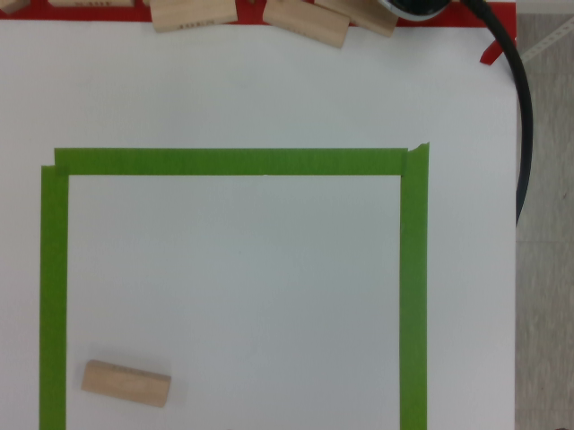
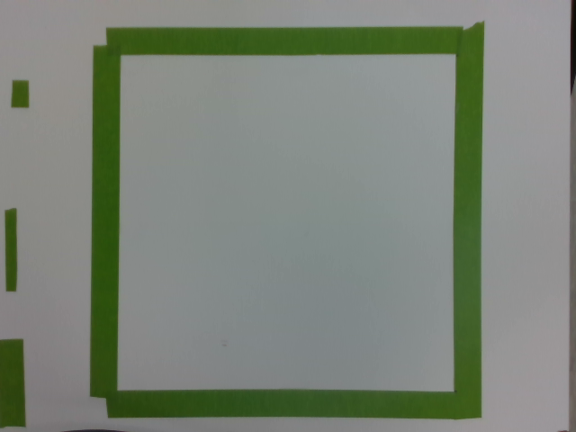

# 관측 자세 교시 (W018, 10/6, 박진용)

손목 카메라(D435i)가 조립 영역 전체를 내려다보는 관측 자세를 정했다. 값은 `src/d2_robot/d2_bringup/config/robot.yaml` `observe_pose`에 있고, 집기 · 놓기 노드의 `/d2/motion/move_to`(target `observe`)가 이 자세로 간다.

| 항목 | 내용 |
|---|---|
| 일정표 | W018(관측 자세 교시 + 빈 작업대 기준 사진) |
| 수준 | 실기 (펜던트 들고, 속도 비율 0.3) |
| 확인 | 비전 민범진 OK(10/6) — 영역 전부 · 약 500 mm · 아래 보기 |

## 1. 정한 자세

| 키 | 값 |
|---|---|
| `observe_pose.joints_deg` | [-18.25, 1.73, 72.73, 0.02, 105.52, 71.44] |
| TCP (`rg2_tcp`, base_link) | (350.5, -109.0, 294.8) mm, 공구 아래 방향 (기울기 0.0°, 돌아간 각 0.3°) |
| 카메라 → 작업대 | 497 mm (깊이 영상 가운데 중앙값) |

- 관절각은 팀 로봇 모델(`m0609_rg2_tcp.urdf.xacro`)의 IK로 구했다. 해가 여럿이면 홈 자세 `[0, 0, 90, 0, 90, 0]`과 가장 가까운 해를 골랐다.
- 실기에서 `move_to observe` 뒤 읽은 값: TCP (0.351, -0.109, 0.295) m, 관절각은 위 값과 0.01° 안. 펜던트 posx 기준과 MoveIt `base_link`가 같다는 것도 이것으로 확인했다.
- 쌓은 블록과 간격: 손가락 끝이 작업대 위 약 313 mm, 가장 높은 레시피(002, 9층 약 133 mm)와 약 180 mm.

## 2. 화면 (컬러 640 x 480, fx 603 px)

497 mm에서 1 px ≈ 0.82 mm, 화면 ≈ 527 x 396 mm. 화면 위 = +x(로봇에서 먼 쪽), 화면 오른쪽 = −y (모델의 카메라 프레임, 작업대 가장자리와 공급 칸 표시 위치로 확인).

| | 후보 1 (민범진 실측 posx) | **정한 자세 (후보 2)** |
|---|---|---|
| TCP (mm) | (460.5, -157.0, 294.8) | (350.5, -109.0, 294.8) |
| 초록 사각형 안쪽 가운데 (px) | (261, 381) — 아래 변이 약 70 mm 잘림 | (318, 247) — 화면 가운데 (319, 247)와 1 px 안 |
| 사각형 안쪽 여유 | — | 위아래 · 양옆 약 45 px (약 37 mm) |
| 사진 |  |  |

- 후보 1은 x · y 손목 보정 전 값으로 정한 것이라 카메라 축이 사각형 가운데보다 +x로 약 110 mm, −y로 약 48 mm 벗어나 있었다. TCP를 (−110, +48) mm 옮겨 후보 2로 했다.
- 화면 왼쪽 끝에 공급 칸 p1 · p3 · p5 표시가 보인다(예상 위치와 맞음). 블록 인식 ROI는 레시피 블록 자리만 보므로 판정에 들어가지 않는다(민범진).
- 펜던트 케이블은 화면에 들어오지 않는다.

## 3. 남은 것

| 항목 | 일정표 | 비고 |
|---|---|---|
| 초록 사각형 가운데와 조립 원점이 같은지 | V-15 (10/7) | 모델 카메라 위치로 어림하면 사각형 가운데 ≈ (413, -101) mm, 원점 (426.1, -72.5) mm. 민범진은 후보 1에서 원점 ± 150 mm가 다 보였다고 함 — 손목 보정 x · y와 같이 본다. 다르면 스캔 범위에 반영 |
| 블록을 쌓은 상태로 보기 | W063 (10/7) | 자동 실기 때 블록마다 관측 자세에서 확인 |
